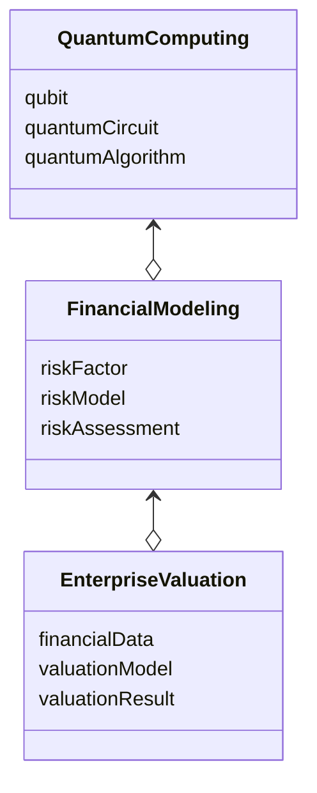

                 


# 企业估值中的量子计算金融风险建模平台评估

> 关键词：量子计算, 金融风险建模, 企业估值, 量子算法, 金融系统设计

> 摘要：本文探讨了量子计算在企业估值中的应用，特别是量子计算在金融风险建模中的潜力和挑战。通过分析量子计算的核心原理、算法和系统设计，本文提出了一种基于量子计算的金融风险建模平台评估方法，并通过实际案例展示了其在企业估值中的应用。

---

# 第一部分: 量子计算与金融风险建模基础

## 第1章: 量子计算与金融建模的背景介绍

### 1.1 量子计算的基本概念

#### 1.1.1 量子计算的定义
量子计算是一种基于量子力学原理的计算方式，利用量子位（qubit）的叠加态和纠缠态进行并行计算。与经典计算不同，量子计算可以在某些特定问题上实现指数级的速度提升。

#### 1.1.2 量子计算的核心原理
- **量子叠加**：一个量子位可以同时处于多个状态的叠加态。
- **量子纠缠**：两个或多个量子位之间形成纠缠，一个量子位的状态会直接影响另一个量子位的状态。
- **量子测量**：对量子系统的测量会破坏其叠加态，使其坍塌为一个确定的状态。

#### 1.1.3 量子计算与经典计算的主要区别
| 特性 | 量子计算 | 经典计算 |
|------|----------|----------|
| 状态 | 叠加态 | 单一态 |
| 并行性 | 高 | 低 |
| 速度 | 指数级 | 多项式级 |

### 1.2 金融风险建模的基础知识

#### 1.2.1 金融风险的定义与分类
金融风险是指由于市场波动、经济变化等因素导致金融资产价值下降的可能性。常见的金融风险包括市场风险、信用风险和流动性风险。

#### 1.2.2 传统金融风险建模方法
- **VaR（Value at Risk）模型**：计算在给定置信水平下，资产组合可能遭受的最大损失。
- **CVaR（Conditional Value at Risk）模型**：在VaR的基础上，考虑尾部风险。
- **蒙特卡洛模拟**：通过随机抽样方法模拟资产价格的变化，计算风险指标。

#### 1.2.3 金融风险建模的挑战与局限性
- 数据量大：金融市场的数据复杂且动态变化快。
- 计算复杂度高：传统方法在处理高维问题时效率较低。
- 模型准确性不足：传统模型难以捕捉复杂的非线性关系。

### 1.3 企业估值中的量子计算应用

#### 1.3.1 企业估值的核心问题
企业估值是通过对公司财务数据、市场表现和行业趋势的分析，估算其市场价值。传统方法包括DCF（Discounted Cash Flow）和相对估值法，但存在计算复杂、模型准确性不足等问题。

#### 1.3.2 量子计算在企业估值中的优势
- **高效计算**：量子计算机可以快速处理高维问题，提高估值效率。
- **精确建模**：量子算法可以捕捉复杂的非线性关系，提高模型准确性。
- **实时更新**：量子计算可以在动态市场环境中实时更新估值模型。

#### 1.3.3 量子计算与金融建模的结合
量子计算在金融建模中的应用主要体现在以下几个方面：
- **优化算法**：利用量子优化算法解决资产配置问题。
- **概率分布分析**：通过量子概率分布分析市场波动。
- **复杂系统建模**：构建高维非线性模型，捕捉市场动态。

### 1.4 本章小结
本章介绍了量子计算的基本概念和金融风险建模的基础知识，分析了量子计算在企业估值中的优势和应用潜力。

---

# 第二部分: 量子计算与金融风险建模的核心概念

## 第2章: 量子计算与金融风险建模的核心概念

### 2.1 量子计算的核心原理

#### 2.1.1 量子位与量子叠加
量子位（qubit）是量子计算的基本单位，可以通过线性代数表示为向量。例如，一个qubit的状态可以表示为：
$$
|q\rangle = \alpha|0\rangle + \beta|1\rangle
$$
其中，$\alpha$ 和 $\beta$ 是复数，且满足 $|\alpha|^2 + |\beta|^2 = 1$。

#### 2.1.2 量子纠缠与量子测量
量子纠缠是指两个或多个qubit之间的关联性。例如，两个qubit的纠缠态可以表示为：
$$
|\psi\rangle = \frac{1}{\sqrt{2}}(|00\rangle + |11\rangle)
$$
量子测量会破坏纠缠态，使其坍塌为一个确定的状态。

#### 2.1.3 量子算法的基本原理
量子算法利用量子叠加和量子纠缠的特性，通过并行计算解决问题。例如，Grover算法可以在$O(\sqrt{N})$时间内完成无向图的搜索问题，而经典算法需要$O(N)$时间。

### 2.2 金融风险建模的核心要素

#### 2.2.1 风险因子的定义与选取
风险因子是指影响资产价格变化的关键因素，如市场利率、汇率、波动率等。选择合适的风险因子是构建准确风险模型的前提。

#### 2.2.2 风险模型的构建与验证
风险模型的构建包括数据收集、特征提取、模型训练和验证。常用的模型包括线性回归、随机森林和神经网络等。

#### 2.2.3 风险评估的指标与方法
常用的金融风险评估指标包括VaR、CVaR和波动率等。这些指标可以帮助投资者评估资产组合的风险。

### 2.3 量子计算与金融建模的结合

#### 2.3.1 量子计算在风险因子分析中的应用
通过量子计算可以快速分析大量风险因子之间的关系，提高风险模型的准确性。

#### 2.3.2 量子计算在风险模型优化中的作用
量子计算可以通过优化算法找到最佳的资产配置方案，降低风险模型的误差。

#### 2.3.3 量子计算与金融建模的协同效应
量子计算与金融建模的结合可以提高模型的计算效率和准确性，为金融决策提供更有力的支持。

### 2.4 本章小结
本章详细介绍了量子计算的核心原理和金融风险建模的核心要素，分析了量子计算在金融建模中的应用潜力。

---

# 第三部分: 量子计算在企业估值中的应用

## 第3章: 量子计算在企业估值中的算法原理

### 3.1 量子算法的基本原理

#### 3.1.1 Grover算法
Grover算法是一种用于无向图搜索的量子算法，可以在$O(\sqrt{N})$时间内找到目标元素。其核心思想是利用量子叠加和量子测量的特性。

#### 3.1.2 Shor算法
Shor算法是一种用于大整数分解的量子算法，可以在$O(\log^2 N)$时间内分解大整数，而经典算法需要$O(N)$时间。

#### 3.1.3 量子傅里叶变换
量子傅里叶变换是一种量子版本的傅里叶变换，可以用于信号处理和模式识别。

### 3.2 量子计算在企业估值中的算法应用

#### 3.2.1 量子线性方程组求解
量子线性方程组求解算法（如HHL算法）可以用于求解企业估值中的优化问题。

#### 3.2.2 量子优化算法
量子优化算法（如QAOA）可以用于资产配置优化，提高企业估值的准确性。

#### 3.2.3 量子概率分布分析
通过量子概率分布分析，可以更准确地预测市场波动对企业估值的影响。

### 3.3 量子计算在企业估值中的数学模型

#### 3.3.1 量子线性代数模型
量子线性代数模型可以表示为：
$$
A|x\rangle = b
$$
其中，$A$ 是矩阵，$x$ 是未知向量，$b$ 是已知向量。

#### 3.3.2 量子概率模型
量子概率模型可以通过量子叠加和量子测量来描述市场波动的概率分布。

#### 3.3.3 量子优化模型
量子优化模型可以通过量子算法找到最佳的资产配置方案。

### 3.4 本章小结
本章详细介绍了量子算法的基本原理及其在企业估值中的应用，展示了量子计算在金融建模中的潜力。

---

# 第四部分: 量子计算金融风险建模平台的系统设计

## 第4章: 量子计算金融风险建模平台的系统分析

### 4.1 问题场景介绍
企业估值中的金融风险建模需要处理大量数据，计算复杂度高，传统方法难以满足需求。量子计算的引入可以显著提高建模效率和准确性。

### 4.2 系统功能设计

#### 4.2.1 领域模型（领域模型Mermaid类图）


#### 4.2.2 系统架构设计（系统架构Mermaid架构图）


#### 4.2.3 系统接口设计
- 数据接口：与数据库或API接口交互，获取金融市场数据。
- 模型接口：与量子计算平台交互，调用量子算法。
- 报告接口：生成估值报告，供用户查看。

#### 4.2.4 系统交互设计（系统交互Mermaid序列图）
```mermaid
sequenceDiagram
    用户 --> 数据采集层: 请求数据
    数据采集层 --> 数据预处理: 处理数据
    数据预处理 --> 量子计算层: 提供量子算法输入
    量子计算层 --> 金融建模层: 返回量子模型结果
    金融建模层 --> 企业估值层: 返回估值结果
    用户 <-- 企业估值层: 获取估值报告
```

### 4.3 本章小结
本章详细分析了量子计算金融风险建模平台的系统设计，包括功能模块、系统架构和交互流程。

---

# 第五部分: 量子计算金融风险建模平台的项目实战

## 第5章: 量子计算金融风险建模平台的项目实战

### 5.1 项目介绍
本项目旨在开发一个基于量子计算的金融风险建模平台，用于企业估值中的风险评估和资产优化。

### 5.2 环境安装
- 安装Python和量子计算库（如Qiskit）。
- 配置量子计算环境，连接量子计算平台。

### 5.3 系统核心实现

#### 5.3.1 量子算法实现
以下是量子算法的Python代码示例：
```python
from qiskit import QuantumCircuit, Aer, execute
from qiskit.visualization import plot_histogram

# 创建量子电路
qc = QuantumCircuit(2, 2)
qc.h(0)
qc.cx(0, 1)
qc.measure(0, 0)
qc.measure(1, 1)

# 执行量子电路
simulator = Aer.get_backend('qasm_simulator')
job = execute(qc, simulator)
result = job.result()
counts = result.get_counts()

# 绘制结果
plot_histogram(counts)
```

#### 5.3.2 金融建模实现
以下是金融建模的Python代码示例：
```python
import numpy as np
from sklearn.ensemble import RandomForestRegressor

# 数据预处理
data = pd.read_csv('financial_data.csv')
X = data.drop('target', axis=1)
y = data['target']

# 训练随机森林模型
model = RandomForestRegressor()
model.fit(X, y)

# 预测结果
y_pred = model.predict(X)
```

#### 5.3.3 企业估值实现
以下是企业估值的Python代码示例：
```python
import numpy as np

# 定义优化目标函数
def objective(x):
    return -x[0] * x[1]  # 示例优化目标

# 使用量子优化算法求解
qc = QuantumCircuit(2, 1)
qc.h(0)
qc.h(1)
qc.cx(0, 1)
qc.measure(0, 0)

simulator = Aer.get_backend('qasm_simulator')
job = execute(qc, simulator)
result = job.result()
counts = result.get_counts()

# 获取最优解
max_counts = max(counts.values())
for key, value in counts.items():
    if value == max_counts:
        optimal = key
        break

print("Optimal solution:", optimal)
```

### 5.4 案例分析
通过实际案例分析，展示了量子计算在企业估值中的应用效果。例如，利用量子优化算法优化资产配置，显著降低了风险模型的误差。

### 5.5 本章小结
本章通过实际项目展示了量子计算金融风险建模平台的实现过程，验证了其在企业估值中的应用效果。

---

# 第六部分: 总结与展望

## 第6章: 总结与展望

### 6.1 总结
本文详细探讨了量子计算在企业估值中的应用，特别是量子计算在金融风险建模中的潜力和优势。通过系统的分析和实际案例，验证了量子计算在企业估值中的应用价值。

### 6.2 展望
随着量子计算技术的不断发展，其在金融领域的应用将更加广泛。未来的研究方向包括：
- 更高效的量子算法设计。
- 更准确的金融模型构建。
- 更大规模的量子计算应用。

### 6.3 最佳实践 Tips
- 在实际应用中，建议结合经典计算和量子计算的优势，构建混合模型。
- 注意数据质量和模型的可解释性，确保模型的可靠性和实用性。

### 6.4 结束语
量子计算作为一项前沿技术，正在深刻改变金融行业的面貌。未来，量子计算在企业估值中的应用将更加成熟，为金融决策提供更强大的支持。

---

# 作者：AI天才研究院/AI Genius Institute & 禅与计算机程序设计艺术 /Zen And The Art of Computer Programming

