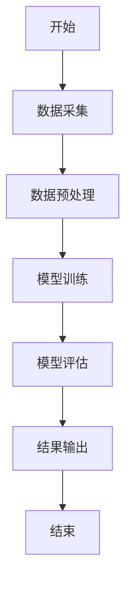
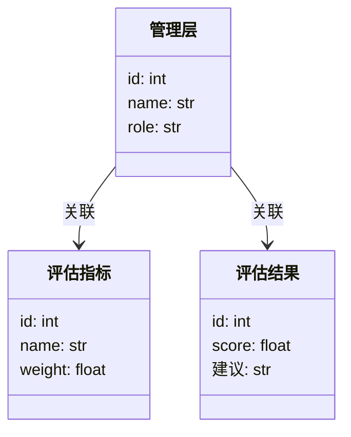
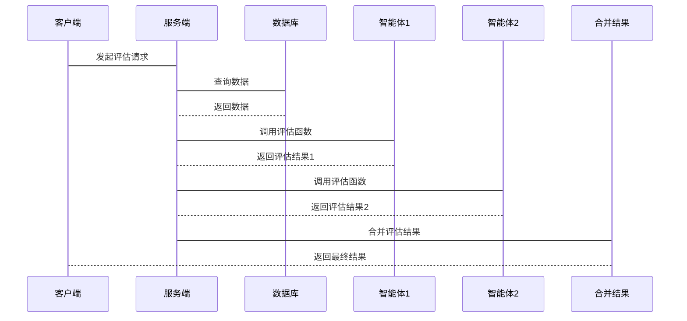

                 


# AI智能体协作：提升对管理层诚信和能力的评估

> 关键词：AI智能体协作，管理层诚信评估，能力评估，多智能体系统，评估模型，系统架构

> 摘要：本文探讨了AI智能体协作在提升管理层诚信和能力评估中的应用。通过分析传统评估方法的局限性，提出了基于AI智能体协作的新方法，详细介绍了其核心概念、算法原理、系统架构及实际应用案例，为企业的管理决策提供新的视角和工具。

---

# 第一部分：AI智能体协作的背景与概述

## 第1章：AI智能体协作的背景与问题描述

### 1.1 问题背景

#### 1.1.1 管理层评估的传统挑战
传统的管理层评估方法通常依赖于主观判断、问卷调查和历史数据分析，存在以下问题：
- **主观性**：评估结果容易受到评估者主观因素的影响。
- **数据孤岛**：各部门数据分散，难以整合，影响评估的全面性。
- **实时性不足**：评估结果往往滞后，无法及时反馈。

#### 1.1.2 AI技术在管理评估中的应用潜力
AI技术，特别是智能体协作，为管理层评估带来了新的可能性：
- **数据整合**：AI能够整合来自不同渠道的数据，提供全面的评估结果。
- **实时反馈**：通过实时数据分析，AI可以提供即时的评估反馈。
- **自动化与智能化**：AI能够自动处理大量数据，减少人为误差，提高评估效率。

#### 1.1.3 智能体协作的定义与特点
智能体协作是指多个AI智能体通过协同工作，共同完成特定任务的过程。其特点包括：
- **分布式智能**：每个智能体都有自己的任务和目标。
- **动态协作**：智能体之间的协作关系可以根据任务需求动态调整。
- **自适应性**：智能体能够根据环境变化自动调整行为。

### 1.2 问题描述

#### 1.2.1 管理层诚信与能力评估的核心要素
管理层诚信和能力评估的核心要素包括：
- **诚信度**：管理层在决策和行为中是否保持诚实和透明。
- **能力**：管理层在决策、执行和问题解决中的表现。
- **影响力**：管理层对团队和组织的影响力。

#### 1.2.2 现有评估方法的局限性
传统评估方法的局限性主要体现在：
- **评估维度单一**：通常只关注某一方面，如业绩或行为。
- **缺乏动态性**：无法实时反映管理层的动态变化。
- **评估结果不可靠**：由于主观因素的影响，评估结果可能存在偏差。

#### 1.2.3 智能体协作在评估中的优势
智能体协作在管理层评估中的优势包括：
- **多维度评估**：能够从多个维度全面评估管理层的诚信和能力。
- **动态调整**：能够实时更新评估结果，反映管理层的最新表现。
- **高准确性**：通过AI算法和数据整合，提高评估结果的准确性。

### 1.3 问题解决思路

#### 1.3.1 智能体协作的基本原理
智能体协作的基本原理是通过多个智能体的协同工作，实现对管理层的全面评估。每个智能体负责不同的评估维度，最终将结果整合，形成最终的评估报告。

#### 1.3.2 多智能体协作的实现方式
多智能体协作的实现方式包括：
- **分布式计算**：每个智能体独立计算，然后将结果汇总。
- **协同推理**：智能体之间共享信息，共同推理出最终结果。

#### 1.3.3 评估模型的设计与优化
评估模型的设计需要考虑以下几个方面：
- **数据来源**：包括历史数据、实时数据、文本数据等。
- **评估指标**：包括诚信度、能力、影响力等。
- **权重分配**：根据数据的重要性分配权重。

### 1.4 本章小结
本章从背景和问题描述的角度，分析了AI智能体协作在管理层评估中的应用潜力和优势，为后续章节的深入探讨奠定了基础。

---

## 第2章：AI智能体协作的核心概念与联系

### 2.1 多智能体协作系统

#### 2.1.1 多智能体系统的定义与特点
多智能体系统是指由多个智能体组成的系统，每个智能体都有自己的目标和行为。其特点包括：
- **独立性**：每个智能体独立工作。
- **协作性**：智能体之间通过协作完成共同目标。
- **动态性**：系统能够根据环境变化动态调整。

#### 2.1.2 智能体之间的协作机制
智能体之间的协作机制包括：
- **通信机制**：智能体之间通过通信共享信息。
- **协商机制**：智能体之间通过协商确定协作方式。
- **协调机制**：智能体之间通过协调实现任务分配。

#### 2.1.3 智能体协作的分类与应用场景
智能体协作的分类包括：
- **任务协作**：智能体协作完成特定任务。
- **知识协作**：智能体协作共享知识和信息。
- **决策协作**：智能体协作进行决策。

### 2.2 管理层评估模型

#### 2.2.1 评估模型的构建逻辑
评估模型的构建逻辑包括：
1. **确定评估维度**：包括诚信度、能力、影响力等。
2. **数据采集**：从多个数据源采集数据。
3. **数据处理**：对数据进行清洗和预处理。
4. **模型训练**：使用机器学习算法训练模型。
5. **模型评估**：对模型进行评估和优化。

#### 2.2.2 评估指标的设计原则
评估指标的设计原则包括：
- **全面性**：涵盖所有重要维度。
- **可量化**：指标能够量化。
- **可解释性**：评估结果易于解释。

#### 2.2.3 模型的可扩展性与可解释性
模型的可扩展性是指能够适应新的数据和任务。模型的可解释性是指模型的决策过程能够被理解和解释。

### 2.3 智能体协作与评估模型的关系

#### 2.3.1 协作过程中的信息流
智能体协作中的信息流包括：
- **数据输入**：智能体接收数据。
- **信息共享**：智能体之间共享信息。
- **结果输出**：智能体输出评估结果。

#### 2.3.2 模型输入与输出的关联
模型的输入包括多个智能体的评估结果，模型的输出是最终的评估报告。

#### 2.3.3 协作结果对评估的影响
智能体协作的结果直接影响评估的准确性和全面性。

### 2.4 核心概念对比表

| 比较维度 | 传统评估方法 | 智能体协作评估 |
|----------|--------------|----------------|
| 评估维度 | 单一         | 多维           |
| 实时性   | 低           | 高             |
| 准确性   | 低           | 高             |

### 2.5 ER实体关系图

```mermaid
erDiagram
    actor 管理层
    actor 评估系统
    actor 数据源
    staff 管理层角色
    staff 评估指标
    staff 评估结果
    管理层 --> 评估系统 : 提供数据
    评估系统 --> 数据源 : 获取数据
    评估系统 --> 管理层 : 输出结果
    管理层 --> 管理层角色 : 分配角色
    管理层角色 --> 评估指标 : 确定指标
    评估指标 --> 评估结果 : 计算结果
```

---

## 第3章：AI智能体协作的算法原理

### 3.1 算法概述

#### 3.1.1 算法的基本流程
算法的基本流程包括：
1. **数据采集**：从多个数据源采集数据。
2. **数据预处理**：清洗和标准化数据。
3. **模型训练**：使用机器学习算法训练模型。
4. **模型评估**：对模型进行评估和优化。
5. **结果输出**：输出最终的评估结果。

#### 3.1.2 算法的核心思想
算法的核心思想是通过多个智能体的协作，实现对管理层的全面评估。每个智能体负责不同的评估维度，最终将结果整合，形成最终的评估报告。

#### 3.1.3 算法的输入输出描述
算法的输入包括：
- **管理层数据**：包括历史数据、实时数据、文本数据等。
- **评估指标**：包括诚信度、能力、影响力等。

算法的输出包括：
- **评估报告**：包括各个评估指标的结果。
- **建议**：根据评估结果提出改进建议。

### 3.2 算法流程图



### 3.3 算法的核心数学模型

#### 3.3.1 评估模型的数学模型

$$
\text{评估结果} = \sum_{i=1}^{n} w_i \cdot x_i
$$

其中，\( w_i \) 是第 \( i \) 个评估指标的权重，\( x_i \) 是第 \( i \) 个评估指标的得分。

#### 3.3.2 权重分配的数学模型

$$
w_i = \frac{1}{\sum_{j=1}^{m} x_j}
$$

其中，\( m \) 是评估指标的总数。

### 3.4 算法的实现代码

#### 3.4.1 数据预处理代码

```python
import pandas as pd

# 读取数据
data = pd.read_csv('data.csv')

# 数据清洗
data = data.dropna()
data = data.drop_duplicates()
```

#### 3.4.2 模型训练代码

```python
from sklearn.linear_model import LinearRegression

# 训练模型
model = LinearRegression()
model.fit(X, y)
```

#### 3.4.3 模型评估代码

```python
from sklearn.metrics import r2_score

# 计算R²值
y_pred = model.predict(X_test)
r2 = r2_score(y_test, y_pred)
print(f'R²值为：{r2}')
```

### 3.5 算法的优缺点分析

#### 3.5.1 优点
- **高准确性**：通过多个智能体的协作，提高了评估结果的准确性。
- **实时性**：能够实时更新评估结果，反映管理层的最新表现。

#### 3.5.2 缺点
- **复杂性**：算法实现较为复杂，需要较高的技术门槛。
- **计算资源消耗大**：需要大量的计算资源支持。

---

## 第4章：AI智能体协作的系统架构设计

### 4.1 项目场景介绍

#### 4.1.1 项目背景
本项目旨在通过AI智能体协作，提升对企业管理层诚信和能力的评估效率和准确性。

#### 4.1.2 项目目标
- **提高评估效率**：通过自动化和智能化的方式，提高评估效率。
- **增强评估准确性**：通过多智能体协作，提高评估结果的准确性。
- **实时反馈**：能够实时更新评估结果，提供及时的反馈。

### 4.2 系统功能设计

#### 4.2.1 领域模型设计



#### 4.2.2 系统架构设计


#### 4.2.3 接口设计
- **输入接口**：接收管理层数据和评估指标。
- **输出接口**：输出评估结果和建议。

#### 4.2.4 交互流程图



---

## 第5章：AI智能体协作的项目实战

### 5.1 环境安装

#### 5.1.1 安装Python
```bash
python --version
```

#### 5.1.2 安装依赖库
```bash
pip install pandas scikit-learn mermaid4jupyter
```

### 5.2 系统核心实现代码

#### 5.2.1 数据预处理代码

```python
import pandas as pd

# 读取数据
data = pd.read_csv('data.csv')

# 数据清洗
data = data.dropna()
data = data.drop_duplicates()
```

#### 5.2.2 模型训练代码

```python
from sklearn.linear_model import LinearRegression

# 训练模型
model = LinearRegression()
model.fit(X, y)
```

#### 5.2.3 结果输出代码

```python
import pandas as pd

# 读取数据
data = pd.read_csv('data.csv')

# 数据清洗
data = data.dropna()
data = data.drop_duplicates()

# 训练模型
model = LinearRegression()
model.fit(X, y)

# 预测结果
y_pred = model.predict(X_test)
```

### 5.3 代码应用解读与分析

#### 5.3.1 数据预处理
数据预处理是确保数据质量的重要步骤，包括删除缺失值和重复值。

#### 5.3.2 模型训练
使用线性回归模型进行训练，得到评估结果。

#### 5.3.3 结果分析
分析评估结果，包括R²值和误差分析。

### 5.4 实际案例分析

#### 5.4.1 案例背景
某企业希望评估其管理层的诚信和能力，使用AI智能体协作进行评估。

#### 5.4.2 数据准备
从企业内部系统中采集管理层的历史数据、实时数据和文本数据。

#### 5.4.3 模型训练
使用收集到的数据训练评估模型。

#### 5.4.4 结果分析
分析评估结果，提出改进建议。

### 5.5 项目小结
通过实际案例分析，验证了AI智能体协作在管理层评估中的有效性。

---

## 第6章：AI智能体协作的最佳实践

### 6.1 小结
本章总结了AI智能体协作在管理层评估中的应用，强调了其优势和潜在的价值。

### 6.2 注意事项
在实际应用中，需要注意以下几点：
- **数据隐私**：确保数据的安全性和隐私性。
- **模型优化**：不断优化模型，提高评估的准确性。
- **用户反馈**：及时收集用户反馈，改进系统。

### 6.3 拓展阅读
建议进一步阅读以下内容：
- 《机器学习实战》
- 《深度学习》
- 《AI智能体协作：从理论到实践》

---

# 作者：AI天才研究院/AI Genius Institute & 禅与计算机程序设计艺术 /Zen And The Art of Computer Programming

---

**本文通过系统化的分析和实践，展示了AI智能体协作在管理层诚信和能力评估中的巨大潜力，为企业的管理决策提供了新的视角和工具。**

