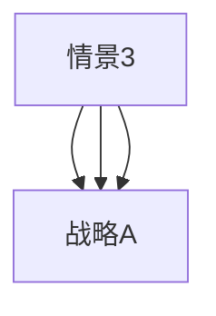
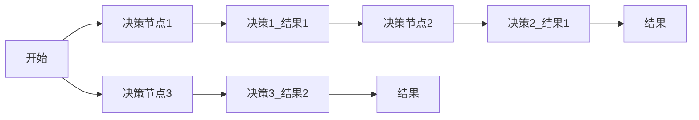
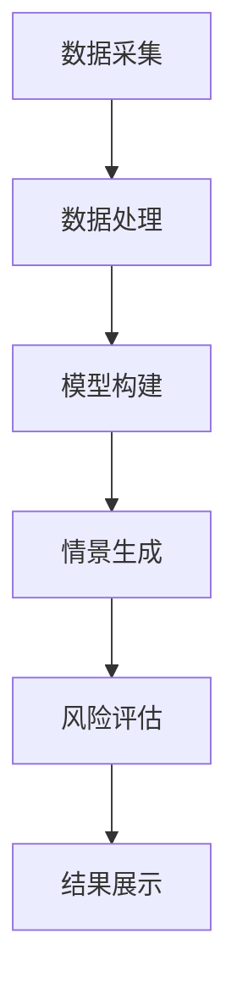
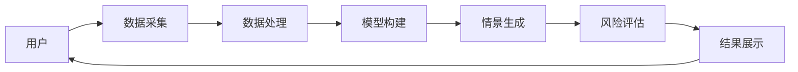

                 


# AI辅助企业战略决策：情景分析与风险评估

> 关键词：AI, 企业战略决策, 情景分析, 风险评估, 蒙特卡洛模拟, 决策树算法, 企业架构

> 摘要：本文将详细探讨人工智能如何辅助企业进行战略决策，特别是通过情景分析和风险评估来优化企业战略选择。文章将从理论基础、数学模型、系统架构到实际项目开发，全面解析AI在企业战略决策中的应用。通过本文的讲解，读者将能够理解如何利用AI技术构建企业战略决策支持系统，从而在复杂多变的商业环境中做出更明智的选择。

---

# 第一部分: AI辅助企业战略决策的背景与基础

# 第1章: AI与企业战略决策的结合

## 1.1 企业战略决策的传统模式

### 1.1.1 传统战略决策的特点
- **经验驱动**：依赖企业历史经验、行业知识和专家判断。
- **主观性高**：决策过程受到决策者主观因素的影响较大。
- **效率低下**：需要大量人工分析和数据整理，耗时较长。
- **适应性差**：面对复杂多变的市场环境，调整能力有限。

### 1.1.2 传统战略决策的局限性
- **数据处理能力有限**：难以处理海量数据，尤其是非结构化数据。
- **决策偏差**：决策者可能因为认知偏差（如确认偏差）做出错误决策。
- **缺乏动态调整**：难以实时根据市场变化进行调整。

### 1.1.3 传统战略决策的优化方向
- **数据驱动化**：引入大数据分析技术，提高决策的客观性和准确性。
- **智能化**：利用AI技术辅助决策，提高决策效率和质量。
- **动态化**：建立动态调整机制，适应市场变化。

## 1.2 AI技术对企业战略决策的影响

### 1.2.1 AI技术的基本概念
- AI（人工智能）是指模拟人类智能的计算机系统，能够执行如学习、推理、感知和语言理解等任务。
- 通过机器学习、自然语言处理、计算机视觉等技术，AI能够帮助企业处理海量数据，发现潜在规律。

### 1.2.2 AI在企业战略决策中的优势
- **数据处理能力强**：能够快速处理和分析海量数据，提取有价值的信息。
- **预测能力强**：利用机器学习算法，可以预测市场趋势、客户行为等。
- **实时性**：能够实时监控市场动态，提供即时反馈。

### 1.2.3 AI与企业战略决策的结合趋势
- **智能化决策支持**：AI技术逐渐成为企业战略决策的重要工具。
- **人机协作**：AI辅助决策，而非完全替代人类决策。
- **个性化决策支持**：根据不同场景和需求，提供定制化决策支持。

## 1.3 本章小结
本章从企业战略决策的传统模式出发，分析了其局限性，并探讨了AI技术在其中的应用潜力。通过AI技术，企业能够实现更高效、更准确的决策支持。

---

# 第2章: 情景分析与风险评估的核心概念

## 2.1 情景分析的定义与特点

### 2.1.1 情景分析的定义
- **情景分析**是一种通过构建不同假设场景来评估其影响的方法。
- 用于企业战略决策中，情景分析可以帮助企业在不同市场条件下评估战略的可行性。

### 2.1.2 情景分析的核心特点
- **多维度**：考虑市场、技术、政策等多个因素的变化。
- **情景驱动**：通过构建不同情景，分析其对企业战略的影响。
- **动态性**：情景可以根据市场变化进行动态调整。

### 2.1.3 情景分析与企业战略决策的关系
- **情景分析是企业战略决策的基础**：通过情景分析，企业可以更好地理解不同环境对企业战略的影响。
- **情景分析是风险评估的前提**：通过情景分析，企业可以识别潜在风险，并进行风险评估。

## 2.2 风险评估的定义与特点

### 2.2.1 风险评估的定义
- **风险评估**是通过分析潜在风险的可能性和影响程度，对风险进行量化的过程。
- 帮助企业在决策中考虑潜在风险，制定应对策略。

### 2.2.2 风险评估的核心特点
- **系统性**：从多个维度分析风险，确保全面性。
- **量化性**：通过概率和影响程度对风险进行量化。
- **动态性**：根据市场变化动态调整风险评估结果。

### 2.2.3 风险评估与企业战略决策的关系
- **风险评估是企业战略决策的重要组成部分**：企业在制定战略时需要考虑潜在风险。
- **风险评估是情景分析的延续**：情景分析构建了不同情景，风险评估则是对这些情景进行进一步分析。

## 2.3 情景分析与风险评估的联系

### 2.3.1 情景分析为企业风险评估提供基础
- 通过情景分析构建不同市场情景，风险评估可以在此基础上分析每种情景下的风险。

### 2.3.2 风险评估为情景分析提供反馈
- 风险评估的结果可以反过来影响情景分析的构建，优化情景设计。

### 2.3.3 两者的结合对企业战略决策的意义
- **提高决策的全面性**：通过情景分析和风险评估，企业能够从多个角度评估战略的可行性。
- **降低决策风险**：通过识别和评估潜在风险，企业可以制定更有针对性的风险应对策略。

## 2.4 本章小结
本章详细介绍了情景分析和风险评估的核心概念及其在企业战略决策中的作用，并探讨了两者之间的关系。通过情景分析和风险评估的结合，企业能够更好地应对复杂多变的市场环境。

---

# 第3章: AI辅助情景分析与风险评估的数学模型

## 3.1 情景分析的数学模型

### 3.1.1 情景分析的基本模型
- **情景构建**：根据市场环境构建不同情景，例如“最佳情景”、“最差情景”等。
- **情景权重**：根据情景发生的概率，对情景进行加权。

### 3.1.2 情景分析的概率分布模型
- **概率分布**：通过统计分析，确定不同情景发生的概率。
- **情景影响**：分析不同情景对企业战略的影响程度。

### 3.1.3 情景分析的层次分析模型
- **层次分析法（AHP）**：用于确定不同情景的重要性权重。
- **步骤**：
  1. 构建层次结构。
  2. 建立判断矩阵。
  3. 计算权重。

### 3.1.4 情景分析的层次分析模型示例


### 3.1.5 情景分析的概率计算公式
$$ P(s) = \frac{N(s)}{N} $$
其中，$P(s)$ 是情景$s$发生的概率，$N(s)$ 是情景$s$出现的次数，$N$ 是总情景数。

## 3.2 风险评估的数学模型

### 3.2.1 风险评估的基本模型
- **风险概率**：$P(r)$，风险$r$发生的概率。
- **风险影响**：$I(r)$，风险$r$对企业的影响程度（损失金额或收益减少）。
- **风险值**：$R(r) = P(r) \times I(r)$，风险的综合值。

### 3.2.2 风险评估的蒙特卡洛模拟模型
- **蒙特卡洛模拟**：通过随机采样，模拟不同情景下的风险。
- **步骤**：
  1. 确定风险变量的概率分布。
  2. 生成随机数，模拟不同情景。
  3. 计算每种情景下的风险值。
  4. 统计风险结果，得出风险分布。

### 3.2.3 风险评估的决策树模型
- **决策树**：通过构建决策树，分析不同决策路径下的风险和收益。
- **步骤**：
  1. 构建决策树。
  2. 计算每条路径的概率和收益。
  3. 确定最优决策路径。

### 3.2.4 决策树算法的流程图


## 3.3 AI算法在情景分析与风险评估中的应用

### 3.3.1 蒙特卡洛模拟算法
- **算法描述**：
  1. 确定输入变量的概率分布。
  2. 生成随机数，模拟输入变量。
  3. 计算输出结果。
  4. 统计输出结果，分析风险。

### 3.3.2 决策树算法
- **算法描述**：
  1. 构建决策树。
  2. 计算每条路径的概率和收益。
  3. 确定最优决策路径。

### 3.3.3 深度学习算法
- **算法描述**：
  1. 收集和整理数据。
  2. 构建神经网络模型。
  3. 训练模型，优化参数。
  4. 使用模型进行预测和风险评估。

### 3.3.4 代码示例：蒙特卡洛模拟
```python
import numpy as np
import matplotlib.pyplot as plt

# 模拟市场情景
np.random.seed(42)
n = 10000
s = np.random.normal(0, 1, n)

# 计算情景结果
results = []
for i in range(n):
    results.append(s[i] ** 2)

# 绘制概率分布图
plt.hist(results, bins=50, alpha=0.7)
plt.xlabel('Value')
plt.ylabel('Frequency')
plt.title('Monte Carlo Simulation Results')
plt.show()
```

## 3.4 本章小结
本章详细介绍了情景分析和风险评估的数学模型，包括概率分布、层次分析法、蒙特卡洛模拟和决策树算法等。通过这些模型，企业可以更科学地进行情景分析和风险评估。

---

# 第4章: AI辅助情景分析与风险评估的系统架构

## 4.1 系统架构设计

### 4.1.1 系统模块划分
- **数据采集模块**：负责采集市场数据、企业数据等。
- **模型构建模块**：构建情景分析和风险评估的数学模型。
- **分析模块**：对数据进行分析，生成情景和风险评估结果。
- **用户界面模块**：展示分析结果，供用户决策。

### 4.1.2 系统功能设计
- **数据处理**：清洗、转换和存储数据。
- **模型训练**：训练AI模型，优化参数。
- **情景生成**：根据模型生成不同情景。
- **风险评估**：对每种情景进行风险评估。
- **结果展示**：以可视化方式展示分析结果。

### 4.1.3 系统架构图


## 4.2 系统接口设计

### 4.2.1 数据接口设计
- **输入接口**：接收市场数据、企业数据等。
- **输出接口**：输出分析结果，如情景报告、风险评估报告。

### 4.2.2 模型接口设计
- **输入接口**：接收数据和参数。
- **输出接口**：输出模型结果。

### 4.2.3 用户接口设计
- **输入接口**：接收用户输入，如选择情景、查看结果。
- **输出接口**：展示分析结果，如图表、报告。

## 4.3 系统交互流程

### 4.3.1 用户输入流程
1. 用户输入需求，如选择市场情景。
2. 系统接收需求，进行数据处理。

### 4.3.2 数据处理流程
1. 数据采集模块采集数据。
2. 数据处理模块清洗和转换数据。
3. 数据存储模块存储处理后的数据。

### 4.3.3 结果输出流程
1. 分析模块根据数据生成情景和风险评估结果。
2. 用户界面模块展示结果。

### 4.3.4 系统交互流程图


## 4.4 本章小结
本章详细介绍了AI辅助情景分析与风险评估系统的架构设计，包括模块划分、功能设计和交互流程。通过系统的构建，企业可以更高效地进行战略决策支持。

---

# 第5章: 项目实战——AI辅助企业战略决策系统开发

## 5.1 项目背景与目标

### 5.1.1 项目背景
- 某企业需要优化其供应链管理，希望通过AI技术辅助进行战略决策。

### 5.1.2 项目目标
- 构建一个AI辅助供应链管理的战略决策支持系统。

## 5.2 系统功能设计

### 5.2.1 数据采集模块
- **功能**：采集市场数据、供应链数据等。

### 5.2.2 模型构建模块
- **功能**：构建供应链管理的数学模型。

### 5.2.3 分析模块
- **功能**：进行情景分析和风险评估。

### 5.2.4 用户界面模块
- **功能**：展示分析结果，供用户决策。

## 5.3 系统实现

### 5.3.1 环境配置
- **工具**：Python、TensorFlow、Keras、Matplotlib。

### 5.3.2 核心代码实现

#### 5.3.2.1 数据采集代码
```python
import pandas as pd

def load_data():
    # 加载市场数据
    market_data = pd.read_csv('market_data.csv')
    # 加载供应链数据
    supply_chain_data = pd.read_csv('supply_chain_data.csv')
    return market_data, supply_chain_data
```

#### 5.3.2.2 模型构建代码
```python
import tensorflow as tf
from tensorflow import keras

def build_model(input_shape):
    model = keras.Sequential([
        keras.layers.Dense(64, activation='relu', input_shape=input_shape),
        keras.layers.Dense(32, activation='relu'),
        keras.layers.Dense(1, activation='linear')
    ])
    model.compile(optimizer='adam', loss='mean_squared_error')
    return model
```

#### 5.3.2.3 情景生成代码
```python
import numpy as np

def generate_scenarios(model, data):
    # 生成不同情景
    scenarios = []
    for i in range(len(data)):
        # 预测结果
        prediction = model.predict(data[i])
        scenarios.append({'input': data[i], 'output': prediction})
    return scenarios
```

## 5.4 项目小结

### 5.4.1 项目总结
- 成功构建了AI辅助供应链管理的战略决策支持系统。
- 系统能够生成不同市场情景，并进行风险评估。

### 5.4.2 项目经验
- 数据采集和处理是项目成功的关键。
- 模型选择和优化对项目结果有重要影响。

### 5.4.3 项目注意事项
- 数据质量和完整性直接影响模型性能。
- 模型需要定期更新，以适应市场变化。

---

# 第6章: 最佳实践与未来展望

## 6.1 最佳实践

### 6.1.1 数据管理
- 确保数据的准确性和完整性。
- 数据清洗和预处理是关键步骤。

### 6.1.2 模型选择
- 根据具体问题选择合适的模型。
- 需要进行模型调优和验证。

### 6.1.3 系统架构
- 模块化设计便于维护和扩展。
- 系统接口设计需要考虑可扩展性。

## 6.2 小结

### 6.2.1 本章小结
- 总结了AI辅助企业战略决策的最佳实践。
- 强调了数据管理和模型选择的重要性。

## 6.3 未来展望

### 6.3.1 技术发展
- AI技术的不断进步将为企业战略决策提供更强大的支持。
- 更多先进的算法和工具将被引入。

### 6.3.2 应用场景扩展
- AI技术将被应用于更多领域，如市场营销、财务管理等。
- 多场景下的AI辅助决策将成为趋势。

---

# 作者：AI天才研究院/AI Genius Institute & 禅与计算机程序设计艺术 /Zen And The Art of Computer Programming

---

**注**：以上内容为完整的技术博客文章结构，实际撰写时可以根据具体需求进行调整和补充。

