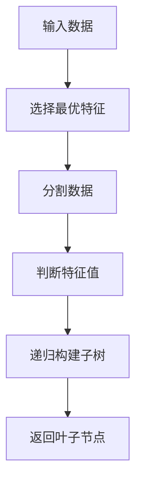
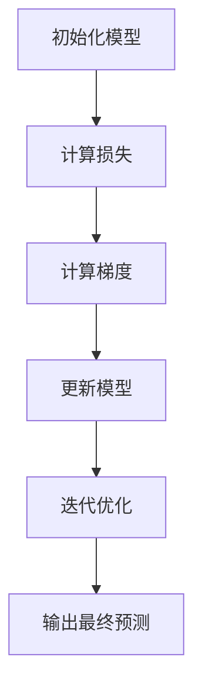
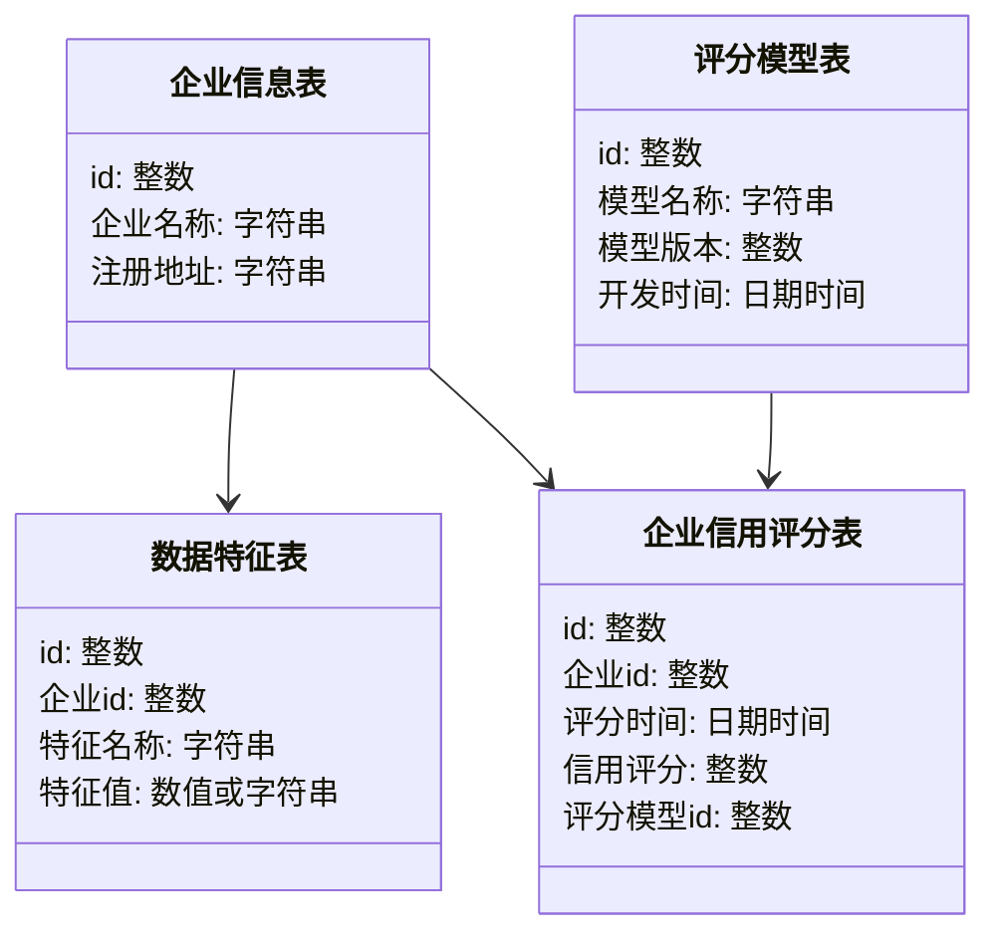
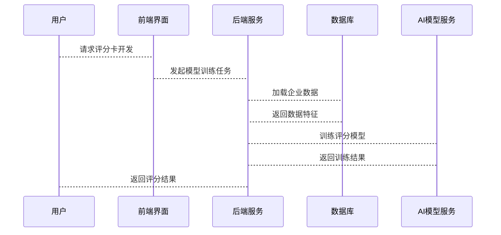

                 


# AI辅助的企业信用评分卡开发与验证平台

## 关键词：企业信用评分卡, AI辅助, 信用评分模型, 金融风险管理, 系统架构设计

## 摘要：本文详细探讨了如何利用人工智能技术开发和验证企业信用评分卡。从背景介绍、核心概念到算法原理、系统架构设计，再到项目实战和最佳实践，全面分析了AI在信用评分卡开发中的应用。通过本文，读者可以深入了解企业信用评分卡的开发流程，掌握AI辅助下的模型构建与验证方法，为金融风险管理提供有力支持。

---

# 第1章: 企业信用评分卡概述

## 1.1 企业信用评分卡的基本概念

### 1.1.1 信用评分卡的定义
企业信用评分卡是一种用于评估企业信用状况的工具，通过对企业财务数据、经营状况和市场表现等多维度信息的综合分析，量化企业的信用风险等级。

### 1.1.2 信用评分卡的核心作用
- 量化企业信用风险，帮助金融机构进行信贷决策。
- 提供客观、可量化的评分结果，减少人为判断的主观性。
- 通过历史数据和模型优化，提高信用评估的准确性和效率。

### 1.1.3 信用评分卡的分类与特点
- **分类**：
  - 按评分对象：企业信用评分卡、个人信用评分卡。
  - 按评分方法：基于规则的评分卡、基于模型的评分卡。
- **特点**：
  - 数据驱动：依赖企业历史数据和市场信息。
  - 客观性：通过模型算法减少人为干预。
  - 可解释性：评分结果需具备可解释性，便于金融机构理解和应用。

## 1.2 人工智能在金融领域的应用现状

### 1.2.1 AI在金融领域的典型应用
- **信用评估**：利用机器学习算法预测企业违约风险。
- **欺诈检测**：通过AI技术识别异常交易行为。
- **投资决策**：基于大数据和AI模型优化投资组合。

### 1.2.2 信用评分中的AI技术
- **监督学习**：用于分类问题，如企业信用等级划分。
- **无监督学习**：用于聚类分析，识别潜在风险企业。
- **深度学习**：用于复杂模式识别，提高模型准确性。

### 1.2.3 企业信用评分卡的行业需求
- **需求背景**：金融机构需要高效、准确的信用评估工具。
- **技术驱动**：AI技术的进步使信用评分卡的开发更加智能化。
- **市场应用**：广泛应用于银行、融资租赁、供应链金融等领域。

## 1.3 本章小结
本章介绍了企业信用评分卡的基本概念和其在金融领域的应用现状，强调了AI技术在信用评分卡开发中的重要性，为后续章节的深入分析奠定了基础。

---

# 第2章: AI在企业信用评分卡中的核心应用

## 2.1 企业信用评分的关键数据特征

### 2.1.1 企业信用评分的核心数据要素
- **财务数据**：收入、利润、资产负债率等财务指标。
- **经营数据**：行业地位、市场份额、供应链稳定性。
- **市场数据**：宏观经济指标、行业周期、政策环境。

### 2.1.2 数据特征的分类与对比
| 特征类型 | 描述 | 示例 |
|----------|------|------|
| 财务特征 | 企业的财务状况 | 营业收入、净利润率 |
| 经营特征 | 企业的经营能力 | 市场占有率、供应链稳定性 |
| 市场特征 | 企业的外部环境 | 宏观经济指标、行业周期 |

### 2.1.3 数据特征与评分结果的关系
通过数据分析和建模，不同特征对评分结果的影响程度不同。例如，财务特征通常对评分结果影响较大，而市场特征则更多反映企业外部环境的风险。

## 2.2 信用评分模型的AI算法选择

### 2.2.1 常见信用评分算法的原理对比
| 算法类型 | 描述 | 优缺点 | 适用场景 |
|----------|------|--------|----------|
| 逻辑回归 | 基于线性模型，输出概率值 | 解释性强，适合线性关系 | 中小企业信用评估 |
| 决策树 | 基于特征分裂的树状结构 | 鲁棒性强，适合非线性关系 | 复杂企业评分 |
| 梯度提升 | 基于树的集成学习 | 高准确性，适合高维数据 | 大型企业风险评估 |

### 2.2.2 算法选择的影响因素
- 数据特征的类型和分布。
- 模型的可解释性和监管要求。
- 计算资源和时间约束。

### 2.2.3 算法性能与企业需求的匹配
通过对比不同算法的性能指标（如准确率、召回率、F1分数），选择最适合企业需求的模型。

## 2.3 评分策略与模型优化

### 2.3.1 评分策略的制定原则
- **公平性**：评分策略应避免歧视，符合监管要求。
- **可操作性**：评分结果应便于金融机构理解和应用。
- **动态调整**：根据市场变化和企业行为调整评分策略。

### 2.3.2 模型优化的常见方法
- **参数调优**：通过网格搜索或随机搜索优化模型参数。
- **特征选择**：去除冗余特征，提高模型性能。
- **集成学习**：通过集成多种模型提高预测准确性。

### 2.3.3 模型效果的评估指标
| 指标 | 描述 | 公式 |
|------|------|------|
| 准确率 | 正确预测的比例 | $$\text{Accuracy} = \frac{\text{TP} + \text{TN}}{\text{TP} + \text{FP} + \text{TN} + \text{FN}}$$ |
| 召回率 | 真实违约企业的预测比例 | $$\text{Recall} = \frac{\text{TP}}{\text{TP} + \text{FN}}$$ |
| F1分数 | 调和准确率 | $$F1 = 2 \times \frac{\text{Precision} \times \text{Recall}}{\text{Precision} + \text{Recall}}$$ |

## 2.4 核心概念的ER实体关系图

```mermaid
er
    企业信息表
        id: 整数，主键
        企业名称: 字符串
        注册地址: 字符串
        法人代表: 字符串
        经营范围: 字符串
    企业信用评分表
        id: 整数，主键
        企业id: 整数，外键，引用企业信息表.id
        评分时间: 日期时间
        信用评分: 整数（1-10分）
        评分模型id: 整数，外键，引用评分模型表.id
    评分模型表
        id: 整数，主键
        模型名称: 字符串
        模型版本: 整数
        开发时间: 日期时间
        模型描述: 字符串
    数据特征表
        id: 整数，主键
        企业id: 整数，外键，引用企业信息表.id
        特征名称: 字符串
        特征值: 数值或字符串
```

---

# 第3章: 信用评分模型的AI算法实现

## 3.1 逻辑回归算法

### 3.1.1 算法原理
逻辑回归通过sigmoid函数将线性组合转换为概率值：
$$P(y=1|x) = \frac{1}{1 + e^{-\beta x}}$$
其中，$$x$$是输入特征向量，$$\beta$$是模型参数。

### 3.1.2 逻辑回归流程图

```mermaid
graph TD
    A[输入特征向量x] --> B(Sigmoid函数)
    B --> C[输出概率P(y=1|x)]
    C --> D[分类结果（0或1）]
```

### 3.1.3 Python实现代码

```python
import numpy as np
from sklearn.linear_model import LogisticRegression

# 数据加载与预处理
X = ... # 特征矩阵
y = ... # 标签向量

# 模型训练
model = LogisticRegression()
model.fit(X, y)

# 预测概率
prob = model.predict_proba(X)[:, 1]
print("预测概率:", prob)
```

## 3.2 决策树算法

### 3.2.1 算法原理
决策树通过特征分裂构建树状结构，最终到达叶节点进行分类。信息增益公式：
$$\text{信息增益} = \text{熵}(S) - \sum \text{权重} \times \text{熵}(S_i)$$

### 3.2.2 决策树流程图



### 3.2.3 Python实现代码

```python
from sklearn.tree import DecisionTreeClassifier
from sklearn import tree

# 数据加载与预处理
X = ... # 特征矩阵
y = ... # 标签向量

# 模型训练
model = DecisionTreeClassifier()
model.fit(X, y)

# 可视化决策树
import graphviz
dot_data = tree.export_graphviz(model, out_file=None, feature_names=feature_names, class_names=class_names)
graph = graphviz.Source(dot_data)
graph.render("decision_tree")
```

## 3.3 梯度提升算法

### 3.3.1 算法原理
梯度提升通过迭代优化模型，最小化损失函数：
$$L = \sum_{i=1}^{n} (y_i - \hat{y}_i)^2$$

### 3.3.2 梯度提升流程图



### 3.3.3 Python实现代码

```python
import xgboost as xgb

# 数据加载与预处理
X = ... # 特征矩阵
y = ... # 标签向量

# 模型训练
model = xgb.XGBClassifier()
model.fit(X, y)

# 预测结果
y_pred = model.predict(X)
print("预测结果:", y_pred)
```

---

# 第4章: 系统分析与架构设计方案

## 4.1 问题场景介绍

### 4.1.1 企业信用评分的痛点
- 数据量大，特征复杂。
- 模型需求多样，开发效率低。
- 需要实时更新和动态调整。

## 4.2 项目介绍

### 4.2.1 项目目标
开发一个AI辅助的企业信用评分卡开发与验证平台，提供从数据处理、模型训练到结果验证的一站式解决方案。

## 4.3 系统功能设计

### 4.3.1 领域模型类图



### 4.3.2 系统架构设计


### 4.3.3 系统接口设计
- 数据接口：数据导入、特征提取。
- 模型接口：模型训练、模型部署。
- 评分接口：批量评分、实时评分。

### 4.3.4 系统交互流程图



---

# 第5章: 项目实战

## 5.1 环境安装与配置

### 5.1.1 Python环境安装
- 安装Python 3.8及以上版本。
- 安装必要的库：scikit-learn、xgboost、graphviz、mermaid。

### 5.1.2 数据集准备
- 数据来源：企业财务数据、经营数据、市场数据。
- 数据清洗：处理缺失值、异常值。

## 5.2 系统核心实现

### 5.2.1 数据加载与预处理

```python
import pandas as pd

# 加载数据
data = pd.read_csv('企业信用数据.csv')

# 数据清洗
data.dropna(inplace=True)
data = pd.get_dummies(data)
```

### 5.2.2 模型训练与验证

```python
from sklearn.model_selection import train_test_split
from sklearn.metrics import accuracy_score

# 划分训练集和测试集
X_train, X_test, y_train, y_test = train_test_split(data.drop('信用评分', axis=1), data['信用评分'], test_size=0.2)

# 选择模型并训练
model = xgb.XGBClassifier()
model.fit(X_train, y_train)

# 模型验证
y_pred = model.predict(X_test)
print("准确率:", accuracy_score(y_test, y_pred))
```

### 5.2.3 案例分析与解读

假设我们有一个中小企业的数据，通过模型预测其信用评分为7分（满分10分）。这个结果意味着该企业在当前市场环境下具有较好的信用状况，但需持续监测经营数据。

---

# 第6章: 最佳实践与总结

## 6.1 本章小结
本文详细介绍了AI辅助的企业信用评分卡开发与验证平台的构建过程，从背景分析到系统设计，再到项目实战，全面展示了如何利用AI技术提升信用评分的准确性和效率。

## 6.2 注意事项
- 数据隐私与合规性：确保数据处理符合相关法律法规。
- 模型解释性：评分结果需具备可解释性，便于金融机构理解和应用。
- 模型更新：定期更新模型，确保评分结果的时效性。

## 6.3 拓展阅读
- 推荐阅读《机器学习实战》、《深入浅出机器学习》等书籍。
- 关注最新AI技术在金融领域的应用，如联邦学习、解释性AI等。

---

# 作者：AI天才研究院/AI Genius Institute & 禅与计算机程序设计艺术/Zen And The Art of Computer Programming

