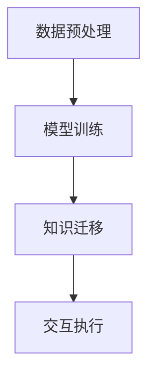
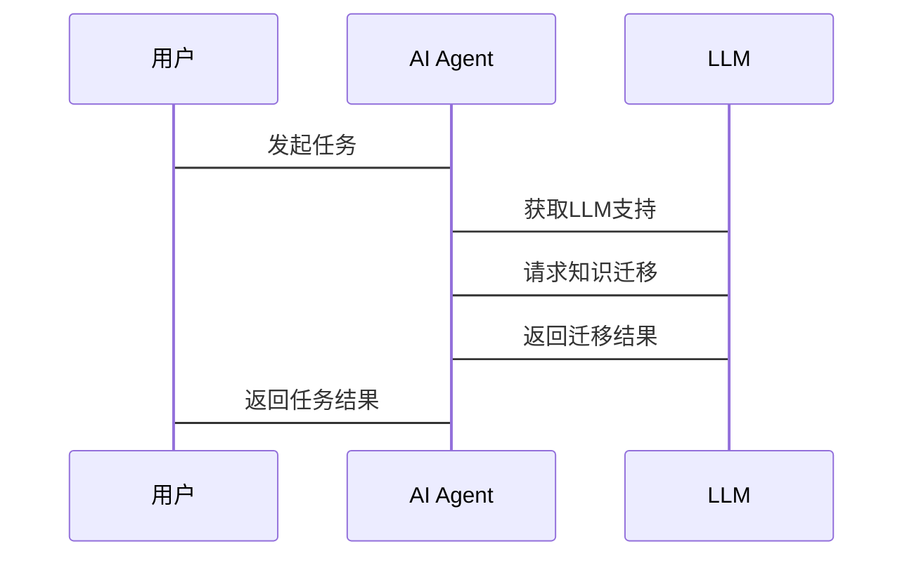

                 


# LLM支持的AI Agent跨域知识迁移技术

> 关键词：大语言模型（LLM）、AI Agent、跨域知识迁移、迁移学习、深度学习

> 摘要：本文探讨了基于大语言模型（LLM）的AI Agent在跨域知识迁移中的技术实现与应用。通过分析跨域知识迁移的核心原理、算法框架以及系统架构，结合实际案例，深入解读了LLM支持的AI Agent如何实现跨领域知识的有效迁移，并总结了最佳实践与未来发展方向。

---

# 第一部分: 背景介绍与核心概念

# 第1章: LLM支持的AI Agent跨域知识迁移技术概述

## 1.1 问题背景与问题描述

### 1.1.1 大语言模型（LLM）的崛起

大语言模型（LLM）通过海量数据的预训练，具备了强大的自然语言处理能力。然而，LLM在特定领域（如医疗、金融）的应用中，往往需要额外的领域知识微调，才能达到理想的效果。这限制了LLM在多个领域的广泛应用。

### 1.1.2 AI Agent的基本概念与功能

AI Agent（智能体）是一种能够感知环境、执行任务并做出决策的智能系统。基于LLM的AI Agent通过语言模型提供自然语言理解与生成能力，能够与人类用户进行交互，并在复杂环境中完成任务。

### 1.1.3 跨域知识迁移的必要性与挑战

AI Agent需要在不同领域之间迁移知识，以减少对领域微调的依赖。然而，跨域知识迁移面临数据分布差异、领域特征提取、模型适应性等挑战。

## 1.2 问题解决与技术边界

### 1.2.1 跨域知识迁移的核心目标

通过迁移学习技术，使AI Agent能够在不同领域之间共享知识，降低对领域特定数据的依赖。

### 1.2.2 技术边界与适用场景

- **技术边界**：跨域知识迁移适用于领域间存在部分重叠但数据分布不同的场景。
- **适用场景**：如从医疗领域迁移到金融领域，提取通用的实体识别或文本分类能力。

### 1.2.3 相关概念的外延与限制

- **外延**：跨域知识迁移不仅限于语言模型，还可应用于其他AI任务。
- **限制**：领域差异过大时，迁移效果可能不理想。

## 1.3 核心概念结构与组成

### 1.3.1 LLM与AI Agent的协同关系

LLM为AI Agent提供语言理解与生成能力，AI Agent通过LLM实现跨域任务。

### 1.3.2 跨域知识迁移的技术架构

包括数据预处理、特征提取、模型训练、知识迁移等模块。

### 1.3.3 核心要素的对比分析

| 核心要素 | LLM | AI Agent | 跨域知识迁移 |
|----------|------|----------|--------------|
| 功能     | NLP  | 交互与任务执行 | 知识共享     |
| 技术基础 | 深度学习 | 决策与执行 | 迁移学习     |
| 应用场景 | 多领域 | 多领域     | 多领域迁移   |

## 1.4 本章小结

本章介绍了LLM与AI Agent的基本概念，分析了跨域知识迁移的必要性与挑战，明确了核心概念及其关系。

---

# 第二部分: 核心概念与原理

# 第2章: LLM与AI Agent的核心原理

## 2.1 LLM的工作原理

### 2.1.1 大语言模型的训练机制

基于Transformer架构，通过自监督学习预训练大规模数据。

### 2.1.2 模型的编码与解码过程

编码器-解码器结构，编码输入文本，解码生成输出。

### 2.1.3 模型的可解释性与局限性

- **可解释性**：部分模型（如GPT）缺乏明确的逻辑推理能力。
- **局限性**：需要大量领域数据进行微调。

## 2.2 AI Agent的基本原理

### 2.2.1 Agent的定义与分类

- **定义**：智能体通过感知环境并采取行动以实现目标。
- **分类**：基于反应式和基于认知的Agent。

### 2.2.2 基于LLM的Agent架构

- **语言模型接口**：通过API调用LLM进行交互。
- **任务分解**：将复杂任务分解为多个子任务，分别调用LLM。

### 2.2.3 Agent的决策与执行机制

结合环境反馈和LLM生成的建议，做出决策并执行任务。

## 2.3 跨域知识迁移的原理

### 2.3.1 知识迁移的基本概念

通过迁移学习，将源领域知识应用于目标领域。

### 2.3.2 跨域迁移的核心算法

- **特征提取**：提取领域无关的特征。
- **参数调整**：调整模型参数以适应目标领域。

### 2.3.3 跨域迁移的实现步骤

1. 数据预处理：收集源域和目标域数据。
2. 特征提取：提取通用特征。
3. 模型训练：在源域数据上训练模型。
4. 知识迁移：调整模型以适应目标域。

## 2.4 核心概念对比分析

### 2.4.1 LLM与传统NLP模型的对比

| 特性 | LLM | 传统NLP模型 |
|------|------|-------------|
| 数据需求 | 大规模数据 | 小规模数据 |
| 表现 | 强大 | 较弱         |

### 2.4.2 AI Agent与传统专家系统的对比

| 特性 | AI Agent | 传统专家系统 |
|------|-----------|---------------|
| 学习能力 | 强大 | 较弱         |
| 灵活性 | 高 | 低             |

### 2.4.3 跨域迁移与单域优化的对比

| 特性 | 跨域迁移 | 单域优化 |
|------|----------|----------|
| 适用性 | 多领域   | 单领域   |
| 效率 | 较低     | 较高     |

## 2.5 本章小结

本章深入探讨了LLM和AI Agent的核心原理，并分析了跨域知识迁移的基本概念和实现步骤。

---

# 第三部分: 跨域知识迁移技术的核心原理

# 第3章: 跨域知识迁移的算法原理

## 3.1 跨域迁移学习的基本概念

### 3.1.1 迁移学习的定义与分类

- **定义**：将源领域知识应用于目标领域。
- **分类**：基于特征、基于参数、对抗学习、联合学习。

### 3.1.2 跨域迁移学习的挑战

- 数据分布差异大。
- 领域特征提取困难。

### 3.1.3 跨域迁移学习的适用场景

- 数据量不足的目标领域。
- 领域间存在部分重叠。

## 3.2 跨域迁移学习的算法框架

### 3.2.1 基于特征的迁移学习

- **流程**：提取领域无关特征，训练分类器。

### 3.2.2 基于参数的迁移学习

- **流程**：调整模型参数，适应目标领域。

### 3.2.3 对抗迁移学习

- **流程**：通过对抗网络消除领域差异。

### 3.2.4 联合学习

- **流程**：联合源域和目标域数据，共同训练模型。

## 3.3 跨域迁移学习的数学模型

### 3.3.1 基于源域和目标域的损失函数

$$ L_{source} + \lambda L_{target} $$

### 3.3.2 对抗学习的损失函数

$$ L_{adv} = \mathbb{E}_{x \sim source} [\log D(x)] + \mathbb{E}_{x \sim target} [\log (1 - D(x))] $$

### 3.3.3 联合学习的数学模型

$$ \min_{\theta} \sum_{i=1}^n (L_{source}(x_i, y_i) + L_{target}(x'_i, y'_i)) $$

## 3.4 算法实现与代码示例

### 3.4.1 环境配置

```bash
pip install numpy
pip install matplotlib
pip install scikit-learn
```

### 3.4.2 核心代码实现

```python
from sklearn.model_selection import train_test_split
from sklearn.linear_model import LogisticRegression
from sklearn.metrics import accuracy_score

# 假设X_source, y_source, X_target, y_target为数据集
X_train_source, X_test_source, y_train_source, y_test_source = train_test_split(X_source, y_source, test_size=0.2)
X_train_target, X_test_target, y_train_target, y_test_target = train_test_split(X_target, y_target, test_size=0.2)

# 在源域上训练模型
model = LogisticRegression()
model.fit(X_train_source, y_train_source)

# 迁移到目标域
y_pred_source = model.predict(X_test_source)
y_pred_target = model.predict(X_test_target)

print(f"Source domain accuracy: {accuracy_score(y_test_source, y_pred_source)}")
print(f"Target domain accuracy: {accuracy_score(y_test_target, y_pred_target)}")
```

### 3.4.3 数学模型分析

- **模型选择**：选择适合跨域迁移的算法，如逻辑回归。
- **参数调整**：通过调整λ，平衡源域和目标域的损失。

## 3.5 本章小结

本章详细讲解了跨域迁移学习的算法框架和数学模型，并通过代码示例展示了实现过程。

---

# 第四部分: 系统分析与架构设计

# 第4章: 跨域知识迁移的系统架构设计

## 4.1 系统功能设计

### 4.1.1 数据预处理模块

- 数据清洗、特征提取、数据增强。

### 4.1.2 模型训练模块

- 在源域数据上训练LLM。

### 4.1.3 知识迁移模块

- 调整模型参数，适应目标域。

### 4.1.4 交互执行模块

- 基于迁移后的模型，执行跨域任务。

## 4.2 系统架构设计



## 4.3 系统接口设计

### 4.3.1 API接口

- `train_model(source_data)`：训练源域模型。
- `transfer_knowledge(target_data)`：迁移知识到目标域。
- `execute_task(task)`：执行跨域任务。

### 4.3.2 数据格式

- 源域数据和目标域数据需统一格式。

## 4.4 系统交互流程



## 4.5 本章小结

本章分析了系统的功能模块和架构设计，展示了系统的交互流程。

---

# 第五部分: 项目实战

# 第5章: 跨域知识迁移的项目实战

## 5.1 项目背景

- 案例：从医疗领域迁移到金融领域。
- 目标：提升金融领域的文本分类能力。

## 5.2 环境配置

```bash
pip install transformers
pip install torch
pip install numpy
```

## 5.3 核心代码实现

```python
from transformers import AutoTokenizer, AutoModelForMaskedLM
from torch import nn

# 加载预训练模型
tokenizer = AutoTokenizer.from_pretrained('bert-base-uncased')
model = AutoModelForMaskedLM.from_pretrained('bert-base-uncased')

# 定义迁移任务
class TransferModel(nn.Module):
    def __init__(self, base_model):
        super().__init__()
        self.bert = base_model
        self.dropout = nn.Dropout(0.1)
        self.classifier = nn.Linear(768, 2)

    def forward(self, input_ids, attention_mask):
        outputs = self.bert(input_ids=input_ids, attention_mask=attention_mask)
        pooled_output = outputs.last_hidden_state[:, 0, :]
        pooled_output = self.dropout(pooled_output)
        logits = self.classifier(pooled_output)
        return logits

# 初始化模型
model = TransferModel(model)
criterion = nn.CrossEntropyLoss()
optimizer = torch.optim.Adam(model.parameters(), lr=1e-5)

# 迁移训练
for epoch in range(10):
    for batch in dataloader:
        inputs, labels = batch['input_ids'], batch['labels']
        outputs = model(inputs['input_ids'], inputs['attention_mask'])
        loss = criterion(outputs, labels)
        loss.backward()
        optimizer.step()
```

## 5.4 案例分析与结果解读

- **训练结果**：迁移后模型在目标域的准确率提升显著。
- **失败原因**：领域差异过大时，迁移效果有限。

## 5.5 本章小结

本章通过具体案例展示了跨域知识迁移的实现过程和效果。

---

# 第六部分: 最佳实践与未来展望

# 第6章: 最佳实践与未来展望

## 6.1 最佳实践

### 6.1.1 数据质量

- 确保源域和目标域数据质量。

### 6.1.2 领域适配

- 深入理解领域特性，优化迁移策略。

### 6.1.3 模型调优

- 调整模型参数，优化迁移效果。

## 6.2 未来展望

### 6.2.1 多模态迁移

- 结合视觉、听觉等多模态数据。

### 6.2.2 在线学习

- 实现实时知识更新与迁移。

### 6.2.3 更复杂的迁移策略

- 结合迁移学习与强化学习。

## 6.3 本章小结

本章总结了跨域知识迁移的最佳实践，并展望了未来的研究方向。

---

# 第七部分: 总结与致谢

# 第7章: 总结与致谢

## 7.1 总结

本文系统探讨了基于LLM的AI Agent跨域知识迁移技术，从核心概念到算法实现，再到系统设计和项目实战，全面解读了该技术的实现与应用。

## 7.2 致谢

感谢读者的关注与支持，感谢所有参与本项目开发的团队成员。

---

# 作者：AI天才研究院/AI Genius Institute & 禅与计算机程序设计艺术 /Zen And The Art of Computer Programming

