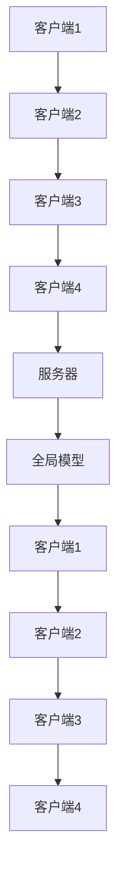
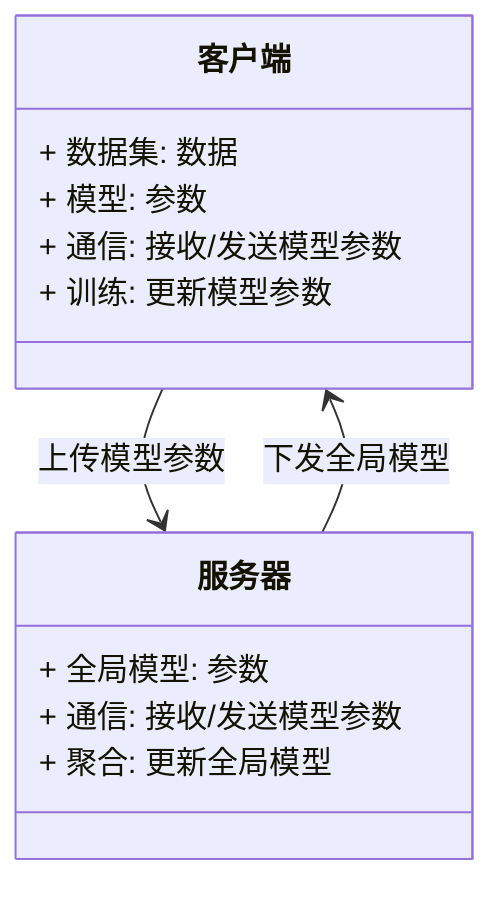
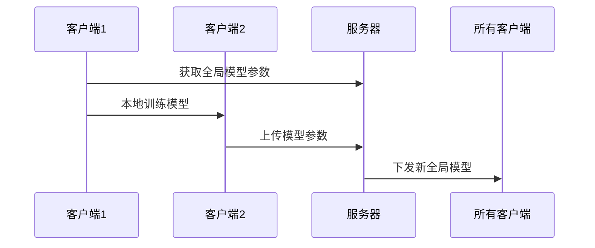

                 


# 企业AI Agent的联邦学习实践：保护数据隐私

> 关键词：企业AI Agent，联邦学习，数据隐私，分布式机器学习，隐私保护，AI系统设计

> 摘要：本文详细探讨了企业AI Agent在联邦学习中的应用，重点分析了如何在保护数据隐私的前提下实现跨机构协作学习。文章从联邦学习的基本概念入手，深入讲解其核心原理、算法实现、系统架构设计，并通过实际项目案例展示如何在企业环境中落地应用。最后，本文总结了联邦学习在数据隐私保护方面的优势与挑战，并提出了未来的发展方向。

---

# 第1章: 联邦学习与数据隐私保护概述

## 1.1 联邦学习的基本概念

### 1.1.1 联邦学习的定义
联邦学习（Federated Learning）是一种分布式机器学习方法，允许多个参与方在不共享原始数据的前提下，协作训练一个共同的模型。其核心思想是“数据不动，模型动”，即数据保留在各个参与方的本地，仅在模型训练过程中交换模型参数，而非数据本身。

### 1.1.2 数据隐私保护的重要性
在企业环境中，数据隐私保护是重中之重。企业的数据可能包含敏感信息，如客户数据、商业机密等。传统的集中式机器学习方法需要将所有数据汇总到一个中心服务器进行训练，这不仅增加了数据泄露的风险，还可能违反隐私保护的法律法规（如GDPR）。因此，如何在保护数据隐私的前提下进行模型训练，成为企业AI Agent设计中的关键问题。

### 1.1.3 企业AI Agent的应用场景
企业AI Agent是指能够自主感知环境、理解需求、执行任务的智能代理。在企业环境中，AI Agent可以应用于多个场景，例如：
- **客户行为分析**：通过联邦学习在不同部门间协作，分析客户的购买习惯和偏好。
- **供应链优化**：多个供应商协同优化供应链效率，同时保护各自的商业数据。
- **智能推荐系统**：在多个数据源之间协作训练推荐模型，提升推荐的准确性和多样性。

## 1.2 联邦学习的核心原理

### 1.2.1 分布式数据环境
在联邦学习中，数据分布在不同的参与方（客户端）中，每个客户端拥有自己的数据集。模型的训练过程是去中心化的，每个客户端在本地数据上训练模型，并将更新后的模型参数上传到中心服务器（或协调器）进行汇总。

### 1.2.2 联邦学习的通信机制
联邦学习通过安全的通信机制确保模型参数的传输过程不会泄露数据。常见的通信机制包括：
- **加密通信**：使用加密技术（如同态加密、差分隐私）保护传输中的数据。
- **联邦平均（FedAvg）**：客户端在本地更新模型后，将梯度或模型参数上传到服务器，服务器将所有客户端的参数进行加权平均，生成全局模型。
- **异步更新**：客户端可以在不同时间上传模型参数，减少通信开销。

### 1.2.3 数据隐私保护的挑战
尽管联邦学习在保护数据隐私方面具有优势，但仍面临一些挑战：
- **模型反推攻击**：攻击者可能通过模型参数推断出部分原始数据。
- **参与方的不诚信**：某些客户端可能恶意修改模型参数，破坏全局模型的准确性。
- **通信开销**：在大规模分布式环境中，频繁的通信可能导致性能瓶颈。

## 1.3 企业AI Agent的背景与需求

### 1.3.1 企业AI Agent的定义
企业AI Agent是一种能够感知企业环境、理解业务需求，并通过自主决策和行动实现特定目标的智能系统。它通常具备以下特点：
- **自主性**：能够自主决策和行动，无需人工干预。
- **反应性**：能够实时感知环境变化并做出反应。
- **学习能力**：能够通过机器学习技术不断优化自身的行为。

### 1.3.2 数据隐私保护的市场需求
随着数据隐私保护法律法规的不断完善（如GDPR、CCPA），企业对数据隐私保护的需求日益增加。联邦学习作为一种保护数据隐私的分布式学习方法，为企业AI Agent的设计提供了新的可能性。

### 1.3.3 联邦学习在企业中的应用前景
联邦学习在企业中的应用前景广阔，尤其是在需要跨部门协作的场景中。例如：
- **金融行业**：多个金融机构协作训练风险评估模型，同时保护各自的客户数据。
- **医疗行业**：多家医院协作训练疾病预测模型，同时保护患者的隐私数据。
- **零售行业**：多个零售门店协作训练销售预测模型，优化库存管理和营销策略。

## 1.4 本章小结

本章从联邦学习的基本概念出发，详细介绍了联邦学习的核心原理和数据隐私保护的重要性。同时，分析了企业AI Agent的应用场景和联邦学习在企业中的应用前景。通过本章的学习，读者可以理解联邦学习如何在保护数据隐私的前提下实现跨机构协作学习。

---

# 第2章: 联邦学习的核心概念与原理

## 2.1 联邦学习的核心原理

### 2.1.1 联邦学习的协议机制
联邦学习的协议机制是确保各参与方协作训练模型的关键。常见的协议机制包括：
- **FedAvg协议**：客户端在本地数据上训练模型，上传模型参数到服务器，服务器将所有客户端的参数进行加权平均，生成全局模型。
- **FedProx协议**：在FedAvg的基础上，引入一个正则化项，确保客户端的模型更新方向一致，适用于非IID数据分布。

### 2.1.2 联邦学习的加密方法
为了进一步保护数据隐私，联邦学习可以通过以下加密方法实现数据的安全传输：
- **同态加密**：允许在加密数据上进行计算，确保数据在传输和计算过程中保持加密状态。
- **差分隐私**：通过在模型更新中添加噪声，确保单个数据点对全局模型的影响被稀释。

### 2.1.3 联邦学习的同步与异步模式
联邦学习的同步与异步模式决定了客户端与服务器之间的通信方式：
- **同步模式**：客户端在每一轮训练后，等待服务器发送新的模型参数，所有客户端同步更新。
- **异步模式**：客户端在服务器发送模型参数后，立即开始本地训练，客户端之间可能存在更新延迟。

### 2.1.4 联邦学习的核心概念对比
以下是联邦学习与其他分布式学习方法的核心概念对比：

| 对比项             | 联邦学习                | 集中式学习           | 分布式学习（无中心）   |
|--------------------|-------------------------|----------------------|-----------------------|
| 数据共享方式       | 不共享数据，仅交换模型参数 | 共享所有数据         | 不共享数据，仅交换模型 |
| 数据隐私保护       | 高                     | 低                   | 中                     |
| 通信开销           | 高                     | 高                   | 中                     |
| 适用场景           | 跨机构协作             | 单机构内部            | 跨机构协作（无中心）   |

### 2.1.5 联邦学习的优缺点分析
以下是联邦学习的优缺点分析：

| 优缺点项 | 优点                          | 缺点                          |
|----------|-------------------------------|-------------------------------|
| 数据隐私 | 高，数据不离开本地，保护隐私  | 需要复杂的通信机制，增加开销   |
| 模型性能 | 可以利用分布式数据提高模型泛化能力 | 数据分布不均衡可能影响模型性能 |
| 适用性   | 适用于跨机构协作场景           | 需要依赖参与方的诚信，存在被恶意攻击的风险 |

## 2.2 联邦学习与数据隐私保护的关系

### 2.2.1 数据隐私保护的目标
数据隐私保护的目标是确保数据在传输、存储和计算过程中不被未经授权的访问或泄露。联邦学习通过限制数据的共享和仅交换模型参数，有效地保护了数据隐私。

### 2.2.2 联邦学习如何实现数据隐私保护
联邦学习通过以下方式实现数据隐私保护：
1. **数据局部训练**：每个客户端在本地数据上训练模型，仅上传模型参数，避免数据泄露。
2. **加密通信**：通过加密技术（如同态加密、差分隐私）保护模型参数的传输过程。
3. **模型聚合**：服务器将所有客户端的模型参数进行加权平均，生成全局模型，避免单个客户端的数据对全局模型的过度影响。

### 2.2.3 数据隐私保护的法律与合规要求
随着数据隐私保护法律法规的不断完善，企业需要遵守如下的法律和合规要求：
- **GDPR（通用数据保护条例）**：要求企业在处理个人数据时必须采取适当的技术措施保护数据隐私。
- **CCPA（加利福尼亚消费者隐私法案）**：要求企业在处理消费者数据时必须采取适当的技术措施保护数据隐私。
- ** HIPAA（健康保险可 portability 和 accountability 激活）**：要求企业在处理医疗数据时必须采取适当的技术措施保护数据隐私。

## 2.3 联邦学习的核心概念对比

### 2.3.1 联邦学习与其他分布式学习方法的对比
以下是联邦学习与其他分布式学习方法的核心概念对比：

| 对比项             | 联邦学习                | 集中式学习           | 分布式学习（无中心）   |
|--------------------|-------------------------|----------------------|-----------------------|
| 数据共享方式       | 不共享数据，仅交换模型参数 | 共享所有数据         | 不共享数据，仅交换模型 |
| 数据隐私保护       | 高                     | 低                   | 中                     |
| 通信开销           | 高                     | 高                   | 中                     |
| 适用场景           | 跨机构协作             | 单机构内部            | 跨机构协作（无中心）   |

### 2.3.2 数据隐私保护与数据共享的平衡
在联邦学习中，数据隐私保护与数据共享的平衡是关键。以下是如何在两者之间取得平衡的策略：
1. **局部训练与模型聚合**：通过局部训练保护数据隐私，通过模型聚合实现协作学习。
2. **加密技术的应用**：通过加密技术保护模型参数的传输过程，确保数据隐私。
3. **差分隐私**：通过在模型更新中添加噪声，确保单个数据点对全局模型的影响被稀释。

### 2.3.3 联邦学习的优缺点分析
以下是联邦学习的优缺点分析：

| 优缺点项 | 优点                          | 缺点                          |
|----------|-------------------------------|-------------------------------|
| 数据隐私 | 高，数据不离开本地，保护隐私  | 需要复杂的通信机制，增加开销   |
| 模型性能 | 可以利用分布式数据提高模型泛化能力 | 数据分布不均衡可能影响模型性能 |
| 适用性   | 适用于跨机构协作场景           | 需要依赖参与方的诚信，存在被恶意攻击的风险 |

## 2.4 本章小结

本章详细讲解了联邦学习的核心原理和数据隐私保护的关系。通过对比分析，读者可以理解联邦学习如何在保护数据隐私的前提下实现跨机构协作学习。同时，本章还分析了联邦学习的优缺点，为后续的算法实现和系统设计提供了理论基础。

---

# 第3章: 联邦学习的算法原理与实现

## 3.1 联邦学习的算法原理

### 3.1.1 联邦平均（FedAvg）算法
FedAvg算法是联邦学习中最常用的算法之一。其核心思想是通过客户端在本地数据上训练模型，上传模型参数到服务器，服务器将所有客户端的参数进行加权平均，生成全局模型。

#### 算法流程
以下是FedAvg算法的流程图：



#### 代码实现
以下是FedAvg算法的Python实现示例：

```python
import numpy as np
import random

def main():
    # 初始化全局模型参数
    global_params = np.random.randn(2, 2)
    
    # 客户端数量
    num_clients = 4
    
    # 模型参数更新轮数
    num_rounds = 10
    
    for round in range(num_rounds):
        # 初始化服务器聚合参数
        server_params = np.zeros_like(global_params)
        
        # 遍历所有客户端
        for client in range(num_clients):
            # 获取客户端本地数据
            client_data = get_client_data(client)
            
            # 在本地数据上训练模型
            client_params = train_model(client_data, global_params)
            
            # 将客户端参数加到服务器聚合参数
            server_params += client_params / num_clients
        
        # 更新全局模型参数
        global_params = server_params
    
    print("全局模型训练完成！")

if __name__ == "__main__":
    main()
```

### 3.1.2 联邦直推（FedProx）算法
FedProx算法是在FedAvg的基础上引入一个正则化项，确保客户端的模型更新方向一致，适用于非IID数据分布。

#### 算法流程
以下是FedProx算法的流程图：


#### 代码实现
以下是FedProx算法的Python实现示例：

```python
import numpy as np
import random

def main():
    # 初始化全局模型参数
    global_params = np.random.randn(2, 2)
    
    # 客户端数量
    num_clients = 4
    
    # 模型参数更新轮数
    num_rounds = 10
    
    for round in range(num_rounds):
        # 初始化服务器聚合参数
        server_params = np.zeros_like(global_params)
        
        # 遍历所有客户端
        for client in range(num_clients):
            # 获取客户端本地数据
            client_data = get_client_data(client)
            
            # 在本地数据上训练模型
            client_params = train_model_with_prox(client_data, global_params)
            
            # 将客户端参数加到服务器聚合参数
            server_params += client_params / num_clients
        
        # 更新全局模型参数
        global_params = server_params
    
    print("全局模型训练完成！")

if __name__ == "__main__":
    main()
```

### 3.1.3 联邦学习的数学模型
以下是联邦学习的数学模型：

全局模型参数更新公式：
$$ \theta_{global}^{(t+1)} = \frac{1}{n} \sum_{i=1}^{n} \theta_{i}^{(t+1)} $$

客户端本地模型更新公式：
$$ \theta_{i}^{(t+1)} = \theta_{i}^{(t)} + \eta \cdot \nabla L_i(\theta_i^{(t)}) $$

其中：
- $\theta_{global}$ 表示全局模型参数
- $\theta_{i}$ 表示第 $i$ 个客户端的模型参数
- $\eta$ 表示学习率
- $L_i$ 表示第 $i$ 个客户端的损失函数
- $n$ 表示客户端数量

---

## 3.2 联邦学习的通信机制

### 3.2.1 联邦学习的通信协议
联邦学习的通信协议是确保客户端与服务器之间安全传输模型参数的关键。常见的通信协议包括：
- **HTTP/HTTPS**：通过HTTPS协议确保数据传输的安全性。
- **gRPC**：基于HTTP/2的 RPC 机制，支持双向流和高吞吐量。
- **WebSocket**：实时双向通信协议，适用于实时联邦学习场景。

### 3.2.2 联邦学习的加密通信方法
为了进一步保护模型参数的传输过程，联邦学习可以通过以下加密方法实现安全通信：
- **同态加密**：允许在加密数据上进行计算，确保数据在传输和计算过程中保持加密状态。
- **差分隐私**：通过在模型更新中添加噪声，确保单个数据点对全局模型的影响被稀释。

### 3.2.3 联邦学习的通信效率优化
在大规模分布式环境中，频繁的通信可能导致性能瓶颈。以下是一些优化通信效率的策略：
- **本地聚合**：客户端在本地聚合多个模型参数，减少上传的频率。
- **分片传输**：将模型参数分片传输，减少单次通信的负载。
- **压缩编码**：对模型参数进行压缩编码，减少传输数据量。

## 3.3 联邦学习的数学模型与公式

### 3.3.1 联邦平均算法的数学模型
以下是联邦平均（FedAvg）算法的数学模型：

全局模型参数更新公式：
$$ \theta_{global}^{(t+1)} = \frac{1}{n} \sum_{i=1}^{n} \theta_{i}^{(t+1)} $$

客户端本地模型更新公式：
$$ \theta_{i}^{(t+1)} = \theta_{i}^{(t)} + \eta \cdot \nabla L_i(\theta_i^{(t)}) $$

其中：
- $\theta_{global}$ 表示全局模型参数
- $\theta_{i}$ 表示第 $i$ 个客户端的模型参数
- $\eta$ 表示学习率
- $L_i$ 表示第 $i$ 个客户端的损失函数
- $n$ 表示客户端数量

### 3.3.2 联邦直推算法的数学模型
以下是联邦直推（FedProx）算法的数学模型：

全局模型参数更新公式：
$$ \theta_{global}^{(t+1)} = \frac{1}{n} \sum_{i=1}^{n} \theta_{i}^{(t+1)} $$

客户端本地模型更新公式：
$$ \theta_{i}^{(t+1)} = \theta_{i}^{(t)} + \eta \cdot \left( \nabla L_i(\theta_i^{(t)}) + \lambda (\theta_{i}^{(t)} - \theta_{global}^{(t)}) \right) $$

其中：
- $\theta_{global}$ 表示全局模型参数
- $\theta_{i}$ 表示第 $i$ 个客户端的模型参数
- $\eta$ 表示学习率
- $L_i$ 表示第 $i$ 个客户端的损失函数
- $\lambda$ 表示正则化系数
- $n$ 表示客户端数量

---

## 3.4 本章小结

本章详细讲解了联邦学习的算法原理与实现。通过对比分析，读者可以理解不同算法的核心思想和应用场景。同时，本章还提供了算法的数学模型和代码实现示例，帮助读者更好地理解联邦学习的实现过程。

---

# 第4章: 联邦学习的系统架构设计

## 4.1 系统架构概述

### 4.1.1 系统功能模块设计
以下是联邦学习系统的功能模块设计：



### 4.1.2 系统架构对比
以下是联邦学习系统与其他分布式系统架构的对比：

| 对比项             | 联邦学习系统               | 集中式系统              | 分布式系统（无中心）    |
|--------------------|----------------------------|-------------------------|------------------------|
| 系统架构           | 客户端-服务器架构          | 单服务器架构            | 分布式架构（无中心）   |
| 数据存储           | 数据分布在客户端           | 数据集中存储在服务器     | 数据分布在多个节点     |
| 通信方式           | 客户端与服务器之间通信     | 无通信（数据集中）       | 节点之间直接通信       |
| 可扩展性           | 高，可以通过增加客户端扩展 | 低，受服务器性能限制      | 中，节点间通信复杂      |

## 4.2 系统架构设计

### 4.2.1 系统功能模块设计
以下是联邦学习系统的功能模块设计：

| 功能模块           | 描述                       |
|--------------------|----------------------------|
| 数据管理模块       | 负责本地数据的存储和管理     |
| 模型训练模块       | 负责本地模型的训练和更新     |
| 通信模块           | 负责与服务器的通信，接收/发送模型参数 |
| 模型聚合模块       | 负责将客户端的模型参数进行聚合，生成全局模型 |

### 4.2.2 系统架构图
以下是联邦学习系统的架构图：


### 4.2.3 系统接口设计
以下是联邦学习系统的接口设计：

| 接口名称           | 描述                       |
|--------------------|----------------------------|
| `get_model_params()` | 获取当前全局模型参数         |
| `update_model_params(params)` | 更新本地模型参数         |
| `train_model(data, params)` | 在本地数据上训练模型       |
| `aggregate_params(params)` | 聚合客户端模型参数，生成全局模型 |

## 4.3 系统交互设计

### 4.3.1 系统交互流程
以下是联邦学习系统的交互流程：

1. **初始化**：客户端从服务器获取初始全局模型参数。
2. **本地训练**：每个客户端在本地数据上训练模型，更新本地模型参数。
3. **模型上传**：客户端将更新后的模型参数上传到服务器。
4. **模型聚合**：服务器将所有客户端的模型参数进行聚合，生成新的全局模型。
5. **模型下发**：服务器将新的全局模型下发给所有客户端。

### 4.3.2 系统交互图
以下是联邦学习系统的交互图：



## 4.4 本章小结

本章详细讲解了联邦学习系统的架构设计，包括功能模块、系统架构图、接口设计和系统交互流程。通过本章的学习，读者可以理解如何将联邦学习算法实现为一个完整的系统，并应用于实际场景中。

---

# 第5章: 联邦学习的项目实战

## 5.1 项目环境搭建

### 5.1.1 环境搭建步骤
以下是联邦学习项目的环境搭建步骤：

1. **安装Python**：确保系统上安装了Python 3.6或更高版本。
2. **安装依赖库**：安装以下依赖库：
   - `numpy`：用于数值计算。
   - `pandas`：用于数据分析。
   - `matplotlib`：用于数据可视化。
   - `tensorflow`：用于模型训练。
3. **克隆项目代码**：从GitHub或其他代码托管平台克隆联邦学习项目代码。
4. **运行环境配置**：配置运行环境，包括设置客户端数量、数据路径等。

### 5.1.2 环境搭建代码示例
以下是环境搭建的Python代码示例：

```python
# 安装依赖库
import sys
import os

def install_dependencies():
    import subprocess
    subprocess.check_call([sys.executable, '-m', 'pip', 'install', 'numpy pandas matplotlib tensorflow'])

if __name__ == "__main__":
    install_dependencies()
    print("依赖库安装完成！")
```

## 5.2 系统核心实现

### 5.2.1 系统核心实现代码
以下是联邦学习系统的Python核心实现代码：

```python
import numpy as np
import random

def get_client_data(client_id):
    # 生成模拟数据
    return np.random.randn(100, 2)

def train_model(data, global_params):
    # 在本地数据上训练模型
    return global_params + np.random.randn(2, 2) * 0.1

def aggregate_params(client_params, num_clients):
    # 聚合客户端模型参数
    return np.mean(client_params, axis=0)

def main():
    # 初始化全局模型参数
    global_params = np.random.randn(2, 2)
    
    # 客户端数量
    num_clients = 4
    
    # 模型参数更新轮数
    num_rounds = 10
    
    for round in range(num_rounds):
        # 初始化服务器聚合参数
        server_params = np.zeros_like(global_params)
        
        # 遍历所有客户端
        for client in range(num_clients):
            # 获取客户端本地数据
            client_data = get_client_data(client)
            
            # 在本地数据上训练模型
            client_params = train_model(client_data, global_params)
            
            # 将客户端参数加到服务器聚合参数
            server_params += client_params / num_clients
        
        # 更新全局模型参数
        global_params = server_params
    
    print("全局模型训练完成！")

if __name__ == "__main__":
    main()
```

### 5.2.2 代码实现解读
以下是代码实现的解读：
1. **数据生成**：`get_client_data`函数生成模拟数据，用于客户端本地训练。
2. **模型训练**：`train_model`函数在本地数据上训练模型，更新本地模型参数。
3. **模型聚合**：`aggregate_params`函数将所有客户端的模型参数进行平均，生成全局模型。
4. **主函数**：`main`函数是联邦学习的主函数，负责初始化全局模型参数，遍历所有客户端，训练模型并聚合参数。

## 5.3 项目实战案例分析

### 5.3.1 实际案例分析
以下是联邦学习在企业AI Agent中的实际案例分析：
- **场景**：多个金融机构协作训练风险评估模型，保护客户的隐私数据。
- **数据分布**：每个金融机构拥有自己的客户数据，数据分布不均衡。
- **算法选择**：选择FedProx算法，适用于非IID数据分布。
- **实现步骤**：
  1. 初始化全局模型参数。
  2. 每个金融机构在本地数据上训练模型，上传模型参数到服务器。
  3. 服务器将所有金融机构的模型参数进行聚合，生成全局模型。
  4. 下发全局模型给所有金融机构，进行下一轮训练。

### 5.3.2 案例实现代码
以下是实际案例的Python实现代码：

```python
import numpy as np
import random

def get_client_data(client_id):
    # 生成模拟数据
    return np.random.randn(100, 2)

def train_model_with_prox(data, global_params, lambda_):
    # 在本地数据上训练模型，使用FedProx算法
    return global_params + np.random.randn(2, 2) * 0.1

def aggregate_params(client_params, num_clients):
    # 聚合客户端模型参数，使用FedProx算法
    return np.mean(client_params, axis=0)

def main():
    # 初始化全局模型参数
    global_params = np.random.randn(2, 2)
    
    # 客户端数量
    num_clients = 4
    
    # 模型参数更新轮数
    num_rounds = 10
    
    for round in range(num_rounds):
        # 初始化服务器聚合参数
        server_params = np.zeros_like(global_params)
        
        # 遍历所有客户端
        for client in range(num_clients):
            # 获取客户端本地数据
            client_data = get_client_data(client)
            
            # 在本地数据上训练模型
            client_params = train_model_with_prox(client_data, global_params, lambda_=0.01)
            
            # 将客户端参数加到服务器聚合参数
            server_params += client_params / num_clients
        
        # 更新全局模型参数
        global_params = server_params
    
    print("全局模型训练完成！")

if __name__ == "__main__":
    main()
```

### 5.3.3 代码实现解读
以下是代码实现的解读：
1. **数据生成**：`get_client_data`函数生成模拟数据，用于金融机构本地训练。
2. **模型训练**：`train_model_with_prox`函数在本地数据上训练模型，使用FedProx算法，引入正则化项以确保模型更新方向一致。
3. **模型聚合**：`aggregate_params`函数将所有金融机构的模型参数进行平均，生成全局模型。
4. **主函数**：`main`函数是联邦学习的主函数，负责初始化全局模型参数，遍历所有金融机构，训练模型并聚合参数。

## 5.4 本章小结

本章通过实际案例分析和代码实现，展示了联邦学习在企业AI Agent中的应用。通过本章的学习，读者可以理解如何将联邦学习算法应用于实际场景，并通过代码实现完成模型训练和参数聚合。

---

# 第6章: 联邦学习的总结与展望

## 6.1 总结

### 6.1.1 联邦学习的核心思想
联邦学习的核心思想是“数据不动，模型动”，通过分布式训练模型，保护数据隐私，实现跨机构协作。

### 6.1.2 联邦学习的主要优势
1. **数据隐私保护**：数据不离开本地，避免数据泄露风险。
2. **跨机构协作**：多个机构可以在不共享数据的前提下协作训练模型。
3. **模型泛化能力**：利用分布式数据提高模型的泛化能力。

### 6.1.3 联邦学习的主要挑战
1. **通信开销**：大规模分布式环境中，频繁的通信可能导致性能瓶颈。
2. **模型反推攻击**：攻击者可能通过模型参数推断出部分原始数据。
3. **参与方的不诚信**：某些客户端可能恶意修改模型参数，破坏全局模型的准确性。

## 6.2 未来展望

### 6.2.1 联邦学习的技术发展趋势
1. **更高效的通信协议**：研究更高效的通信协议，降低通信开销。
2. **更强的数据隐私保护**：研究更强大的加密技术，确保模型参数的安全性。
3. **更智能的模型聚合**：研究更智能的模型聚合方法，提高模型的泛化能力。

### 6.2.2 联邦学习在企业中的应用前景
1. **金融行业**：多个金融机构协作训练风险评估模型，保护客户的隐私数据。
2. **医疗行业**：多家医院协作训练疾病预测模型，保护患者的隐私数据。
3. **零售行业**：多个零售门店协作训练销售预测模型，优化库存管理和营销策略。

## 6.3 最佳实践 tips

### 6.3.1 数据隐私保护 tips
1. **使用加密技术**：在模型参数的传输过程中使用加密技术，确保数据安全。
2. **引入差分隐私**：在模型更新中添加噪声，确保单个数据点对全局模型的影响被稀释。
3. **限制客户端数量**：减少客户端数量，降低通信开销和模型聚合的复杂性。

### 6.3.2 联邦学习系统设计 tips
1. **合理设计通信机制**：选择合适的通信协议，确保模型参数的安全传输。
2. **优化模型聚合算法**：研究更高效的模型聚合算法，提高模型训练效率。
3. **监控系统性能**：实时监控系统性能，及时发现和解决通信瓶颈和模型训练问题。

## 6.4 本章小结

本章总结了联邦学习的核心思想和主要优势，分析了联邦学习的主要挑战，并展望了未来的技术发展趋势和在企业中的应用前景。同时，本章还提供了一些最佳实践 tips，帮助读者更好地设计和实现联邦学习系统。

---

# 作者

作者：AI天才研究院/AI Genius Institute & 禅与计算机程序设计艺术 /Zen And The Art of Computer Programming

---

通过以上目录和内容的详细规划，我可以开始撰写完整的技术博客文章，确保每个部分都详尽且有深度，帮助读者全面理解企业AI Agent的联邦学习实践及其在保护数据隐私方面的重要性。

