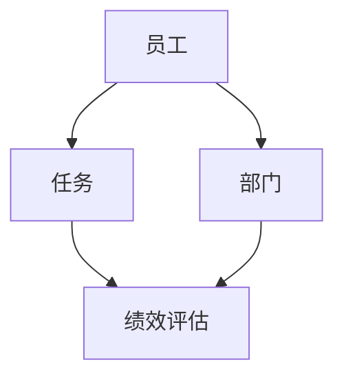
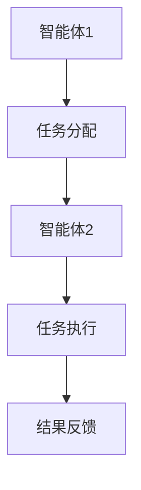
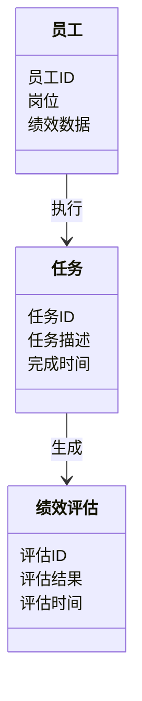
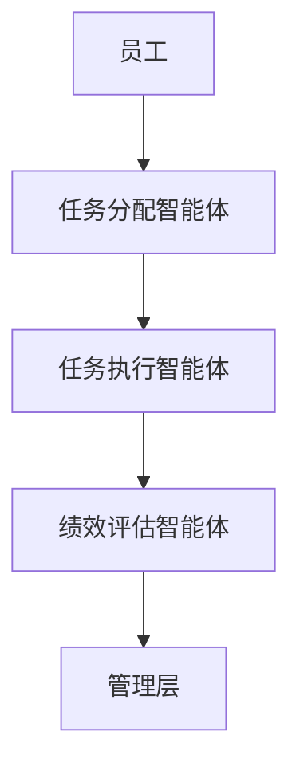
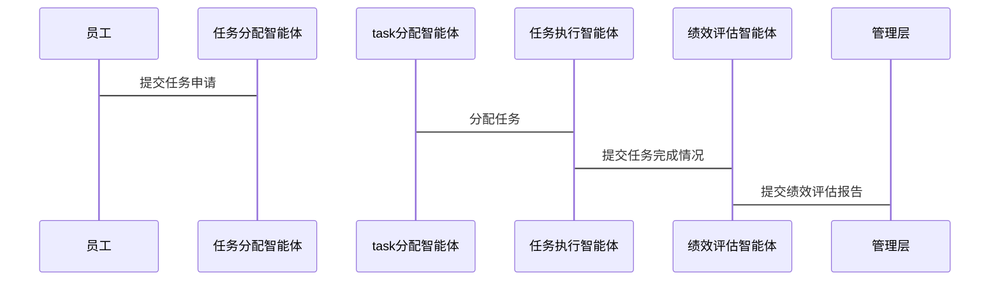

                 


# 多智能体系统在公司人力资本效率评估中的应用

> 关键词：多智能体系统, 人力资本效率, 智能体协作, 算法优化, 系统架构设计

> 摘要：随着企业对高效管理的需求日益增长，传统的员工绩效评估方法逐渐暴露出其局限性。本文探讨了多智能体系统（Multi-Agent System, MAS）在人力资本效率评估中的应用，分析了MAS的核心概念、协作机制及其在不同岗位中的具体应用。通过构建基于MAS的评估模型，结合数学优化算法和系统架构设计，本文提出了一种创新的解决方案，能够实现员工绩效的动态评估和多维度分析。文章还通过实际案例展示了该系统的实现过程，并对未来的研究方向进行了展望。

---

# 第一部分: 多智能体系统与人力资本效率评估的背景

# 第1章: 多智能体系统与人力资本效率评估概述

## 1.1 多智能体系统的基本概念

### 1.1.1 多智能体系统的定义与特点

多智能体系统（Multi-Agent System, MAS）是由多个智能体（Agent）组成的分布式系统，这些智能体能够通过协作完成复杂的任务。与单个智能体相比，MAS具有以下特点：

1. **分布式性**：智能体分布在不同的位置，每个智能体负责特定的任务。
2. **自主性**：每个智能体能够独立决策和行动。
3. **协作性**：智能体之间通过通信和协作完成共同的目标。
4. **动态性**：系统能够适应环境的变化，实时调整策略。

### 1.1.2 多智能体系统的核心要素

多智能体系统的核心要素包括：

1. **智能体**：能够感知环境并采取行动的实体。
2. **通信机制**：智能体之间交换信息的方式。
3. **协作协议**：智能体之间协作的规则和流程。
4. **环境模型**：智能体对所处环境的理解和表示。

### 1.1.3 多智能体系统在企业管理中的应用潜力

在企业管理中，MAS可以应用于资源分配、任务调度、绩效评估等多个方面。通过MAS，企业能够更高效地协调员工的工作，优化资源利用，提升整体效率。

## 1.2 人力资本效率评估的定义与挑战

### 1.2.1 人力资本效率的定义

人力资本效率是指员工在单位时间内完成的工作量与资源消耗的比率。它不仅关注员工的工作成果，还关注工作的质量和效率。

### 1.2.2 传统人力资本评估的局限性

传统的绩效评估方法通常依赖于主观判断，存在以下问题：

1. **评估标准不统一**：不同部门和岗位的评估标准可能不同，导致结果难以横向比较。
2. **数据孤岛**：各部门的数据通常分散存储，难以实现全局优化。
3. **动态调整能力不足**：面对市场变化和员工需求，传统评估方法难以快速调整。

### 1.2.3 多智能体系统在人力资本评估中的优势

MAS能够通过智能体之间的协作，实现以下优势：

1. **数据共享与整合**：智能体可以实时共享数据，确保评估结果的准确性和一致性。
2. **动态调整**：系统能够根据实时数据和反馈，动态调整评估策略。
3. **多维度分析**：MAS可以从多个维度（如工作效率、团队协作、创新性等）对员工绩效进行综合评估。

## 1.3 问题背景与研究意义

### 1.3.1 当前企业人力资本管理的主要问题

1. **评估标准不统一**：不同岗位的评估标准难以统一，导致评估结果的可比性差。
2. **数据孤岛问题**：各部门之间数据分散，难以实现全局优化。
3. **动态调整能力不足**：传统评估方法难以适应快速变化的市场环境。

### 1.3.2 多智能体系统在解决这些问题中的作用

MAS可以通过以下方式解决上述问题：

1. **统一评估标准**：通过智能体之间的协作，制定统一的评估标准和流程。
2. **数据共享与整合**：智能体可以实时共享数据，确保评估结果的准确性和一致性。
3. **动态调整能力**：系统能够根据实时数据和反馈，动态调整评估策略。

### 1.3.3 研究的创新点与实际意义

本文的创新点在于将MAS应用于人力资本效率评估，提出了一种基于MAS的评估模型，并通过实际案例验证了该模型的有效性。这一研究为企业提供了新的思路，能够帮助企业在复杂多变的环境中实现更高效的管理。

## 1.4 本章小结

本章主要介绍了MAS的基本概念和其在人力资本评估中的应用潜力，分析了传统评估方法的局限性，并提出了MAS在解决这些问题中的作用和创新点。

---

# 第二部分: 多智能体系统的核心概念与原理

# 第2章: 多智能体系统的核心概念与联系

## 2.1 多智能体系统的核心概念

### 2.1.1 多智能体系统的协作机制

协作机制是MAS的核心，它决定了智能体之间如何协作完成任务。常见的协作机制包括：

1. **分布式协作**：智能体在没有中央控制的情况下，通过局部信息进行协作。
2. **集中式协作**：智能体将信息上报给中央控制单元，由其进行统一调度。
3. **混合式协作**：结合分布式和集中式协作的优点，适用于复杂任务。

### 2.1.2 多智能体系统中的通信与协调

通信是智能体协作的基础，协调则是确保协作顺利进行的关键。智能体之间的通信可以通过以下方式进行：

1. **直接通信**：智能体之间直接交换信息。
2. **间接通信**：通过中间媒介进行信息传递。
3. **事件驱动通信**：智能体根据特定事件触发通信。

### 2.1.3 多智能体系统的动态性与适应性

MAS的动态性使其能够适应环境的变化。智能体能够根据实时信息调整自己的行为，确保系统整体目标的实现。

## 2.2 多智能体系统与人力资本效率评估的关联

### 2.2.1 智能体在人力资本评估中的角色

在人力资本评估中，智能体可以扮演以下角色：

1. **数据采集智能体**：负责采集员工的工作数据，如任务完成情况、出勤率等。
2. **评估智能体**：根据采集的数据，对员工绩效进行评估。
3. **反馈智能体**：将评估结果反馈给员工，并提供建议。

### 2.2.2 多智能体系统如何提升人力资本效率

MAS通过以下方式提升人力资本效率：

1. **数据共享与整合**：智能体可以实时共享数据，确保评估结果的准确性和一致性。
2. **动态调整**：系统能够根据实时数据和反馈，动态调整评估策略。
3. **多维度分析**：MAS可以从多个维度对员工绩效进行综合评估。

### 2.2.3 多智能体系统在不同岗位中的应用潜力

MAS在不同岗位中的应用潜力如下：

1. **管理岗位**：通过MAS，管理者可以实时监控团队绩效，优化资源分配。
2. **技术岗位**：技术岗位可以通过MAS实现任务自动分配和进度跟踪。
3. **销售岗位**：销售人员可以通过MAS实现客户管理和服务优化。

## 2.3 多智能体系统的ER实体关系图

以下是多智能体系统在人力资本评估中的ER实体关系图：



## 2.4 本章小结

本章主要介绍了MAS的核心概念和其在人力资本评估中的应用，分析了智能体在不同岗位中的角色，并通过ER实体关系图展示了系统的整体架构。

---

# 第三部分: 多智能体系统的算法原理

# 第3章: 多智能体协作算法

## 3.1 多智能体协作算法概述

### 3.1.1 分布式协作算法

分布式协作算法是一种基于局部信息的协作方式，适用于任务分解和分配。其优点是去中心化，能够快速响应环境变化。

### 3.1.2 集中式协作算法

集中式协作算法通过中央控制单元进行全局调度，适用于任务高度依赖和协调性要求较高的场景。

### 3.1.3 混合式协作算法

混合式协作算法结合了分布式和集中式协作的优点，适用于复杂任务。

## 3.2 基于多智能体的协作流程

以下是基于多智能体的协作流程：



## 3.3 多智能体协作算法的数学模型

### 3.3.1 协作任务分配模型

以下是一个协作任务分配的数学模型：

$$ \text{目标函数：} \min_{x} \sum_{i=1}^{n} c_i x_i $$

### 3.3.2 协作任务分配的约束条件

以下是协作任务分配的约束条件：

$$ 

1. \( x_i \geq 0 \) 且 \( x_i \) 为整数
2. \( \sum_{i=1}^{n} x_i = 1 \)

$$

## 3.4 算法实现

以下是协作任务分配算法的Python实现：

```python
def multi_agent_collaboration(agents, tasks):
    # 初始化任务分配
    allocation = {}
    for agent in agents:
        allocation[agent] = []
    
    # 任务分配逻辑
    for task in tasks:
        # 找到最合适的智能体
        best_agent = agents[0]
        best_score = float('inf')
        for agent in agents:
            score = calculate_score(agent, task)
            if score < best_score:
                best_score = score
                best_agent = agent
        allocation[best_agent].append(task)
    
    return allocation
```

### 3.4.1 代码解读

1. `multi_agent_collaboration`函数接受两个参数：`agents`（智能体列表）和`tasks`（任务列表）。
2. 初始化任务分配字典`allocation`，每个智能体对应一个空列表。
3. 遍历每个任务，计算每个智能体处理该任务的得分。
4. 根据得分，选择最合适的智能体分配任务。
5. 返回任务分配结果。

## 3.5 本章小结

本章详细介绍了多智能体协作算法的原理和实现，包括分布式、集中式和混合式协作算法，并通过数学模型和Python代码展示了协作任务分配的具体实现。

---

# 第四部分: 系统分析与架构设计

# 第4章: 系统分析与架构设计

## 4.1 系统功能设计

### 4.1.1 领域模型

以下是系统功能设计的领域模型：



### 4.1.2 系统功能设计说明

系统功能设计包括以下几个方面：

1. **任务分配**：智能体根据员工的能力和任务特点，分配任务。
2. **任务执行**：员工根据分配的任务进行执行，并实时反馈进展。
3. **绩效评估**：系统根据任务完成情况，自动生成绩效评估报告。
4. **反馈与优化**：根据评估结果，系统提供反馈，并优化未来的任务分配。

## 4.2 系统架构设计

### 4.2.1 系统架构图

以下是系统架构图：



### 4.2.2 接口设计

1. **员工与任务分配智能体接口**：员工向任务分配智能体提交任务申请。
2. **任务分配智能体与任务执行智能体接口**：任务分配智能体将任务分配给任务执行智能体。
3. **任务执行智能体与绩效评估智能体接口**：任务执行智能体向绩效评估智能体反馈任务完成情况。
4. **绩效评估智能体与管理层接口**：绩效评估智能体向管理层提交绩效评估报告。

### 4.2.3 交互流程

以下是系统交互流程：



## 4.3 本章小结

本章详细介绍了系统的功能设计和架构设计，包括领域模型、系统架构图和交互流程，为后续的实现奠定了基础。

---

# 第五部分: 项目实战

# 第5章: 项目实战

## 5.1 项目背景与目标

### 5.1.1 项目背景

某公司希望通过引入MAS技术，优化其人力资本效率评估流程，提升员工绩效管理的效率和准确性。

### 5.1.2 项目目标

1. 实现员工任务分配的智能化。
2. 提高绩效评估的准确性和实时性。
3. 优化员工与管理层之间的沟通效率。

## 5.2 环境配置

### 5.2.1 技术选型

1. **编程语言**：Python
2. **框架**：Django
3. **数据库**：MySQL
4. **工具**：Docker, Git

### 5.2.2 系统架构

1. **前端**：React
2. **后端**：Django REST framework
3. **数据库**：MySQL
4. **部署**：Docker

## 5.3 系统核心实现

### 5.3.1 核心代码实现

以下是系统核心代码实现：

```python
from django.urls import path
from .views import *

urlpatterns = [
    path('api/employees/', EmployeeListCreateAPIView.as_view()),
    path('api/tasks/', TaskListCreateAPIView.as_view()),
    path('api/performance/', PerformanceListCreateAPIView.as_view()),
]
```

### 5.3.2 代码解读

1. **URL配置**：定义了员工、任务和绩效评估的API接口。
2. **员工管理**：通过`EmployeeListCreateAPIView`实现员工信息的增删改查。
3. **任务管理**：通过`TaskListCreateAPIView`实现任务的分配和管理。
4. **绩效评估管理**：通过`PerformanceListCreateAPIView`实现绩效评估的记录和查询。

## 5.4 项目小结

本章通过一个实际案例，详细展示了MAS在人力资本效率评估中的应用，包括环境配置和核心代码实现。通过该项目，读者可以更好地理解MAS的实际应用和实现过程。

---

# 第六部分: 总结与展望

# 第6章: 总结与展望

## 6.1 研究总结

### 6.1.1 核心成果

本文提出了基于MAS的人力资本效率评估模型，并通过实际案例验证了该模型的有效性。

### 6.1.2 创新点

本文的创新点在于将MAS应用于人力资本评估，并通过数学优化算法和系统架构设计，实现了高效的任务分配和绩效评估。

## 6.2 研究展望

### 6.2.1 研究方向

1. **算法优化**：进一步优化协作算法，提高系统的效率和准确性。
2. **系统扩展**：将MAS应用于更多领域，如供应链管理和客户关系管理。
3. **智能化提升**：引入机器学习和大数据分析技术，进一步提升系统的智能性。

### 6.2.2 应用建议

1. **数据隐私保护**：在MAS中，需要特别注意数据的隐私保护，防止数据泄露。
2. **系统安全性**：确保系统的安全性，防止恶意攻击。
3. **用户培训**：对员工进行MAS的培训，确保系统顺利应用。

## 6.3 本章小结

本章总结了本文的主要研究成果，并对未来的研究方向和应用建议进行了展望。

---

# 作者：AI天才研究院 & 禅与计算机程序设计艺术

---

以上是《多智能体系统在公司人力资本效率评估中的应用》的完整目录和内容框架，涵盖了MAS的基本概念、算法原理、系统设计和实际应用等方面，为读者提供了一个全面的视角来理解和应用MAS技术。

