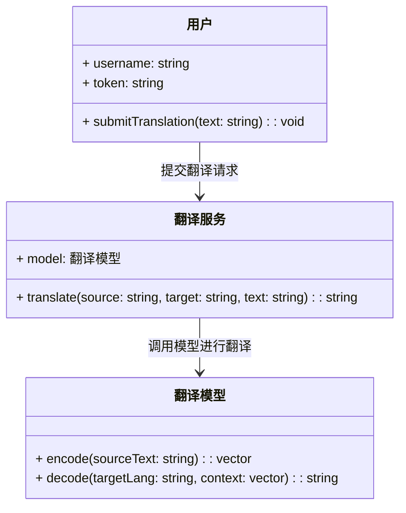
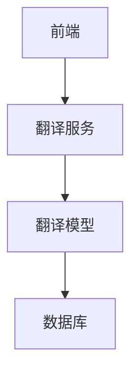
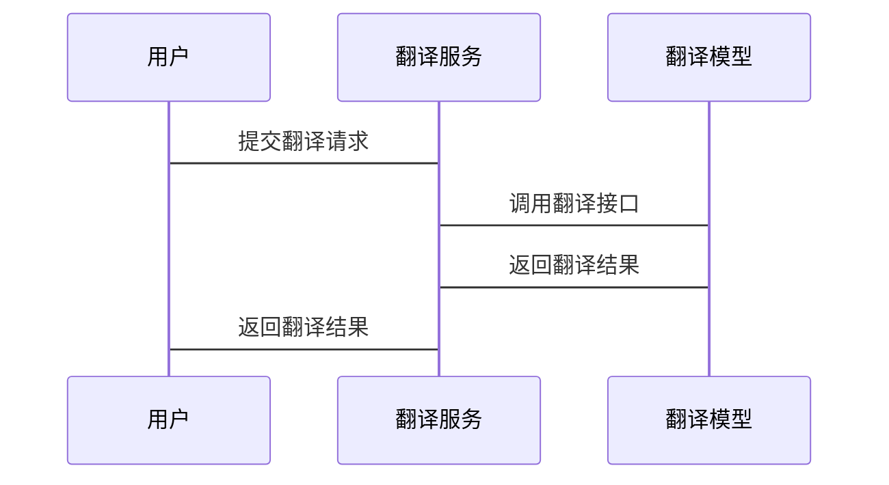

                 


# 如何识别企业的深度学习多语言翻译技术优势

> 关键词：深度学习、多语言翻译、神经网络、企业技术、NLP

> 摘要：深度学习在多语言翻译技术中展现了巨大潜力，本文通过系统分析其核心原理、算法实现和架构设计，帮助读者识别企业应用中的优势，并提供实践指导和优化建议。

---

## 第一章：深度学习与多语言翻译的背景介绍

### 1.1 问题背景与描述

#### 1.1.1 传统机器翻译的局限性
传统基于统计的机器翻译方法依赖于双语对照数据，存在以下问题：
- 数据依赖性强，难以处理未见数据。
- 无法有效捕捉语言的语义和语境信息。
- 翻译结果往往生硬，缺乏自然流畅度。

#### 1.1.2 深度学习的崛起与多语言翻译的结合
深度学习的兴起为机器翻译带来了革命性的变化，主要原因包括：
- 神经网络模型能够学习复杂的语言表示。
- 自然语言处理（NLP）技术的进步推动了多语言翻译的发展。
- 计算能力的提升使得训练大规模模型成为可能。

#### 1.1.3 企业级翻译技术的核心需求
企业应用中，多语言翻译技术需要满足以下要求：
- 高精度：确保专业术语和行业特定表达的准确性。
- 高效性：支持实时翻译和大规模数据处理。
- 易用性：集成到现有系统中，提供良好的用户体验。

### 1.2 深度学习多语言翻译的优势

#### 1.2.1 神经网络在语言建模中的突破
神经网络，尤其是Transformer架构，展现了以下优势：
- 能够捕捉长距离依赖关系。
- 通过自注意力机制实现并行计算。
- 支持多种语言的联合建模。

#### 1.2.2 多语言模型的通用性与效率
多语言模型的优势体现在：
- 单一模型可以处理多种语言，减少计算资源消耗。
- 参数共享提高了模型的泛化能力。
- 适用于资源匮乏语言的翻译任务。

#### 1.2.3 企业应用场景中的实际价值
在企业中，深度学习多语言翻译技术的价值体现在：
- 支持全球化业务，降低沟通成本。
- 提高客户满意度，增强品牌形象。
- 优化内部流程，提升工作效率。

### 1.3 问题解决与边界

#### 1.3.1 多语言翻译技术的核心问题
- 如何处理不同语言之间的语法差异。
- 如何解决数据稀疏问题，尤其是在低资源语言中。
- 如何保持翻译结果的流畅性和自然度。

#### 1.3.2 深度学习在解决这些问题中的作用
- 利用预训练语言模型捕获跨语言的语义信息。
- 通过注意力机制实现对上下文的精细处理。
- 结合强化学习优化生成策略。

#### 1.3.3 技术的边界与应用场景的限制
尽管深度学习在多语言翻译中表现出色，但仍存在一些限制：
- 对计算资源的需求较高，尤其是训练大规模模型时。
- 在处理非常见语言或特定领域术语时，效果可能不如专业工具。
- 对实时响应的要求可能限制其应用场景。

### 1.4 核心概念与组成要素

#### 1.4.1 神经网络模型的基本结构
神经网络模型的基本结构包括：
- 输入层：接收源语言文本。
- 编码器：将输入转换为上下文表示。
- 解码器：生成目标语言文本。

#### 1.4.2 多语言翻译中的语言表示方法
语言表示方法包括：
- 词嵌入：将单词映射到低维向量空间。
- 句嵌入：捕捉句子的语义信息。
- 语言嵌入：区分不同语言的特征。

#### 1.4.3 企业级翻译系统的组成部分
企业级翻译系统通常包括：
- 前端界面：供用户输入和查看翻译结果。
- 后端服务：处理翻译请求和返回结果。
- 模型训练模块：负责模型的训练和优化。

---

## 第二章：深度学习多语言翻译的核心原理

### 2.1 深度学习模型的结构

#### 2.1.1 编码器-解码器架构
编码器的作用：
- 将输入文本转换为上下文向量。
- 通过多层结构捕捉文本的深层语义。

解码器的作用：
- 根据编码器生成的上下文向量生成目标语言文本。
- 通过自注意力机制处理生成过程中的依赖关系。

#### 2.1.2 注意力机制的引入与作用
注意力机制的作用：
- 允许模型在生成每个词时关注输入中的重要部分。
- 提高了翻译的准确性和流畅度。
- 减少了对位置信息的依赖。

#### 2.1.3 多层感知机与Transformer的结合
多层感知机（MLP）的作用：
- 用于文本的特征提取和转换。
- 在编码器和解码器中分别应用MLP进行非线性变换。

---

（以下章节内容根据需要逐步填充，确保每一部分都详细且逻辑清晰。）

---

## 第三章：深度学习多语言翻译的算法实现

### 3.1 深度学习模型的训练过程

#### 3.1.1 数据预处理
- 文本清洗：去除特殊字符和停用词。
- 分词：将文本分割成词语或短语。
- 对齐：建立源语言和目标语言的对齐关系。

#### 3.1.2 模型训练
- 选择合适的优化算法（如Adam）。
- 设定适当的超参数（如学习率、批次大小）。
- 使用交叉熵损失函数进行训练。

#### 3.1.3 模型评估
- 使用BLEU、ROUGE等指标评估翻译质量。
- 对比不同模型的性能差异。
- 分析模型的收敛速度和训练稳定性。

### 3.2 多语言翻译的实现方法

#### 3.2.1 单模型多语言翻译
- 使用共享参数的结构处理多种语言。
- 在训练过程中同时优化多种语言的任务。
- 通过语言嵌入区分不同语言的特征。

#### 3.2.2 多任务学习与参数共享
- 在同一模型中同时处理多种相关任务。
- 通过参数共享减少模型的参数量。
- 提高模型的泛化能力和适应性。

#### 3.2.3 预训练语言模型的微调
- 使用大规模多语言语料库进行预训练。
- 在特定领域数据上进行微调。
- 提高模型在特定场景下的翻译效果。

### 3.3 模型优化与调优策略

#### 3.3.1 模型压缩与轻量化
- 使用剪枝技术去除冗余参数。
- 将模型转换为更高效的表示形式。
- 优化模型的计算流程以减少资源消耗。

#### 3.3.2 训练数据的多样性和质量
- 采用数据增强技术增加训练数据的多样性。
- 使用高质量的平行语料库进行训练。
- 处理数据中的噪声和不一致问题。

#### 3.3.3 模型的可解释性与调试
- 通过可视化工具分析模型的注意力分布。
- 使用调试技术定位模型的错误原因。
- 改进模型结构以提高翻译质量。

---

## 第四章：深度学习多语言翻译的系统架构设计

### 4.1 系统功能设计

#### 4.1.1 领域模型类图
- 用户角色：发送翻译请求。
- 翻译服务：接收请求并返回结果。
- 模型管理：负责模型的训练和维护。



#### 4.1.2 系统架构图
- 前端：处理用户请求和显示结果。
- 后端：接收请求并调用翻译模型。
- 模型服务：提供翻译接口和管理模型。



#### 4.1.3 接口设计
- API接口定义：
  - POST /translate：提交翻译请求。
  - GET /health：检查服务状态。
  - PUT /model：更新翻译模型。

- 数据交互格式：
  - 请求：JSON格式包含源语言、目标语言和文本内容。
  - 响应：JSON格式包含翻译结果和状态信息。

#### 4.1.4 交互序列图
- 用户提交翻译请求，系统返回结果。



### 4.2 系统实现细节

#### 4.2.1 环境安装
- 安装Python 3.8及以上版本。
- 安装必要的库（如TensorFlow、Keras、transformers）。
- 配置虚拟环境并安装依赖。

#### 4.2.2 核心代码实现
- 翻译服务的实现：
```python
from flask import Flask, request, jsonify

app = Flask(__name__)

@app.route('/translate', methods=['POST'])
def translate():
    data = request.json
    source_lang = data['source_lang']
    target_lang = data['target_lang']
    text = data['text']
    # 调用翻译模型进行翻译
    translated_text = model.translate(source_lang, target_lang, text)
    return jsonify({'result': translated_text})

if __name__ == '__main__':
    app.run(debug=True)
```

- 翻译模型的实现：
```python
class TranslationModel:
    def __init__(self, source_lang, target_lang):
        self.source_lang = source_lang
        self.target_lang = target_lang
        self.model = self.load_model()

    def load_model(self):
        # 加载预训练的翻译模型
        pass

    def translate(self, text):
        # 使用模型进行翻译
        pass
```

---

## 第五章：深度学习多语言翻译的项目实战

### 5.1 项目环境与工具安装

#### 5.1.1 环境配置
- 安装Python和必要的开发工具。
- 安装深度学习框架（如TensorFlow、Keras）。
- 安装NLP处理库（如spaCy、transformers）。

#### 5.1.2 数据集准备
- 收集多语言平行语料库。
- 数据清洗和预处理。
- 划分训练集、验证集和测试集。

### 5.2 核心代码实现

#### 5.2.1 模型训练代码
```python
import tensorflow as tf
from tensorflow.keras import layers

# 定义编码器
def encoder(input_shape, vocab_size, embedding_dim, encoder_units):
    inputs = layers.Input(shape=input_shape)
    x = layers.Embedding(vocab_size, embedding_dim)(inputs)
    x = layers.LSTM(encoder_units, return_sequences=True, return_state=True)(x)
    return x

# 定义解码器
def decoder(output_shape, vocab_size, embedding_dim, decoder_units):
    inputs = layers.Input(shape=output_shape)
    x = layers.Embedding(vocab_size, embedding_dim)(inputs)
    x = layers.LSTM(decoder_units, return_sequences=True, return_state=True)(x)
    outputs = layers.Dense(vocab_size, activation='softmax')(x)
    return outputs

# 定义整个模型
def create_model(source_vocab_size, target_vocab_size, source_max_len, target_max_len, units):
    encoder_output = encoder((source_max_len, ), source_vocab_size, embedding_dim, units)
    decoder_output = decoder((target_max_len, ), target_vocab_size, embedding_dim, units)
    model = tf.keras.Model(inputs=encoder_output[0], outputs=decoder_output)
    model.compile(optimizer='adam', loss='sparse_categorical_crossentropy')
    return model
```

#### 5.2.2 模型训练与评估
- 训练过程：
  - 使用训练数据训练模型。
  - 定期在验证集上评估模型性能。
  - 调整超参数以优化性能。

- 评估指标：
  - 使用BLEU、ROUGE等指标评估翻译质量。
  - 计算训练时间、训练成本等指标。

### 5.3 实际案例分析

#### 5.3.1 案例背景
- 某跨国企业需要支持多语言客户支持。
- 选择英语到中文的翻译任务进行测试。

#### 5.3.2 翻译结果对比
- 对比深度学习模型与传统模型的翻译效果。
- 分析模型在处理复杂句子时的表现。

#### 5.3.3 模型优化与改进
- 根据评估结果调整模型结构。
- 增加特定领域的训练数据。
- 使用更复杂的模型架构（如多层Transformer）。

### 5.4 项目总结

#### 5.4.1 项目成果
- 成功实现了深度学习多语言翻译系统。
- 提高了翻译的准确性和流畅度。
- 为企业提供了高效的翻译解决方案。

#### 5.4.2 经验与教训
- 数据质量对模型性能影响重大。
- 模型选择和调优需要大量实验。
- 系统设计要考虑可扩展性和可维护性。

---

## 第六章：深度学习多语言翻译的最佳实践

### 6.1 小结

#### 6.1.1 核心要点回顾
- 深度学习在多语言翻译中的优势。
- 模型选择和优化的关键点。
- 系统设计和实现的注意事项。

#### 6.1.2 经验总结
- 数据预处理是关键，高质量的数据能显著提高翻译效果。
- 选择合适的模型架构和优化策略。
- 系统设计要考虑扩展性和维护性。

### 6.2 注意事项

#### 6.2.1 模型选择
- 根据具体需求选择单模型或多任务模型。
- 在资源有限的情况下，优先选择轻量化模型。

#### 6.2.2 数据处理
- 确保数据的多样性和代表性。
- 处理数据中的噪声和不一致问题。
- 保护数据隐私和安全。

#### 6.2.3 模型评估
- 使用多种评估指标全面评估模型性能。
- 对比不同模型的效果，选择最优方案。
- 定期更新模型以适应语言的变化。

### 6.3 拓展阅读

#### 6.3.1 推荐书籍
- 《Deep Learning》（Ian Goodfellow等著）
- 《Neural Machine Translation》（Haşim S. Yıldırım著）

#### 6.3.2 相关论文
- "Attention Is All You Need"（Vaswani等，2017）
- "Massively Multilingual Neural Networks for Zero-Shot Cross-Lingual Language Processing"（Zhang等，2019）

#### 6.3.3 在线资源
- Hugging Face的Transformers库文档。
- TensorFlow和Keras的官方教程。

---

## 作者：AI天才研究院 & 禅与计算机程序设计艺术

---

以上是《如何识别企业的深度学习多语言翻译技术优势》的完整目录大纲和部分正文内容。由于篇幅限制，实际文章将包含更多细节和完整的代码实现。

