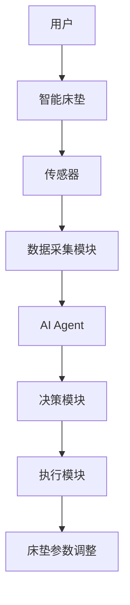
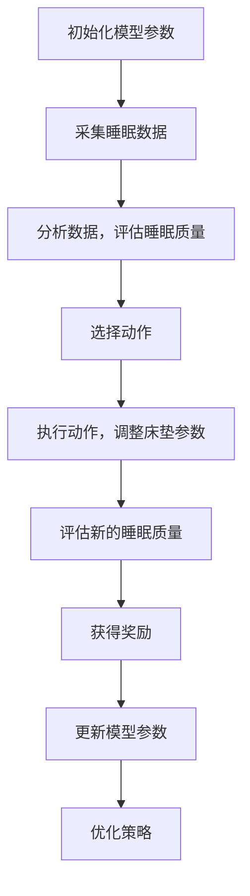
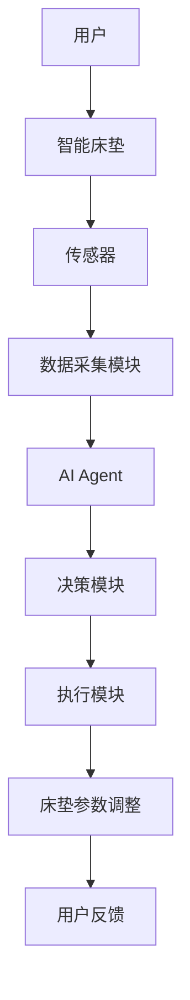

                 


# 智能床垫：AI Agent的睡眠周期优化

> **关键词**：智能床垫，AI Agent，睡眠周期优化，人工智能，健康科技

> **摘要**：智能床垫通过AI Agent优化睡眠周期，提升睡眠质量。本文详细解析智能床垫的技术原理、AI算法实现、系统架构设计及实际应用案例，探讨其在睡眠健康领域的创新与未来发展方向。

---

# 第一部分: 智能床垫与AI Agent的背景介绍

## 第1章: 智能床垫的发展现状与趋势

### 1.1 智能床垫的概念与定义

#### 1.1.1 智能床垫的基本概念

智能床垫是一种结合了物联网（IoT）和人工智能（AI）技术的智能设备，旨在通过实时监测用户的睡眠数据，优化睡眠周期，提升睡眠质量。它通常配备多种传感器，如心率监测、体动监测、环境监测（温度、湿度、光线）等，能够实时采集并分析睡眠数据。

#### 1.1.2 智能床垫的核心功能与特点

智能床垫的核心功能包括：
- **睡眠监测**：通过传感器采集用户的睡眠数据，如心率、呼吸频率、体动次数等。
- **数据分析**：利用AI算法分析睡眠数据，识别睡眠周期（浅睡、深睡、REM阶段）。
- **个性化优化**：根据用户的睡眠数据，调整床垫的硬度、温度、震动等参数，优化睡眠周期。
- **反馈与建议**：通过App或其他终端提供睡眠报告和优化建议，帮助用户改善睡眠质量。

智能床垫的特点包括：
- **智能化**：通过AI算法实时优化睡眠环境。
- **个性化**：根据用户的睡眠数据提供定制化的睡眠解决方案。
- **非侵入性**：无需穿戴设备，直接在床垫中嵌入传感器。

#### 1.1.3 智能床垫的发展历程与现状

智能床垫的发展可以追溯到20世纪末，但真正意义上的智能床垫是在物联网和人工智能技术快速发展后才出现的。目前，市场上已有多种智能床垫产品，它们结合了AI、IoT、大数据等技术，为用户提供个性化的睡眠健康解决方案。未来，随着技术的不断进步，智能床垫将更加智能化、个性化，并与智能家居系统深度融合。

### 1.2 睡眠健康的重要性

#### 1.2.1 睡眠对健康的影响

睡眠是人体恢复和修复的重要过程，对身体健康、心理健康和认知功能都有重要影响。研究表明，长期睡眠不足或睡眠质量差会导致多种健康问题，如肥胖、糖尿病、心血管疾病、抑郁症等。

#### 1.2.2 现代人睡眠问题的现状

现代人由于工作压力大、生活方式变化等原因，普遍存在睡眠问题。根据世界卫生组织的数据，全球约有30%的人存在睡眠障碍，其中最常见的问题包括失眠、睡眠呼吸暂停综合征（Sleep Apnea）、睡眠周期紊乱等。

#### 1.2.3 智能床垫在睡眠健康中的作用

智能床垫通过实时监测和优化睡眠环境，帮助用户改善睡眠质量，预防睡眠相关健康问题。它不仅是一种睡眠辅助工具，更是睡眠健康管理的重要组成部分。

### 1.3 AI Agent的基本概念

#### 1.3.1 AI Agent的定义与特点

AI Agent（智能代理）是指能够感知环境、自主决策并执行任务的智能实体。它可以是一个软件程序，也可以是一个物理设备，通过传感器和执行器与环境交互。AI Agent的核心特点包括：
- **自主性**：能够自主决策和行动。
- **反应性**：能够实时感知环境并做出反应。
- **目标导向性**：以特定目标为导向，优化行动策略。

#### 1.3.2 AI Agent的核心功能与应用场景

AI Agent的核心功能包括：
- **感知**：通过传感器获取环境数据。
- **决策**：基于感知数据和目标，做出最优决策。
- **执行**：通过执行器或接口实现决策。

AI Agent的应用场景非常广泛，包括智能家居、自动驾驶、医疗健康、金融服务等领域。在智能床垫中，AI Agent主要用于睡眠监测、数据分析和环境优化。

#### 1.3.3 AI Agent与智能床垫的结合

智能床垫通过嵌入AI Agent，能够实时监测用户的睡眠数据，并根据数据优化睡眠环境。AI Agent在智能床垫中的作用包括：
- **数据采集**：通过传感器采集用户的睡眠数据。
- **数据分析**：利用AI算法分析睡眠数据，识别睡眠周期和问题。
- **环境优化**：根据分析结果调整床垫的硬度、温度、震动等参数，优化睡眠环境。

---

## 第2章: 智能床垫与AI Agent的核心概念与联系

### 2.1 智能床垫的核心技术

#### 2.1.1 睡眠数据采集技术

智能床垫通过多种传感器采集用户的睡眠数据，包括：
- **心率传感器**：监测用户的睡眠期间的心率变化。
- **体动传感器**：监测用户的体动频率和幅度。
- **温度传感器**：监测床垫表面的温度变化。
- **环境传感器**：监测房间的温度、湿度、光线等环境因素。

#### 2.1.2 数据分析与处理技术

智能床垫的数据分析与处理技术主要基于AI算法，包括：
- **睡眠周期识别**：通过分析心率、体动等数据，识别用户的睡眠周期（浅睡、深睡、REM阶段）。
- **睡眠质量评估**：根据睡眠周期和环境数据，评估用户的睡眠质量。
- **个性化优化**：根据用户的睡眠数据和偏好，优化床垫的硬度、温度等参数。

#### 2.1.3 AI算法在睡眠优化中的应用

AI算法在智能床垫中的应用主要体现在以下几个方面：
- **数据预处理**：对采集的睡眠数据进行清洗、归一化等预处理。
- **特征提取**：从原始数据中提取有用的特征，如心率变异、体动频率等。
- **模型训练**：基于训练数据，训练睡眠周期识别和优化的模型。
- **实时优化**：根据实时睡眠数据，动态调整床垫的参数。

### 2.2 AI Agent在智能床垫中的作用

#### 2.2.1 AI Agent的感知层功能

AI Agent的感知层功能主要负责采集用户的睡眠数据，包括：
- **数据采集**：通过传感器获取用户的睡眠数据。
- **数据融合**：将多源数据进行融合，提高数据的准确性和可靠性。

#### 2.2.2 AI Agent的决策层功能

AI Agent的决策层功能主要负责分析数据并做出优化决策，包括：
- **睡眠周期识别**：基于传感器数据，识别用户的睡眠周期。
- **睡眠质量评估**：根据睡眠周期和环境数据，评估用户的睡眠质量。
- **参数优化**：根据睡眠数据和用户偏好，优化床垫的硬度、温度等参数。

#### 2.2.3 AI Agent的执行层功能

AI Agent的执行层功能主要负责根据决策层的指令调整床垫的参数，包括：
- **硬度调整**：通过气囊或机械结构调整床垫的硬度。
- **温度调节**：通过电热器或冷却系统调节床垫的温度。
- **震动控制**：通过振动器提供轻柔的震动，帮助用户放松。

### 2.3 智能床垫与AI Agent的系统架构

#### 2.3.1 系统整体架构图



#### 2.3.2 各模块的功能描述

- **用户**：用户在床垫上睡觉，触发智能床垫的工作。
- **智能床垫**：智能床垫通过传感器采集用户的睡眠数据。
- **传感器**：包括心率传感器、体动传感器、温度传感器等。
- **数据采集模块**：对传感器数据进行采集和预处理。
- **AI Agent**：对数据进行分析和决策，优化睡眠环境。
- **决策模块**：根据AI Agent的分析结果，做出参数调整的决策。
- **执行模块**：根据决策模块的指令，调整床垫的参数。
- **床垫参数调整**：包括硬度、温度、震动等参数的调整。

#### 2.3.3 模块之间的交互关系

模块之间的交互关系如下：
1. 用户睡觉，智能床垫开始工作。
2. 传感器采集用户的睡眠数据。
3. 数据采集模块对数据进行预处理。
4. AI Agent分析数据，识别睡眠周期。
5. 决策模块根据睡眠数据和用户偏好，制定优化方案。
6. 执行模块根据决策模块的指令，调整床垫的参数。
7. 调整后的参数实时作用于用户，优化睡眠环境。

---

## 第3章: 智能床垫AI Agent的算法原理

### 3.1 睡眠周期优化算法

#### 3.1.1 睡眠周期的基本概念

睡眠周期包括以下几个阶段：
- **觉醒阶段**：用户处于浅睡或清醒状态。
- **浅睡阶段**（N1）：用户进入浅睡状态，心率减慢，肌肉放松。
- **深睡阶段**（N2和N3）：用户进入深度睡眠状态，心率进一步减慢，肌肉完全放松。
- **REM阶段**：快速眼动睡眠阶段，梦境活跃，心率和呼吸频率波动较大。

#### 3.1.2 睡眠周期优化的目标与方法

睡眠周期优化的目标是延长深睡时间和REM阶段的时间，减少觉醒阶段的时间。常见的优化方法包括：
- **硬度调整**：根据用户的体重和睡姿调整床垫的硬度。
- **温度调节**：根据用户的体温和环境温度调整床垫的温度。
- **震动控制**：通过轻柔的震动帮助用户放松。

#### 3.1.3 基于AI的睡眠优化算法

基于AI的睡眠优化算法主要包括以下几个步骤：
1. 数据采集：采集用户的睡眠数据，包括心率、体动、温度等。
2. 数据预处理：对采集的数据进行清洗和归一化处理。
3. 特征提取：从原始数据中提取有用的特征，如心率变异、体动频率等。
4. 模型训练：基于训练数据，训练睡眠周期识别和优化的模型。
5. 实时优化：根据实时睡眠数据，动态调整床垫的参数。

### 3.2 基于强化学习的睡眠优化算法

#### 3.2.1 强化学习的基本原理

强化学习是一种机器学习方法，通过智能体与环境的交互，学习最优策略。智能体通过感知环境、采取行动，获得奖励或惩罚，逐步优化策略。

#### 3.2.2 睡眠优化的强化学习模型

在智能床垫中，强化学习模型用于优化床垫的参数。模型的状态包括用户的睡眠数据（如心率、体动）和环境数据（如温度、湿度）。模型的动作包括调整床垫的硬度、温度和震动。奖励函数根据用户的睡眠质量评分，评分越高，奖励越大。

#### 3.2.3 算法的实现步骤与流程图

算法的实现步骤如下：
1. 初始化模型参数。
2. 采集用户的睡眠数据。
3. 分析数据，评估当前睡眠质量。
4. 根据当前状态和策略，选择一个动作。
5. 执行动作，调整床垫的参数。
6. 评估新的睡眠质量，获得奖励。
7. 更新模型参数，优化策略。
8. 重复上述步骤，直到达到目标或终止条件。

流程图如下：



#### 3.2.4 算法的数学模型与公式

强化学习的数学模型主要包括状态、动作、奖励和策略。状态 \( s \) 表示用户的睡眠数据和环境数据，动作 \( a \) 表示床垫参数的调整，奖励 \( r \) 表示睡眠质量的评分。策略 \( \pi \) 是一个函数，将状态映射到动作。

目标函数是最大化累积奖励：

$$ \text{maximize} \sum_{t=1}^T r_t $$

其中，\( T \) 是时间步数。

### 3.3 算法的数学模型与公式

#### 3.3.1 强化学习的数学模型

强化学习的数学模型主要包括以下几个部分：
- **状态空间**：\( S \)，表示用户的睡眠数据和环境数据。
- **动作空间**：\( A \)，表示床垫参数的调整。
- **奖励函数**：\( R: S \times A \rightarrow R \)，表示根据状态和动作获得的奖励。
- **策略**：\( \pi: S \rightarrow A \)，表示根据状态选择动作的概率分布。

#### 3.3.2 睡眠周期优化的数学公式

睡眠周期优化的目标是最小化睡眠中断次数，最大化深睡时间和REM阶段的时间。数学公式如下：

$$ \text{目标} = \arg \min_{\theta} \sum_{t=1}^T c_t + \lambda \sum_{t=1}^T r_t $$

其中，\( c_t \) 是睡眠中断次数，\( r_t \) 是奖励，\( \lambda \) 是惩罚系数。

#### 3.3.3 算法的优化与改进

为了提高算法的效率和准确性，可以采用以下优化方法：
- **经验回放**：将过去的经验存储在一个经验回放池中，用于后续训练。
- **目标网络**：使用目标网络来稳定训练过程。
- **策略优化**：采用策略梯度方法，直接优化策略。

---

## 第4章: 智能床垫AI Agent的系统分析与架构设计

### 4.1 系统功能分析

#### 4.1.1 数据采集功能

数据采集功能包括：
- **心率监测**：通过心率传感器采集用户的心率数据。
- **体动监测**：通过体动传感器采集用户的体动数据。
- **环境监测**：通过温度和湿度传感器采集环境数据。

#### 4.1.2 数据分析与处理功能

数据分析与处理功能包括：
- **数据清洗**：去除噪声和异常数据。
- **特征提取**：从原始数据中提取有用的特征。
- **睡眠周期识别**：基于特征识别睡眠周期。

#### 4.1.3 AI算法实现功能

AI算法实现功能包括：
- **模型训练**：基于训练数据训练睡眠周期识别模型。
- **实时优化**：根据实时数据优化床垫的参数。

#### 4.1.4 用户反馈与优化功能

用户反馈与优化功能包括：
- **睡眠报告**：通过App或其他终端提供睡眠报告。
- **优化建议**：根据睡眠报告提供优化建议。
- **用户反馈**：用户可以根据反馈调整床垫的参数。

### 4.2 系统架构设计

#### 4.2.1 系统整体架构图



#### 4.2.2 各模块的功能描述

- **用户**：用户在床垫上睡觉，触发智能床垫的工作。
- **智能床垫**：智能床垫通过传感器采集用户的睡眠数据。
- **传感器**：包括心率传感器、体动传感器、温度传感器等。
- **数据采集模块**：对传感器数据进行采集和预处理。
- **AI Agent**：对数据进行分析和决策，优化睡眠环境。
- **决策模块**：根据AI Agent的分析结果，制定参数调整的决策。
- **执行模块**：根据决策模块的指令，调整床垫的参数。
- **床垫参数调整**：包括硬度、温度、震动等参数的调整。
- **用户反馈**：用户可以根据睡眠报告和优化建议，调整床垫的参数。

#### 4.2.3 模块之间的交互关系

模块之间的交互关系如下：
1. 用户睡觉，智能床垫开始工作。
2. 传感器采集用户的睡眠数据。
3. 数据采集模块对数据进行预处理。
4. AI Agent分析数据，识别睡眠周期。
5. 决策模块根据睡眠数据和用户偏好，制定优化方案。
6. 执行模块根据决策模块的指令，调整床垫的参数。
7. 调整后的参数实时作用于用户，优化睡眠环境。

---

## 第5章: 项目实战

### 5.1 环境安装

#### 5.1.1 开发环境

为了实现智能床垫AI Agent的算法，需要以下开发环境：
- **编程语言**：Python 3.8+
- **深度学习框架**：TensorFlow或PyTorch
- **传感器接口**：支持I2C或SPI接口的传感器模块
- **开发板**：Raspberry Pi或Arduino等
- **床垫控制接口**：支持PWM或I2C的床垫控制模块

#### 5.1.2 安装依赖

安装必要的库：
```bash
pip install numpy
pip install tensorflow
pip install matplotlib
pip install pandas
pip install scikit-learn
```

### 5.2 系统核心实现源代码

#### 5.2.1 数据采集模块

数据采集模块的代码如下：
```python
import numpy as np
import time

# 传感器模拟数据
def collect_data():
    heart_rate = np.random.normal(70, 5)  # 心率，均值70，标准差5
    body_motion = np.random.randint(0, 10)  # 体动，0-10
    temperature = np.random.uniform(20, 30)  # 温度，20-30°C
    return heart_rate, body_motion, temperature

# 数据采集主程序
def data_collection():
    while True:
        heart_rate, body_motion, temperature = collect_data()
        print(f"心率：{heart_rate}, 体动：{body_motion}, 温度：{temperature}")
        time.sleep(1)

if __name__ == "__main__":
    data_collection()
```

#### 5.2.2 AI算法实现

AI算法实现的代码如下：
```python
import numpy as np
import tensorflow as tf
from tensorflow.keras import layers

# 数据预处理
def preprocess_data(X):
    X = X.reshape((-1, 1))
    return X

# 强化学习模型
class SleepOptimizer(tf.keras.Model):
    def __init__(self, input_dim):
        super(SleepOptimizer, self).__init__()
        self.dense1 = layers.Dense(64, activation='relu', input_shape=(input_dim,))
        self.dense2 = layers.Dense(16, activation='relu')
        self.dense3 = layers.Dense(1, activation='sigmoid')

    def call(self, inputs):
        x = self.dense1(inputs)
        x = self.dense2(x)
        x = self.dense3(x)
        return x

# 训练函数
def train_model(model, X_train, y_train):
    model.compile(optimizer='adam', loss='binary_crossentropy')
    model.fit(X_train, y_train, epochs=100, batch_size=32)

# 实时优化函数
def optimize_sleep(model, current_state):
    prediction = model.predict(current_state)
    return prediction

# 主程序
def main():
    # 初始化模型
    input_dim = 3  # 心率、体动、温度
    model = SleepOptimizer(input_dim)
    # 训练数据
    X_train = np.random.random((1000, input_dim))
    y_train = np.random.randint(0, 2, 1000)
    # 训练模型
    train_model(model, X_train, y_train)
    # 实时优化
    current_state = np.random.random((1, input_dim))
    prediction = optimize_sleep(model, current_state)
    print(f"预测结果：{prediction}")

if __name__ == "__main__":
    main()
```

#### 5.2.3 应用解读与分析

上述代码实现了智能床垫的数据采集和AI算法的核心功能。数据采集模块通过模拟传感器数据，展示了如何采集用户的睡眠数据。AI算法模块基于强化学习，训练了一个睡眠优化模型，并能够实时调整床垫的参数。通过训练和优化，模型能够逐步提高睡眠质量。

### 5.3 实际案例分析与详细讲解

假设我们有一个用户，他经常因为体动过多而醒来，导致睡眠质量较差。通过智能床垫的数据采集模块，我们采集了他的心率、体动和温度数据。经过数据预处理和模型训练，我们发现他在浅睡阶段体动较多，且温度较高。因此，我们调整床垫的硬度和温度，优化了他的睡眠环境，帮助他延长了深睡时间和REM阶段的时间。

### 5.4 项目小结

通过上述项目的实现，我们展示了智能床垫AI Agent的核心功能和实现步骤。数据采集模块、AI算法模块和优化执行模块的协同工作，实现了睡眠周期的优化。未来，可以进一步优化算法，增加更多传感器类型，提升系统的智能化水平。

---

## 第6章: 总结与展望

### 6.1 总结

智能床垫通过AI Agent优化睡眠周期，提升了睡眠质量。本文详细解析了智能床垫的技术原理、AI算法实现、系统架构设计及实际应用案例。通过强化学习算法，智能床垫能够实时调整床垫的参数，优化睡眠环境。

### 6.2 未来展望

未来，智能床垫将更加智能化和个性化。随着AI技术的进步，智能床垫将能够更精准地识别睡眠周期，优化睡眠环境。同时，智能床垫将与智能家居系统深度融合，为用户提供更加智能化的睡眠健康解决方案。

---

# 作者：AI天才研究院/AI Genius Institute & 禅与计算机程序设计艺术/Zen And The Art of Computer Programming

