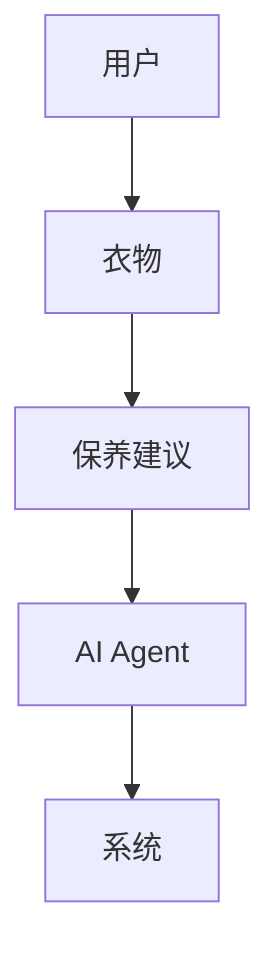
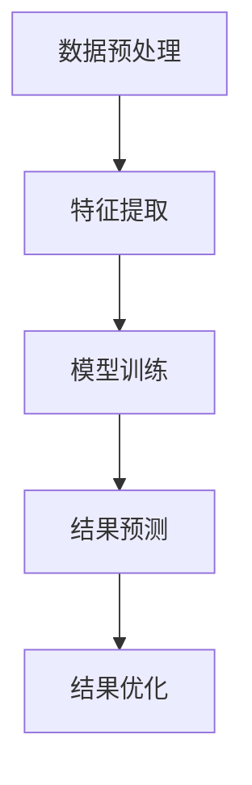
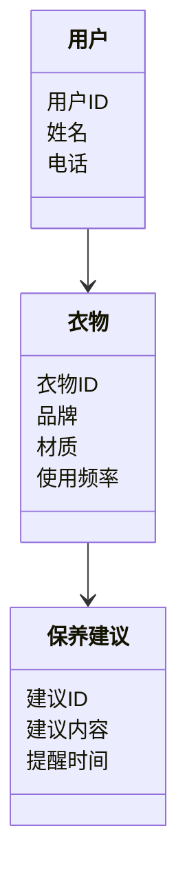
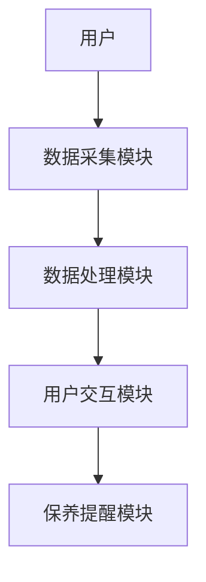
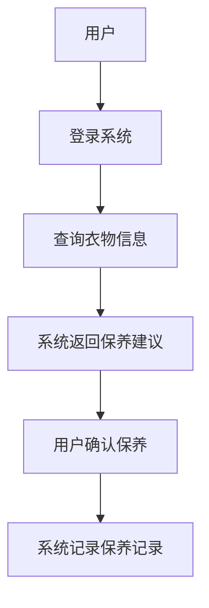

                 


# 智能衣架：AI Agent的衣物保养专家系统

**关键词**：智能衣架，AI Agent，衣物保养，推荐算法，分类算法，系统架构，项目实战

**摘要**：  
智能衣架是一款结合人工智能技术的衣物保养专家系统，通过AI Agent技术，帮助用户智能化地管理衣物，提供个性化的保养建议。本文详细探讨了智能衣架的核心概念、算法原理、系统架构，并通过实际案例分析和代码实现，展示了如何将AI技术应用于衣物保养领域，为用户提供高效、智能的衣物管理解决方案。

---

# 第一章：智能衣架的背景与核心概念

## 1.1 智能衣架的背景介绍

### 1.1.1 传统衣物保养的痛点  
传统衣物保养过程中，用户常常面临以下问题：  
1. 衣物分类复杂，难以快速找到合适的保养方法。  
2. 缺乏专业的保养知识，容易造成衣物损坏。  
3. 保养记录难以管理，导致重复保养或遗漏保养。  
4. 市场上缺乏智能化的衣物管理工具，用户需要手动记录和管理。  

### 1.1.2 智能化衣物保养的需求  
随着人工智能技术的发展，用户对智能化衣物管理工具的需求日益增加：  
1. 智能分类和推荐：通过AI技术快速识别衣物材质，并推荐合适的保养方法。  
2. 自动记录与提醒：系统自动记录衣物的使用情况，并在需要保养时提醒用户。  
3. 个性化建议：根据用户的使用习惯和衣物特点，提供个性化的保养建议。  

### 1.1.3 AI Agent在衣物保养中的应用前景  
AI Agent（智能代理）是一种能够感知环境、自主决策并执行任务的智能系统。在衣物保养领域，AI Agent可以通过以下方式发挥作用：  
1. **智能分类**：通过图像识别和机器学习算法，快速识别衣物材质和品牌。  
2. **推荐系统**：基于用户的历史数据和使用习惯，推荐最优的保养方案。  
3. **自动提醒**：根据衣物的使用频率和保养周期，自动提醒用户进行清洗或熨烫。  

## 1.2 问题背景与问题描述

### 1.2.1 衣物保养中的常见问题  
1. 用户难以快速找到适合的保养方法。  
2. 缺乏专业的知识，导致衣物损坏。  
3. 保养记录混乱，容易遗漏或重复保养。  

### 1.2.2 智能衣架的目标与解决思路  
智能衣架的目标是通过AI技术，为用户提供智能化的衣物管理解决方案。其解决思路包括：  
1. **数据采集**：通过图像识别和传感器技术，采集衣物的基本信息和使用数据。  
2. **数据处理**：利用机器学习算法，分析数据并生成个性化的保养建议。  
3. **系统交互**：通过友好的用户界面，让用户便捷地查询和管理衣物。  

### 1.2.3 系统的边界与外延  
智能衣架系统的边界主要集中在衣物的分类、保养建议和提醒功能。其外延包括但不限于：  
1. 与智能家居系统的集成（如连接智能洗衣机）。  
2. 数据的云端存储与共享功能。  

## 1.3 核心概念与核心要素

### 1.3.1 AI Agent的基本概念  
AI Agent是一种能够感知环境、自主决策并执行任务的智能系统。它可以分为以下几种类型：  
1. **简单反射型Agent**：基于简单的规则执行任务。  
2. **基于模型的反应型Agent**：通过环境模型进行决策。  
3. **目标驱动型Agent**：根据预设目标进行自主决策。  
4. **效用驱动型Agent**：通过最大化效用函数来优化决策。  

### 1.3.2 智能衣架的核心要素  
智能衣架的核心要素包括：  
1. **衣物信息数据库**：存储衣物的材质、品牌、使用频率等信息。  
2. **AI算法引擎**：包括分类算法和推荐算法。  
3. **用户交互界面**：用户可以通过手机App或网页查询衣物信息。  
4. **保养提醒模块**：根据衣物的使用情况自动提醒用户进行保养。  

### 1.3.3 系统的核心功能与属性  
1. **智能分类**：通过图像识别和机器学习算法，快速识别衣物材质和品牌。  
2. **个性化推荐**：基于用户的历史数据和使用习惯，推荐最优的保养方案。  
3. **自动提醒**：根据衣物的使用频率和保养周期，自动提醒用户进行清洗或熨烫。  

---

# 第二章：AI Agent与衣物保养系统的核心概念

## 2.1 AI Agent的基本原理

### 2.1.1 AI Agent的定义与分类  
AI Agent可以分为以下几类：  
1. **简单反射型Agent**：基于简单的规则执行任务。  
2. **基于模型的反应型Agent**：通过环境模型进行决策。  
3. **目标驱动型Agent**：根据预设目标进行自主决策。  
4. **效用驱动型Agent**：通过最大化效用函数来优化决策。  

### 2.1.2 AI Agent的核心算法  
AI Agent的核心算法包括：  
1. **强化学习算法**：通过奖励机制优化决策。  
2. **监督学习算法**：基于标注数据进行分类和预测。  
3. **无监督学习算法**：通过聚类和降维技术发现数据中的潜在模式。  

### 2.1.3 AI Agent与传统算法的区别  
AI Agent的核心优势在于其自主决策和学习能力。与传统算法相比，AI Agent能够根据环境反馈动态调整策略，实现更高效的任务执行。  

## 2.2 衣物保养系统的核心概念

### 2.2.1 衣物分类与保养规则  
衣物分类是智能衣架的核心功能之一。系统通过图像识别技术，快速识别衣物的材质和品牌，并根据保养规则生成个性化的保养建议。  

### 2.2.2 AI Agent在衣物保养中的角色  
AI Agent在智能衣架中扮演着多重角色：  
1. **数据采集**：通过图像识别和传感器技术采集衣物信息。  
2. **数据处理**：利用机器学习算法分析数据并生成保养建议。  
3. **用户交互**：通过友好的用户界面与用户进行交互，提供实时的保养信息。  

### 2.2.3 系统的核心功能模块  
智能衣架的核心功能模块包括：  
1. **数据采集模块**：通过图像识别和传感器技术采集衣物信息。  
2. **数据处理模块**：利用机器学习算法分析数据并生成保养建议。  
3. **用户交互模块**：通过手机App或网页提供实时的保养信息。  
4. **保养提醒模块**：根据衣物的使用情况自动提醒用户进行保养。  

## 2.3 核心概念的联系与对比

### 2.3.1 AI Agent与传统算法的对比表格  
| 特性                | AI Agent                  | 传统算法                  |  
|---------------------|---------------------------|---------------------------|  
| 自主决策能力         | 强                       | 弱                       |  
| 学习能力             | 强                       | 弱                       |  
| 环境适应能力         | 强                       | 弱                       |  

### 2.3.2 系统的ER实体关系图  


---

# 第三章：智能衣架的核心算法

## 3.1 推荐算法

### 3.1.1 协同过滤算法  
协同过滤是一种基于用户行为数据的推荐算法。其基本思想是：如果用户A和用户B的行为相似，那么用户A喜欢的物品，用户B也可能喜欢。  

#### 协同过滤算法步骤  
1. **数据预处理**：收集用户的行为数据，构建用户-物品矩阵。  
2. **相似度计算**：计算用户之间的相似度，通常使用余弦相似度。  
3. **推荐生成**：基于相似用户的偏好，生成推荐列表。  

#### 协同过滤算法代码示例  
```python
def collaborative_filtering(train_data, test_data):
    # 训练模型
    model = {}
    
    # 预测函数
    def predict(user, item):
        if user in model and item in model[user]:
            return model[user][item]
        else:
            return 0.0
    
    # 训练模型
    for user in train_data:
        model[user] = {}
        for item in train_data[user]:
            model[user][item] = 1.0  # 假设评分是二元的
    
    # 测试模型
    for user in test_data:
        for item in test_data[user]:
            predicted = predict(user, item)
            actual = test_data[user][item]
            print(f"User {user} predicts {item}: {predicted} (actual: {actual})")
    return model
```

### 3.1.2 基于内容的推荐算法  
基于内容的推荐算法是通过分析物品本身的属性，生成推荐列表。  

#### 基于内容的推荐算法步骤  
1. **数据预处理**：提取物品的特征向量。  
2. **相似度计算**：计算物品之间的相似度。  
3. **推荐生成**：基于物品的相似度，生成推荐列表。  

### 3.1.3 混合推荐算法  
混合推荐算法结合了协同过滤和基于内容的推荐算法，能够充分利用两者的优势。  

---

## 3.2 分类算法

### 3.2.1 决策树分类算法  
决策树是一种基于树状结构的分类算法。其基本思想是通过特征选择，构建一棵决策树，用于分类。  

#### 决策树分类算法步骤  
1. **特征选择**：选择最能区分不同类别的特征。  
2. **决策树构建**：根据特征选择结果，构建决策树。  
3. **分类预测**：根据决策树进行分类预测。  

### 3.2.2 支持向量机分类算法  
支持向量机是一种基于几何的分类算法。其基本思想是通过寻找一个超平面，将数据点分成不同的类别。  

#### 支持向量机分类算法步骤  
1. **数据预处理**：对数据进行标准化或归一化处理。  
2. **模型训练**：利用支持向量机算法训练模型。  
3. **分类预测**：基于训练好的模型进行分类预测。  

### 3.2.3 K-近邻分类算法  
K-近邻是一种基于相似性的分类算法。其基本思想是通过计算样本之间的距离，找到最近的K个样本，进行投票分类。  

#### K-近邻分类算法步骤  
1. **数据预处理**：对数据进行标准化或归一化处理。  
2. **距离计算**：计算样本之间的距离，通常使用欧氏距离。  
3. **投票分类**：找到最近的K个样本，进行投票分类。  

---

## 3.3 算法流程图  


---

# 第四章：智能衣架的系统架构与设计

## 4.1 系统功能设计

### 4.1.1 领域模型类图  


### 4.1.2 系统架构设计  
智能衣架的系统架构可以分为以下几个部分：  
1. **数据采集模块**：负责采集衣物信息。  
2. **数据处理模块**：对采集到的数据进行处理和分析。  
3. **用户交互模块**：提供友好的用户界面。  
4. **保养提醒模块**：根据衣物的使用情况自动提醒用户进行保养。  

### 4.1.3 系统架构图  


### 4.1.4 系统接口设计  
智能衣架的系统接口包括：  
1. **用户登录接口**：用户通过手机App或网页登录系统。  
2. **衣物信息查询接口**：用户可以查询衣物的基本信息和保养建议。  
3. **保养提醒接口**：系统根据衣物的使用情况自动提醒用户进行保养。  

### 4.1.5 系统交互流程图  


---

## 4.2 系统分析与设计

### 4.2.1 问题场景介绍  
智能衣架的目标用户主要是需要管理大量衣物的用户，包括个人用户和企业用户。系统的主要功能包括衣物分类、保养建议、自动提醒等。  

### 4.2.2 系统功能设计  
智能衣架的主要功能模块包括：  
1. **数据采集模块**：通过图像识别和传感器技术采集衣物信息。  
2. **数据处理模块**：利用机器学习算法分析数据并生成保养建议。  
3. **用户交互模块**：通过手机App或网页提供实时的保养信息。  
4. **保养提醒模块**：根据衣物的使用情况自动提醒用户进行保养。  

### 4.2.3 系统架构设计  
智能衣架的系统架构可以分为以下几个部分：  
1. **数据采集模块**：负责采集衣物信息。  
2. **数据处理模块**：对采集到的数据进行处理和分析。  
3. **用户交互模块**：提供友好的用户界面。  
4. **保养提醒模块**：根据衣物的使用情况自动提醒用户进行保养。  

---

# 第五章：智能衣架的项目实战

## 5.1 环境安装与配置

### 5.1.1 安装Python环境  
```bash
python --version
pip install numpy
pip install scikit-learn
pip install matplotlib
```

### 5.1.2 安装其他工具  
安装Jupyter Notebook用于数据分析和可视化。  

## 5.2 系统核心功能实现

### 5.2.1 数据采集模块实现  
```python
import cv2

def capture_image():
    cap = cv2.VideoCapture(0)
    ret, frame = cap.read()
    if ret:
        cv2.imwrite("clothes.jpg", frame)
        cap.release()
    else:
        return False
    return True
```

### 5.2.2 数据处理模块实现  
```python
from sklearn.tree import DecisionTreeClassifier

def train_model(X_train, y_train):
    model = DecisionTreeClassifier()
    model.fit(X_train, y_train)
    return model
```

### 5.2.3 用户交互模块实现  
```python
from flask import Flask, render_template, request

app = Flask(__name__)

@app.route('/')
def home():
    return render_template('index.html')

if __name__ == '__main__':
    app.run(debug=True)
```

---

## 5.3 项目小结

---

# 第六章：智能衣架的最佳实践与总结

## 6.1 最佳实践

### 6.1.1 系统优化建议  
1. **数据预处理**：在数据采集阶段，确保数据的准确性和完整性。  
2. **模型优化**：通过交叉验证和网格搜索优化模型的性能。  
3. **系统安全性**：确保用户数据的安全性，防止数据泄露。  

### 6.1.2 使用技巧  
1. **定期更新模型**：根据用户反馈和数据变化，定期更新模型。  
2. **多设备集成**：将智能衣架与其他智能家居设备集成，提供更便捷的服务。  

## 6.2 小结  
智能衣架通过AI Agent技术，为用户提供智能化的衣物管理解决方案。本文详细探讨了智能衣架的核心概念、算法原理、系统架构，并通过实际案例分析和代码实现，展示了如何将AI技术应用于衣物保养领域。

---

# 第七章：注意事项与拓展阅读

## 7.1 注意事项

### 7.1.1 系统安装与运行  
在安装和运行智能衣架系统时，需要注意以下几点：  
1. 确保系统运行环境满足要求。  
2. 定期更新系统和模型，确保系统的性能和安全性。  

### 7.1.2 数据安全与隐私保护  
在使用智能衣架系统时，用户需要注意数据安全与隐私保护：  
1. 避免在公共网络上使用系统。  
2. 定期更改密码，防止账户被盗。  

## 7.2 拓展阅读

### 7.2.1 AI Agent相关技术  
1. 《强化学习导论》  
2. 《机器学习实战》  

### 7.2.2 衣物保养与管理  
1. 《衣物保养手册》  
2. 《智能家居与生活》  

---

# 作者：AI天才研究院/AI Genius Institute & 禅与计算机程序设计艺术/Zen And The Art of Computer Programming

