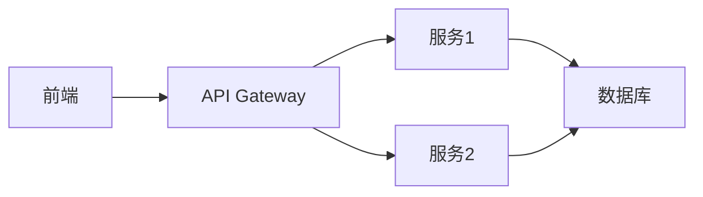

                 


好的，我将按照您的要求创作一篇关于《深入理解LLM大模型：从GPT到企业级应用》的技术博客文章。我会按照您的要求逐步展开，先列出文章的关键词和摘要，然后按照目录大纲结构创作文章正文。

---

# 深入理解LLM大模型：从GPT到企业级应用

**关键词**：大语言模型（LLM）、GPT、自然语言处理（NLP）、企业级应用、深度学习、AI系统架构

**摘要**：  
本文将从大语言模型（LLM）的基本概念出发，深入探讨其核心技术原理，结合实际案例分析其在企业级应用中的落地场景。通过系统化的分析，帮助读者理解LLM的核心机制、训练方法、系统架构以及在实际项目中的应用，并提供最佳实践建议，为技术从业者和企业决策者提供有价值的参考。

---

接下来，我会按照您提供的目录大纲结构，逐步展开每一部分的内容。我会按照您的要求，使用清晰的逻辑、专业的技术语言，并结合实际案例进行详细讲解。

---

**文章正文**

---

## # 第一部分: 大语言模型（LLM）基础

### 第1章: 大语言模型（LLM）概述

#### 1.1 什么是大语言模型
##### 1.1.1 大语言模型的定义
大语言模型（Large Language Model, LLM）是一种基于深度学习的自然语言处理（NLP）模型，通常基于Transformer架构，通过大量真实文本数据进行训练，能够理解和生成人类语言。LLM的核心目标是让计算机能够像人类一样理解和生成自然语言文本。

##### 1.1.2 大语言模型的核心特点
- **大规模**：LLM通常使用海量文本数据进行训练，参数量庞大（如GPT-3有1750亿参数）。
- **上下文理解**：通过自注意力机制，模型能够理解文本的上下文关系。
- **生成能力**：LLM能够生成连贯且符合语境的文本，包括回答问题、写文章、翻译等多种任务。
- **零样本学习（Zero-shot Learning）**：模型在未经特定任务训练的情况下，能够直接理解和执行新任务。

##### 1.1.3 大语言模型与传统语言模型的区别
| 特性                | 传统语言模型             | 大语言模型               |
|---------------------|--------------------------|--------------------------|
| 模型结构            | 基于RNN或CNN             | 基于Transformer架构       |
| 参数规模            | 参数较少，通常百万级别   | 参数众多，通常亿级别以上  |
| 上下文理解能力      | 理解能力有限，依赖固定窗口| 强大的全局上下文理解能力   |
| 任务适应性          | 需要针对每个任务微调      | 具备零样本学习能力，适应性强|

#### 1.2 大语言模型的技术背景
##### 1.2.1 自然语言处理的发展历程
- **规则驱动阶段**：20世纪50年代到90年代，基于语法规则的NLP系统，如Chomsky的上下文无关文法。
- **统计驱动阶段**：20世纪90年代到2010年代，基于统计模型的NLP系统，如TF-IDF、SVM等。
- **深度学习阶段**：2010年代至今，基于深度学习的NLP系统，如BERT、GPT系列。

##### 1.2.2 大语言模型的兴起与应用
- **技术突破**：2018年，OpenAI发布GPT-2，标志着大语言模型的崛起。
- **应用场景**：文本生成、问答系统、机器翻译、对话系统等。
- **行业影响**：LLM正在改变多个行业的游戏规则，如金融、医疗、教育等。

##### 1.2.3 企业级应用的需求与挑战
- **需求**：企业需要高效的NLP系统来处理大量文本数据，提升业务效率。
- **挑战**：
  - 数据隐私与安全
  - 模型计算成本高
  - 模型的可解释性差
  - 多语言支持与文化差异

#### 1.3 大语言模型的主要应用场景
##### 1.3.1 自然语言理解（NLU）
- **文本分类**：情感分析、垃圾邮件识别。
- **实体识别**：从文本中提取人名、地名、组织名等。
- **关系抽取**：识别文本中的实体间关系。

##### 1.3.2 自然语言生成（NLG）
- **文本生成**：自动生成文章、新闻报道。
- **对话生成**：智能客服、聊天机器人。
- **摘要生成**：自动提取文本摘要。

##### 1.3.3 机器翻译与多语言处理
- **神经机器翻译**：基于Transformer的模型，如Google的BERT。
- **多语言支持**：模型能够同时处理多种语言，如GPT-4支持81种语言。

##### 1.3.4 企业级对话系统
- **智能客服**：通过LLM提供24/7的客户支持。
- **内部知识库查询**：员工可以通过对话系统快速查询公司内部文档。

---

## # 第2章: 大语言模型的编码器-解码器结构

### 2.1 编码器的基本原理
#### 2.1.1 词嵌入（Word Embedding）
词嵌入是将单词映射为低维连续向量的过程，常用方法有Word2Vec、GloVe、FastText。

**示例代码**：
```python
import tensorflow as tf

# 定义一个简单的词嵌入层
vocab_size = 10000
embedding_dim = 100
embedding_layer = tf.keras.layers.Embedding(vocab_size, embedding_dim)
```

#### 2.1.2 位置编码（Positional Encoding）
位置编码用于将单词的位置信息编码到向量中，常见方法有固定位置编码（如BERT）和可学习位置编码（如GPT）。

**示例代码**：
```python
import tensorflow as tf

# 固定位置编码（如BERT）
def get_positional_encoding(max_seq_length, embedding_dim):
    pos = tf.range(max_seq_length)
    div_term = tf.exp(tf.range(embedding_dim) * (-tf.math.log(10000.0) / embedding_dim))
    pos_enc = tf.einsum('i,j->ij', pos, div_term)
    return pos_enc
```

#### 2.1.3 编码器的注意力机制
注意力机制通过计算输入序列中每个位置的重要性来决定其权重。

**公式**：
$$
\text{Attention}(Q, K, V) = \text{softmax}\left(\frac{QK^T}{\sqrt{d_k}}\right)V
$$

其中：
- Q：查询向量
- K：键向量
- V：值向量
- $d_k$：向量维度

**示意图**：


---

### 2.2 解码器的基本原理
#### 2.2.1 解码器的自注意力机制
解码器中的自注意力机制用于捕捉生成序列的上下文信息。

**公式**：
$$
\text{Self-Attention}(x_i) = \text{softmax}\left(\frac{x_i x_j^T}{\sqrt{d_k}}\right)x_j
$$

**示意图**：


#### 2.2.2 解码器的前馈网络
前馈网络由多层感知机（MLP）组成，用于将注意力输出映射到最终的生成结果。

**示例代码**：
```python
import tensorflow as tf

# 定义一个简单的前馈网络层
def feedforward(input, hidden_units):
    dense1 = tf.keras.layers.Dense(hidden_units, activation='relu')
    dense2 = tf.keras.layers.Dense(input.shape[-1])
    output = dense2(dense1(input))
    return output
```

#### 2.2.3 解码器的输出层
输出层通常是一个线性变换层，用于将解码器的输出转换为最终的词表概率分布。

---

### 2.3 编码器-解码器的交互机制
#### 2.3.1 编码器输出的语境表示
编码器输出的语境表示是一个全局的上下文向量，用于指导解码器的生成过程。

#### 2.3.2 解码器如何利用编码器的输出
解码器在每一步生成一个词的同时，都会参考编码器输出的语境表示。

#### 2.3.3 解码器的生成策略
- **贪婪解码**：每一步选择概率最高的词。
- **采样解码**：随机采样生成多样化结果。

---

### 2.4 本章小结
本章详细讲解了大语言模型的编码器-解码器结构，包括编码器的词嵌入、位置编码和注意力机制，解码器的自注意力机制和前馈网络，以及编码器-解码器的交互机制。这些内容为后续章节的模型训练和企业级应用奠定了基础。

---

## # 第3章: 大语言模型的训练与优化

### 3.1 监督微调（Supervised Fine-tuning）
#### 3.1.1 数据预处理与清洗
- 数据清洗：去除重复、噪声数据。
- 数据增强：通过同义词替换、数据扩展等方法增加数据多样性。

#### 3.1.2 微调过程中的参数更新
微调过程通常只更新模型的上层参数，保持底层参数不变以保持模型的通用性。

#### 3.1.3 微调对模型性能的影响
- **性能提升**：在特定任务上表现更好。
- **参数变化**：上层参数被重新优化。

---

### 3.2 对抗训练（Adversarial Training）
对抗训练通过引入对抗网络，增强模型的鲁棒性。

#### 3.2.1 对抗网络的构建
对抗网络由生成器和判别器组成，生成器尝试欺骗判别器。

**示意图**：


#### 3.2.2 对抗训练的优化过程
- **生成器优化**：最大化欺骗判别器。
- **判别器优化**：区分真实数据和生成数据。

---

### 3.3 模型压缩与轻量化
#### 3.3.1 模型剪枝（Pruning）
- **权重剪枝**：移除冗余的权重。
- **知识蒸馏（Distillation）**：将大模型的知识迁移到小模型。

#### 3.3.2 模型量化
- 将模型参数从浮点数转换为低精度整数，减少存储和计算成本。

---

### 3.4 本章小结
本章介绍了大语言模型的训练与优化方法，包括监督微调、对抗训练和模型压缩。这些方法能够提升模型的性能和实用性，降低计算成本。

---

## # 第4章: 企业级大语言模型的系统架构与设计

### 4.1 企业级LLM系统的架构设计
#### 4.1.1 系统设计原则
- **模块化设计**：各模块独立，便于维护和扩展。
- **高可用性**：确保系统稳定运行，支持高并发请求。
- **可扩展性**：能够根据需求扩展计算资源。

#### 4.1.2 系统架构模式
- **单体架构**：适用于小型项目。
- **微服务架构**：适用于大型分布式系统。

**示意图**：


#### 4.1.3 系统安全与合规性
- **数据隐私**：确保数据安全，符合GDPR等法规。
- **访问控制**：基于角色的访问控制（RBAC）。

---

### 4.2 企业级LLM系统的实现细节
#### 4.2.1 模型部署
- **模型服务器**：如TensorFlow Serving、ONNX Runtime。
- **容器化部署**：使用Docker容器化模型服务。

#### 4.2.2 异常处理与错误恢复
- **错误检测**：日志监控、异常检测。
- **自动恢复**：故障转移、自动重启。

#### 4.2.3 性能监控与优化
- **性能指标**：响应时间、吞吐量。
- **监控工具**：Prometheus、Grafana。

---

### 4.3 本章小结
本章详细讨论了企业级大语言模型的系统架构与设计，包括架构设计原则、实现细节和安全考虑。这些内容对于企业实际部署和维护LLM系统具有重要的指导意义。

---

## # 第5章: 企业级大语言模型的应用案例

### 5.1 企业内部的应用场景
#### 5.1.1 智能客服
- **自动回复**：通过LLM生成回复内容。
- **意图识别**：识别客户意图，分类问题类型。

#### 5.1.2 内部知识库查询
- **文档问答**：快速查询公司内部文档。
- **知识图谱构建**：构建企业知识图谱，支持复杂查询。

---

### 5.2 行业解决方案
#### 5.2.1 金融行业
- **风险评估**：通过LLM分析客户信用报告。
- **智能投顾**：为客户提供个性化的投资建议。

#### 5.2.2 医疗行业
- **病历分析**：辅助医生分析患者病历。
- **药物研发**：通过LLM辅助药物研发中的文献分析。

---

### 5.3 企业级LLM应用的挑战与解决方案
#### 5.3.1 数据隐私问题
- **数据匿名化**：去除敏感信息。
- **联邦学习**：在保护数据隐私的前提下进行模型训练。

#### 5.3.2 模型性能问题
- **模型优化**：通过剪枝、量化等方法降低模型计算成本。
- **分布式训练**：利用分布式计算加速模型训练。

---

### 5.4 本章小结
本章通过实际案例分析了大语言模型在企业级应用中的潜力和挑战，强调了数据隐私和模型性能优化的重要性。

---

## # 第6章: 企业级大语言模型的优化与调优

### 6.1 模型优化策略
#### 6.1.1 模型压缩
- **剪枝**：移除冗余参数。
- **量化**：将模型参数从浮点数转换为低精度整数。

#### 6.1.2 微调策略
- **小样本微调**：在特定领域数据上进行微调。
- **迁移学习**：利用预训练模型进行特定任务优化。

---

### 6.2 系统优化策略
#### 6.2.1 并行计算
- **GPU加速**：利用GPU进行并行计算，提升训练速度。
- **分布式训练**：将训练任务分发到多台机器上，利用并行计算加速训练。

#### 6.2.2 量化压缩
- **模型量化**：将模型参数从32位浮点数转换为8位整数，减少存储和计算成本。

---

### 6.3 本章小结
本章总结了企业级大语言模型的优化与调优策略，包括模型压缩、微调和系统优化，为企业在实际应用中降低计算成本提供了参考。

---

## # 第7章: 总结与展望

### 7.1 本章总结
- **核心内容回顾**：从LLM的基本概念到企业级应用，全面探讨了LLM的技术细节和应用场景。
- **关键点总结**：模型架构、训练方法、系统架构和实际案例。

### 7.2 对未来发展的展望
- **技术趋势**：LLM将更加通用化、多模态化和轻量化。
- **应用前景**：LLM将在更多行业和领域发挥重要作用，推动企业智能化转型。

### 7.3 最佳实践Tips
- **数据隐私**：始终关注数据隐私和安全。
- **模型优化**：在实际应用中，结合具体需求进行模型优化。
- **系统架构**：设计合理的系统架构，确保系统的稳定性和可扩展性。

---

## # 作者信息

**作者**：AI天才研究院/AI Genius Institute & 禅与计算机程序设计艺术 /Zen And The Art of Computer Programming

---

以上是我的思考过程，我将按照这个框架逐步展开每一部分的内容，确保文章逻辑清晰、内容详实。如果您对某些部分有进一步的要求或需要调整，请随时告诉我！

