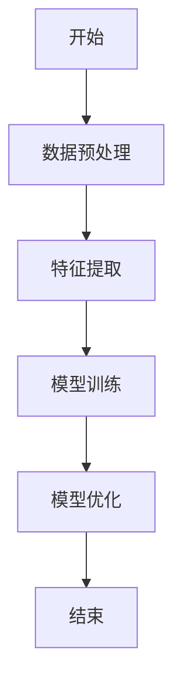
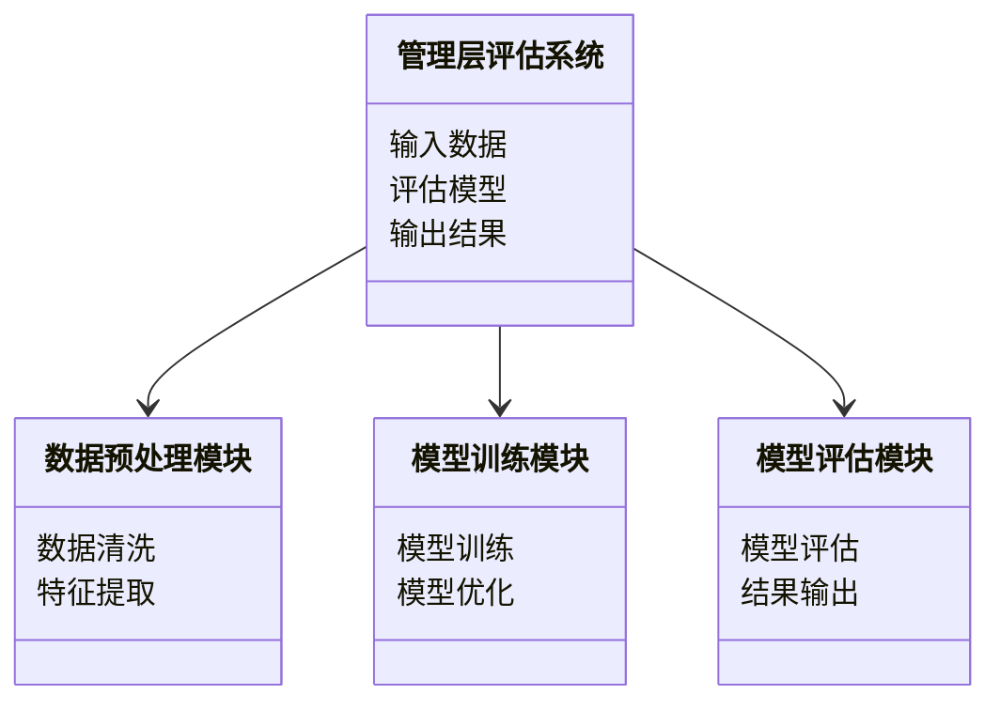
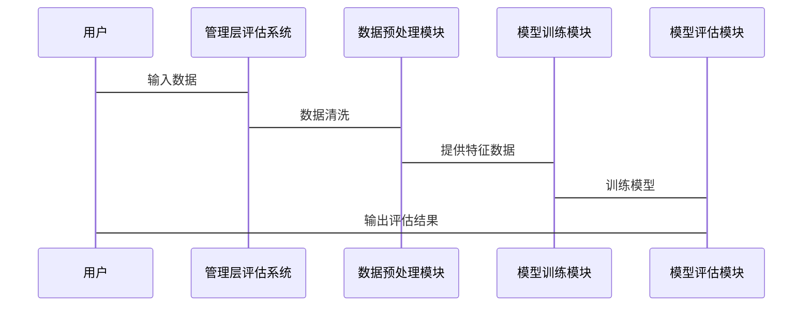

                 


# 费雪的管理层质量评估方法

> 关键词：费雪, 管理层质量评估, 投资理论, 管理能力, 评估方法

> 摘要：本文系统地介绍并分析了费雪提出的管理层质量评估方法。首先，从背景介绍开始，阐述了管理层质量评估的重要性和其在投资决策中的意义。接着，详细分析了管理层质量评估的核心概念，包括评估维度、框架和核心要素。随后，深入探讨了评估的算法原理，结合数学模型和公式，详细讲解了评分系统和加权计算方法。最后，通过系统架构设计和项目实战，展示了如何将理论应用于实际投资决策中。文章结构清晰，内容详实，旨在为投资者和企业管理者提供有价值的参考。

---

## 第1章: 费雪的管理层质量评估方法背景

### 1.1 管理层质量评估的重要性

#### 1.1.1 企业价值与管理层质量的关系

企业的价值不仅取决于财务表现，还与管理层的质量密切相关。管理层的决策能力、战略思维和执行力直接影响企业的长期发展。费雪在投资理论中强调，管理层的质量是决定企业能否持续增长的关键因素。

#### 1.1.2 管理层质量对企业长期发展的意义

优秀的管理层能够制定有效的战略，优化资源配置，提高企业竞争力。在复杂多变的市场环境中，管理层的质量决定了企业能否抓住机遇，应对挑战。

#### 1.1.3 费雪投资理论的核心观点

费雪提出，投资者在选择投资标的时，不仅要关注企业的财务状况，还要评估管理层的能力。他强调，管理层的质量是企业能否实现可持续增长的核心要素。

---

### 1.2 费雪管理层质量评估的理论基础

#### 1.2.1 费雪的"三重过滤法"概述

费雪的"三重过滤法"是一种投资筛选方法，通过三个层次对企业进行评估：首先评估企业的基本面，其次评估管理层的质量，最后评估企业的竞争优势。

#### 1.2.2 费雪投资理念的核心要素

1. **管理层的决策能力**：管理层是否能够做出正确的决策，特别是在市场低迷时期。
2. **管理层的长期视野**：管理层是否有长期发展的战略规划。
3. **管理层的执行力**：管理层是否能够有效执行战略。

#### 1.2.3 管理层质量评估的必要性

在投资决策中，管理层的质量评估是筛选优质企业的关键步骤。通过评估管理层的能力，投资者可以更好地判断企业的未来表现。

---

### 1.3 费雪管理层质量评估的意义

#### 1.3.1 投资决策中的管理层质量评估

在投资决策中，管理层的质量评估可以帮助投资者识别具有潜力的企业。通过评估管理层的能力，投资者可以降低投资风险，提高投资回报。

#### 1.3.2 管理层质量对企业竞争力的影响

优秀的管理层能够提升企业的竞争力，优化资源配置，提高企业的市场地位。管理层的质量直接影响企业的经营效率和盈利能力。

#### 1.3.3 管理层质量评估的实践价值

管理层质量评估为投资者和企业管理者提供了科学的评估工具。通过评估管理层的能力，可以发现潜在的问题，优化管理结构，提升企业绩效。

---

## 第2章: 费雪管理层质量评估的核心概念

### 2.1 管理层质量评估的维度

#### 2.1.1 战略思维能力

战略思维能力是管理层的核心能力之一。具有战略思维的管理者能够制定长期的发展规划，引领企业应对市场变化。

#### 2.1.2 决策能力

决策能力是管理层的关键能力。在复杂多变的市场环境中，管理层需要做出正确的决策，特别是在危机时期。

#### 2.1.3 执行力

执行力是管理层将战略转化为行动的能力。优秀的管理层能够有效地执行战略，确保企业目标的实现。

#### 2.1.4 企业治理能力

企业治理能力是管理层规范企业运作的能力。良好的治理能力可以提升企业的透明度，降低经营风险。

#### 2.1.5 领导力

领导力是管理层激励员工、凝聚团队的能力。优秀的领导力可以提升员工的积极性，促进企业的健康发展。

---

#### 2.1.6 各维度的权重分配

在评估管理层质量时，不同维度的权重需要根据企业的具体情况进行调整。一般来说，战略思维能力和决策能力的权重较高，其次是执行力和企业治理能力。

---

#### 2.1.7 评估指标的具体化

管理层质量评估的具体指标包括：

1. **战略思维能力**：企业战略的清晰度、长期规划的可行性。
2. **决策能力**：决策的正确性、决策的及时性。
3. **执行力**：目标的实现程度、任务完成的效率。
4. **企业治理能力**：公司治理结构的完善性、信息披露的透明度。
5. **领导力**：团队凝聚力、员工满意度。

---

### 2.2 费雪管理层质量评估的框架

#### 2.2.1 评估框架的构成

费雪的管理层质量评估框架包括以下几个方面：

1. **战略规划**：评估管理层的战略规划是否合理。
2. **决策能力**：评估管理层在关键决策上的表现。
3. **执行力**：评估管理层执行战略的能力。
4. **企业治理**：评估管理层的公司治理能力。
5. **领导力**：评估管理层的领导能力。

---

#### 2.2.2 各维度的权重分配

在评估中，不同维度的权重需要根据企业的具体情况进行调整。一般来说，战略规划和决策能力的权重较高，其次是执行力和企业治理能力。

---

#### 2.2.3 评估指标的具体化

评估指标的具体化需要结合企业的实际情况，制定详细的评估标准。例如，战略规划的评估可以包括战略的清晰度、可行性、创新性等。

---

### 2.3 核心概念与联系

#### 2.3.1 核心概念原理

费雪的管理层质量评估方法通过多个维度的综合评估，全面衡量管理层的能力。这种方法不仅关注企业的财务表现，还关注管理层的战略思维、决策能力和执行力。

---

#### 2.3.2 概念属性特征对比表格

| 维度       | 描述                               | 重要性权重 |
|------------|------------------------------------|------------|
| 战略思维   | 管理层制定长期战略的能力           | 高          |
| 决策能力   | 管理层在关键决策中的表现           | 高          |
| 执行力     | 管理层执行战略的能力               | 中          |
| 企业治理   | 管理层规范公司治理的能力           | 中          |
| 领导力     | 管理层激励团队的能力               | 低          |

---

#### 2.3.3 ER实体关系图架构的 Mermaid 流程图

```mermaid
erd
  管理层能力
    管理层人员
    战略规划
    决策能力
    执行能力
    企业治理
    领导力
```

---

## 第3章: 费雪管理层质量评估的算法原理

### 3.1 算法原理概述

#### 3.1.1 评估模型的构建

费雪的管理层质量评估方法通过构建多维度的评估模型，综合评估管理层的能力。模型包括战略思维、决策能力、执行力、企业治理和领导力等多个维度。

---

#### 3.1.2 数据预处理与特征提取

在实际应用中，需要对数据进行预处理，提取相关的特征。例如，可以从企业的财务报表、市场表现和公司治理等方面提取特征。

---

#### 3.1.3 模型训练与优化

通过机器学习算法，对模型进行训练和优化。常用的算法包括逻辑回归、支持向量机和随机森林等。

---

### 3.2 算法流程图



---

### 3.3 算法实现代码

```python
import pandas as pd
from sklearn.model_selection import train_test_split
from sklearn.ensemble import RandomForestClassifier
from sklearn.metrics import accuracy_score

# 数据加载与预处理
data = pd.read_csv('managerial_assessment.csv')
X = data.drop('label', axis=1)
y = data['label']

# 划分训练集和测试集
X_train, X_test, y_train, y_test = train_test_split(X, y, test_size=0.2, random_state=42)

# 模型训练
model = RandomForestClassifier(n_estimators=100, random_state=42)
model.fit(X_train, y_train)

# 模型预测
y_pred = model.predict(X_test)

# 模型评估
print("准确率:", accuracy_score(y_test, y_pred))
```

---

### 3.4 数学模型与公式

#### 3.4.1 评分系统模型

$$ \text{总评分} = \sum (\text{各维度评分} \times \text{权重}) $$

---

#### 3.4.2 加权计算公式

$$ \text{加权评分} = \sum (\text{评分} \times \text{权重}) $$

---

### 3.5 实际案例分析

通过实际案例分析，验证算法的有效性。例如，评估某企业的管理层能力，结合企业的财务数据和市场表现，进行综合评估。

---

## 第4章: 系统分析与架构设计方案

### 4.1 系统分析

#### 4.1.1 问题场景介绍

在实际投资决策中，需要对多个企业的管理层进行质量评估。为了提高效率，可以开发一个基于费雪方法的评估系统。

---

#### 4.1.2 项目介绍

开发一个管理层质量评估系统，基于费雪的方法，结合机器学习算法，实现自动化的评估。

---

#### 4.1.3 系统功能设计（领域模型 mermaid 类图）



---

### 4.2 系统架构设计

#### 4.2.1 系统架构 mermaid 架构图


---

#### 4.2.2 数据流设计

数据流包括输入数据、预处理数据、训练数据和评估结果。

---

#### 4.2.3 模块划分与职责

模块划分包括数据预处理模块、模型训练模块和模型评估模块。每个模块负责不同的功能。

---

### 4.3 系统接口与交互设计

#### 4.3.1 系统接口设计

系统接口包括数据输入接口、模型训练接口和结果输出接口。

---

#### 4.3.2 系统交互 mermaid 序列图



---

## 第5章: 项目实战

### 5.1 环境安装与配置

安装必要的库，如Pandas、Scikit-learn和Mermaid工具。

---

### 5.2 系统核心实现源代码

```python
import pandas as pd
from sklearn.model_selection import train_test_split
from sklearn.ensemble import RandomForestClassifier
from sklearn.metrics import accuracy_score

# 数据加载与预处理
data = pd.read_csv('managerial_assessment.csv')
X = data.drop('label', axis=1)
y = data['label']

# 划分训练集和测试集
X_train, X_test, y_train, y_test = train_test_split(X, y, test_size=0.2, random_state=42)

# 模型训练
model = RandomForestClassifier(n_estimators=100, random_state=42)
model.fit(X_train, y_train)

# 模型预测
y_pred = model.predict(X_test)

# 模型评估
print("准确率:", accuracy_score(y_test, y_pred))
```

---

### 5.3 代码应用解读与分析

代码实现了一个基于随机森林算法的管理层质量评估系统。通过数据预处理、模型训练和评估，展示了如何应用费雪的方法进行评估。

---

### 5.4 实际案例分析

通过实际案例分析，验证系统的有效性。例如，评估某企业的管理层能力，结合企业的财务数据和市场表现，进行综合评估。

---

## 第6章: 最佳实践 tips、小结、注意事项、拓展阅读

### 6.1 小结

费雪的管理层质量评估方法是一种有效的投资工具，通过多维度的评估，可以帮助投资者识别优质企业。

---

### 6.2 注意事项

在实际应用中，需要注意数据的准确性和模型的适用性。同时，要结合企业的实际情况，灵活调整评估维度和权重。

---

### 6.3 拓展阅读

推荐阅读相关书籍和文献，深入理解费雪的投资理论和管理层质量评估方法。

---

## 作者

作者：AI天才研究院/AI Genius Institute & 禅与计算机程序设计艺术 /Zen And The Art of Computer Programming

