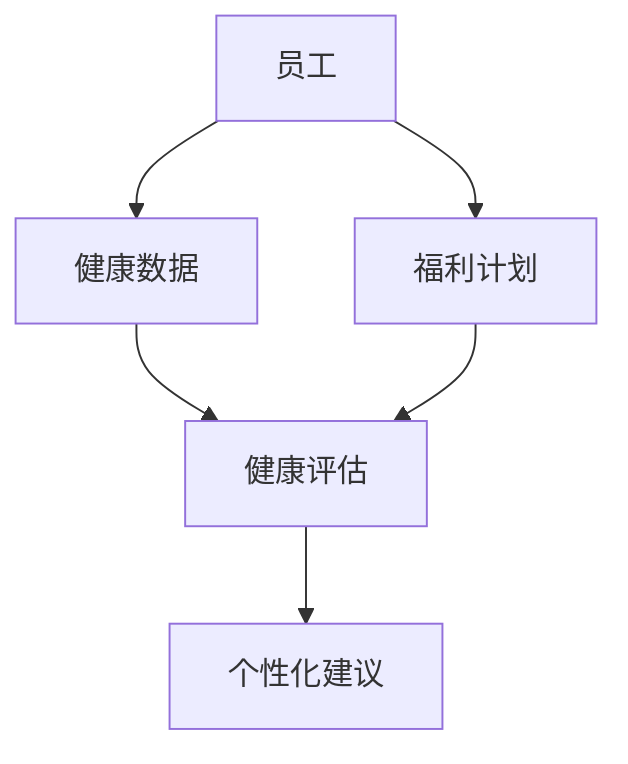
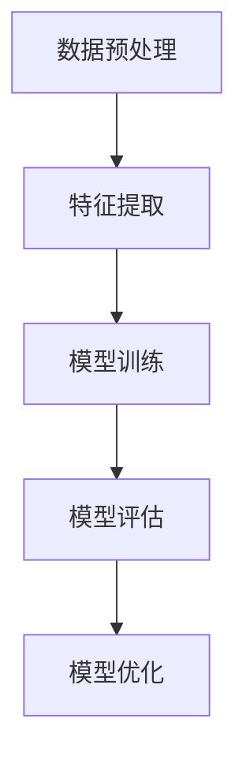
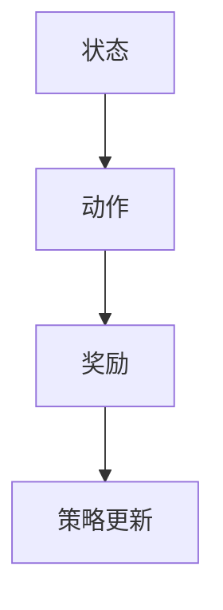
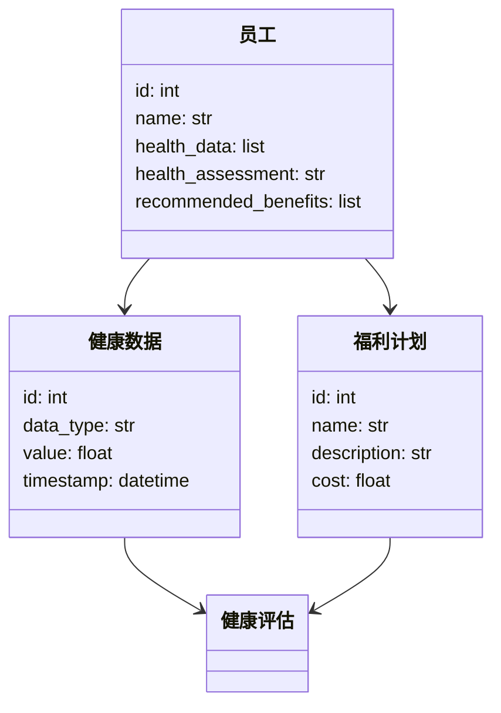
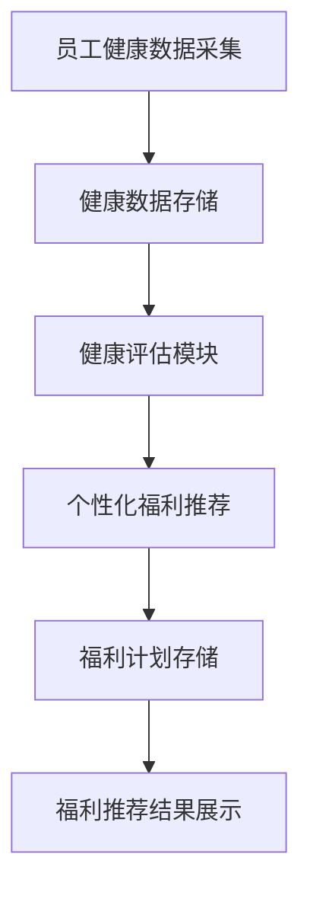
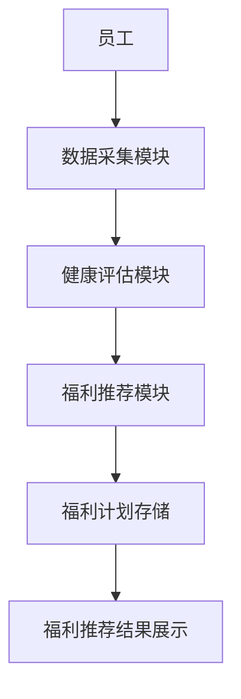

                 


# AI Agent在企业员工健康与福利管理中的应用

**关键词**：AI Agent、企业员工、健康与福利管理、人工智能、机器学习、健康评估

**摘要**：  
随着人工智能技术的快速发展，AI Agent（人工智能代理）在企业员工健康与福利管理中的应用日益广泛。本文系统地探讨了AI Agent在员工健康监测、福利计划推荐、健康干预等方面的应用场景、技术原理和实际案例。通过分析AI Agent的核心算法、系统架构和项目实现，本文为读者提供了一个全面理解AI Agent在企业员工健康与福利管理中的应用的视角。同时，本文还总结了AI Agent在实际应用中的优势与挑战，并展望了未来的发展方向。

---

## 第1章: 问题背景与核心概念

### 1.1 问题背景

#### 1.1.1 企业员工健康与福利管理的现状
现代企业越来越重视员工的健康与福利管理，因为员工的健康状况直接影响企业的生产力和员工满意度。然而，传统的健康与福利管理方式存在以下问题：
- 数据分散：员工的健康数据可能分布在不同的系统中，难以整合和分析。
- 个性化需求难以满足：员工的健康需求千差万别，传统管理方式难以实现个性化服务。
- 管理效率低下：人工处理大量数据和信息，效率低且容易出错。

#### 1.1.2 当前管理模式的痛点与挑战
- 数据孤岛问题：企业内部的健康数据、福利数据和员工行为数据分散在不同的系统中，缺乏统一的管理平台。
- 员工健康评估不精准：传统评估方法依赖于简单的问卷调查，难以全面反映员工的健康状况。
- 福利计划缺乏个性化：福利计划通常是基于固定的分类标准制定，难以满足员工的个性化需求。

#### 1.1.3 AI Agent的引入意义
AI Agent作为一种智能代理，能够通过数据采集、分析和决策，为企业员工的健康与福利管理提供智能化解决方案。AI Agent的优势在于：
- 实时数据分析：能够快速处理和分析大量的员工健康数据，提供实时的健康评估和建议。
- 个性化服务：基于员工的个人数据，提供个性化的健康管理和福利推荐。
- 自动化管理：通过自动化流程，提高管理效率，降低人工成本。

### 1.2 核心概念与问题描述

#### 1.2.1 AI Agent的定义与特点
AI Agent是一种能够感知环境、自主决策并执行任务的智能系统。其特点包括：
- 自主性：能够自主决策并执行任务。
- 反应性：能够根据环境的变化实时调整行为。
- 学习能力：能够通过数据学习和优化自身的算法。

#### 1.2.2 企业员工健康与福利管理的核心要素
- 健康数据：包括员工的体检数据、行为数据（如运动量、睡眠质量）等。
- 福利计划：包括健康保险、健身补贴、心理健康支持等。
- 健康评估：基于健康数据对员工的健康状况进行评估。

#### 1.2.3 问题解决的边界与外延
AI Agent在企业员工健康与福利管理中的应用边界包括：
- 数据范围：仅限于员工的健康数据和福利数据。
- 服务范围：仅限于健康评估、福利推荐和健康干预。
- 决策范围：基于数据的分析和模型的预测，提供决策支持。

### 1.3 核心概念的联系与区别

#### 1.3.1 核心概念的联系与区别
以下是AI Agent与其他相关概念的对比：

| 概念         | 定义                                                                 | 特点                                                                 |
|--------------|----------------------------------------------------------------------|----------------------------------------------------------------------|
| AI Agent     | 能够感知环境、自主决策并执行任务的智能系统。                          | 自主性、反应性、学习能力。                                             |
| 人工智能（AI）| 模拟人类智能的计算机系统。                                           | 包括机器学习、自然语言处理等多种技术。                                 |
| 机器学习     | 通过数据训练模型，使其能够进行预测或决策。                          | 基于数据的模式识别和预测。                                             |

#### 1.3.2 实体关系图架构
以下是员工健康与福利管理的核心实体关系图：



---

## 第2章: AI Agent的核心原理与算法实现

### 2.1 AI Agent的核心原理

#### 2.1.1 自主性与反应性
AI Agent的自主性使其能够独立决策，而反应性使其能够根据环境的变化实时调整行为。例如，当员工的健康数据发生变化时，AI Agent能够实时更新健康评估并提供新的建议。

#### 2.1.2 学习与适应机制
AI Agent通过机器学习算法不断优化自身的模型。例如，使用监督学习算法对员工的健康数据进行分类，从而实现健康评估的准确性。

#### 2.1.3 多目标优化与权衡
在企业员工健康与福利管理中，AI Agent需要在多个目标之间进行权衡。例如，既要考虑员工的健康需求，又要考虑企业的福利预算。

### 2.2 算法原理与实现

#### 2.2.1 监督学习算法
以下是监督学习算法的流程图：



以下是监督学习算法的Python代码示例：

```python
# 数据预处理
import pandas as pd
data = pd.read_csv('employee_health_data.csv')
# 特征提取
features = data[['age', 'gender', 'weight', 'height']]
# 模型训练
from sklearn.tree import DecisionTreeClassifier
model = DecisionTreeClassifier()
model.fit(features, data['health_status'])
# 模型评估
from sklearn.metrics import accuracy_score
predictions = model.predict(features)
print('准确率:', accuracy_score(data['health_status'], predictions))
```

#### 2.2.2 强化学习算法
以下是强化学习算法的流程图：



以下是强化学习算法的Python代码示例：

```python
# 状态空间
states = ['healthy', 'slightly_unhealthy', 'unhealthy']
# 动作空间
actions = ['no_action', 'health_check', 'provide_healthcare']
# 奖励函数
def reward_function(current_state, action):
    if action == 'health_check':
        return 1
    else:
        return 0
# 策略更新
from collections import defaultdict
q_values = defaultdict(int)
for state in states:
    for action in actions:
        q_values[(state, action)] = q_values[(state, action)] * 0.9 + reward_function(state, action)
```

---

## 第3章: 系统分析与架构设计

### 3.1 系统分析

#### 3.1.1 问题场景介绍
企业员工健康与福利管理系统的应用场景包括：
- 健康数据采集：通过智能设备采集员工的健康数据。
- 健康评估：基于健康数据对员工的健康状况进行评估。
- 福利推荐：根据员工的健康状况推荐个性化的福利计划。

#### 3.1.2 系统功能设计
以下是系统的功能模块：

| 模块         | 功能描述                     |
|--------------|------------------------------|
| 数据采集模块 | 采集员工的健康数据           |
| 健康评估模块 | 对员工的健康状况进行评估     |
| 福利推荐模块 | 根据健康评估结果推荐福利计划 |

#### 3.1.3 领域模型
以下是领域的类图：



### 3.2 系统架构设计

#### 3.2.1 系统架构图
以下是系统的架构图：



#### 3.2.2 接口设计与交互流程
以下是系统的交互流程图：



---

## 第4章: 项目实战

### 4.1 环境安装与配置

#### 4.1.1 系统环境
- 操作系统：Linux/Windows/macOS
- Python版本：3.6+
- 依赖库：pandas、scikit-learn、mermaid、LaTeX

#### 4.1.2 安装依赖
```bash
pip install pandas scikit-learn mermaid
```

### 4.2 核心实现

#### 4.2.1 数据采集模块
```python
import pandas as pd

def collect_health_data():
    data = pd.read_csv('employee_health_data.csv')
    return data
```

#### 4.2.2 健康评估模块
```python
from sklearn.tree import DecisionTreeClassifier

def assess_health(data):
    model = DecisionTreeClassifier()
    model.fit(data[['age', 'gender', 'weight', 'height']], data['health_status'])
    return model.predict(data[['age', 'gender', 'weight', 'height']])
```

#### 4.2.3 福利推荐模块
```python
def recommend_benefits(health_status):
    benefits = {
        'healthy': ['fitness补贴', '健康保险'],
        'slightly_unhealthy': ['健康保险', '心理健康支持'],
        'unhealthy': ['健康保险', '医疗补贴']
    }
    return benefits[health_status]
```

### 4.3 案例分析与代码解读

#### 4.3.1 案例分析
假设我们有一个员工的数据如下：

| 员工ID | 年龄 | 性别 | 体重 | 高度 | 健康状况 |
|--------|------|------|------|------|----------|
| 1      | 30   | 男   | 75   | 175  | 健康     |
| 2      | 35   | 女   | 65   | 165  | 健康     |
| 3      | 40   | 男   | 85   | 170  | 不健康   |

#### 4.3.2 代码解读
```python
# 数据采集模块
data = collect_health_data()
print(data)
```

#### 4.3.3 案例结果
对于员工ID=3，健康状况为“不健康”，系统会推荐“健康保险”和“医疗补贴”。

---

## 第5章: 总结与展望

### 5.1 总结
本文详细探讨了AI Agent在企业员工健康与福利管理中的应用，包括问题背景、核心概念、算法原理、系统架构和项目实战。AI Agent通过实时数据分析、个性化服务和自动化管理，为企业员工的健康与福利管理提供了智能化解决方案。

### 5.2 未来展望
随着AI技术的不断发展，AI Agent在企业员工健康与福利管理中的应用前景广阔。未来的研究方向包括：
- 更加智能化的健康评估算法。
- 更加个性化的福利推荐系统。
- 更加高效的健康干预策略。

### 5.3 最佳实践 tips
- 数据隐私保护：在处理员工健康数据时，必须遵守相关法律法规，确保数据的安全性。
- 模型的可解释性：确保AI Agent的决策过程透明可解释，以便员工理解和信任。
- 持续优化：定期更新模型，以适应员工健康需求的变化。

---

**作者：AI天才研究院/AI Genius Institute & 禅与计算机程序设计艺术 /Zen And The Art of Computer Programming**

