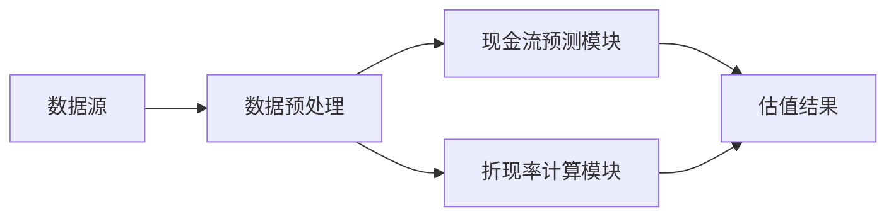

                 


# AI增强型现金流贴现模型

## 关键词：AI，现金流贴现模型，金融分析，机器学习，DCF模型，估值模型

## 摘要：本文深入探讨了如何利用人工智能技术增强现金流贴现模型（DCF模型）的准确性和效率。通过结合AI算法和传统金融模型，我们提出了一种创新的现金流贴现方法，能够更精准地预测现金流、优化贴现率计算并提升整体估值的准确性。文章从理论基础到实际应用，系统性地介绍了AI增强型DCF模型的构建过程、核心算法、数学模型以及在不同场景下的应用案例。

---

# 第1章: 现金流贴现模型概述

## 1.1 现金流贴现模型的基本概念

### 1.1.1 什么是现金流贴现模型
现金流贴现模型（Discounted Cash Flow，DCF）是一种用于评估公司或项目内在价值的金融分析方法。其核心思想是将未来现金流折现到现值，以确定其当前的合理价值。

$$
DCF = \sum_{t=1}^{n} \frac{CF_t}{(1 + r)^t}
$$

其中，$CF_t$ 表示第 $t$ 年的现金流，$r$ 是折现率，$n$ 是现金流的期限。

### 1.1.2 DCF模型的核心假设
- 资金的时间价值：资金随着时间的推移具有价值变化。
- 稳定的现金流：假设未来现金流可以预测和稳定。
- 合理的折现率：折现率反映风险和市场利率。

### 1.1.3 DCF模型的适用场景
- 企业价值评估。
- 项目可行性分析。
- 投资决策支持。

## 1.2 AI在金融分析中的应用

### 1.2.1 AI在金融预测中的作用
- 提供高精度的预测模型。
- 处理非线性关系和复杂数据。
- 实现实时监控和动态调整。

### 1.2.2 AI在DCF模型中的潜在价值
- 优化现金流预测的准确性。
- 自动化处理复杂数据。
- 提供动态调整折现率的能力。

### 1.2.3 AI增强型DCF模型的定义与目标
AI增强型DCF模型通过结合AI算法和传统DCF模型，旨在提升现金流预测的准确性和估值的效率。其目标是通过机器学习技术优化模型的输入参数和预测结果。

## 1.3 现金流贴现模型的优缺点

### 1.3.1 DCF模型的优点
- 能够准确反映公司的未来现金流。
- 是一种科学、系统的估值方法。
- 能够考虑时间价值和风险因素。

### 1.3.2 DCF模型的局限性
- 对未来现金流的假设可能存在偏差。
- 折现率的选择具有主观性。
- 数据的不完整性和波动性可能影响结果。

### 1.3.3 AI如何弥补DCF模型的不足
- AI可以通过历史数据和模式识别优化现金流预测。
- 机器学习算法能够动态调整折现率。
- AI可以处理复杂的数据关系，减少人为偏差。

## 1.4 本章小结

### 1.4.1 DCF模型的核心价值
DCF模型通过预测未来现金流并折现，为公司或项目的估值提供了科学依据。

### 1.4.2 AI增强型DCF模型的创新点
通过AI技术优化现金流预测和折现率计算，提升模型的准确性和效率。

### 1.4.3 本书的研究目标
系统性地介绍AI增强型DCF模型的构建过程、核心算法和实际应用，为金融分析提供新的思路。

---

# 第2章: AI增强型DCF模型的核心概念

## 2.1 AI与DCF模型的结合点

### 2.1.1 数据处理的智能化
AI能够从海量数据中提取关键特征，优化数据预处理过程。

### 2.1.2 模型预测的准确性
通过机器学习算法，AI能够更准确地预测未来现金流。

### 2.1.3 风险评估的全面性
AI可以通过分析历史数据和市场趋势，全面评估风险因素。

---

## 2.2 AI增强型DCF模型的核心要素

### 2.2.1 数据预处理
- 数据清洗：去除噪声数据，确保数据质量。
- 特征工程：提取关键特征，如收入增长率、利润率等。

### 2.2.2 模型训练
- 选择适合的机器学习算法（如随机森林、神经网络）。
- 训练模型以预测未来现金流。

### 2.2.3 模型预测
- 使用训练好的模型预测未来现金流。
- 对比传统DCF模型和AI增强型模型的预测结果。

### 2.2.4 结果分析
- 评估模型的准确性和稳定性。
- 对比传统DCF模型的估值结果。

---

## 2.3 AI增强型DCF模型的优势

### 2.3.1 提高现金流预测的准确性
AI能够通过历史数据和模式识别，优化现金流预测的准确性。

### 2.3.2 动态调整折现率
AI可以根据市场变化和风险因素，动态调整折现率。

### 2.3.3 处理复杂数据关系
AI能够发现传统模型难以捕捉的非线性关系，提升模型的解释力。

---

## 2.4 AI增强型DCF模型的挑战

### 2.4.1 数据依赖性
AI模型的预测能力依赖于数据的完整性和质量。

### 2.4.2 黑箱问题
AI模型的预测结果可能缺乏可解释性。

### 2.4.3 计算复杂性
复杂的AI算法需要大量的计算资源。

---

## 2.5 本章小结

### 2.5.1 AI增强型DCF模型的核心价值
通过AI技术优化现金流预测和估值过程，提高模型的准确性和效率。

### 2.5.2 AI与传统DCF模型的结合
AI技术为DCF模型注入新的活力，使其能够适应复杂多变的市场环境。

### 2.5.3 本书的后续内容
接下来的章节将详细介绍AI增强型DCF模型的算法原理、数学模型和实际应用。

---

# 第3章: AI增强型DCF模型的算法原理

## 3.1 数据预处理与特征工程

### 3.1.1 数据清洗
- 去除重复数据和异常值。
- 处理缺失值。

### 3.1.2 特征工程
- 提取关键特征，如收入增长率、利润率、行业指数等。
- 对特征进行标准化或归一化处理。

### 3.1.3 数据分割
- 将数据分为训练集、验证集和测试集。

---

## 3.2 模型训练与预测

### 3.2.1 选择算法
- 使用随机森林、支持向量机（SVM）或神经网络等算法。

### 3.2.2 训练模型
- 使用训练数据训练模型。
- 调参优化模型性能。

### 3.2.3 预测现金流
- 使用验证集和测试集评估模型性能。
- 对比传统DCF模型和AI增强型模型的预测结果。

---

## 3.3 结果分析与优化

### 3.3.1 评估模型性能
- 使用均方误差（MSE）、R平方值等指标评估模型的准确性。

### 3.3.2 模型优化
- 调整模型参数，优化预测精度。
- 对比不同算法的性能，选择最优模型。

### 3.3.3 动态调整折现率
- 根据市场变化和风险因素，动态调整折现率。

---

## 3.4 本章小结

### 3.4.1 算法原理的核心价值
通过AI算法优化现金流预测和估值过程，提高模型的准确性和效率。

### 3.4.2 算法实现的关键步骤
数据预处理、模型训练、预测与优化。

### 3.4.3 下一章内容预告
下一章将详细介绍AI增强型DCF模型的数学模型和系统架构设计。

---

# 第4章: AI增强型DCF模型的数学模型

## 4.1 DCF模型的传统公式

$$
DCF = \sum_{t=1}^{n} \frac{CF_t}{(1 + r)^t}
$$

其中，$CF_t$ 是第 $t$ 年的现金流，$r$ 是折现率，$n$ 是现金流的期限。

## 4.2 AI增强型DCF模型的数学框架

$$
DCF_{AI} = \sum_{t=1}^{n} \frac{CF_{AI,t}}{(1 + r_{AI})^t}
$$

其中，$CF_{AI,t}$ 是通过AI模型预测的第 $t$ 年现金流，$r_{AI}$ 是通过AI模型优化的折现率。

## 4.3 现金流预测的机器学习模型

$$
CF_{AI,t} = f_{ML}(X_t)
$$

其中，$X_t$ 是输入特征，$f_{ML}$ 是机器学习模型。

## 4.4 折现率的动态调整

$$
r_{AI} = \alpha \cdot r_{market} + (1 - \alpha) \cdot r_{custom}
$$

其中，$\alpha$ 是调整系数，$r_{market}$ 是市场平均折现率，$r_{custom}$ 是根据公司具体情况调整的折现率。

---

## 4.5 本章小结

### 4.5.1 数学模型的核心价值
通过AI算法优化现金流预测和折现率计算，提升DCF模型的准确性和效率。

### 4.5.2 数学模型的关键公式
DCF的传统公式和AI增强型公式，现金流预测的机器学习模型，折现率的动态调整公式。

### 4.5.3 下一章内容预告
下一章将详细介绍AI增强型DCF模型的系统架构设计和实际应用案例。

---

# 第5章: AI增强型DCF模型的系统架构设计

## 5.1 系统架构概述

### 5.1.1 系统功能模块
- 数据采集与预处理模块。
- 现金流预测模块。
- 折现率计算模块。
- 估值结果展示模块。

### 5.1.2 系统架构图



---

## 5.2 系统功能设计

### 5.2.1 数据采集与预处理
- 数据源：公司财务报表、市场数据等。
- 数据预处理：清洗、特征提取。

### 5.2.2 现金流预测模块
- 输入：历史数据和市场数据。
- 输出：预测现金流。

### 5.2.3 折现率计算模块
- 输入：市场数据和公司特征。
- 输出：动态折现率。

### 5.2.4 估值结果展示模块
- 输入：预测现金流和折现率。
- 输出：DCF估值结果。

---

## 5.3 系统接口设计

### 5.3.1 数据接口
- 数据输入接口：接收原始数据。
- 数据输出接口：输出处理后的数据。

### 5.3.2 模型接口
- 模型输入接口：接收特征数据。
- 模型输出接口：输出预测结果。

### 5.3.3 用户接口
- 用户输入接口：接收用户输入的参数。
- 用户输出接口：展示估值结果。

---

## 5.4 系统交互流程

### 5.4.1 数据预处理流程
1. 从数据源获取原始数据。
2. 清洗数据，去除噪声和异常值。
3. 提取特征，进行标准化处理。

### 5.4.2 模型训练流程
1. 使用训练数据训练机器学习模型。
2. 调整模型参数，优化性能。

### 5.4.3 预测与估值流程
1. 使用验证数据预测现金流。
2. 计算动态折现率。
3. 输出DCF估值结果。

---

## 5.5 本章小结

### 5.5.1 系统架构设计的核心价值
通过模块化设计，实现系统的高效运行和功能扩展。

### 5.5.2 系统架构的关键组件
数据预处理模块、现金流预测模块、折现率计算模块和估值结果展示模块。

### 5.5.3 下一章内容预告
下一章将详细介绍AI增强型DCF模型的项目实战和最佳实践。

---

# 第6章: AI增强型DCF模型的项目实战

## 6.1 项目背景与目标

### 6.1.1 项目背景
选择一个具体的行业和公司，例如科技公司，进行DCF模型的估值。

### 6.1.2 项目目标
通过AI增强型DCF模型，评估公司的内在价值。

---

## 6.2 项目环境与工具安装

### 6.2.1 环境要求
- Python 3.8以上版本。
- Jupyter Notebook或IDE。

### 6.2.2 工具安装
- 安装NumPy、Pandas、Scikit-learn、XGBoost等库。

---

## 6.3 核心代码实现

### 6.3.1 数据预处理

```python
import pandas as pd
import numpy as np

# 读取数据
data = pd.read_csv('financial_data.csv')

# 清洗数据
data.dropna(inplace=True)

# 特征提取
features = data[['revenue', 'profit_margin', 'industry_index']]
```

### 6.3.2 模型训练

```python
from sklearn.ensemble import RandomForestRegressor

# 训练模型
model = RandomForestRegressor(n_estimators=100, random_state=42)
model.fit(features, data['cash_flow'])
```

### 6.3.3 预测与估值

```python
# 预测现金流
predicted_flow = model.predict(new_features)

# 计算折现率
def calculate_discount_rate(risk_factor, market_rate):
    alpha = 0.7
    return alpha * market_rate + (1 - alpha) * risk_factor

discount_rate = calculate_discount_rate(risk_factor, market_rate)

# 计算DCF估值
DCF = sum(predicted_flow / (1 + discount_rate) ** t for t in range(1, 10))
```

---

## 6.4 实际案例分析

### 6.4.1 案例选择
选择一家科技公司，收集过去5年的财务数据和市场数据。

### 6.4.2 数据分析与预测
通过AI模型预测未来5年的现金流，计算动态折现率。

### 6.4.3 结果对比
对比传统DCF模型和AI增强型模型的估值结果，分析AI模型的优势。

---

## 6.5 项目小结

### 6.5.1 项目实现的关键步骤
数据预处理、模型训练、预测与估值。

### 6.5.2 项目成果
通过AI增强型DCF模型，准确评估公司的内在价值。

### 6.5.3 下一章内容预告
下一章将总结全书内容，并提供最佳实践和未来展望。

---

# 第7章: 总结与展望

## 7.1 本章小结

### 7.1.1 全书核心内容回顾
系统性地介绍了AI增强型DCF模型的构建过程、核心算法和实际应用。

### 7.1.2 AI增强型DCF模型的优势
提高现金流预测的准确性，动态调整折现率，处理复杂数据关系。

### 7.1.3 本书的研究价值
为金融分析提供新的思路，推动AI技术在金融领域的应用。

---

## 7.2 未来展望

### 7.2.1 模型优化方向
- 提升模型的可解释性。
- 引入更复杂的机器学习算法，如深度学习。
- 结合自然语言处理技术，分析文本数据。

### 7.2.2 应用领域扩展
- 应用于更多行业的估值和投资决策。
- 结合区块链技术，实现更安全的数据处理。

### 7.2.3 技术与金融的深度融合
- 推动金融分析的智能化和自动化。
- 促进金融科技（FinTech）的创新与发展。

---

## 7.3 最佳实践

### 7.3.1 小结
AI增强型DCF模型是一种创新的金融分析工具，能够提升估值的准确性和效率。

### 7.3.2 注意事项
- 数据质量是模型性能的关键。
- 模型的可解释性需要重视。
- 结合实际情况，灵活调整模型参数。

### 7.3.3 拓展阅读
- 推荐阅读相关领域的书籍和论文，深入了解AI在金融中的应用。

---

## 作者：AI天才研究院/AI Genius Institute & 禅与计算机程序设计艺术/Zen And The Art of Computer Programming

