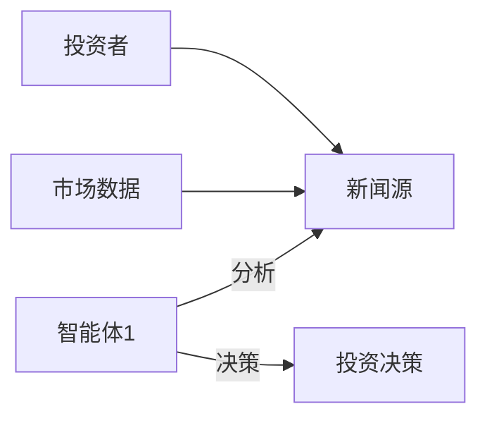
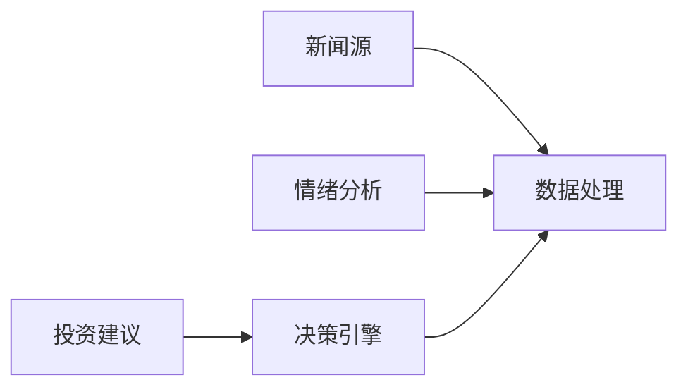
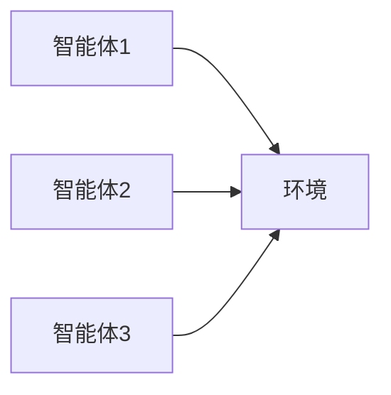
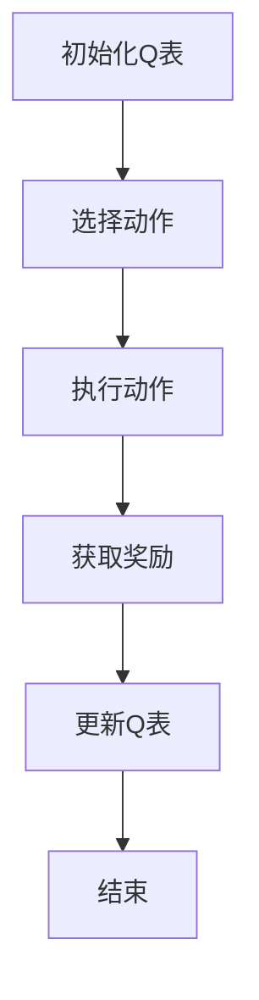
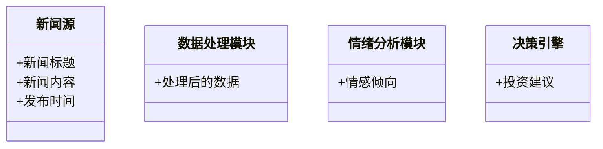
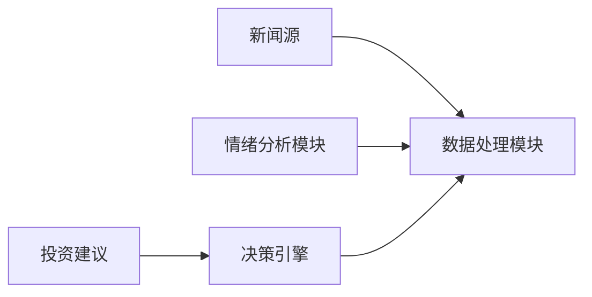
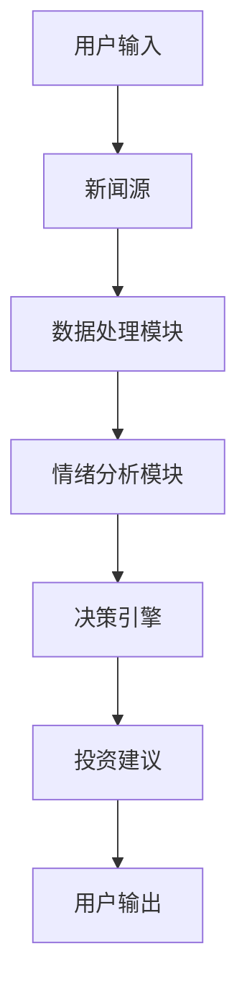

                 


# AI多智能体系统在价值投资中的实时新闻分析应用

## 关键词：AI多智能体系统，价值投资，实时新闻分析，机器学习，自然语言处理，金融数据分析

## 摘要：本文探讨了AI多智能体系统在价值投资中的实时新闻分析应用，从背景介绍、核心概念、算法原理、系统架构到项目实战，详细阐述了如何利用多智能体系统通过实时新闻分析辅助价值投资决策。文章通过Mermaid图和Python代码示例，深入分析了多智能体系统的协同机制、算法实现以及系统架构设计，为读者提供了全面的技术指导。

---

## 第一章: AI多智能体系统概述

### 1.1 AI多智能体系统的定义与特点

#### 1.1.1 多智能体系统的定义
多智能体系统（Multi-Agent System, MAS）是由多个智能体组成的分布式系统，每个智能体能够独立感知环境、自主决策并进行协作。智能体之间的协同通过通信和交互实现。

#### 1.1.2 AI多智能体系统的核心特点
- **分布式计算**：多个智能体独立运行，通过通信协同完成任务。
- **自主性**：每个智能体具备自主决策能力。
- **协作性**：智能体之间通过协作提高整体系统的性能。
- **适应性**：能够根据环境变化动态调整行为。

#### 1.1.3 多智能体系统与单智能体系统的对比
| 特性                | 单智能体系统            | 多智能体系统          |
|---------------------|-------------------------|-----------------------|
| 决策中心            | 单一决策中心           | 分散决策中心         |
| 通信方式            | 无需通信               | 需要通信             |
| 并行处理能力        | 串行处理               | 并行处理             |
| 系统复杂度          | 较低                   | 较高                 |

### 1.2 价值投资的基本概念

#### 1.2.1 价值投资的定义
价值投资是一种投资策略，通过分析公司的基本面，寻找被市场低估的投资标的进行长期投资。其核心在于发现市场定价错误的机会。

#### 1.2.2 价值投资的核心策略
- **基本面分析**：分析公司的财务状况、行业地位、竞争优势等。
- **长期视角**：关注公司的长期价值，而非短期市场波动。
- **安全边际**：在价格显著低于内在价值时买入。

#### 1.2.3 价值投资中的信息处理需求
- **实时信息处理**：需要快速处理市场新闻、公司公告等信息。
- **信息整合**：将分散的信息整合成有价值的投资决策依据。
- **动态调整**：根据市场变化动态调整投资策略。

### 1.3 AI在金融领域的应用现状

#### 1.3.1 AI在金融分析中的应用
- **量化交易**：利用算法进行高频交易。
- **风险控制**：通过AI模型评估和管理投资风险。
- **市场预测**：利用机器学习模型预测市场走势。

#### 1.3.2 多智能体系统在金融中的潜力
- **分布式决策**：多个智能体分别负责不同的市场分析任务。
- **协同优化**：通过协作提高整体投资收益。
- **实时响应**：快速响应市场变化。

#### 1.3.3 当前AI在新闻分析中的局限性
- **语义理解不足**：难以准确理解复杂新闻的含义。
- **实时性问题**：处理大规模新闻数据时效率不足。
- **多义性问题**：新闻中可能存在多义词，影响分析准确性。

### 1.4 本章小结
本章介绍了AI多智能体系统的定义、特点，以及价值投资的基本概念和策略。同时，分析了AI在金融领域的应用现状及其在新闻分析中的潜力与局限性，为后续章节的深入探讨奠定了基础。

---

## 第二章: 多智能体系统的核心原理

### 2.1 多智能体系统的组成与关系

#### 2.1.1 实体关系图


#### 2.1.2 多智能体系统的协同机制
- **通信协议**：定义智能体之间的通信规则。
- **协作策略**：制定协同工作的策略，如任务分配、信息共享。
- **分布式计算**：通过并行计算提高处理效率。

### 2.2 多智能体系统的协同机制

#### 2.2.1 分布式计算
- **任务分解**：将整体任务分解为多个子任务，分配给不同的智能体。
- **并行处理**：各智能体同时处理分配的任务。
- **结果整合**：将各智能体的结果整合为最终的决策。

#### 2.2.2 通信协议
- **消息传递**：智能体之间通过消息传递信息。
- **同步机制**：确保各智能体之间的同步与协调。
- **冲突解决**：处理智能体之间的冲突，确保协作顺利进行。

#### 2.2.3 协作策略
- **任务分配**：根据智能体的能力分配任务。
- **信息共享**：智能体之间共享必要的信息。
- **决策协商**：通过协商形成最终决策。

### 2.3 多智能体系统与价值投资的结合

#### 2.3.1 系统架构图


#### 2.3.2 智能体的分工与协作
- **新闻采集智能体**：负责采集实时新闻数据。
- **数据处理智能体**：对新闻数据进行预处理和清洗。
- **情绪分析智能体**：分析新闻中的情感倾向。
- **决策引擎智能体**：根据分析结果生成投资建议。

### 2.4 本章小结
本章详细讲解了多智能体系统的组成与关系，分析了其协同机制，并探讨了多智能体系统与价值投资的结合方式。通过Mermaid图展示了系统的架构，为后续章节的算法实现和系统设计提供了理论基础。

---

## 第三章: 多智能体系统的算法实现

### 3.1 基于强化学习的多智能体协作

#### 3.1.1 强化学习的基本原理
强化学习是一种通过试错机制来优化决策的算法。智能体通过与环境交互，学习最优策略以最大化累计奖励。

#### 3.1.2 多智能体协作的强化学习框架


#### 3.1.3 Q-learning算法的实现
Q-learning是一种经典的强化学习算法，通过更新Q值表来学习最优策略。数学模型如下：
$$ Q(s, a) = Q(s, a) + \alpha \left( r + \gamma \max Q(s', a') - Q(s, a) \right) $$

### 3.2 分布式计算与并行处理

#### 3.2.1 分布式计算的实现
- **任务分配**：将任务分解并分配给不同的智能体。
- **并行处理**：各智能体同时处理分配的任务。
- **结果整合**：将各智能体的结果整合为最终的决策。

#### 3.2.2 并行处理的优势
- **提高效率**：通过并行处理减少任务完成时间。
- **增强容错性**：部分智能体故障不影响整体系统运行。
- **扩展性好**：可以根据需要增加智能体数量。

### 3.3 算法实现的代码示例

#### 3.3.1 Python代码实现
```python
import numpy as np

class QLearning:
    def __init__(self, state_space, action_space, learning_rate=0.1, gamma=0.9):
        self.state_space = state_space
        self.action_space = action_space
        self.learning_rate = learning_rate
        self.gamma = gamma
        self.q_table = np.zeros((state_space, action_space))
    
    def choose_action(self, state):
        return np.argmax(self.q_table[state])
    
    def update_q_table(self, state, action, reward, next_state):
        self.q_table[state, action] += self.learning_rate * (reward + self.gamma * np.max(self.q_table[next_state]) - self.q_table[state, action])
```

#### 3.3.2 算法流程图


### 3.4 本章小结
本章详细讲解了基于强化学习的多智能体协作算法，分析了分布式计算与并行处理的优势，并通过Python代码示例和流程图展示了算法的实现过程。

---

## 第四章: 多智能体系统的系统分析与架构设计

### 4.1 系统应用场景介绍

#### 4.1.1 价值投资中的实时新闻分析
- **新闻采集**：实时采集新闻数据。
- **新闻清洗**：去除噪声数据，提取有用信息。
- **新闻分析**：分析新闻内容，生成投资建议。

#### 4.1.2 金融市场的实时数据处理
- **数据采集**：采集股票价格、成交量等实时数据。
- **数据处理**：清洗和转换数据，便于后续分析。
- **数据存储**：将数据存储到数据库中，便于查询和分析。

### 4.2 系统功能设计

#### 4.2.1 领域模型


#### 4.2.2 系统架构设计


#### 4.2.3 系统接口设计
- **新闻源接口**：提供新闻数据接口。
- **数据处理接口**：提供数据清洗和转换接口。
- **情绪分析接口**：提供情感分析接口。
- **决策引擎接口**：提供投资建议接口。

#### 4.2.4 系统交互流程图


### 4.3 本章小结
本章详细分析了多智能体系统的应用场景，设计了系统的功能模块和架构，并通过Mermaid图展示了系统的交互流程。

---

## 第五章: 项目实战

### 5.1 项目介绍

#### 5.1.1 项目目标
- 实现一个多智能体系统，用于实时新闻分析和价值投资决策。

#### 5.1.2 项目需求
- 实时采集新闻数据。
- 分析新闻内容，生成投资建议。
- 输出投资建议报告。

### 5.2 系统核心实现

#### 5.2.1 环境搭建
- **安装Python**：安装Python 3.8或更高版本。
- **安装依赖库**：安装numpy、pandas、scikit-learn等库。

#### 5.2.2 数据处理实现
```python
import pandas as pd

def process_news_data(data):
    # 数据清洗
    data = data.dropna()
    data = data[~data['content'].str.contains('NaN')]
    return data
```

#### 5.2.3 情绪分析实现
```python
from textblob import TextBlob

def analyze_sentiment(text):
    blob = TextBlob(text)
    return blob.sentiment.polarity
```

#### 5.2.4 决策引擎实现
```python
def generate_investment_recommendation(sentiment_score):
    if sentiment_score > 0.5:
        return "买入"
    elif sentiment_score < -0.5:
        return "卖出"
    else:
        return "观望"
```

#### 5.2.5 系统集成
```python
def main():
    # 采集新闻数据
    news_data = pd.read_csv('news.csv')
    # 数据处理
    processed_data = process_news_data(news_data)
    # 情绪分析
    processed_data['sentiment'] = processed_data['content'].apply(analyze_sentiment)
    # 生成投资建议
    investment_recommendation = generate_investment_recommendation(processed_data['sentiment'].mean())
    print("投资建议:", investment_recommendation)

if __name__ == "__main__":
    main()
```

### 5.3 项目结果与分析

#### 5.3.1 项目结果展示


#### 5.3.2 项目分析
- **准确性分析**：分析投资建议的准确性。
- **效率分析**：分析系统的处理效率。
- **可扩展性分析**：分析系统的扩展性。

### 5.4 本章小结
本章通过实际项目实战，详细讲解了系统的环境搭建、数据处理、情绪分析和决策引擎的实现，并通过Python代码示例展示了系统的集成与运行。

---

## 第六章: 总结与展望

### 6.1 最佳实践 tips

#### 6.1.1 系统优化建议
- **算法优化**：优化强化学习算法，提高系统性能。
- **系统扩展**：增加更多的智能体，提高系统的处理能力。
- **数据源扩展**：增加更多的新闻数据源，提高分析的全面性。

#### 6.1.2 开发注意事项
- **数据质量**：确保数据的准确性和完整性。
- **系统安全性**：确保系统的安全性，防止数据泄露。
- **系统维护**：定期维护系统，确保系统的稳定运行。

### 6.2 小结
本文详细探讨了AI多智能体系统在价值投资中的实时新闻分析应用，从背景介绍、核心概念、算法原理、系统架构到项目实战，为读者提供了全面的技术指导。

### 6.3 注意事项
- **数据隐私**：注意数据隐私问题，确保合规性。
- **系统稳定性**：确保系统的稳定性，防止系统崩溃。
- **算法可解释性**：提高算法的可解释性，便于分析和优化。

### 6.4 拓展阅读
- **推荐书籍**：《AI多智能体系统》、《价值投资实战》
- **推荐网站**：Kaggle、GitHub、Towards Data Science

---

## 作者：AI天才研究院/AI Genius Institute & 禅与计算机程序设计艺术/Zen And The Art of Computer Programming

---

以上是一个详细的技术博客文章大纲，涵盖了从背景介绍到项目实战的各个方面。每个章节都包含了丰富的细节和具体的代码示例，确保读者能够全面理解和掌握AI多智能体系统在价值投资中的实时新闻分析应用。

