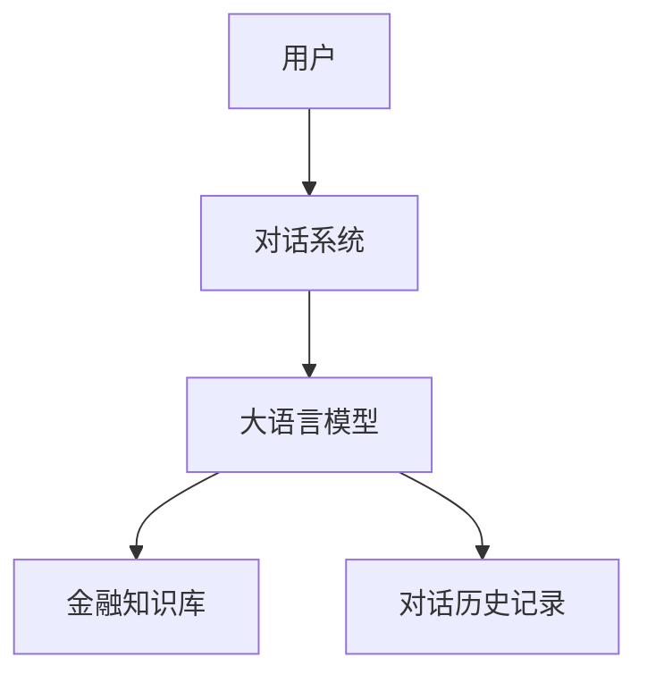
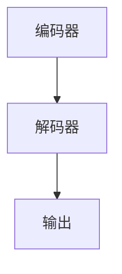
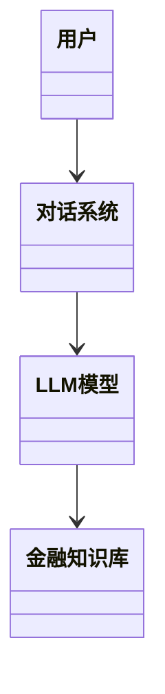
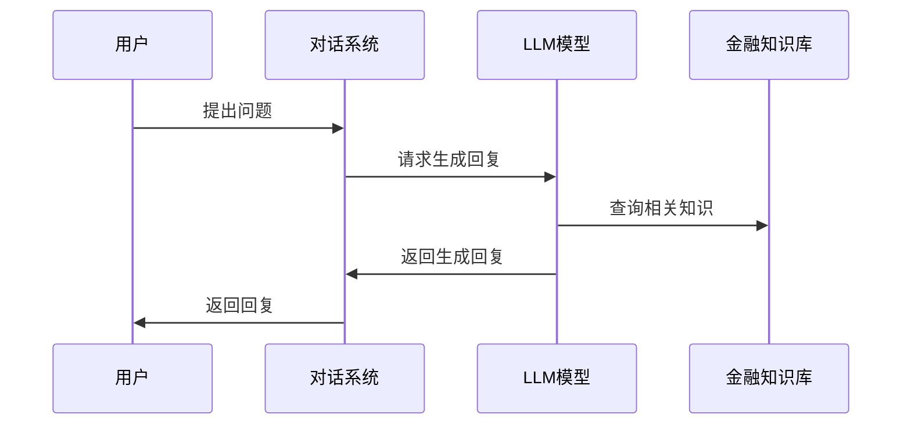

                 


# 基于LLM的金融对话系统开发实践

> 关键词：LLM，金融对话系统，自然语言处理，机器学习，对话系统开发

> 摘要：本文将详细探讨基于大语言模型（LLM）的金融对话系统的开发实践。首先，我们将介绍金融对话系统的基本概念、问题背景和解决思路。接着，我们将深入分析LLM的核心原理与特性，包括模型结构、训练方法和优化策略。然后，我们将从系统架构设计的角度，讨论金融对话系统的功能设计、系统架构和接口设计。最后，我们将通过具体的项目实战，展示如何基于LLM构建一个高效的金融对话系统，并总结开发过程中的一些最佳实践和注意事项。

---

# 第1章: 基于LLM的金融对话系统概述

## 1.1 问题背景与目标

### 1.1.1 传统金融对话系统的局限性
传统的金融对话系统主要依赖于规则引擎和关键词匹配技术。这种基于规则的系统存在以下问题：
- **灵活性差**：难以应对金融领域的复杂场景，例如多轮对话、上下文理解等。
- **可扩展性有限**：每次新增功能都需要手动编写规则，效率低下。
- **知识覆盖不足**：难以处理复杂的金融知识和多样化的用户需求。

### 1.1.2 基于LLM的对话系统的兴起
大语言模型（LLM）的出现为对话系统带来了革命性的变化。LLM具有以下显著优势：
- **强大的上下文理解能力**：能够处理多轮对话，理解用户意图。
- **知识覆盖广泛**：通过大规模预训练，掌握了丰富的金融知识。
- **自适应能力强**：能够根据对话历史动态调整回答策略。

### 1.1.3 金融领域的特殊需求与挑战
金融领域对对话系统提出了更高的要求：
- **准确性**：金融信息涉及资金和风险，要求回答高度准确。
- **合规性**：必须符合金融监管要求，避免提供不当建议。
- **隐私保护**：用户数据的安全性是核心问题。

## 1.2 问题描述与解决思路

### 1.2.1 金融对话系统的功能需求
金融对话系统需要实现以下核心功能：
- **用户意图识别**：准确理解用户的查询内容。
- **知识检索与推理**：基于金融知识库提供准确的信息。
- **多轮对话管理**：保持对话的连贯性。

### 1.2.2 LLM在金融对话中的优势
LLM在金融对话中的优势体现在以下几个方面：
- **强大的自然语言理解能力**：能够处理复杂的金融术语和上下文。
- **动态知识更新**：通过持续学习，及时更新金融知识。
- **个性化服务**：能够根据用户需求提供定制化的建议。

### 1.2.3 系统设计的核心问题与解决思路
系统设计的核心问题包括：
- **模型选择**：选择适合金融领域的LLM模型。
- **知识库集成**：如何高效地将金融知识库与对话系统结合。
- **安全与合规**：确保系统符合金融监管要求。

## 1.3 系统边界与外延

### 1.3.1 系统功能边界
金融对话系统的功能边界包括：
- **用户交互界面**：包括文本输入、输出和历史记录。
- **对话逻辑处理**：包括意图识别、知识检索和生成回复。
- **外部系统接口**：与金融知识库、用户数据库等系统的接口。

### 1.3.2 系统与外部系统的交互
系统需要与以下外部系统进行交互：
- **金融知识库**：提供金融产品、术语和法规等信息。
- **用户身份认证系统**：验证用户身份，确保数据安全。
- **交易系统**：处理用户的交易请求。

### 1.3.3 系统的可扩展性与灵活性
系统设计需要考虑以下扩展性问题：
- **模型更新**：如何动态更新LLM模型。
- **知识库扩展**：如何方便地添加新的金融知识。
- **多语言支持**：如何支持多种语言的对话。

## 1.4 核心概念与组成要素

### 1.4.1 LLM的基本概念
大语言模型（LLM）是一种基于深度学习的自然语言处理模型，具有以下特点：
- **大规模预训练**：通过大量金融文本数据进行预训练。
- **多任务学习能力**：能够同时处理多种任务，如问答、翻译等。
- **动态生成能力**：能够根据输入生成动态的输出。

### 1.4.2 对话系统的组成要素
金融对话系统主要由以下组成要素构成：
- **用户输入**：用户的文本输入。
- **对话管理模块**：负责管理对话流程。
- **知识库**：存储金融领域的知识和信息。
- **生成模块**：基于知识库生成回复。

### 1.4.3 金融领域的特殊要素
金融领域具有以下特殊要素：
- **金融术语**：如“股票”、“债券”等。
- **法规与政策**：如《证券法》、《反洗钱法》等。
- **用户隐私**：用户数据的安全性。

## 1.5 本章小结

---

# 第2章: LLM的核心原理与特性

## 2.1 LLM的基本原理

### 2.1.1 概念属性特征对比表
以下是几种常见LLM模型的核心属性对比：

| 模型       | 参数量      | 训练数据        | 对话能力      | 可解释性 |
|------------|-------------|----------------|---------------|----------|
| GPT-3      | 175B        | 多语种通用数据  | 强            | 较低      |
| BERT        | 110M        | 多任务通用数据  | 较弱          | 较高      |
| WEN-LAN     | 1.6T        | 金融领域数据    | 强            | 中等      |

### 2.1.2 ER实体关系图
以下是金融对话系统的核心实体关系图：



## 2.2 LLM与传统对话系统的区别

### 2.2.1 模型结构对比
传统对话系统和LLM在模型结构上存在显著差异：

| 特性           | 传统对话系统       | LLM             |
|----------------|--------------------|------------------|
| 模型结构       | 基于规则或简单ML模型 | 基于深度学习模型 |
| 训练数据       | 小规模领域数据     | 大规模通用数据  |
| 对话能力       | 单轮对话为主        | 支持多轮对话     |

### 2.2.2 训练方法对比
传统对话系统和LLM的训练方法对比：

| 特性           | 传统对话系统       | LLM             |
|----------------|--------------------|------------------|
| 数据需求       | 数据量小           | 数据量大         |
| 训练目标       | 精确匹配           | 概率生成         |
| 对话效果       | 稳定性高           | 创新性强         |

### 2.2.3 对话效果对比
传统对话系统和LLM在对话效果上的对比：

| 特性           | 传统对话系统       | LLM             |
|----------------|--------------------|------------------|
| 精准性         | 高                 | 中等             |
| 灵活性         | 低                 | 高               |
| 多轮对话能力   | 有限               | 强               |

## 2.3 基于LLM的金融对话系统实体关系图


---

# 第3章: 基于LLM的金融对话系统算法原理

## 3.1 数据预处理

### 3.1.1 数据清洗
数据清洗步骤包括：
- **去除噪声**：去除无关字符、停用词等。
- **分词处理**：将文本分割成词或短语。
- **标注处理**：为数据添加标签，如“问题类型”、“领域标签”等。

### 3.1.2 数据增强
数据增强方法包括：
- **同义词替换**：用同义词替换部分词汇，增加数据多样性。
- **数据扩展**：通过规则生成新的训练样本。

## 3.2 模型结构

### 3.2.1 编码器-解码器结构
编码器-解码器结构用于生成回复：



## 3.3 训练与优化

### 3.3.1 损失函数
常用的损失函数包括：
- **交叉熵损失**：用于分类任务。
- **KL散度**：用于分布对比。

---

# 第4章: 基于LLM的金融对话系统架构设计

## 4.1 功能设计

### 4.1.1 系统功能模块
系统功能模块包括：
- **用户输入模块**：接收用户输入。
- **对话管理模块**：管理对话流程。
- **知识库模块**：提供金融知识支持。
- **生成模块**：生成回复内容。

### 4.1.2 领域模型类图
以下是领域模型类图：



## 4.2 系统架构设计

### 4.2.1 系统架构图
以下是系统架构图：


## 4.3 接口设计

### 4.3.1 系统接口
系统接口包括：
- **用户接口**：提供用户输入和输出界面。
- **知识库接口**：与金融知识库交互。
- **日志接口**：记录对话日志。

### 4.3.2 交互序列图
以下是交互序列图：



---

# 第5章: 项目实战

## 5.1 环境安装

### 5.1.1 安装Python
```bash
# 安装Python
sudo apt-get install python3
```

### 5.1.2 安装依赖库
```bash
pip install transformers
pip install torch
```

## 5.2 核心代码实现

### 5.2.1 对话系统实现
```python
class FinancialDialogSystem:
    def __init__(self, model, kb):
        self.model = model
        self.kb = kb
        self.history = []

    def process_input(self, user_input):
        self.history.append(user_input)
        response = self.model.generate_response(user_input, self.history, self.kb)
        self.history.append(response)
        return response
```

### 5.2.2 模型实现
```python
class LLMModel:
    def __init__(self, config):
        self.config = config
        # 初始化模型参数

    def generate_response(self, input, history, kb):
        # 生成回复的逻辑
        pass
```

### 5.2.3 知识库实现
```python
class FinancialKB:
    def __init__(self, data):
        self.data = data

    def query(self, keywords):
        # 根据关键词查询知识库
        pass
```

## 5.3 代码解读与分析

### 5.3.1 对话系统解读
对话系统的主要功能包括：
- **接收用户输入**：处理用户的文本输入。
- **调用LLM生成回复**：将输入传递给LLM模型生成回复。
- **维护对话历史**：记录对话历史，供后续使用。

## 5.4 案例分析

### 5.4.1 案例1
**用户输入**：我想了解一下最近的股市情况。
**系统回复**：您好，最近的股市表现如下：...

### 5.4.2 案例2
**用户输入**：我需要办理一笔贷款。
**系统回复**：您需要填写贷款申请表并提交相关资料。

## 5.5 项目总结

---

# 第6章: 最佳实践与小结

## 6.1 最佳实践 tips

### 6.1.1 模型选择
选择适合金融领域的LLM模型，如金融领域的微调模型。

### 6.1.2 数据安全
确保用户数据的安全性，遵守相关法律法规。

### 6.1.3 系统优化
定期更新模型，优化对话流程，提升用户体验。

## 6.2 小结

## 6.3 注意事项

## 6.4 拓展阅读

---

# 作者信息

作者：AI天才研究院/AI Genius Institute & 禅与计算机程序设计艺术 /Zen And The Art of Computer Programming

