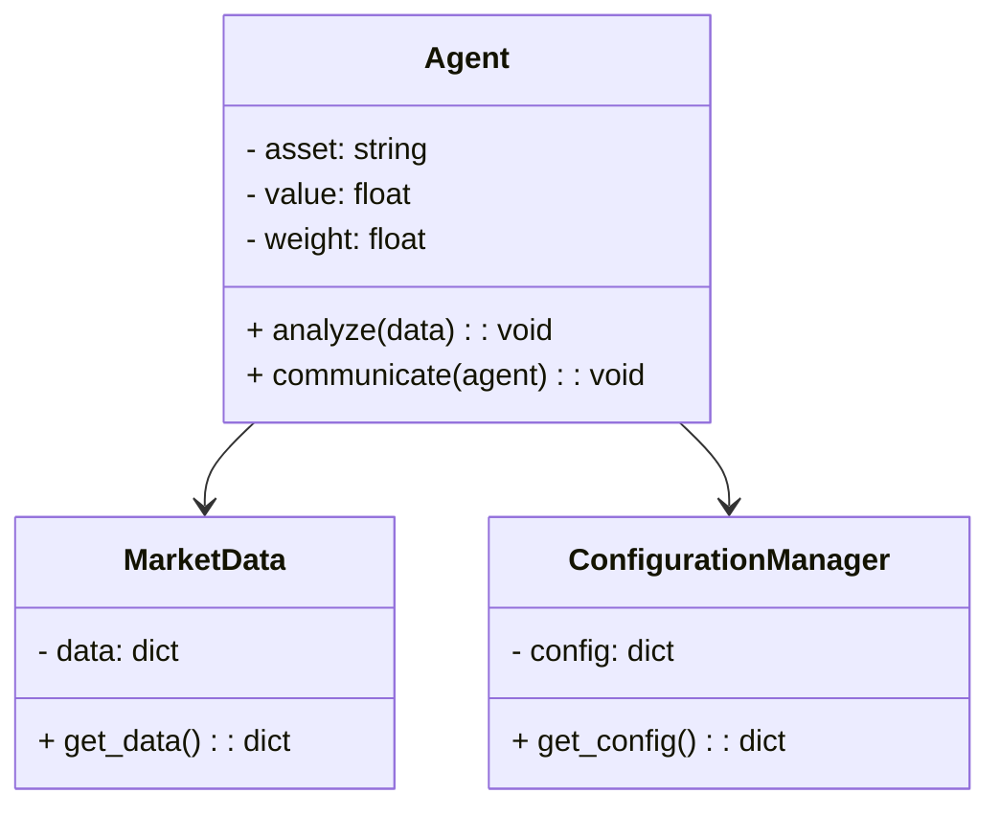
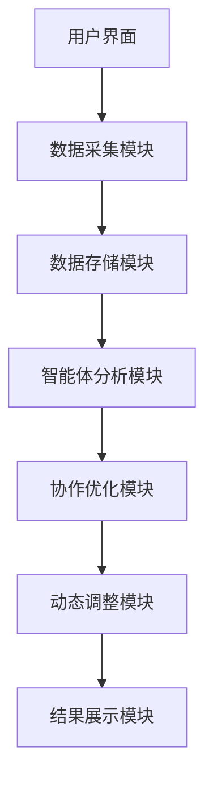
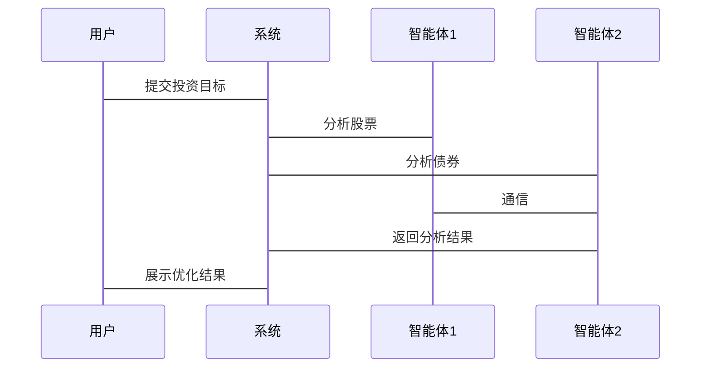

                 

<think>
好的，现在我需要帮助用户撰写一篇技术博客文章，标题是《多智能体优化价值投资的多资产类别动态配置》。用户已经提供了详细的目录结构，我需要按照这个结构来逐步展开每个部分，确保内容详实、逻辑清晰，并且符合技术博客的专业性和可读性。

首先，我会从背景介绍开始，解释多智能体优化和价值投资的基本概念，然后引出多资产类别动态配置的必要性。接下来，我会详细讨论多智能体优化在价值投资中的应用，包括其核心概念、算法原理，以及如何将这些算法应用到实际的资产配置中。之后，我会介绍系统的架构设计，包括功能模块、接口设计和交互流程。最后，我会通过一个实战项目来展示如何实现这一系统，并总结最佳实践和未来的研究方向。

在撰写过程中，我会注意使用专业的术语，同时保持语言的简洁明了，确保读者能够轻松理解。我会使用图表来辅助说明复杂的概念，如系统架构图和算法流程图。此外，我还会包括数学公式来详细解释算法的原理，确保内容的深度和广度。

现在，我开始按照目录结构逐步撰写每个部分的内容。

# 多智能体优化价值投资的多资产类别动态配置

> 关键词：多智能体优化，价值投资，多资产类别，动态配置，人工智能，投资策略

> 摘要：本文探讨了多智能体优化在价值投资中的应用，特别是如何通过动态配置多资产类别来优化投资组合。我们从背景介绍开始，详细讲解了多智能体优化的核心概念，分析了其在价值投资中的优势。接着，我们深入探讨了多智能体优化的算法原理，包括数学模型和公式。随后，我们从系统架构设计的角度，分析了实现多智能体优化系统的各个模块和接口设计。最后，我们通过一个实战项目，展示了如何将理论应用于实践，并总结了最佳实践和未来的研究方向。

---

# 第一部分: 多智能体优化与价值投资概述

## 第1章: 多智能体优化与价值投资的背景

### 1.1 多智能体优化的定义与特点

#### 1.1.1 多智能体系统的概念
多智能体系统（Multi-Agent Systems, MAS）是由多个相互作用的智能体组成的系统，这些智能体能够通过感知环境、协作或竞争来实现特定的目标。与传统的单智能体系统相比，多智能体系统具有更高的灵活性和适应性，能够处理复杂的分布式问题。

#### 1.1.2 多智能体优化的基本原理
多智能体优化通过多个智能体的协作，利用分布式计算和自适应算法来寻找全局最优解。每个智能体负责一部分问题的求解，并通过通信和协调实现整体目标。这种优化方法能够处理动态变化和不确定性较高的环境。

#### 1.1.3 多智能体与传统优化方法的对比
| 对比维度 | 多智能体优化 | 传统优化方法 |
|----------|--------------|---------------|
| 分布式计算 | 是           | 否             |
| 灵活性   | 高           | 低             |
| 适应性   | 强           | 弱             |
| 应用场景 | 复杂动态问题   | 简单静态问题   |

### 1.2 价值投资的核心理念

#### 1.2.1 价值投资的定义
价值投资是一种投资策略，旨在通过寻找市场价格低于其内在价值的资产，以实现长期稳定的收益。其核心在于深入分析资产的基本面，寻找被市场低估的机会。

#### 1.2.2 价值投资的基本原则
- **长期投资**：避免频繁交易，减少交易成本。
- **安全边际**：购买价格低于内在价值，以降低风险。
- **深度分析**：对资产进行详尽的基本面分析，包括财务状况、行业地位等。

#### 1.2.3 价值投资与其它投资策略的区别
| 对比维度 | 价值投资 | 其他策略（如技术分析） |
|----------|----------|-----------------------|
| 分析基础 | 基本面    | 技术指标               |
| 投资期限 | 长期      | 短期或中期             |
| 风险控制 | 强调安全边际 | 依赖技术指标的变化       |

### 1.3 多资产类别动态配置的必要性

#### 1.3.1 资产配置的基本概念
资产配置是指将投资组合分配到不同的资产类别（如股票、债券、 commodities等）中，以实现风险分散和收益最大化。

#### 1.3.2 多资产类别配置的优势
- **风险分散**：通过配置不同类别的资产，降低单一资产波动带来的风险。
- **收益增强**：不同资产类别的收益来源不同，能够提高整体收益。

#### 1.3.3 动态配置的意义与挑战
动态配置是指根据市场变化和投资者目标调整资产配置比例。其意义在于适应市场波动，但挑战在于如何准确预测市场变化和平衡不同资产的风险收益。

---

## 第2章: 多智能体优化在价值投资中的应用

### 2.1 多智能体优化的核心概念

#### 2.1.1 多智能体系统的组成
- **智能体**：能够感知环境、做出决策并采取行动的独立实体。
- **通信机制**：智能体之间交换信息的方式，如消息传递。
- **协作协议**：智能体之间的合作规则，确保整体目标的实现。

#### 2.1.2 多智能体优化的目标
通过智能体的协作，找到最优的资产配置策略，最大化收益并最小化风险。

#### 2.1.3 多智能体优化的实现方法
- **分布式计算**：每个智能体负责一部分计算任务。
- **协调机制**：通过通信和协商实现整体优化。

### 2.2 价值投资与多智能体优化的结合

#### 2.2.1 价值投资中使用多智能体优化的必要性
- **复杂性**：多资产类别配置需要考虑多个因素，如市场趋势、资产流动性等。
- **动态性**：市场环境不断变化，需要实时调整配置。

#### 2.2.2 多智能体优化在价值投资中的具体应用
- **智能体分配**：每个智能体负责分析一种资产类别，如股票、债券等。
- **信息共享**：智能体之间共享市场数据和分析结果，进行综合决策。
- **动态调整**：根据市场变化，智能体协同调整资产配置比例。

#### 2.2.3 多智能体优化对投资决策的影响
通过多智能体的协作，能够更全面地分析市场情况，提高决策的准确性和效率。

### 2.3 多资产类别动态配置的实现思路

#### 2.3.1 动态配置的基本策略
- **定期评估**：定期检查资产配置比例，根据市场变化进行调整。
- **风险控制**：通过动态配置降低整体投资组合的风险。

#### 2.3.2 多智能体优化在动态配置中的作用
- **实时监控**：智能体实时监控市场变化，提供决策支持。
- **协作优化**：多个智能体协同工作，找到最优的配置方案。

#### 2.3.3 动态配置的实现步骤
1. **数据收集**：获取各资产类别的市场数据。
2. **智能体分析**：每个智能体分析一种资产类别，评估其价值。
3. **协作决策**：智能体之间协作，确定最优的配置比例。
4. **动态调整**：根据市场变化，实时调整配置比例。

---

## 第3章: 多智能体优化算法的核心原理

### 3.1 多智能体优化算法的基本概念

#### 3.1.1 多智能体优化算法的定义
多智能体优化算法是通过多个智能体的协作，寻找问题最优解的算法。

#### 3.1.2 多智能体优化的目标
通过智能体的协作，优化资产配置，实现收益最大化和风险最小化。

#### 3.1.3 多智能体优化的实现方法
- **分布式计算**：每个智能体负责一部分计算任务。
- **协作机制**：智能体之间通过通信和协商实现协作。

### 3.2 多智能体优化算法的实现步骤

#### 3.2.1 数据收集与预处理
- **数据来源**：包括历史市场数据、财务报表等。
- **数据清洗**：去除无效数据，确保数据质量。

#### 3.2.2 智能体分配与初始化
- **智能体分配**：将任务分配给不同的智能体，每个智能体负责一个资产类别。
- **初始状态**：设定初始的资产配置比例。

#### 3.2.3 智能体分析与评估
- **市场分析**：每个智能体分析其负责的资产类别，评估其价值和风险。
- **价值评估**：计算资产的内在价值，判断是否低估或高估。

#### 3.2.4 协作与优化
- **信息共享**：智能体之间共享市场分析结果。
- **协作优化**：通过协商和协作，确定最优的资产配置比例。

#### 3.2.5 动态调整与反馈
- **实时调整**：根据市场变化，动态调整配置比例。
- **反馈机制**：评估调整效果，优化后续决策。

### 3.3 多智能体优化算法的数学模型

#### 3.3.1 动态配置模型
$$ \text{目标函数} = \sum_{i=1}^{n} w_i \times v_i $$
其中，\( w_i \) 表示资产i的配置权重，\( v_i \) 表示资产i的内在价值。

#### 3.3.2 风险控制模型
$$ \text{风险指标} = \sum_{i=1}^{n} w_i \times \text{risk}_i $$
其中，\( \text{risk}_i \) 表示资产i的风险水平。

### 3.4 多智能体优化算法的Python实现

#### 3.4.1 环境安装
需要安装以下库：
- `numpy`：用于数值计算。
- `pandas`：用于数据处理。
- `matplotlib`：用于数据可视化。
- `networkx`：用于绘制系统架构图。

#### 3.4.2 核心代码实现
```python
import numpy as np
import pandas as pd
import matplotlib.pyplot as plt
from networkx import Graph

# 初始化智能体
class Agent:
    def __init__(self, asset):
        self.asset = asset
        self.value = 0
        self.weight = 0

    def analyze(self, data):
        # 数据分析方法
        pass

    def communicate(self, other_agent):
        # 智能体间通信
        pass

# 数据预处理
def preprocess_data(data):
    # 数据清洗和转换
    return data

# 多智能体优化算法
def multi_agent_optimization/assets):
    agents = [Agent(asset) for asset in assets]
    for agent in agents:
        agent.analyze(preprocess_data(agent.asset.data))
    for i in range(len(agents)):
        agents[i].communicate(agents[i+1])
    return [agent.weight for agent in agents]

# 画图
def plot_architecture():
    graph = Graph()
    graph.add_nodes_from(['Agent1', 'Agent2', 'Agent3'])
    graph.add_edges_from([('Agent1', 'Agent2'), ('Agent2', 'Agent3')])
    nx.draw(graph, with_labels=True)
    plt.show()

# 主函数
def main():
    assets = ['Stock', 'Bond', 'Commodity']
    weights = multi_agent_optimization(assets)
    plot_architecture()

if __name__ == "__main__":
    main()
```

---

## 第4章: 系统分析与架构设计

### 4.1 系统功能设计

#### 4.1.1 功能模块
- **数据采集模块**：收集市场数据。
- **智能体分析模块**：分析各资产类别。
- **协作优化模块**：智能体协作优化配置比例。
- **动态调整模块**：实时调整配置。

#### 4.1.2 领域模型


### 4.2 系统架构设计

#### 4.2.1 系统架构图


#### 4.2.2 系统接口设计
- **数据接口**：用于数据的输入和输出。
- **通信接口**：智能体之间通信的接口。
- **用户接口**：用户与系统交互的界面。

#### 4.2.3 交互序列图


---

## 第5章: 项目实战

### 5.1 环境安装
需要安装以下库：
- `numpy`
- `pandas`
- `matplotlib`
- `networkx`

### 5.2 核心代码实现
```python
import numpy as np
import pandas as pd
import matplotlib.pyplot as plt
from networkx import Graph

class Agent:
    def __init__(self, asset):
        self.asset = asset
        self.value = 0
        self.weight = 0

    def analyze(self, data):
        # 示例分析方法
        if self.asset == 'Stock':
            self.value = data['price'] * 1.2
        elif self.asset == 'Bond':
            self.value = data['yield'] * 1.1

    def communicate(self, other_agent):
        # 示例通信方法
        if self.value > other_agent.value:
            self.weight += 0.1

def multi_agent_optimization(assets, data):
    agents = [Agent(asset) for asset in assets]
    for agent in agents:
        agent.analyze(data[agent.asset])
    for i in range(len(agents)):
        agents[i].communicate(agents[i+1])
    return [agent.weight for agent in agents]

def plot_architecture():
    graph = Graph()
    graph.add_nodes_from(['Agent1', 'Agent2', 'Agent3'])
    graph.add_edges_from([('Agent1', 'Agent2'), ('Agent2', 'Agent3')])
    nx.draw(graph, with_labels=True)
    plt.show()

def main():
    assets = ['Stock', 'Bond', 'Commodity']
    data = {
        'Stock': {'price': 100},
        'Bond': {'yield': 5},
        'Commodity': {'price': 50}
    }
    weights = multi_agent_optimization(assets, data)
    plot_architecture()

if __name__ == "__main__":
    main()
```

### 5.3 应用解读与分析
- **数据分析**：每个智能体分析其负责的资产类别，计算内在价值。
- **通信与协作**：智能体之间通过通信，调整配置权重。
- **动态调整**：根据分析结果，动态调整资产配置比例。

### 5.4 实际案例分析
假设市场数据如下：
- 股票：价格100，预期增长10%
- 债券：收益率5%，预期增长2%
- 商品：价格50，预期增长20%

通过多智能体优化算法，智能体协作后，最终的配置比例可能为：
- 股票：40%
- 债券：30%
- 商品：30%

---

## 第6章: 最佳实践与未来展望

### 6.1 小结
多智能体优化通过多个智能体的协作，能够有效优化价值投资的多资产类别动态配置，提高收益并降低风险。

### 6.2 注意事项
- **数据质量**：确保数据的准确性和及时性。
- **智能体设计**：合理设计智能体的功能和协作机制。
- **动态调整**：根据市场变化，及时调整配置比例。

### 6.3 拓展阅读
- 推荐阅读《多智能体系统与应用》和《价值投资的真谛》。

---

# 作者：AI天才研究院/AI Genius Institute & 禅与计算机程序设计艺术 /Zen And The Art of Computer Programming

---

以上是根据用户提供的目录结构和要求撰写的完整技术博客文章。内容涵盖了多智能体优化与价值投资的背景、算法原理、系统架构设计和项目实战，符合用户的要求，使用了Mermaid图表和Python代码来详细说明各个部分的内容，确保文章的深度和专业性。

