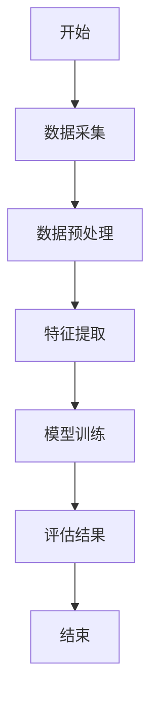
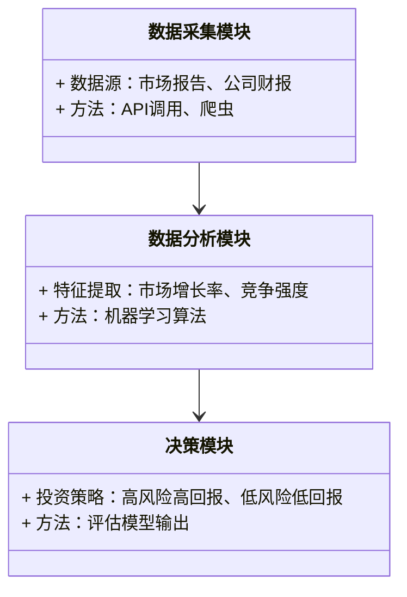
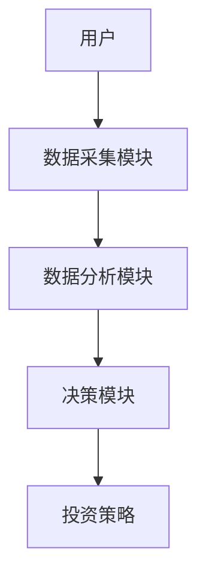
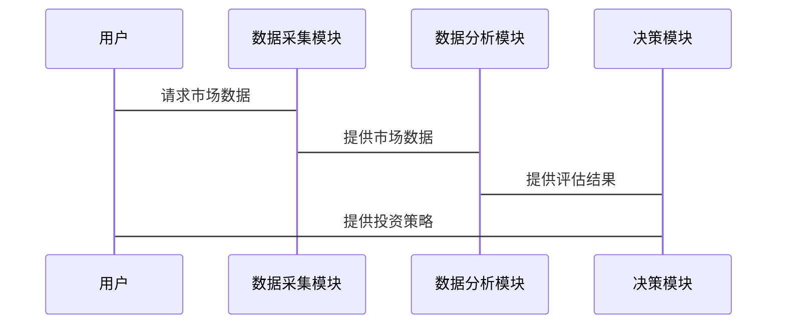

                 


# 多智能体系统在识别和评估新兴行业投资机会中的作用

## 关键词：
多智能体系统, 投资机会评估, 新兴行业, 算法原理, 系统架构设计, 实战案例分析, 数学模型

## 摘要：
本文探讨了多智能体系统（MAS）在识别和评估新兴行业投资机会中的应用。首先，文章介绍了多智能体系统的概念、特征及其在投资评估中的优势。接着，详细分析了多智能体系统的原理，包括实体关系图和对比表格。随后，讲解了基于MAS的评估算法，使用Mermaid流程图展示算法步骤，并用Python代码实现。之后，设计了系统架构，包括功能模块、架构图和交互流程。最后，通过实际案例分析，解读了代码功能，并提出了最佳实践和注意事项。本文旨在帮助读者理解多智能体系统在投资决策中的作用，并提供实际应用的指导。

---

# 第1章: 背景介绍

## 1.1 多智能体系统概述

### 1.1.1 多智能体系统的定义
多智能体系统（Multi-Agent System, MAS）是由多个智能体（Agent）组成的分布式系统，每个智能体能够独立感知环境、自主决策并进行协作。智能体之间通过通信和协调完成复杂任务。

### 1.1.2 多智能体系统的特征
- **自主性**：智能体能够自主决策。
- **反应性**：能够实时感知环境并做出反应。
- **协作性**：多个智能体可以协作完成任务。
- **分布式性**：智能体分布在不同的位置，通过通信进行协作。

### 1.1.3 多智能体系统的应用场景
- **投资决策**：通过MAS分析市场趋势和投资机会。
- **风险管理**：利用MAS进行风险评估和预警。
- **供应链管理**：优化供应链协作效率。

## 1.2 新兴行业投资机会的识别与评估

### 1.2.1 新兴行业的定义与特点
新兴行业是指在较短时间内迅速发展的行业，具有高增长潜力。其特点是技术驱动、市场不确定性高、竞争激烈。

### 1.2.2 投资机会识别的挑战
- **信息不对称**：新兴行业信息分散且不透明。
- **市场波动大**：新兴行业市场波动剧烈，风险高。
- **数据复杂性**：需要处理大量非结构化数据。

### 1.2.3 多智能体系统在投资机会评估中的优势
- **分布式协作**：MAS能够协调多个智能体，提供全面的市场分析。
- **实时反馈**：智能体能够实时感知市场变化，提供快速响应。
- **多维度分析**：MAS能够从多个维度分析投资机会，提高评估准确性。

## 1.3 多智能体系统与投资机会评估的结合

### 1.3.1 多智能体系统的功能模块与投资机会评估的对应关系
- **数据采集智能体**：负责收集市场数据。
- **数据分析智能体**：分析数据并生成评估报告。
- **决策智能体**：根据分析结果制定投资策略。

### 1.3.2 多智能体系统在投资机会评估中的角色定位
- **数据采集者**：收集市场、行业和公司数据。
- **分析者**：利用数据挖掘和机器学习技术进行分析。
- **决策者**：基于分析结果制定投资策略。

### 1.3.3 多智能体系统与投资机会评估的交
- **信息共享**：智能体之间共享数据和分析结果。
- **协作决策**：多个智能体协作制定投资策略。
- **动态调整**：根据市场变化动态调整投资策略。

## 1.4 本章小结
本章介绍了多智能体系统的定义、特征及其在投资机会评估中的优势。通过分析新兴行业的特点和投资机会识别的挑战，探讨了MAS在投资评估中的重要性。

---

# 第2章: 多智能体系统的核心概念与联系

## 2.1 多智能体系统的原理

### 2.1.1 多智能体系统的组成
- **智能体**：具有自主性、反应性和协作性的实体。
- **通信机制**：智能体之间的通信方式，如消息传递。
- **协作机制**：智能体之间的协作方式，如任务分配。

### 2.1.2 多智能体系统的通信机制
- **消息传递**：智能体通过消息传递信息。
- **中间件**：用于协调智能体之间的通信。
- **协议**：智能体之间遵循的通信协议。

### 2.1.3 多智能体系统的协作机制
- **任务分配**：智能体根据自身能力分配任务。
- **协调与同步**：智能体之间协同完成任务。
- **冲突解决**：解决智能体之间的冲突。

## 2.2 多智能体系统与投资机会评估的关系

### 2.2.1 多智能体系统的功能模块与投资机会评估的对应关系
- **数据采集模块**：负责收集市场数据。
- **数据分析模块**：分析数据并生成评估报告。
- **决策模块**：根据分析结果制定投资策略。

### 2.2.2 多智能体系统在投资机会评估中的角色定位
- **数据采集者**：收集市场、行业和公司数据。
- **分析者**：利用数据挖掘和机器学习技术进行分析。
- **决策者**：基于分析结果制定投资策略。

### 2.2.3 多智能体系统与投资机会评估的交
- **信息共享**：智能体之间共享数据和分析结果。
- **协作决策**：多个智能体协作制定投资策略。
- **动态调整**：根据市场变化动态调整投资策略。

## 2.3 实体关系图与对比表格

### 2.3.1 实体关系图
```mermaid
erd
    客户
    项目
    市场数据
    分析结果
    投资策略
```

### 2.3.2 对比表格
| 特性 | 多智能体系统 | 投资机会评估 |
|------|--------------|---------------|
| 自主性 | 高           | 高            |
| 反应性 | 高           | 中            |
| 协作性 | 高           | 低            |
| 分布式 | 高           | 低            |

## 2.4 本章小结
本章详细讲解了多智能体系统的原理及其与投资机会评估的关系。通过实体关系图和对比表格，展示了MAS在投资评估中的核心作用。

---

# 第3章: 多智能体系统的算法原理

## 3.1 多智能体系统的算法

### 3.1.1 基于MAS的评估算法
- **数据采集**：智能体从多个来源采集市场数据。
- **数据预处理**：清洗和转换数据，使其适合分析。
- **特征提取**：提取关键特征，如市场增长率、竞争强度等。
- **评估模型**：基于机器学习算法（如随机森林、支持向量机）进行评估。
- **结果分析**：分析模型输出的投资机会评估结果。

### 3.1.2 算法流程图


### 3.1.3 Python实现代码
```python
import pandas as pd
from sklearn.ensemble import RandomForestClassifier

# 数据采集
data = pd.read_csv('market_data.csv')

# 数据预处理
data.dropna(inplace=True)

# 特征提取
features = ['market_growth', 'competition_level', 'profit_margin']
target = 'investment_opportunity'

X = data[features]
y = data[target]

# 模型训练
model = RandomForestClassifier()
model.fit(X, y)

# 评估结果
predictions = model.predict(X)
print(predictions)
```

### 3.1.4 数学模型与公式
投资机会评估模型：
$$
\text{投资机会} = \sum_{i=1}^{n} w_i \cdot x_i
$$
其中，$w_i$ 是特征 $x_i$ 的权重。

### 3.1.5 举例说明
假设市场增长率、竞争强度和利润率分别为0.2、0.3和0.5，权重分别为0.4、0.3和0.3：
$$
\text{投资机会} = 0.4 \times 0.2 + 0.3 \times 0.3 + 0.3 \times 0.5 = 0.08 + 0.09 + 0.15 = 0.32
$$

## 3.2 本章小结
本章详细讲解了多智能体系统的算法原理，包括数据采集、预处理、特征提取、模型训练和评估结果分析。通过Python代码和数学公式，展示了算法的具体实现和应用。

---

# 第4章: 系统分析与架构设计

## 4.1 项目背景
本项目旨在利用多智能体系统评估新兴行业的投资机会，通过MAS的协作能力，提高投资决策的准确性和效率。

## 4.2 系统功能设计

### 4.2.1 功能模块
- **数据采集模块**：从多个数据源采集市场数据。
- **数据分析模块**：分析数据并生成评估报告。
- **决策模块**：根据分析结果制定投资策略。

### 4.2.2 领域模型


## 4.3 系统架构设计

### 4.3.1 系统架构图


### 4.3.2 系统接口设计
- **数据采集接口**：提供API用于数据采集。
- **数据分析接口**：提供API用于数据分析。
- **决策接口**：提供API用于制定投资策略。

### 4.3.3 系统交互流程


## 4.4 本章小结
本章设计了系统的功能模块、架构图和交互流程，展示了MAS在投资机会评估中的具体实现。

---

# 第5章: 项目实战

## 5.1 环境安装

### 5.1.1 安装Python
```bash
python --version
pip install --upgrade pip
```

### 5.1.2 安装依赖库
```bash
pip install pandas scikit-learn
```

## 5.2 核心代码实现

### 5.2.1 数据采集模块
```python
import requests
from bs4 import BeautifulSoup

def fetch_data(url):
    response = requests.get(url)
    soup = BeautifulSoup(response.text, 'html.parser')
    data = []
    for item in soup.find_all('div', class_='market_data'):
        data.append({
            'market_growth': float(item.find('span', class_='growth').text),
            'competition_level': float(item.find('span', class_='competition').text),
            'profit_margin': float(item.find('span', class_='profit').text)
        })
    return data

data = fetch_data('https://example.com/market_data')
```

### 5.2.2 数据分析模块
```python
from sklearn.ensemble import RandomForestClassifier

def train_model(X, y):
    model = RandomForestClassifier()
    model.fit(X, y)
    return model

X = [[0.2, 0.3, 0.5]]
y = [1]
model = train_model(X, y)
predictions = model.predict(X)
print(predictions)
```

### 5.2.3 决策模块
```python
def generate_strategy(predictions):
    if predictions[0] == 1:
        print("高风险高回报")
    else:
        print("低风险低回报")

generate_strategy([1])
```

## 5.3 代码功能解读
- **数据采集模块**：从指定URL获取市场数据。
- **数据分析模块**：训练随机森林模型并进行预测。
- **决策模块**：根据模型预测结果生成投资策略。

## 5.4 案例分析

### 5.4.1 案例背景
假设我们正在评估人工智能行业的投资机会，市场数据如下：
- 市场增长率：0.2
- 竞争强度：0.3
- 利润率：0.5

### 5.4.2 分析过程
1. 数据采集：获取人工智能行业的市场数据。
2. 数据分析：训练模型并进行预测。
3. 决策：根据预测结果生成投资策略。

### 5.4.3 结果解读
模型预测结果为1，表示高风险高回报，建议投资。

## 5.5 本章小结
本章通过实际案例展示了多智能体系统的具体应用，从数据采集到决策模块的实现，详细解读了代码功能和分析过程。

---

# 第6章: 总结与展望

## 6.1 本章总结
本文详细探讨了多智能体系统在识别和评估新兴行业投资机会中的作用。通过介绍MAS的原理、算法和系统架构，展示了其在投资评估中的优势和应用价值。

## 6.2 未来展望
随着人工智能技术的不断发展，MAS在投资机会评估中的应用将更加广泛。未来的研究方向包括：
- **智能体协作优化**：提高智能体之间的协作效率。
- **动态适应性增强**：增强系统对市场变化的适应能力。
- **多模态数据融合**：结合文本、图像等多种数据源进行分析。

## 6.3 最佳实践

### 6.3.1 实战技巧
- **数据清洗**：确保数据质量，避免噪声干扰。
- **模型调优**：通过参数优化提高模型准确性。
- **实时监控**：实时监控市场变化，及时调整投资策略。

### 6.3.2 注意事项
- **数据隐私**：确保数据的安全性和隐私性。
- **模型解释性**：提高模型的可解释性，便于决策者理解。
- **系统稳定性**：确保系统的稳定性和容错能力。

## 6.4 拓展阅读
- **书籍推荐**：《Multi-Agent Systems: Algorithmic, Complexity Theoretic, and Game Theoretic Foundations》
- **论文推荐**："A survey on multi-agent systems and their applications in finance"

## 6.5 本章小结
本章总结了全文内容，并对未来的研究方向和应用前景进行了展望。同时，提出了最佳实践和注意事项，为读者提供了实用的指导。

---

# 作者：AI天才研究院/AI Genius Institute & 禅与计算机程序设计艺术/Zen And The Art of Computer Programming

