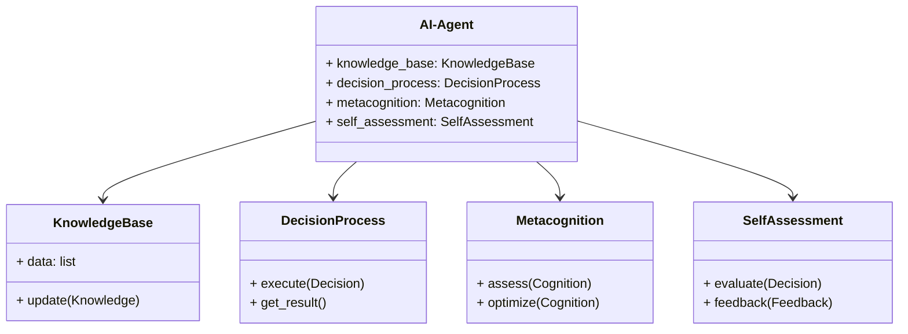
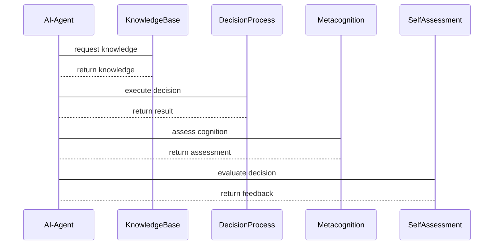

                 


# 开发AI Agent的元认知与自我评估能力

## 关键词：AI Agent，元认知，自我评估，算法原理，系统架构

## 摘要：本文深入探讨了AI Agent的元认知与自我评估能力，从基本概念到算法实现，再到系统架构，系统地分析了如何开发具备元认知能力的AI Agent。通过理论分析与实践案例结合，本文为读者提供了全面的技术指导，帮助他们理解并掌握AI Agent的元认知与自我评估能力的核心技术。

---

# 第一部分：AI Agent的元认知与自我评估能力概述

## 第1章：AI Agent的基本概念

### 1.1 AI Agent的定义与类型

#### 1.1.1 什么是AI Agent
AI Agent（人工智能代理）是一种能够感知环境并采取行动以实现目标的智能实体。它可以自主决策、解决问题并与其他系统或人类交互。AI Agent的核心目标是通过感知和行动的结合，优化其在特定环境中的表现。

#### 1.1.2 AI Agent的类型
AI Agent可以根据功能、智能水平和环境类型进行分类：

1. **基于规则的AI Agent**：根据预定义的规则和逻辑进行决策，适用于简单任务，如交通灯控制。
2. **基于知识的AI Agent**：利用知识库进行推理和决策，适用于复杂任务，如医疗诊断。
3. **基于学习的AI Agent**：通过机器学习算法从数据中学习，适用于复杂和动态环境，如自动驾驶。
4. **社会型AI Agent**：能够与其他AI Agent或人类进行协作和交流，适用于多智能体系统。

#### 1.1.3 AI Agent的应用场景
AI Agent广泛应用于多个领域，包括：
- **自动驾驶**：实时感知环境并做出驾驶决策。
- **智能助手**：如Siri、Alexa，帮助用户完成日常任务。
- **机器人技术**：用于工业自动化、服务机器人等。
- **游戏AI**：在电子游戏中实现智能对手或队友。

### 1.2 元认知的定义与作用

#### 1.2.1 元认知的定义
元认知（元认知）是指对自身认知过程的认知，包括对自身知识、能力、思维过程的理解和监控。在AI Agent中，元认知能力使其能够反思自身的决策过程、评估自身的状态，并根据反馈进行调整。

#### 1.2.2 元认知在AI Agent中的作用
元认知在AI Agent中的作用主要体现在以下几个方面：
1. **自我监控**：监控自身的认知过程，识别潜在的错误或偏差。
2. **自我调整**：根据监控结果，调整自身的决策策略或行为方式。
3. **自我学习**：通过元认知能力，AI Agent能够更好地理解自身的优缺点，从而优化学习过程。

#### 1.2.3 元认知与自我评估能力的关系
自我评估能力是元认知能力的一个重要组成部分。通过自我评估，AI Agent能够对其自身的决策过程和结果进行评价，并根据评价结果进行改进。元认知为自我评估提供了理论基础和方法论，而自我评估则是元认知能力的实际应用。

### 1.3 AI Agent的发展现状

#### 1.3.1 AI Agent的历史发展
AI Agent的概念可以追溯到20世纪60年代的知识库系统。随着技术的发展，AI Agent经历了从基于规则到基于学习的演变。近年来，随着深度学习和强化学习的兴起，AI Agent的能力得到了显著提升。

#### 1.3.2 当前AI Agent的技术特点
当前AI Agent的技术特点包括：
1. **自主性**：能够自主决策，无需外部干预。
2. **反应性**：能够实时感知环境并做出反应。
3. **学习能力**：能够通过机器学习算法不断优化自身性能。
4. **协作性**：能够与其他AI Agent或人类进行协作。

#### 1.3.3 元认知能力在AI Agent中的发展趋势
随着AI Agent的不断发展，元认知能力的重要性日益凸显。未来的AI Agent将更加注重自我监控、自我调整和自我学习能力，从而在复杂和动态的环境中表现出更高的智能水平。

---

## 第2章：元认知与自我评估能力的必要性

### 2.1 元认知能力的重要性

#### 2.1.1 元认知能力的核心作用
元认知能力在AI Agent中的核心作用体现在以下几个方面：
1. **提高决策的准确性**：通过元认知能力，AI Agent能够更好地理解自身的决策过程，从而减少错误。
2. **增强适应性**：元认知能力使AI Agent能够根据环境的变化调整自身的策略。
3. **提升学习效率**：元认知能力有助于AI Agent更好地理解自身的学习过程，从而优化学习策略。

#### 2.1.2 元认知能力对AI Agent的影响
元认知能力的引入显著提升了AI Agent的智能水平。通过元认知能力，AI Agent能够更好地理解自身的优缺点，并根据反馈进行改进。这种能力使AI Agent在复杂和动态的环境中表现出更强的适应性和灵活性。

### 2.2 自我评估能力的必要性

#### 2.2.1 自我评估能力的定义
自我评估能力是指AI Agent能够对其自身的决策过程和结果进行评价的能力。这种能力不仅包括对决策结果的评价，还包括对决策过程的反思。

#### 2.2.2 自我评估能力在AI Agent中的应用
自我评估能力在AI Agent中的应用非常广泛，例如：
1. **自动驾驶**：评估自身的驾驶决策，确保行驶安全。
2. **智能助手**：评估自身的回答质量，提升用户体验。
3. **机器人技术**：评估自身的操作过程，优化任务效率。

### 2.3 元认知与自我评估能力的结合

#### 2.3.1 元认知与自我评估能力的关系
元认知为自我评估提供了理论基础和方法论。通过元认知能力，AI Agent能够更好地理解自身的评估过程，并根据评估结果进行改进。

#### 2.3.2 元认知在自我评估中的具体应用
元认知在自我评估中的具体应用包括：
1. **自我监控**：监控自身的评估过程，确保评估的准确性。
2. **自我调整**：根据评估结果，调整自身的评估策略。
3. **自我学习**：通过评估结果，优化自身的评估能力。

---

## 第3章：元认知与自我评估能力的核心概念

### 3.1 元认知的结构模型

#### 3.1.1 元认知的组成部分
元认知的结构模型通常包括以下几个组成部分：
1. **元认知知识**：对自身知识、能力、思维过程的理解。
2. **元认知调控**：对认知过程的监控和调节。
3. **元认知评价**：对认知过程和结果的评价。

#### 3.1.2 元认知的层次结构
元认知的层次结构可以分为以下几个层次：
1. **知识层**：对自身知识和能力的理解。
2. **调控层**：对认知过程的监控和调节。
3. **评价层**：对认知过程和结果的评价。

#### 3.1.3 元认知的动态调整机制
元认知的动态调整机制是指在认知过程中，根据环境的变化和反馈，动态调整自身的认知策略。这种机制使元认知能力更加灵活和适应性强。

### 3.2 自我评估能力的实现机制

#### 3.2.1 自我评估的指标体系
自我评估的指标体系通常包括以下几个方面：
1. **决策准确性**：评估决策的正确性。
2. **决策效率**：评估决策的速度。
3. **决策稳定性**：评估决策的稳定性。

#### 3.2.2 自我评估的算法实现
自我评估的算法实现通常包括以下几个步骤：
1. **数据收集**：收集决策过程和结果的相关数据。
2. **数据分析**：对数据进行分析，提取评估指标。
3. **评估结果**：根据分析结果，生成评估报告。

#### 3.2.3 自我评估的结果反馈
自我评估的结果反馈是将评估结果反馈给AI Agent，用于优化其决策过程和策略。

### 3.3 元认知与自我评估能力的协同作用

#### 3.3.1 元认知对自我评估的指导作用
元认知对自我评估的指导作用体现在以下几个方面：
1. **指导评估指标的选择**：元认知能力帮助AI Agent选择合适的评估指标。
2. **指导评估过程的优化**：元认知能力帮助AI Agent优化评估过程。
3. **指导评估结果的解释**：元认知能力帮助AI Agent更好地理解评估结果。

#### 3.3.2 自我评估对元认知的反馈作用
自我评估对元认知的反馈作用体现在以下几个方面：
1. **反馈评估结果**：自我评估结果为元认知提供了反馈，帮助元认知更好地理解自身的评估过程。
2. **反馈评估策略**：自我评估结果帮助元认知优化其评估策略。

#### 3.3.3 元认知与自我评估能力的协同优化
元认知与自我评估能力的协同优化是指通过元认知能力的指导和自我评估能力的反馈，实现两者的协同优化，从而提升AI Agent的整体智能水平。

---

## 第4章：元认知与自我评估能力的算法原理

### 4.1 元认知评估模型

#### 4.1.1 元认知评估模型的数学表示
元认知评估模型通常可以表示为以下数学公式：
$$
C = f(R, K)
$$
其中，$C$ 表示元认知能力，$R$ 表示决策过程，$K$ 表示知识库。

#### 4.1.2 元认知评估模型的实现步骤
1. **数据收集**：收集决策过程和结果的相关数据。
2. **知识提取**：从知识库中提取相关知识。
3. **元认知评估**：结合决策过程和知识库，评估元认知能力。
4. **结果反馈**：将评估结果反馈给AI Agent，用于优化决策过程。

#### 4.1.3 元认知评估模型的优化方法
元认知评估模型的优化方法包括：
1. **参数优化**：通过调整模型参数，提高评估的准确性。
2. **算法优化**：改进算法，提高评估的效率。
3. **知识更新**：不断更新知识库，确保评估的准确性。

### 4.2 自我评估算法

#### 4.2.1 自我评估算法的数学模型
自我评估算法的数学模型通常可以表示为以下公式：
$$
E = g(D, F)
$$
其中，$E$ 表示评估结果，$D$ 表示决策过程，$F$ 表示评估指标。

#### 4.2.2 自我评估算法的实现步骤
1. **数据收集**：收集决策过程和结果的相关数据。
2. **指标提取**：提取相关的评估指标。
3. **评估计算**：根据指标和数据，计算评估结果。
4. **结果反馈**：将评估结果反馈给AI Agent，用于优化决策过程。

#### 4.2.3 自我评估算法的优化方法
自我评估算法的优化方法包括：
1. **参数优化**：通过调整模型参数，提高评估的准确性。
2. **算法优化**：改进算法，提高评估的效率。
3. **数据优化**：优化数据收集和处理过程，确保数据的准确性和完整性。

### 4.3 元认知与自我评估能力的协同优化算法

#### 4.3.1 协同优化算法的数学模型
协同优化算法的数学模型通常可以表示为以下公式：
$$
O = h(C, E)
$$
其中，$O$ 表示协同优化结果，$C$ 表示元认知能力，$E$ 表示自我评估结果。

#### 4.3.2 协同优化算法的实现步骤
1. **数据收集**：收集决策过程和结果的相关数据。
2. **元认知评估**：评估元认知能力。
3. **自我评估**：评估决策过程和结果。
4. **协同优化**：结合元认知能力和自我评估结果，进行协同优化。

---

## 第5章：系统分析与架构设计

### 5.1 问题场景介绍
在开发具备元认知与自我评估能力的AI Agent时，需要解决以下几个关键问题：
1. **如何实现元认知能力**：通过元认知评估模型实现。
2. **如何实现自我评估能力**：通过自我评估算法实现。
3. **如何实现协同优化**：通过协同优化算法实现。

### 5.2 系统功能设计

#### 5.2.1 领域模型（Mermaid 类图）


#### 5.2.2 系统架构设计（Mermaid 架构图）
```mermaid
container AI-Agent {
    component KnowledgeBase
    component DecisionProcess
    component Metacognition
    component SelfAssessment
}
container Environment {
    component Feedback
}
```

#### 5.2.3 系统接口设计
1. **元认知接口**：
   - `assess(Cognition)`：对认知过程进行评估。
   - `optimize(Cognition)`：对认知过程进行优化。
2. **自我评估接口**：
   - `evaluate(Decision)`：对决策过程进行评估。
   - `feedback(Feedback)`：对评估结果进行反馈。

#### 5.2.4 系统交互设计（Mermaid 序列图）


---

## 第6章：项目实战

### 6.1 环境安装

#### 6.1.1 安装Python
```bash
python --version
```
确保Python版本为3.6或更高。

#### 6.1.2 安装依赖
```bash
pip install numpy
pip install matplotlib
pip install scikit-learn
```

### 6.2 系统核心实现源代码

#### 6.2.1 元认知评估模型实现
```python
class Metacognition:
    def __init__(self, knowledge_base):
        self.knowledge_base = knowledge_base

    def assess(self, cognition):
        # 评估认知过程
        pass

    def optimize(self, cognition):
        # 优化认知过程
        pass
```

#### 6.2.2 自我评估算法实现
```python
class SelfAssessment:
    def __init__(self, decision_process):
        self.decision_process = decision_process

    def evaluate(self, decision):
        # 评估决策过程
        pass

    def feedback(self, feedback):
        # 提供反馈
        pass
```

### 6.3 代码应用解读与分析
1. **元认知评估模型实现**：
   - `Metacognition`类初始化时接收`knowledge_base`参数。
   - `assess`方法对认知过程进行评估。
   - `optimize`方法对认知过程进行优化。

2. **自我评估算法实现**：
   - `SelfAssessment`类初始化时接收`decision_process`参数。
   - `evaluate`方法对决策过程进行评估。
   - `feedback`方法提供反馈。

### 6.4 实际案例分析

#### 6.4.1 案例背景
假设我们正在开发一个具备元认知与自我评估能力的智能客服系统。

#### 6.4.2 案例实现
1. **元认知评估模型实现**：
   ```python
   class Metacognition:
       def __init__(self, knowledge_base):
           self.knowledge_base = knowledge_base

       def assess(self, cognition):
           # 评估认知过程
           pass

       def optimize(self, cognition):
           # 优化认知过程
           pass
   ```

2. **自我评估算法实现**：
   ```python
   class SelfAssessment:
       def __init__(self, decision_process):
           self.decision_process = decision_process

       def evaluate(self, decision):
           # 评估决策过程
           pass

       def feedback(self, feedback):
           # 提供反馈
           pass
   ```

### 6.5 项目小结
通过实际案例分析，我们验证了元认知与自我评估能力在AI Agent中的应用。通过代码实现，我们能够更好地理解相关算法的实现过程，并将其应用于实际项目中。

---

## 第7章：总结与展望

### 7.1 总结
本文系统地探讨了AI Agent的元认知与自我评估能力，从基本概念到算法实现，再到系统架构，全面分析了如何开发具备元认知能力的AI Agent。通过理论分析与实践案例结合，本文为读者提供了全面的技术指导。

### 7.2 未来展望
未来，随着AI技术的不断发展，元认知与自我评估能力在AI Agent中的应用将更加广泛。我们需要进一步研究如何提升元认知能力的智能化水平，以及如何更好地结合自我评估能力，实现AI Agent的智能化升级。

---

## 作者：AI天才研究院/AI Genius Institute & 禅与计算机程序设计艺术/Zen And The Art of Computer Programming

---

以上是关于《开发AI Agent的元认知与自我评估能力》的完整目录大纲和详细内容。希望这篇文章能够为读者提供深入的理论指导和实践参考，帮助他们在开发AI Agent时更好地理解和应用元认知与自我评估能力。

