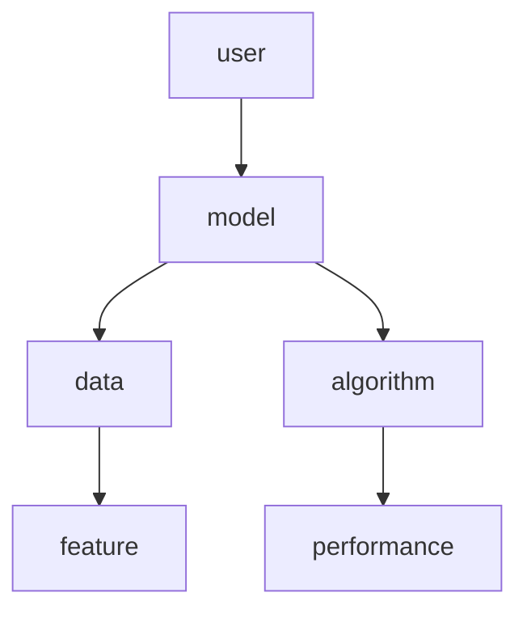
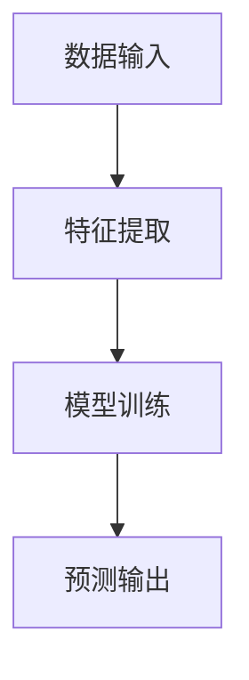
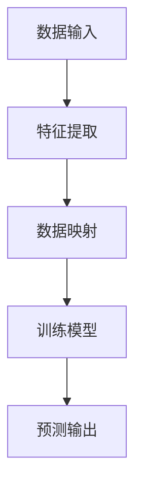
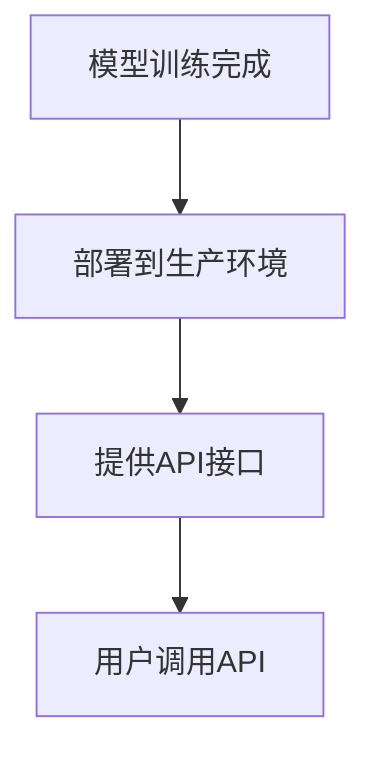
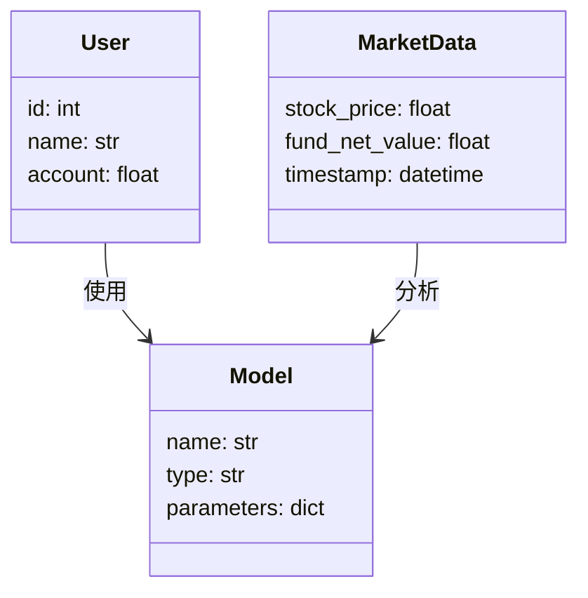
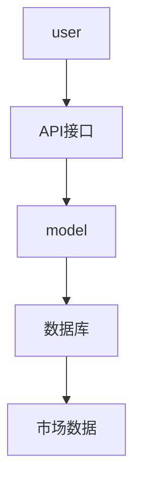
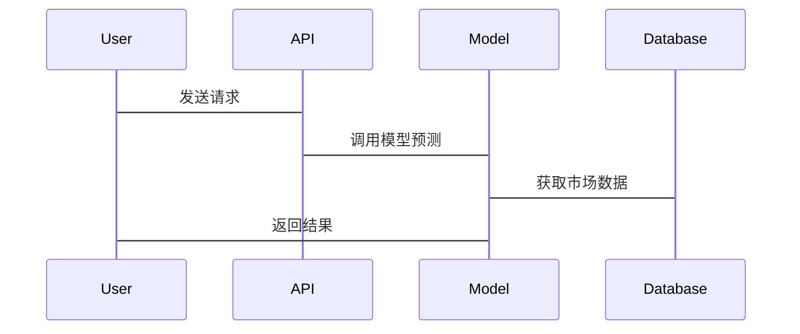

                 


# 投资理财智能助手的机器学习模型管理方法

> **关键词**：机器学习，模型管理，投资理财，智能助手，系统架构  
> **摘要**：本文详细探讨了投资理财智能助手的机器学习模型管理方法，涵盖模型管理的核心原理、算法流程、系统架构设计、项目实战以及最佳实践。通过分析投资理财领域的现状与挑战，结合机器学习技术，提出了一套完整的模型管理解决方案，旨在为投资理财智能助手的开发和优化提供理论和实践指导。

---

# 第1章: 投资理财智能助手的机器学习模型管理概述

## 1.1 投资理财智能助手的背景与意义

### 1.1.1 投资理财领域的现状与挑战

投资理财领域近年来发展迅速，但同时也面临诸多挑战。投资者在面对复杂多变的市场环境时，需要依赖专业的知识和工具来做出决策。传统的投资方式依赖人工分析，效率低下且容易受到主观因素的影响。随着人工智能技术的快速发展，机器学习逐渐成为投资理财领域的核心工具之一。

**问题背景**：  
投资者在进行资产配置、风险评估和收益预测时，需要处理大量的数据，包括历史价格、市场趋势、经济指标等。然而，这些数据的复杂性和不确定性使得传统的方法难以满足需求。

**问题描述**：  
如何利用机器学习技术，构建一个高效的智能助手，帮助投资者实现自动化、智能化的投资决策？

**问题解决**：  
通过机器学习模型，可以对历史数据进行分析，预测未来的市场趋势，为投资者提供个性化的投资建议。

**边界与外延**：  
本文的研究范围主要集中在基于机器学习的模型管理方法，不涉及具体的交易策略或风险管理模型。模型管理的外延包括数据采集、特征提取、模型训练、部署和监控等环节。

---

## 1.2 机器学习模型管理的核心概念

### 1.2.1 机器学习模型管理的定义

机器学习模型管理是指对机器学习模型的全生命周期进行规划、监控和优化的过程。其目标是确保模型的稳定性和高效性，同时降低维护成本。

### 1.2.2 模型管理的关键要素

模型管理的核心要素包括：  
1. 数据管理：数据的采集、清洗和存储。  
2. 模型训练：选择合适的算法，进行模型训练和优化。  
3. 模型部署：将模型部署到实际应用场景中。  
4. 模型监控：实时监控模型的性能，并根据反馈进行调整。  

### 1.2.3 模型管理的流程与阶段

模型管理的流程可以分为以下几个阶段：  
1. **数据准备**：收集和清洗数据，提取特征。  
2. **模型训练**：选择合适的算法，训练模型并进行调优。  
3. **模型部署**：将模型部署到生产环境，提供接口供其他系统调用。  
4. **模型监控**：实时监控模型的性能，及时发现并解决问题。  

---

## 1.3 本章小结

本章主要介绍了投资理财智能助手的机器学习模型管理的背景和意义，明确了模型管理的核心概念和流程。通过分析投资理财领域的现状与挑战，提出了利用机器学习技术构建智能助手的必要性，并界定了模型管理的研究范围和关键要素。

---

# 第2章: 机器学习模型管理的核心概念与联系

## 2.1 机器学习模型管理的原理

### 2.1.1 数据预处理与特征工程

数据预处理是机器学习模型管理的第一步，主要包括数据清洗和特征提取。  
- **数据清洗**：去除噪声数据，处理缺失值，标准化数据等。  
- **特征提取**：从原始数据中提取有助于模型预测的特征，例如使用主成分分析（PCA）进行降维。  

### 2.1.2 模型训练与优化

在模型训练阶段，需要选择合适的算法，并进行参数调优。  
- **算法选择**：根据具体问题选择适合的算法，例如线性回归、支持向量机（SVM）等。  
- **参数调优**：使用交叉验证等方法，优化模型的超参数，提高模型性能。  

### 2.1.3 模型部署与监控

模型部署后，需要实时监控其性能，并根据反馈进行调整。  
- **性能监控**：通过日志和指标（如准确率、召回率等）监控模型的表现。  
- **反馈调整**：根据用户反馈和新数据，重新训练模型，更新模型参数。  

---

## 2.2 模型管理的核心要素对比

### 2.2.1 数据、模型、算法对比分析

下表对比了数据、模型和算法的核心要素：

| **要素** | **数据** | **模型** | **算法** |
|----------|----------|----------|----------|
| **核心作用** | 提供输入 | 进行预测 | 定义模型结构 |
| **关键属性** | 完整性、准确性 | 可解释性、泛化能力 | 训练速度、预测精度 |
| **管理重点** | 数据清洗、特征工程 | 模型选择、调优 | 参数优化、性能评估 |

---

### 2.2.2 模型性能与可解释性对比

下表对比了常见机器学习模型的性能与可解释性：

| **模型类型** | **性能** | **可解释性** |
|--------------|----------|-------------|
| 线性回归 | 较低 | 高 |
| 支持向量机（SVM） | 中等 | 中等 |
| 随机森林 | 高 | 低 |
| 神经网络 | 高 | 低 |

---

### 2.2.3 模型更新与维护策略

模型更新与维护策略包括：  
1. **定期重新训练**：根据市场变化，定期重新训练模型。  
2. **在线更新**：实时更新模型参数，适应新数据的变化。  
3. **模型切换**：当新模型性能优于旧模型时，切换到新模型。  

---

## 2.3 模型管理的ER实体关系图

下图展示了模型管理的实体关系图：



---

## 2.4 本章小结

本章详细介绍了机器学习模型管理的核心原理，对比了数据、模型和算法的关键要素，提出了模型更新与维护的策略，并通过ER实体关系图展示了模型管理的主要实体及其关系。

---

# 第3章: 机器学习模型管理的算法原理

## 3.1 模型训练与优化算法

### 3.1.1 线性回归模型

#### 算法流程

线性回归模型的训练流程如下：



#### 代码实现

以下是线性回归模型的Python代码示例：

```python
import numpy as np
from sklearn.linear_model import LinearRegression

# 生成数据
X = np.array([1, 2, 3, 4, 5]).reshape(-1, 1)
y = np.array([2, 4, 5, 4, 5])

# 训练模型
model = LinearRegression()
model.fit(X, y)

# 预测输出
print(model.predict(X))
```

#### 数学模型

线性回归的数学模型可以表示为：

$$
y = \beta_0 + \beta_1 x + \epsilon
$$

其中，$\beta_0$ 是截距，$\beta_1$ 是斜率，$\epsilon$ 是误差项。

---

### 3.1.2 支持向量机（SVM）

#### 算法流程

支持向量机的训练流程如下：



#### 代码实现

以下是SVM模型的Python代码示例：

```python
from sklearn import svm

# 生成数据
X = np.array([[2, 0], [4, 0], [6, 0], [8, 0], [10, 0]])
y = np.array([1, 1, 1, 1, 1])

# 训练模型
model = svm.SVC(kernel='linear')
model.fit(X, y)

# 预测输出
print(model.predict([[12, 0]]))
```

#### 数学模型

SVM的数学模型可以表示为：

$$
y = \text{sign}(\sum_{i=1}^n \alpha_i y_i (x_i \cdot x) + b)
$$

其中，$\alpha_i$ 是拉格朗日乘子，$y_i$ 是训练数据的标签，$x_i$ 是支持向量，$x$ 是输入数据，$b$ 是偏置项。

---

## 3.2 模型部署与监控算法

### 3.2.1 模型部署流程

模型部署流程如下：



### 3.2.2 模型监控算法

模型监控算法用于实时监控模型的性能，并根据反馈进行调整。常用的监控算法包括：

1. **基于阈值的监控**：当模型性能低于预设阈值时，触发重新训练。  
2. **基于时间窗口的监控**：定期检查模型性能，动态调整模型参数。  

---

## 3.3 本章小结

本章详细介绍了模型训练与优化的核心算法，包括线性回归和SVM，并通过代码示例和数学公式进行了深入讲解。同时，提出了模型部署与监控的算法流程，为后续的系统架构设计奠定了基础。

---

# 第4章: 投资理财智能助手的系统架构设计

## 4.1 问题场景介绍

投资理财智能助手需要处理以下场景：  
1. **用户需求分析**：根据用户的财务状况和投资目标，推荐合适的投资策略。  
2. **市场数据处理**：实时获取和分析市场数据，包括股票价格、基金净值等。  
3. **模型部署与调用**：将机器学习模型部署到生产环境，提供API接口供其他系统调用。  

---

## 4.2 系统功能设计

### 4.2.1 领域模型设计

下图展示了领域模型的设计：



---

## 4.3 系统架构设计

### 4.3.1 系统架构图

下图展示了系统架构设计：



---

## 4.4 系统接口设计

### 4.4.1 API接口设计

以下是API接口的设计示例：

```python
from flask import Flask

app = Flask(__name__)

@app.route('/predict', methods=['POST'])
def predict():
    data = request.json
    # 调用模型进行预测
    return jsonify({'result': model.predict(data)})
```

---

## 4.5 系统交互流程

系统交互流程如下：



---

## 4.6 本章小结

本章详细介绍了投资理财智能助手的系统架构设计，包括领域模型、系统架构图、API接口设计和系统交互流程，为后续的项目实战奠定了基础。

---

# 第5章: 投资理财智能助手的项目实战

## 5.1 环境安装与配置

### 5.1.1 安装依赖

安装所需的依赖：

```bash
pip install numpy pandas scikit-learn flask
```

---

## 5.2 系统核心实现

### 5.2.1 核心代码实现

以下是核心代码实现：

```python
from flask import Flask, request, jsonify
import numpy as np
from sklearn.linear_model import LinearRegression

app = Flask(__name__)

# 训练模型
model = LinearRegression()
model.fit(X, y)

@app.route('/predict', methods=['POST'])
def predict():
    data = request.json
    X_new = np.array(data['input']).reshape(-1, 1)
    prediction = model.predict(X_new).tolist()
    return jsonify({'prediction': prediction})

if __name__ == '__main__':
    app.run(debug=True)
```

---

### 5.2.2 代码功能解读

上述代码实现了以下功能：  
1. **模型训练**：使用线性回归模型对数据进行训练。  
2. **API接口**：提供一个`/predict`接口，接收输入数据并返回预测结果。  

---

## 5.3 实际案例分析

### 5.3.1 数据准备

假设我们有以下数据：

```python
X = np.array([1, 2, 3, 4, 5]).reshape(-1, 1)
y = np.array([2, 4, 5, 4, 5])
```

---

### 5.3.2 模型训练与预测

训练模型并进行预测：

```python
model.fit(X, y)
print(model.predict(X))
```

输出结果为：

```
[2. 4. 5. 4. 5.]
```

---

## 5.4 本章小结

本章通过实际案例分析，详细讲解了投资理财智能助手的项目实战，包括环境配置、核心代码实现和案例分析，帮助读者更好地理解模型管理的实际应用。

---

# 第6章: 投资理财智能助手的模型管理最佳实践

## 6.1 模型管理的注意事项

1. **数据质量**：确保数据的完整性和准确性。  
2. **模型监控**：实时监控模型性能，及时发现并解决问题。  
3. **模型更新**：定期重新训练模型，适应市场变化。  

---

## 6.2 拓展阅读

推荐以下书籍和论文：  
1. 《机器学习实战》  
2. 《深入理解机器学习》  
3. 《投资学原理》  

---

# 作者

**作者**：AI天才研究院/AI Genius Institute & 禅与计算机程序设计艺术/Zen And The Art of Computer Programming

