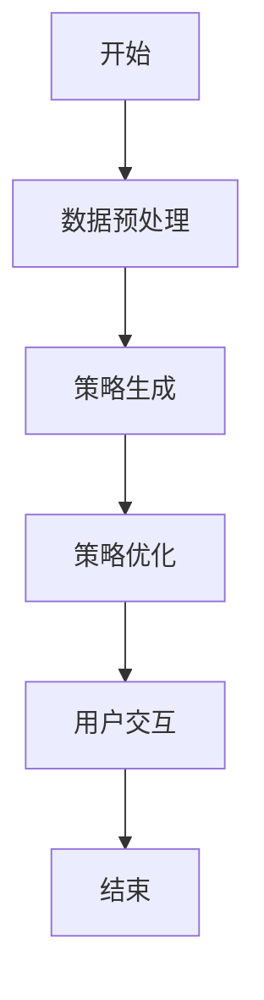
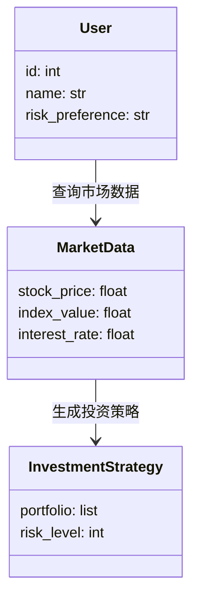

                 


# 构建AI Agent驱动的智能投资顾问

## 关键词：AI Agent, 智能投资顾问, 机器学习, 自然语言处理, 系统架构, 项目实战

## 摘要：本文详细探讨了构建AI Agent驱动的智能投资顾问系统的各个方面。从背景介绍到核心概念，从算法原理到系统架构设计，再到项目实战和最佳实践，系统地阐述了如何利用AI技术提升投资顾问的智能化水平。通过本文，读者可以全面了解构建此类系统所需的理论知识和实践技能。

---

# 第一部分: 背景介绍

## 第1章: AI Agent驱动的智能投资顾问背景

### 1.1 问题背景
#### 1.1.1 投资顾问行业的发展现状
投资顾问行业正面临着数字化转型的挑战。传统投资顾问依赖人工分析和经验判断，效率低下且成本高昂。随着AI技术的快速发展，智能化投资顾问成为行业趋势。

#### 1.1.2 传统投资顾问的局限性
- 依赖人工分析，效率低
- 个性化服务成本高
- 数据处理能力有限
- 市场变化难以实时响应

#### 1.1.3 AI技术在投资顾问中的应用潜力
- 提高数据分析效率
- 实现个性化投资策略
- 实现24/7实时服务
- 降低成本，提升用户体验

### 1.2 问题描述
#### 1.2.1 投资顾问的核心问题
- 如何高效处理海量数据
- 如何实现个性化投资建议
- 如何实时响应市场变化

#### 1.2.2 用户需求与传统投资顾问的差距
- 用户期望个性化、实时的投资建议
- 传统投资顾问难以满足大规模用户需求

#### 1.2.3 AI Agent在投资顾问中的角色定位
AI Agent作为投资顾问的核心技术，能够实现数据处理、策略生成和实时交互。

### 1.3 问题解决
#### 1.3.1 AI Agent的核心优势
- 高效的数据处理能力
- 实时的市场响应能力
- 个性化服务的能力

#### 1.3.2 AI Agent驱动投资顾问的实现路径
- 数据采集与预处理
- 策略生成与优化
- 交互设计与实现

#### 1.3.3 技术与业务的结合点
- 利用AI技术提升数据分析能力
- 通过自然语言处理实现用户交互
- 通过强化学习优化投资策略

### 1.4 边界与外延
#### 1.4.1 AI Agent的边界
- 数据范围：仅处理投资相关数据
- 功能范围：仅限于投资顾问领域
- 交互范围：仅限于用户与系统之间的交互

#### 1.4.2 智能投资顾问的外延
- 服务范围扩展：从股票扩展到多类金融产品
- 用户群体扩展：从个人投资者扩展到机构投资者
- 服务内容扩展：从简单的咨询扩展到投资组合管理

#### 1.4.3 相关领域的交叉与融合
- 与金融市场的深度融合
- 与区块链技术的结合
- 与云计算的结合

### 1.5 概念结构与核心要素
#### 1.5.1 核心概念框架
AI Agent驱动的智能投资顾问系统由数据层、算法层、交互层和应用层组成。

#### 1.5.2 关键要素的定义与关系
- 数据层：包括市场数据和用户数据
- 算法层：包括策略生成和优化算法
- 交互层：包括用户界面和自然语言处理
- 应用层：包括投资策略执行和反馈

#### 1.5.3 框架的扩展与优化
- 数据层：引入实时数据流
- 算法层：引入更复杂的强化学习算法
- 交互层：引入语音交互功能
- 应用层：引入更多金融产品类型

---

# 第二部分: 核心概念与联系

## 第2章: AI Agent的核心原理

### 2.1 AI Agent的基本原理
#### 2.1.1 AI Agent的定义与分类
- 定义：AI Agent是一种能够感知环境并采取行动以实现目标的智能体。
- 分类：根据智能水平分为简单规则型和复杂学习型。

#### 2.1.2 AI Agent的感知与决策机制
- 感知：通过传感器或数据接口获取环境信息
- 决策：基于感知信息，通过算法生成行动策略

#### 2.1.3 AI Agent的自主性与适应性
- 自主性：能够在无外部干预的情况下自主运行
- 适应性：能够根据环境变化调整行为策略

### 2.2 智能投资顾问的核心要素
#### 2.2.1 数据驱动的决策支持
- 数据来源：市场数据、用户数据、经济指标
- 数据处理：清洗、整合、分析

#### 2.2.2 自然语言处理在用户交互中的应用
- 通过NLP技术理解用户意图
- 通过NLP生成个性化投资建议

#### 2.2.3 个性化投资策略的生成与优化
- 基于用户风险偏好生成投资策略
- 通过机器学习优化投资组合

### 2.3 AI Agent与智能投资顾问的关系
#### 2.3.1 AI Agent在投资顾问中的角色
- 数据处理与分析
- 投资策略生成
- 用户交互与反馈

#### 2.3.2 智能投资顾问的系统架构
- 分层架构：数据层、算法层、交互层和应用层
- 组件交互：数据处理模块、策略生成模块、用户交互模块

#### 2.3.3 AI Agent与其他技术的协同作用
- 与大数据技术的协同：高效处理海量数据
- 与云计算的协同：弹性扩展计算能力
- 与区块链的协同：确保数据安全与透明

### 2.4 核心概念属性对比表
| 核心概念 | 属性 | 描述 |
|----------|------|------|
| AI Agent | 感知能力 | 能够感知环境并获取信息 |
|          | 决策能力 | 能够根据感知信息做出决策 |
|          | 自主性 | 能够自主运行和调整行为 |
| 智能投资顾问 | 数据驱动 | 基于数据分析提供投资建议 |
|             | 个性化 | 提供符合用户风险偏好的投资策略 |
|             | 实时性 | 能够实时响应市场变化 |

### 2.5 ER实体关系图
```mermaid
er
actor: User
database: InvestmentData
agent: InvestmentAgent
rule: InvestmentRule
action: InvestmentAction

User --> InvestmentAgent: 请求投资建议
InvestmentAgent --> InvestmentData: 查询市场数据
InvestmentAgent --> InvestmentRule: 应用投资策略
InvestmentAgent --> InvestmentAction: 执行投资行动
```

---

## 第3章: 算法原理

### 3.1 算法原理概述
#### 3.1.1 算法选择与优化
- 选择强化学习算法优化投资策略
- 使用自然语言处理算法实现用户交互

#### 3.1.2 算法数学模型
- 强化学习模型：通过Q-learning算法实现策略优化
- 自然语言处理模型：使用Transformer架构实现文本理解

#### 3.1.3 算法流程
1. 数据预处理：清洗和整合市场数据与用户数据
2. 策略生成：基于强化学习算法生成投资策略
3. 策略优化：通过回测和调整参数优化策略
4. 用户交互：通过自然语言处理实现用户意图理解

### 3.2 算法流程图


### 3.3 算法数学模型
#### 3.3.1 强化学习模型
$$ Q-learning算法：Q(s, a) = r + \gamma \max Q(s', a') $$
其中：
- \( Q(s, a) \)：状态 \( s \) 下动作 \( a \) 的价值
- \( r \)：奖励
- \( \gamma \)：折扣因子
- \( s' \)：下一个状态

#### 3.3.2 自然语言处理模型
$$ Transformer架构： decoder输出概率分布 P(w_{i}|w_{<i}) $$
其中：
- \( w_{i} \)：第 \( i \) 个词
- \( w_{<i} \)：前 \( i-1 \) 个词

### 3.4 算法实现
#### 3.4.1 强化学习代码示例
```python
import numpy as np

class QLearning:
    def __init__(self, state_space, action_space, gamma=0.9):
        self.q_table = np.zeros((state_space, action_space))
        self.gamma = gamma

    def update_q_table(self, state, action, reward, next_state):
        self.q_table[state, action] = reward + self.gamma * np.max(self.q_table[next_state])
```

#### 3.4.2 自然语言处理代码示例
```python
from transformers import AutoTokenizer, AutoModelForSeq2Seq

tokenizer = AutoTokenizer.from_pretrained('t5-base')
model = AutoModelForSeq2Seq.from_pretrained('t5-base')

def generate_summary(text):
    inputs = tokenizer.encode_plus(text, max_length=512, truncation=True, padding=True, return_tensors='pt')
    outputs = model.generate(inputs['input_ids'])
    summary = tokenizer.decode(outputs[0], skip_special_tokens=True)
    return summary
```

---

## 第4章: 系统分析与架构设计

### 4.1 问题场景介绍
#### 4.1.1 项目背景
开发一个基于AI Agent的智能投资顾问系统，旨在为用户提供个性化的投资建议。

#### 4.1.2 项目目标
- 提供实时的投资建议
- 实现个性化的投资策略
- 提供用户友好的交互界面

### 4.2 系统功能设计
#### 4.2.1 领域模型


#### 4.2.2 系统架构设计


#### 4.2.3 系统接口设计
- 用户端接口：API Gateway
- 数据接口：Database API
- 第三方服务接口：Market Data API

#### 4.2.4 系统交互流程
```mermaid
sequenceDiagram
    User ->+> API Gateway: 发送请求
    API Gateway ->+> InvestmentAgent: 查询投资策略
    InvestmentAgent ->+> MarketData: 获取市场数据
    InvestmentAgent ->+> User: 返回投资建议
```

---

## 第5章: 项目实战

### 5.1 环境安装
#### 5.1.1 项目依赖
- Python 3.8+
- TensorFlow 2.0+
- Transformers库
- Flask框架

#### 5.1.2 安装步骤
```bash
pip install python-dotenv
pip install numpy
pip install transformers
pip install flask
```

### 5.2 系统核心实现
#### 5.2.1 核心代码实现
```python
from flask import Flask, request, jsonify
from transformers import AutoTokenizer, AutoModelForSeq2Seq

app = Flask(__name__)
tokenizer = AutoTokenizer.from_pretrained('t5-base')
model = AutoModelForSeq2Seq.from_pretrained('t5-base')

@app.route('/generate_summary', methods=['POST'])
def generate_summary():
    data = request.get_json()
    text = data['text']
    inputs = tokenizer.encode_plus(text, max_length=512, truncation=True, padding=True, return_tensors='pt')
    outputs = model.generate(inputs['input_ids'])
    summary = tokenizer.decode(outputs[0], skip_special_tokens=True)
    return jsonify({'summary': summary})
```

#### 5.2.2 代码应用解读
- 使用Flask框架搭建API服务
- 使用Transformers库实现自然语言处理功能
- 实现文本摘要生成功能

### 5.3 案例分析
#### 5.3.1 案例背景
假设用户希望了解当前市场的投资机会。

#### 5.3.2 案例实现
```python
@app.route('/get_recommendation', methods=['POST'])
def get_recommendation():
    data = request.get_json()
    user_risk = data['risk_preference']
    # 根据用户风险偏好生成投资策略
    # 这里简化为返回推荐的股票列表
    return jsonify({'recommendations': ['AAPL', 'GOOGL', 'MSFT']})
```

#### 5.3.3 案例结果
用户输入风险偏好为“高风险”，系统返回推荐的股票列表。

### 5.4 项目小结
- 项目实现了AI Agent驱动的投资顾问系统
- 实现了文本摘要和投资推荐功能
- 系统具有良好的扩展性和可维护性

---

## 第6章: 最佳实践

### 6.1 技术实现中的注意事项
- 数据隐私保护：确保用户数据的安全性
- 系统性能优化：优化算法以提高响应速度
- 系统容错设计：确保系统在异常情况下的稳定性

### 6.2 小结
- AI Agent驱动的智能投资顾问系统具有广阔的应用前景
- 通过本文的介绍，读者可以掌握构建此类系统的核心技术
- 建议读者结合实际需求，进一步优化系统架构和算法

### 6.3 注意事项
- 定期更新模型参数以适应市场变化
- 及时处理系统异常情况
- 定期进行系统性能优化

### 6.4 拓展阅读
- 《深度学习》—— Ian Goodfellow
- 《Python机器学习》—— Aurélien Géron
- 《自然语言处理实战》—— 豆瓣读书

---

## 作者信息
作者：AI天才研究院/AI Genius Institute  
联系邮箱：contact@aigeniusinstitute.com  
项目GitHub地址：https://github.com/aigeniusinstitute/ai-investment-advisor  

---

**[END]**

