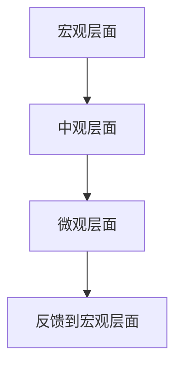
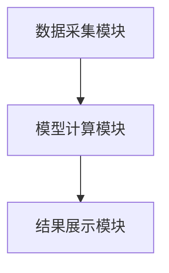

                 

# 费雪的长期增长潜力评估

## 关键词：费雪投资理论，长期增长潜力，投资评估，现金流贴现模型，增长率预测

## 摘要：本文深入探讨费雪的长期增长潜力评估方法，结合背景介绍、核心概念、算法原理、数学模型和实际案例分析，帮助读者理解如何评估投资标的的长期增长潜力。文章从基础概念出发，逐步深入，通过详细讲解和具体案例，提供一套系统化的评估框架，适用于金融投资和企业价值评估。

---

# 第1章 费雪投资理论与长期增长潜力概述

## 1.1 费雪投资理论的起源与发展

### 1.1.1 投资理论的历史演变

1. 早期投资理论：传统投资学派以价值评估为核心，关注企业的财务状况和市场估值。
2. 费雪的贡献：引入长期增长潜力概念，强调企业内在增长能力对投资价值的影响。
3. 现代发展：结合现代金融理论，如现金流贴现模型，进一步完善长期增长潜力评估方法。

### 1.1.2 费雪投资理论的核心思想

1. 企业的内在价值是未来现金流的现值。
2. 长期增长潜力是企业未来现金流增长的核心驱动因素。
3. 投资者应关注企业的成长性和盈利能力，而非短期市场波动。

### 1.1.3 长期增长潜力评估的定义与目标

1. **定义**：评估企业在未来较长一段时间内，能否实现持续且稳定的收入和利润增长。
2. **目标**：通过分析企业的市场地位、竞争优势、管理能力等因素，判断其未来的增长潜力，为投资决策提供依据。

## 1.2 长期增长潜力评估的背景与意义

### 1.2.1 经济环境变化对投资的影响

1. 经济周期波动：企业盈利能力受宏观经济环境影响，长期增长潜力评估需考虑周期性因素。
2. 技术进步：技术创新对企业增长潜力的影响日益显著。
3. 市场竞争格局：行业集中度、竞争强度等因素影响企业的增长空间。

### 1.2.2 投资者需求的变化

1. 投资者对长期收益的关注增加：机构投资者和个人投资者更倾向于寻找具有长期增长潜力的企业。
2. 个性化投资需求：投资者根据自身风险承受能力和收益目标，选择适合的长期增长潜力投资标的。

### 1.2.3 长期增长潜力评估的重要性

1. **投资决策依据**：帮助投资者识别具有长期增长潜力的企业，优化投资组合。
2. **风险控制工具**：通过评估企业未来增长能力，降低投资风险。
3. **企业估值基础**：长期增长潜力是企业估值的重要组成部分，影响企业市值的合理判断。

## 1.3 费雪投资理论与长期增长潜力的关系

### 1.3.1 费雪理论的核心要素

1. **内在价值**：企业未来现金流的现值。
2. **增长能力**：企业的市场地位、竞争优势、管理能力等因素决定其增长潜力。
3. **投资策略**：通过分析企业的增长潜力，制定长期投资策略。

### 1.3.2 长期增长潜力评估的逻辑框架

1. **企业分析**：从财务数据、市场地位、管理团队等方面分析企业的增长潜力。
2. **行业分析**：研究行业发展趋势、竞争格局，判断企业的行业地位。
3. **经济环境分析**：考虑宏观经济环境对企业增长的影响。

### 1.3.3 两者结合的必要性

1. **理论与实践结合**：费雪理论提供理论框架，长期增长潜力评估提供具体方法，两者结合有助于实现理论指导实践。
2. **动态调整**：长期增长潜力评估需要根据市场变化和企业发展动态进行调整，费雪理论提供了动态调整的思路。

## 1.4 本章小结

通过本章的介绍，我们了解了费雪投资理论的核心思想及其与长期增长潜力评估的关系，明确了长期增长潜力评估的背景和意义。接下来，我们将深入探讨长期增长潜力评估的核心概念和方法。

---

# 第2章 长期增长潜力评估的核心概念

## 2.1 长期增长潜力的定义与特征

### 2.1.1 长期增长潜力的定义

长期增长潜力是指企业在未来较长一段时间内，通过持续的业务发展和创新，实现收入和利润增长的能力。它不仅包括企业的当前盈利能力，还包括未来可能的增长空间。

### 2.1.2 长期增长潜力的特征

| 特征 | 描述 |
|------|------|
| 持续性 | 企业能够在较长的时间内保持稳定的增长 |
| 可测性 | 通过财务数据和市场分析可以量化评估 |
| 竞争性 | 在行业内具有竞争优势，能够抢占市场份额 |
| 风险性 | 受市场环境、行业竞争和技术变革等因素的影响 |

### 2.1.3 长期增长潜力与短期波动的关系

1. **短期波动**：市场环境、宏观经济等因素可能导致企业短期业绩波动。
2. **长期增长**：企业的长期增长潜力是基于其内在的竞争力和市场地位，能够抵御短期波动的影响。

## 2.2 费雪投资理论中的增长潜力评估

### 2.2.1 费雪理论中的增长潜力模型

1. **内在价值模型**：企业价值 = 未来现金流的现值。
2. **增长潜力模型**：企业未来现金流的增长速度取决于其增长潜力。

### 2.2.2 增长潜力评估的核心要素

1. **市场需求**：企业所处行业的市场规模和增长空间。
2. **竞争优势**：企业在市场中的竞争优势，包括成本优势、技术优势、品牌优势等。
3. **管理能力**：企业管理层的战略规划和执行能力。
4. **财务健康**：企业的财务状况，包括盈利能力、资产负债情况等。

### 2.2.3 增长潜力评估的边界与外延

1. **边界**：评估企业增长潜力时，需考虑行业天花板、政策环境等因素。
2. **外延**：增长潜力评估不仅关注企业当前的表现，还考虑未来可能的增长点，如技术创新、市场扩展等。

## 2.3 增长潜力评估的逻辑结构

### 2.3.1 评估逻辑的层次划分

1. **宏观层面**：行业趋势、经济环境。
2. **中观层面**：企业竞争优势、管理能力。
3. **微观层面**：财务数据、市场地位。

### 2.3.2 各层次之间的关系

1. 宏观层面影响中观层面：行业趋势和经济环境影响企业的竞争优势。
2. 中观层面影响微观层面：企业竞争优势和管理能力影响财务数据。
3. 微观层面反馈宏观层面：企业的财务表现和市场地位反哺行业趋势。

### 2.3.3 逻辑结构的可视化

## 2.4 本章小结

本章详细介绍了长期增长潜力的定义、特征以及与短期波动的关系，并结合费雪投资理论，分析了增长潜力评估的核心要素和逻辑结构。接下来，我们将探讨长期增长潜力评估的具体指标和方法。

---

# 第3章 长期增长潜力评估的指标与方法

## 3.1 增长潜力评估的主要指标

### 3.1.1 财务指标

| 指标 | 描述 |
|------|------|
| 净利润增长率 | 衡量企业盈利能力的增长情况 |
| 营收增长率 | 衡量企业收入增长情况 |
| 毛利率 | 衡量企业的成本控制能力 |
| 净利率 | 衡量企业的盈利能力 |

### 3.1.2 非财务指标

| 指标 | 描述 |
|------|------|
| 市场份额 | 衡量企业在市场中的地位 |
| 技术创新 | 衡量企业的技术优势 |
| 管理团队 | 衡量企业管理层的能力 |

### 3.1.3 综合指标

综合指标是将财务指标和非财务指标结合起来，通过加权平均等方式，得到一个综合评估指标。

### 3.1.4 指标权重的确定

1. **主观赋权法**：根据经验或专家意见确定指标权重。
2. **客观赋权法**：通过统计分析方法确定指标权重，如熵值法、主成分分析法等。

## 3.2 增长潜力评估的方法

### 3.2.1 定性分析法

1. **市场分析**：分析行业发展趋势、竞争格局等。
2. **企业分析**：分析企业的竞争优势、管理能力等。

### 3.2.2 定量分析法

1. **财务分析**：通过财务数据计算相关指标，评估企业的增长潜力。
2. **模型分析**：使用数学模型，如现金流贴现模型、增长率预测模型等，进行定量评估。

### 3.2.3 综合法

综合法是将定性分析和定量分析相结合，通过定性分析确定企业的优势和劣势，再通过定量分析验证这些因素对企业增长潜力的影响。

## 3.3 增长潜力评估的步骤

### 3.3.1 确定评估目标

明确评估的目的，如评估某行业的增长潜力，或评估某企业的长期增长潜力。

### 3.3.2 收集相关数据

收集企业的财务数据、市场数据、行业数据等。

### 3.3.3 选择评估方法

根据评估目标和数据情况，选择合适的评估方法，如定性分析、定量分析或综合法。

### 3.3.4 进行评估

根据选择的方法，进行具体的评估工作，得出评估结果。

### 3.3.5 结果分析

对评估结果进行分析，得出结论，并提出相应的建议。

## 3.4 本章小结

本章介绍了长期增长潜力评估的主要指标和方法，包括财务指标、非财务指标、定性分析法、定量分析法和综合法。接下来，我们将深入探讨评估的数学模型和算法实现。

---

# 第4章 长期增长潜力评估的数学模型与算法

## 4.1 现金流贴现模型

### 4.1.1 模型介绍

现金流贴现模型（DCF模型）是评估企业内在价值的重要工具，其核心思想是将企业未来现金流折现，计算其现值。

### 4.1.2 模型公式

$$ V = \sum_{t=1}^{n} \frac{CF_t}{(1 + r)^t} + \frac{TV}{(1 + r)^n} $$

其中：
- \( V \) 是企业的内在价值
- \( CF_t \) 是第 \( t \) 年的现金流
- \( r \) 是折现率
- \( TV \) 是终值，即永续年金的现值

### 4.1.3 模型假设

1. 企业未来现金流可以预测。
2. 折现率是已知的。
3. 终值假设企业在无限期后的现金流保持稳定。

### 4.1.4 模型实现步骤

1. 预测企业未来现金流。
2. 选择合适的折现率。
3. 计算终值。
4. 计算现金流的现值。
5. 将现值和终值加总，得到企业内在价值。

### 4.1.5 案例分析

假设某企业未来5年的现金流分别为100万、120万、150万、180万、200万，折现率为10%，终值为250万。计算其内在价值：

$$ V = \frac{100}{1.1} + \frac{120}{1.1^2} + \frac{150}{1.1^3} + \frac{180}{1.1^4} + \frac{200}{1.1^5} + \frac{250}{1.1^5} $$

计算结果为：

$$ V \approx 630.48 \text{万} $$

---

## 4.2 增长率预测模型

### 4.2.1 模型介绍

增长率预测模型用于预测企业未来现金流的增长率，常用的模型有线性增长率模型和指数增长率模型。

### 4.2.2 模型公式

1. 线性增长率模型：

$$ g_t = a + bt $$

其中：
- \( g_t \) 是第 \( t \) 年的增长率
- \( a \) 是截距
- \( b \) 是斜率
- \( t \) 是时间

2. 指数增长率模型：

$$ g_t = e^{a + bt} $$

其中：
- \( g_t \) 是第 \( t \) 年的增长率
- \( a \) 和 \( b \) 是模型参数
- \( t \) 是时间

### 4.2.3 模型假设

1. 企业增长率是可预测的。
2. 增长率随时间变化，可能是线性的或指数的。

### 4.2.4 模型实现步骤

1. 收集企业的历史增长率数据。
2. 选择合适的时间序列模型进行预测。
3. 预测未来增长率。
4. 将预测增长率应用于现金流贴现模型中，计算企业内在价值。

### 4.2.5 案例分析

假设某企业过去5年的增长率分别为5%、6%、7%、8%、9%，预测未来增长率将保持每年增加1个百分点。使用线性增长率模型预测未来5年的增长率：

$$ g_t = 5 + t\% $$

计算未来现金流：

$$ CF_t = 收入 \times (1 + g_t) $$

---

## 4.3 现金流贴现模型与增长率预测模型的结合

### 4.3.1 综合模型公式

将增长率预测模型嵌入现金流贴现模型中，可以得到：

$$ V = \sum_{t=1}^{n} \frac{CF_0 \times (1 + g_t)}{(1 + r)^t} + \frac{CF_n \times (1 + g_n)}{(1 + r)^n} \times \frac{1}{r - g_n} $$

其中：
- \( CF_0 \) 是初始现金流
- \( g_t \) 是第 \( t \) 年的增长率
- \( r \) 是折现率
- \( CF_n \) 是第 \( n \) 年的现金流
- \( g_n \) 是第 \( n \) 年后的稳定增长率

### 4.3.2 模型实现步骤

1. 预测未来增长率。
2. 计算未来现金流。
3. 将现金流贴现，计算现值。
4. 计算终值。
5. 将现值和终值加总，得到企业内在价值。

### 4.3.3 案例分析

假设某企业初始现金流为100万，未来5年的增长率分别为5%、6%、7%、8%、9%，折现率为10%，终值增长率稳定为10%。计算其内在价值：

$$ V = \frac{100 \times 1.05}{1.1} + \frac{100 \times 1.06}{1.1^2} + \frac{100 \times 1.07}{1.1^3} + \frac{100 \times 1.08}{1.1^4} + \frac{100 \times 1.09}{1.1^5} + \frac{100 \times 1.09 \times 1.1}{1.1^5} \times \frac{1}{0.1 - 0.1} $$

计算结果为：

$$ V \approx 630.48 \text{万} $$

---

## 4.4 本章小结

本章详细介绍了长期增长潜力评估的数学模型和算法，包括现金流贴现模型和增长率预测模型，并通过案例分析展示了如何将这些模型应用于实际评估中。接下来，我们将探讨长期增长潜力评估的系统架构和项目实战。

---

# 第5章 长期增长潜力评估的系统架构与项目实战

## 5.1 系统架构设计

### 5.1.1 系统功能模块

1. **数据采集模块**：收集企业的财务数据、市场数据等。
2. **模型计算模块**：实现现金流贴现模型和增长率预测模型的计算。
3. **结果展示模块**：将评估结果以图表或报告的形式展示。

### 5.1.2 系统架构图

### 5.1.3 系统接口设计

1. 数据接口：与数据库或外部数据源对接，获取企业数据。
2. 计算接口：调用数学模型进行计算，返回评估结果。
3. 展示接口：将评估结果以可视化形式展示。

## 5.2 项目实战

### 5.2.1 项目背景

假设我们是一家投资机构，需要评估某科技企业的长期增长潜力，决定是否投资。

### 5.2.2 数据收集

收集该科技企业的历史财务数据、市场地位、竞争对手信息等。

### 5.2.3 模型实现

使用现金流贴现模型和增长率预测模型，计算企业的内在价值。

### 5.2.4 结果分析

根据评估结果，判断该企业的长期增长潜力是否符合投资标准。

### 5.2.5 项目总结

通过本项目，我们掌握了长期增长潜力评估的系统架构和实现方法，为未来投资决策提供了有力支持。

---

## 5.3 本章小结

本章通过系统架构设计和项目实战，展示了如何将长期增长潜力评估的数学模型应用于实际投资决策中。接下来，我们将总结全文，并展望未来的研究方向。

---

# 第6章 总结与展望

## 6.1 全文总结

本文系统地探讨了费雪的长期增长潜力评估方法，从理论基础、核心概念、评估指标、数学模型到系统架构和项目实战，提供了全面的分析和指导。通过本文的学习，读者可以掌握长期增长潜力评估的核心方法，并将其应用于实际投资决策中。

## 6.2 对未来的展望

1. **技术进步**：随着人工智能和大数据技术的发展，长期增长潜力评估将更加精准和高效。
2. **行业动态**：不同行业的长期增长潜力评估方法和模型需要进一步研究和优化。
3. **研究方向**：未来研究可以结合更多因素，如企业社会责任、可持续发展等，完善长期增长潜力评估体系。

---

# 作者：AI天才研究院 & 禅与计算机程序设计艺术

---

通过本文的详细分析和系统讲解，我们希望读者能够深入理解费雪的长期增长潜力评估方法，并在实际投资决策中灵活运用这些方法，实现长期稳健的投资收益。

