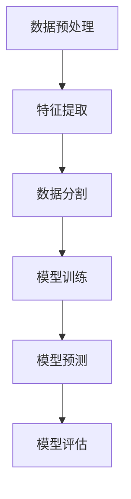
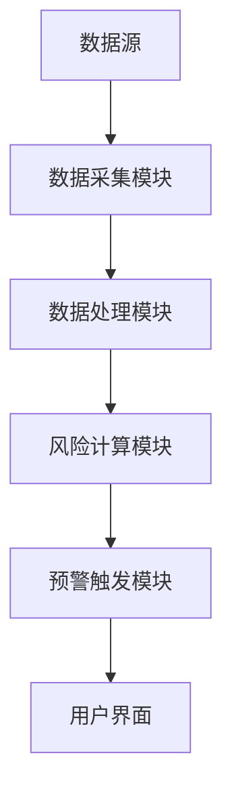
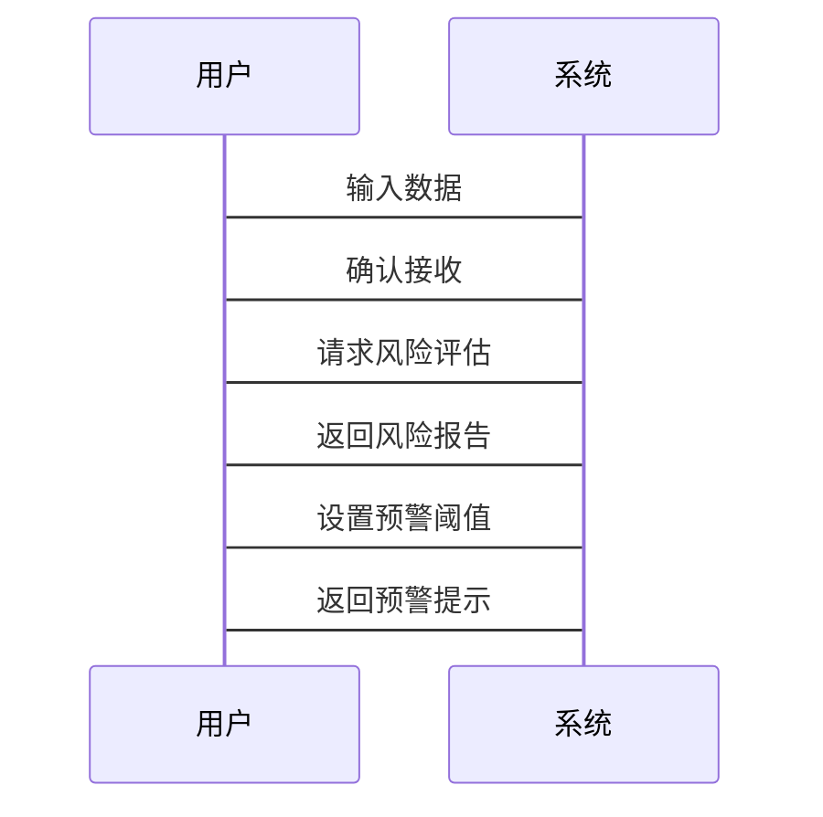

                 


# 金融市场系统性风险预警模型

> 关键词：金融市场，系统性风险，预警模型，算法实现，数学模型，系统架构

> 摘要：本文详细探讨了金融市场系统性风险的预警模型，从背景、概念到算法实现和系统架构设计，提供了全面的分析。文章首先介绍了系统性风险的基本概念和特征，然后分析了系统性风险预警模型的核心原理，包括传染机制和杠杆效应。接着，文章详细讲解了系统性风险预警模型的算法实现，包括数据预处理、模型训练和验证。最后，通过数学模型和系统架构设计，展示了如何构建一个高效、可靠的系统性风险预警系统。本文还提供了具体的Python代码实现和实际案例分析，帮助读者更好地理解和应用系统性风险预警模型。

---

# 第一部分: 金融市场系统性风险背景与概念

## 第1章: 系统性风险概述

### 1.1 系统性风险的定义与背景

#### 1.1.1 系统性风险的定义
系统性风险是指由于金融系统内在的相互关联性，导致整个金融体系发生系统性崩溃或剧烈波动的风险。与非系统性风险不同，系统性风险的影响范围更广，往往涉及整个金融市场的多个参与者和机构。

#### 1.1.2 系统性风险的背景与重要性
近年来，全球金融危机频发，如2008年的全球金融危机和2020年的新冠疫情引发的市场波动，凸显了系统性风险的重要性。系统性风险的预警和防范对于维护金融市场稳定、保护投资者利益具有重要意义。

#### 1.1.3 系统性风险与非系统性风险的区别
- 非系统性风险：特指某个具体资产或机构的风险，可以通过分散投资来降低。
- 系统性风险：影响整个金融市场的风险，无法通过分散投资来消除。

---

### 1.2 系统性风险的特征

#### 1.2.1 系统性风险的传染性
系统性风险通常通过金融机构之间的关联性传播。例如，一家银行的破产可能会引发连锁反应，导致整个金融体系的崩塌。

#### 1.2.2 系统性风险的杠杆效应
高杠杆率是系统性风险的重要来源。当市场出现波动时，杠杆率高的机构可能会被迫平仓，进一步加剧市场的波动。

#### 1.2.3 系统性风险的复杂性
系统性风险的来源多样，包括市场波动、政策变化、机构行为等，使得其预测和防范更加复杂。

---

### 1.3 系统性风险的来源

#### 1.3.1 金融市场的内在脆弱性
金融市场的高度杠杆化、复杂的金融工具和过度的投机行为，使得市场容易受到外部冲击的影响。

#### 1.3.2 外部冲击的影响
经济危机、地缘政治冲突、疫情等外部事件可能引发市场的剧烈波动，进而导致系统性风险。

#### 1.3.3 金融机构的过度杠杆
金融机构为了追求高收益，往往使用高杠杆进行投资，这在市场波动时容易引发连锁反应。

---

## 1.4 本章小结
本章主要介绍了系统性风险的基本概念、特征和来源，为后续构建预警模型奠定了基础。

---

# 第二部分: 系统性风险预警模型的核心概念与联系

## 第2章: 系统性风险预警模型的原理

### 2.1 系统性风险预警模型的核心要素

#### 2.1.1 风险传染机制
系统性风险通过金融机构之间的关联性传播。例如，A机构的破产可能引发B机构的流动性危机，进而影响整个金融体系。

#### 2.1.2 风险传染路径
风险传染路径包括直接传染（如银行间的直接贷款）和间接传染（如通过债券市场或股票市场的传导）。

#### 2.1.3 风险传染强度
风险传染强度取决于金融机构之间的关联程度、市场流动性、政策干预等因素。

---

### 2.2 系统性风险预警模型的构建逻辑

#### 2.2.1 数据收集与处理
- 数据来源：金融市场数据、机构资产负债表、交易数据等。
- 数据预处理：清洗、标准化、特征提取。

#### 2.2.2 风险指标的选取
- 常见风险指标：波动率、VaR（Value at Risk）、信用违约风险等。
- 指标选择：根据模型目标选择合适的指标组合。

#### 2.2.3 风险传染模型的构建
- 采用网络模型（如图论）来描述金融机构之间的关联性。
- 使用系统动力学模型模拟风险传播过程。

---

### 2.3 系统性风险预警模型的评价指标

#### 2.3.1 预警准确率
模型在历史数据上的准确率，越高越好。

#### 2.3.2 预警及时性
模型能够及时捕捉到潜在风险的能力。

#### 2.3.3 预警稳定性
模型在不同市场环境下的稳定性，避免频繁误报。

---

### 2.4 本章小结
本章详细讲解了系统性风险预警模型的核心要素和构建逻辑，为后续的算法实现奠定了理论基础。

---

# 第三部分: 系统性风险预警模型的算法原理

## 第3章: 系统性风险预警模型的算法实现

### 3.1 系统性风险预警模型的算法选择

#### 3.1.1 常见的系统性风险预警算法
- 多元回归分析
- 主成分分析（PCA）
- 网络模型（如PageRank算法）
- 时间序列分析（如ARIMA）

#### 3.1.2 算法选择的依据
- 数据类型和特征
- 模型的可解释性和复杂性
- 计算资源和时间限制

---

### 3.2 系统性风险预警模型的实现步骤

#### 3.2.1 数据预处理
- 数据清洗：处理缺失值、异常值。
- 数据标准化：归一化或标准化处理。
- 特征提取：选择关键风险指标。

#### 3.2.2 模型训练
- 采用多元回归分析，建立风险指标与系统性风险的关系模型。
- 使用训练数据拟合模型，调整参数。

#### 3.2.3 模型验证
- 使用验证数据评估模型的准确率和稳定性。
- 调整模型参数，优化性能。

---

### 3.3 系统性风险预警模型的实现代码

#### 3.3.1 Python代码实现
```python
import pandas as pd
import numpy as np
from sklearn.linear_model import LinearRegression
from sklearn.metrics import mean_squared_error

# 数据加载
data = pd.read_csv('financial_data.csv')

# 特征选择
features = ['market_value', 'leverage_ratio', 'volatility']
target = 'systemicRisk'

# 数据分割
X = data[features]
y = data[target]

# 模型训练
model = LinearRegression()
model.fit(X, y)

# 模型预测
y_pred = model.predict(X)

# 模型评估
mse = mean_squared_error(y, y_pred)
print(f"均方误差：{mse}")
```

#### 3.3.2 算法流程图


---

### 3.4 本章小结
本章通过具体代码和流程图，详细讲解了系统性风险预警模型的算法实现过程。

---

# 第四部分: 系统性风险预警模型的数学模型与公式

## 第4章: 系统性风险预警模型的数学模型

### 4.1 系统性风险预警模型的数学表达

#### 4.1.1 系统性风险的数学定义
系统性风险可以通过市场波动率、相关性矩阵等数学指标进行量化。

#### 4.1.2 系统性风险的传播方程
$$ R_{i} = \sum_{j=1}^{n} w_{ij} R_{j} $$
其中，\( R_{i} \) 表示机构i的系统性风险，\( w_{ij} \) 表示机构i和j之间的关联权重。

#### 4.1.3 系统性风险的评估公式
$$ VaR = z \cdot \sigma $$
其中，\( z \) 是标准正态分布的分位数，\( \sigma \) 是资产的波动率。

---

### 4.2 系统性风险预警模型的参数估计

#### 4.2.1 参数估计的方法
- 最小二乘法
- 最大似然估计
- 贝叶斯估计

#### 4.2.2 参数估计的步骤
1. 确定模型形式
2. 选择估计方法
3. 优化参数
4. 验证估计结果

---

### 4.3 系统性风险预警模型的数学推导

#### 4.3.1 系统性风险传播的数学推导
假设市场中有N个金融机构，每个机构的系统性风险传播系数为\( \alpha_{i} \)，则整体系统性风险可以表示为：
$$ R_{total} = \sum_{i=1}^{N} \alpha_{i} R_{i} $$

#### 4.3.2 系统性风险评估的数学推导
通过多元回归分析，可以得到：
$$ y = \beta X + \epsilon $$
其中，\( y \) 是目标变量（系统性风险），\( X \) 是特征矩阵，\( \beta \) 是回归系数，\( \epsilon \) 是误差项。

---

### 4.4 本章小结
本章通过数学公式和推导，详细讲解了系统性风险预警模型的理论基础。

---

# 第五部分: 系统性风险预警模型的系统架构与设计

## 第5章: 系统性风险预警模型的系统架构

### 5.1 系统性风险预警模型的系统功能设计

#### 5.1.1 数据采集功能
- 从金融市场数据源获取实时数据。
- 支持多种数据格式（如CSV、JSON）。

#### 5.1.2 风险评估功能
- 计算各机构的系统性风险指标。
- 生成风险评估报告。

#### 5.1.3 预警提示功能
- 当系统性风险超过阈值时，触发预警。
- 支持多种预警方式（如邮件、短信）。

---

### 5.2 系统性风险预警模型的系统架构设计

#### 5.2.1 分层架构设计
- 数据层：存储和管理金融数据。
- 业务逻辑层：实现风险评估和预警逻辑。
- 用户界面层：提供数据可视化和预警提示。

#### 5.2.2 模块化设计
- 数据采集模块
- 风险计算模块
- 预警触发模块

#### 5.2.3 可扩展性设计
- 支持新算法的接入。
- 支持新数据源的接入。

---

### 5.3 系统性风险预警模型的系统架构图



---

## 第5.4 系统性风险预警模型的接口设计

### 5.4.1 数据接口
- 输入接口：接收金融市场数据。
- 输出接口：提供风险评估结果。

### 5.4.2 预警接口
- 输入接口：接收风险指标。
- 输出接口：触发预警信号。

---

## 第5.5 系统性风险预警模型的交互设计

### 5.5.1 用户交互流程
1. 用户输入数据
2. 系统处理数据
3. 系统计算风险
4. 系统触发预警
5. 用户收到预警提示

---

## 第5.6 系统性风险预警模型的交互图



---

## 第5.7 本章小结
本章详细讲解了系统性风险预警模型的系统架构设计，包括功能设计、架构图和交互设计。

---

# 第六部分: 系统性风险预警模型的项目实战

## 第6章: 系统性风险预警模型的项目实战

### 6.1 项目环境安装

#### 6.1.1 系统要求
- 操作系统：Windows、Linux、macOS
- Python版本：3.6以上
- 硬件要求：4GB以上内存，推荐8GB

#### 6.1.2 安装依赖库
- Python库：pandas、numpy、scikit-learn、matplotlib
- 其他工具：Jupyter Notebook、IDE（如PyCharm）

---

### 6.2 系统核心实现源代码

#### 6.2.1 数据加载与处理
```python
import pandas as pd
import numpy as np

# 加载数据
data = pd.read_csv('financial_data.csv')

# 数据清洗
data.dropna()  # 删除缺失值
data = data[~data['market_value'].isnull()]  # 删除市场价值为NaN的行

# 数据标准化
from sklearn.preprocessing import StandardScaler
scaler = StandardScaler()
scaled_data = scaler.fit_transform(data[['market_value', 'leverage_ratio', 'volatility']])
```

#### 6.2.2 模型训练与预测
```python
from sklearn.linear_model import LinearRegression
from sklearn.metrics import mean_squared_error

# 训练模型
model = LinearRegression()
model.fit(scaled_data, data['systemicRisk'])

# 预测结果
y_pred = model.predict(scaled_data)

# 评估模型
mse = mean_squared_error(data['systemicRisk'], y_pred)
print(f"均方误差：{mse}")
```

---

### 6.3 代码应用解读与分析

#### 6.3.1 数据加载与处理
- 使用pandas加载数据，并处理缺失值和标准化数据。
- 标准化处理是为了消除不同特征之间的量纲差异。

#### 6.3.2 模型训练与预测
- 使用线性回归模型进行训练。
- 通过均方误差评估模型的性能。

---

### 6.4 实际案例分析

#### 6.4.1 数据来源与处理
以2008年金融危机为例，加载相关金融数据，进行数据预处理。

#### 6.4.2 模型训练
使用训练数据训练系统性风险预警模型。

#### 6.4.3 模型验证
在验证数据上评估模型的准确率和稳定性。

---

### 6.5 项目小结
本章通过具体项目实战，展示了系统性风险预警模型的实现过程，包括环境安装、代码实现和案例分析。

---

# 第七部分: 系统性风险预警模型的最佳实践与总结

## 第7章: 最佳实践与总结

### 7.1 最佳实践 tips

#### 7.1.1 数据质量
- 确保数据的完整性和准确性。
- 定期更新数据源。

#### 7.1.2 模型优化
- 根据实际情况调整模型参数。
- 尝试不同的算法组合。

#### 7.1.3 系统维护
- 定期检查系统性能。
- 及时修复系统漏洞。

---

### 7.2 小结

系统性风险预警模型在金融市场中具有重要的应用价值。通过本文的讲解，读者可以全面了解系统性风险的基本概念、预警模型的构建方法以及实际应用案例。

---

### 7.3 注意事项

- 系统性风险预警模型只是一个工具，实际应用中需要结合具体情况。
- 数据质量和模型选择对预警效果有重要影响。
- 定期更新模型和数据，以适应市场变化。

---

### 7.4 拓展阅读

- 《金融风险管理》
- 《系统性风险的数学模型》
- 《Python金融数据分析》

---

# 作者：AI天才研究院/AI Genius Institute & 禅与计算机程序设计艺术 /Zen And The Art of Computer Programming

---

感谢您的阅读！如需进一步了解系统性风险预警模型的实现细节，欢迎参考相关文献和代码示例。

