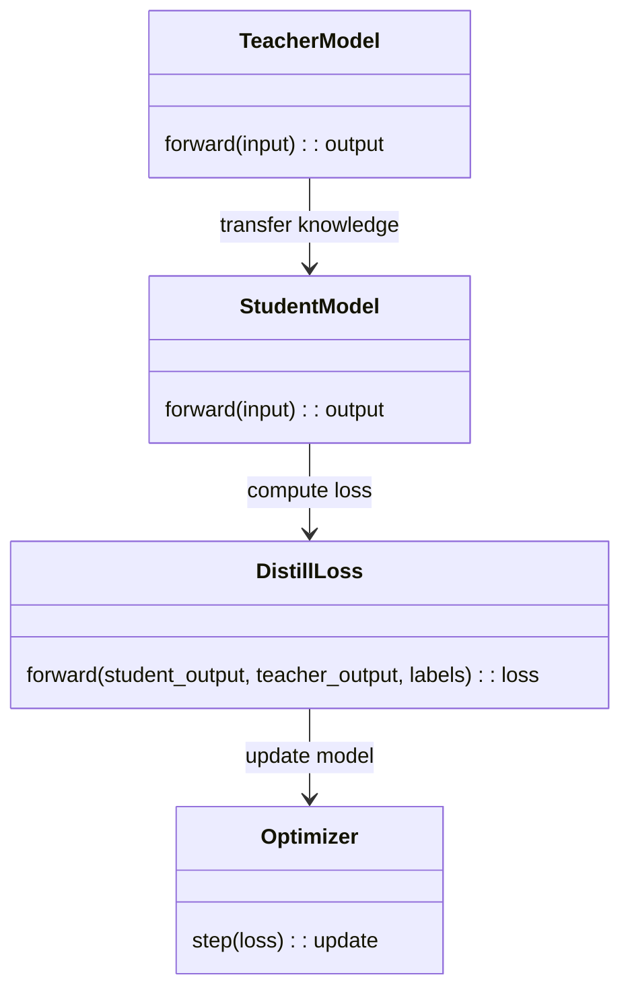
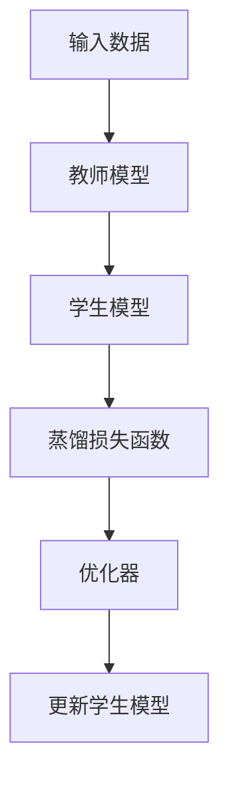

                 


```markdown
# 第一部分: AI Agent 的知识蒸馏基础

# 第1章: 知识蒸馏的背景与概念

## 1.1 知识蒸馏的背景
### 1.1.1 大型语言模型的发展现状
大型语言模型（LLM）近年来取得了显著进展，如GPT-3、GPT-4等，这些模型在自然语言处理任务中表现出色，但其计算资源需求和运行成本过高，限制了其在实际应用中的普及。

### 1.1.2 知识蒸馏技术的提出背景
随着AI技术的快速发展，对模型轻量化的需求日益增加。知识蒸馏技术作为一种有效的模型压缩方法，能够将大型模型的知识迁移到更小、更高效的模型中，从而在资源受限的环境中也能实现高性能。

### 1.1.3 知识蒸馏的目标与意义
知识蒸馏的目标是将大型模型的知识迁移到轻量级模型中，同时保持或提升性能。其意义在于降低计算成本、提高部署效率，并扩展AI技术的应用范围。

## 1.2 AI Agent 的基本概念
### 1.2.1 AI Agent 的定义
AI Agent是指能够感知环境、执行任务并做出决策的智能实体，通常通过传感器获取信息，并通过执行器与环境交互。

### 1.2.2 AI Agent 的核心功能
AI Agent的核心功能包括感知、推理、规划、学习和执行，能够实现自主决策和任务完成。

### 1.2.3 AI Agent 与传统模型的区别
AI Agent不仅能够处理数据，还能与环境动态交互，具备自主性和适应性，而传统模型通常只是静态的数据处理工具。

## 1.3 知识蒸馏的核心概念
### 1.3.1 知识蒸馏的定义
知识蒸馏是一种模型压缩技术，通过将知识从大型模型（教师模型）迁移到小型模型（学生模型）中，使小型模型能够继承教师模型的能力。

### 1.3.2 知识蒸馏的关键技术
知识蒸馏的关键技术包括教师模型的输出蒸馏、中间层特征蒸馏以及参数蒸馏等。

### 1.3.3 知识蒸馏的实现流程
知识蒸馏的实现流程通常包括：选择教师模型、设计学生模型、定义蒸馏损失函数、优化训练等步骤。

## 1.4 本章小结
本章介绍了知识蒸馏的背景、AI Agent的基本概念以及知识蒸馏的核心概念，为后续内容奠定了基础。

---

# 第二部分: AI Agent 的知识蒸馏原理

# 第2章: AI Agent 的知识蒸馏过程

## 2.1 知识蒸馏的基本原理
### 2.1.1 知识蒸馏的数学模型
知识蒸馏通过最小化学生模型输出与教师模型输出之间的差异来实现知识迁移。数学模型通常包括蒸馏损失函数和分类损失函数的组合优化。

### 2.1.2 知识蒸馏的核心算法
知识蒸馏的核心算法包括直觉蒸馏、软标签蒸馏、对抗蒸馏等方法，每种方法都有其特点和适用场景。

### 2.1.3 知识蒸馏的实现步骤
知识蒸馏的实现步骤一般包括数据准备、模型选择、蒸馏损失函数设计、训练优化等。

## 2.2 AI Agent 的知识蒸馏方法
### 2.2.1 直接蒸馏法
直接蒸馏法将教师模型的输出作为软标签，通过交叉熵损失函数指导学生模型的训练。

### 2.2.2 对抗蒸馏法
对抗蒸馏法通过引入对抗网络，增强学生模型的鲁棒性，使其在对抗环境下也能有效迁移教师模型的知识。

### 2.2.3 联合蒸馏法
联合蒸馏法结合了多种蒸馏方法，通过多任务学习的方式，进一步提升学生模型的性能。

## 2.3 知识蒸馏的优化策略
### 2.3.1 损失函数设计
损失函数的设计需要平衡分类损失和蒸馏损失，通常采用加权的方式进行优化。

### 2.3.2 知识表示优化
知识表示优化通过改进特征提取和表示学习，增强学生模型对教师模型知识的吸收能力。

### 2.3.3 蒸馏过程中的参数调整
蒸馏过程中的参数调整需要根据任务需求和数据特性，动态优化学习率、温度等超参数，以达到最佳效果。

## 2.4 本章小结
本章详细讲解了AI Agent的知识蒸馏过程，包括基本原理、具体方法和优化策略，为后续的系统设计和项目实现提供了理论基础。

---

# 第三部分: 知识蒸馏的算法实现

# 第3章: 知识蒸馏的算法原理

## 3.1 知识蒸馏的数学模型
### 3.1.1 源模型的输出表示
源模型（教师模型）的输出通常是一个概率分布，表示输入样本属于各个类别的可能性。

### 3.1.2 学生模型的输出表示
学生模型的输出也是概率分布，但需要通过蒸馏损失函数的优化，使其尽可能接近教师模型的输出。

### 3.1.3 蒸馏损失函数的构建
蒸馏损失函数通常是一个加权的交叉熵损失，公式如下：

$$ L_{distill} = \alpha \cdot L_{ce}(S, T) + (1-\alpha) \cdot L_{ce}(S, Y) $$

其中，$S$是学生模型的输出，$T$是教师模型的输出，$Y$是真实标签，$\alpha$是权重系数。

## 3.2 知识蒸馏的核心算法
### 3.2.1 蒸馏损失函数的公式推导
通过推导蒸馏损失函数的公式，可以看出其核心思想是平衡学生模型与教师模型输出之间的差异。

### 3.2.2 算法的收敛性
蒸馏算法通常具有较好的收敛性，但具体效果还需结合数据分布和模型结构进行分析。

## 3.3 算法实现的代码示例
```python
import torch
import torch.nn as nn
import torch.optim as optim

# 定义教师模型和学生模型
teacher_model = ...  # 定义具体的教师模型
student_model = ...  # 定义具体的 student 模型

# 定义蒸馏损失函数
class DistillLoss(nn.Module):
    def __init__(self, T=1.0, alpha=0.5):
        super(DistillLoss, self).__init__()
        self.T = T
        self.alpha = alpha
    
    def forward(self, student_output, teacher_output, labels):
        # 软标签蒸馏
        teacher_output = teacher_output / self.T
        student_output = student_output / self.T
        
        # 计算蒸馏损失
        distill_loss = nn.KLDivLoss(reduction='batchmean')(student_output.log_softmax(), teacher_output.log_softmax()) * (self.T * self.T)
        
        # 计算分类损失
        class_loss = nn.CrossEntropyLoss()(student_output, labels)
        
        # 总损失
        total_loss = self.alpha * distill_loss + (1 - self.alpha) * class_loss
        return total_loss

# 定义优化器
optimizer = optim.Adam(student_model.parameters(), lr=1e-4)

# 训练循环
for epoch in range(num_epochs):
    for batch_input, batch_labels, batch_teacher_output in dataloader:
        # 前向传播
        student_output = student_model(batch_input)
        teacher_output = teacher_model(batch_input)
        
        # 计算损失
        loss = DistillLoss(T=1.0, alpha=0.5)(student_output, teacher_output, batch_labels)
        
        # 反向传播和优化
        optimizer.zero_grad()
        loss.backward()
        optimizer.step()
```

## 3.4 本章小结
本章通过数学公式和代码示例，详细讲解了知识蒸馏的算法原理，为后续的系统设计和项目实现提供了具体的技术支持。

---

# 第四部分: 系统分析与架构设计方案

# 第4章: 系统架构设计

## 4.1 问题场景介绍
### 4.1.1 问题背景
在实际应用中，大型语言模型的计算资源需求过高，限制了其在边缘设备和移动应用中的使用。

### 4.1.2 项目介绍
本项目旨在通过知识蒸馏技术，将大型语言模型的知识迁移到轻量级模型中，提升模型的运行效率和部署灵活性。

## 4.2 系统功能设计
### 4.2.1 领域模型设计
使用Mermaid绘制的领域模型类图，展示系统的核心模块及其交互关系。



### 4.2.2 系统架构设计
使用Mermaid绘制的系统架构图，展示系统的整体结构和模块划分。



## 4.3 系统接口设计
### 4.3.1 系统接口定义
定义系统的主要接口，包括数据输入接口、模型训练接口、模型部署接口等。

### 4.3.2 接口交互流程
使用Mermaid绘制的序列图，展示系统接口的交互流程。

## 4.4 系统交互设计
### 4.4.1 用户与系统交互
用户通过图形界面或命令行接口与系统进行交互，完成数据输入、模型训练和结果输出。

### 4.4.2 系统内部交互
系统内部通过模块之间的调用，完成数据处理、模型训练和结果输出。

## 4.5 本章小结
本章通过系统架构设计和接口设计，详细讲解了知识蒸馏技术在实际系统中的应用，为后续的项目实现提供了指导。

---

# 第五部分: 项目实战

# 第5章: 项目实战

## 5.1 环境配置
### 5.1.1 系统环境
推荐使用Python 3.8及以上版本，安装PyTorch、Transformers等库。

### 5.1.2 依赖管理
使用虚拟环境管理依赖，通过pip install命令安装必要的库。

## 5.2 系统核心实现
### 5.2.1 知识蒸馏的实现
基于前面的算法原理，实现具体的蒸馏过程，包括教师模型和学生模型的定义、损失函数的实现、优化器的设置等。

### 5.2.2 模型训练与评估
定义训练循环，包括数据加载、模型前向传播、损失计算、反向传播和优化器更新等步骤。

## 5.3 代码实现与解读
### 5.3.1 教师模型与学生模型的定义
```python
class TeacherModel(nn.Module):
    def __init__(self):
        super(TeacherModel, self).__init__()
        self.lm = AutoModelForMaskedLM.from_pretrained('bert-base-uncased')
    
    def forward(self, input_ids, attention_mask):
        outputs = self.lm(input_ids, attention_mask=attention_mask)
        return outputs.last_hidden_state

class StudentModel(nn.Module):
    def __init__(self):
        super(StudentModel, self).__init__()
        self.lm = AutoModelForMaskedLM.from_pretrained('roberta-base')
    
    def forward(self, input_ids, attention_mask):
        outputs = self.lm(input_ids, attention_mask=attention_mask)
        return outputs.last_hidden_state
```

### 5.3.2 蒸馏损失函数的实现
```python
class DistillLoss(nn.Module):
    def __init__(self, T=1.0, alpha=0.5):
        super(DistillLoss, self).__init__()
        self.T = T
        self.alpha = alpha
    
    def forward(self, student_output, teacher_output, labels):
        teacher_output = teacher_output / self.T
        student_output = student_output / self.T
        distill_loss = nn.KLDivLoss(reduction='batchmean')(student_output.log_softmax(), teacher_output.log_softmax()) * (self.T ** 2)
        class_loss = nn.CrossEntropyLoss()(student_output, labels)
        total_loss = self.alpha * distill_loss + (1 - self.alpha) * class_loss
        return total_loss
```

### 5.3.3 模型训练与优化
```python
optimizer = optim.Adam(student_model.parameters(), lr=1e-4)
criterion = DistillLoss(T=1.0, alpha=0.5)

for epoch in range(num_epochs):
    for batch in dataloader:
        input_ids, attention_mask, labels, teacher_output = batch
        student_output = student_model(input_ids, attention_mask)
        loss = criterion(student_output, teacher_output, labels)
        optimizer.zero_grad()
        loss.backward()
        optimizer.step()
```

## 5.4 案例分析与详细解读
### 5.4.1 实验数据集
选择适当的文本数据集，进行预处理和划分训练集、验证集。

### 5.4.2 模型评估
通过准确率、F1分数等指标，评估蒸馏后学生模型的性能。

### 5.4.3 性能对比
将蒸馏后的学生模型与原始教师模型进行对比，分析性能差异和计算资源消耗。

## 5.5 本章小结
本章通过实际项目案例，详细讲解了知识蒸馏技术的实现过程，为读者提供了宝贵的实战经验。

---

# 第六部分: 最佳实践与小结

# 第6章: 最佳实践与小结

## 6.1 最佳实践
### 6.1.1 知识蒸馏的参数选择
合理选择温度系数T、权重系数α等参数，根据具体任务和数据分布进行调整。

### 6.1.2 模型压缩策略
结合知识蒸馏与其他模型压缩技术，如剪枝、量化，进一步优化模型体积和计算效率。

### 6.1.3 模型评估指标
使用准确率、F1分数、计算速度等指标，全面评估蒸馏后模型的性能和效率。

## 6.2 小结
通过本章的总结，读者可以更好地理解和掌握知识蒸馏技术的关键点和应用技巧，为实际项目提供了重要的参考。

---

# 作者

作者：AI天才研究院/AI Genius Institute & 禅与计算机程序设计艺术 /Zen And The Art of Computer Programming
```

