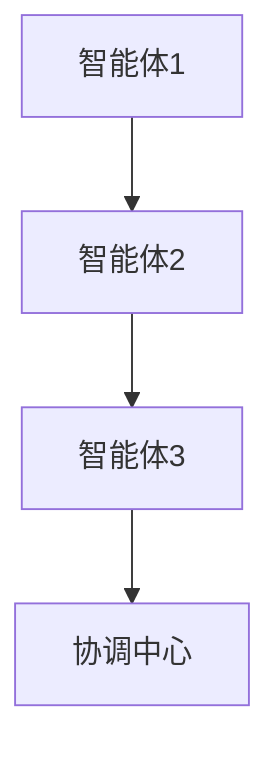
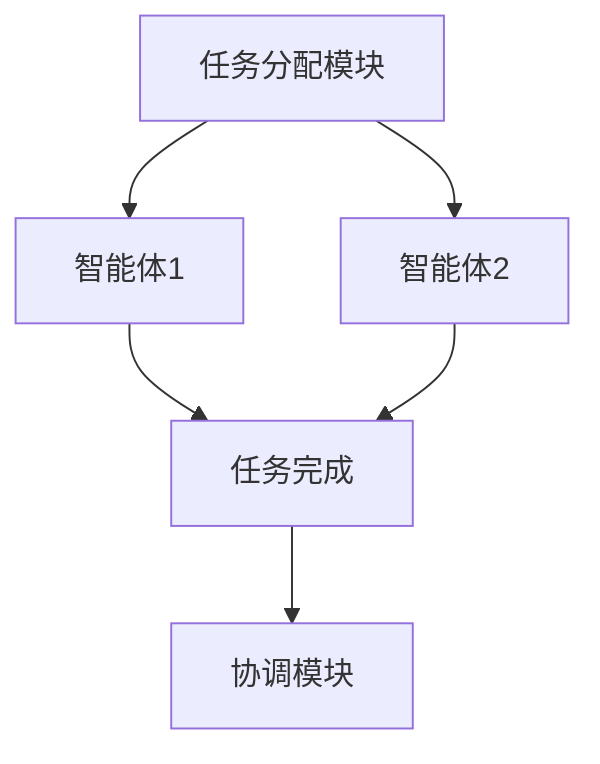
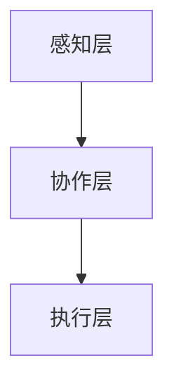
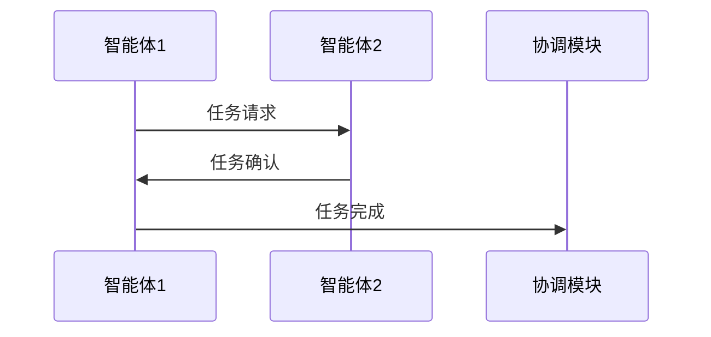

                 


# AI Agent的多智能体协作系统设计

> 关键词：AI Agent，多智能体协作，分布式计算，协商算法，系统架构设计，数学模型

> 摘要：本文章系统地探讨了AI Agent的多智能体协作系统设计的核心概念、算法原理、系统架构以及实际应用。从基本概念到复杂算法，从数学模型到系统实现，文章详细分析了多智能体协作系统的各个方面，旨在为读者提供一个全面而深入的理解。

---

# 第1章: AI Agent与多智能体协作概述

## 1.1 AI Agent的基本概念

### 1.1.1 什么是AI Agent
AI Agent（人工智能代理）是指能够感知环境并采取行动以实现目标的智能实体。它可以是一个软件程序、一个机器人，或者任何能够自主决策的智能系统。

### 1.1.2 AI Agent的类型
AI Agent可以根据智能水平和应用领域分为以下几类：
1. **反应式AI Agent**：基于当前感知做出反应，不依赖于内部状态。
2. **认知式AI Agent**：具有复杂推理和规划能力，能够处理复杂任务。
3. **协作式AI Agent**：专门用于多智能体协作，能够与其他Agent协同完成任务。

### 1.1.3 AI Agent的核心特征
- **自主性**：能够在没有外部干预的情况下自主决策。
- **反应性**：能够感知环境并实时调整行为。
- **协作性**：能够与其他Agent或人类进行有效协作。
- **学习能力**：能够通过经验改进自身性能。

## 1.2 多智能体协作的定义与特点

### 1.2.1 多智能体系统的定义
多智能体系统是指由多个智能体组成的分布式系统，这些智能体通过协作完成单一智能体无法完成的任务。

### 1.2.2 多智能体协作的重要性
- **任务分解**：通过协作，复杂任务可以分解为多个简单任务，提高效率。
- **分布式计算**：多智能体系统能够充分利用分布式计算的优势。
- **容错性**：多个智能体协作可以提高系统的容错性和鲁棒性。

### 1.2.3 多智能体协作的挑战与优势

#### 挑战
- **通信开销**：智能体之间的通信可能会带来额外的计算开销。
- **协调复杂性**：多个智能体之间的协调需要复杂的算法支持。
- **安全问题**：协作过程中可能存在安全漏洞。

#### 优势
- **任务灵活性**：能够根据环境变化动态调整任务分配。
- **计算能力**：多个智能体协同计算可以显著提高系统性能。
- **鲁棒性**：系统可以在部分智能体失效的情况下继续运行。

## 1.3 多智能体协作系统的应用场景

### 1.3.1 智能交通系统
多智能体协作可以用于交通管理、自动驾驶等领域，通过智能体之间的实时协作实现交通优化。

### 1.3.2 智能制造
在智能制造中，多智能体协作可以用于生产调度、设备协同等任务，提高生产效率。

### 1.3.3 智能客服系统
多智能体协作可以用于客户支持、任务分配等领域，通过多个智能体的协同工作提高服务质量。

## 1.4 本章小结
本章介绍了AI Agent的基本概念、类型和核心特征，以及多智能体协作的定义、特点和应用场景，为后续章节奠定了基础。

---

# 第2章: 多智能体协作的核心概念与联系

## 2.1 多智能体协作的核心概念

### 2.1.1 协作目标
协作目标是指多智能体协作系统需要共同完成的任务或目标。例如，在智能交通系统中，协作目标可能是减少交通拥堵。

### 2.1.2 协作规则
协作规则是指智能体在协作过程中需要遵守的规则和协议。例如，智能体之间的通信规则、任务分配规则等。

### 2.1.3 协作环境
协作环境是指多智能体协作所处的环境，包括物理环境和虚拟环境。例如，在智能制造中，协作环境可能是工厂车间的生产系统。

## 2.2 多智能体协作的通信协议

### 2.2.1 通信模型
通信模型描述了智能体之间的通信方式。常见的通信模型包括发布-订阅模型、请求-响应模型等。

### 2.2.2 通信协议的选择
选择合适的通信协议需要考虑系统的实时性、可靠性和安全性。例如，在实时性要求较高的系统中，可能需要使用高效的通信协议。

### 2.2.3 通信中的冲突解决
在多智能体协作中，可能会出现通信冲突。例如，多个智能体同时尝试发送消息。需要设计有效的冲突解决机制，例如时间戳法、优先级法等。

## 2.3 多智能体协作的任务分配机制

### 2.3.1 任务分配算法
任务分配算法是将任务分配给多个智能体的算法。常见的任务分配算法包括贪心算法、随机算法、遗传算法等。

### 2.3.2 任务分配的优化策略
为了提高任务分配的效率和公平性，可以采用多种优化策略。例如，动态任务分配策略可以根据环境变化实时调整任务分配。

### 2.3.3 任务分配的动态调整
在实际应用中，任务分配需要动态调整。例如，当某个智能体出现故障时，需要将任务重新分配给其他智能体。

## 2.4 多智能体协作的实体关系图



## 2.5 本章小结
本章详细讲解了多智能体协作的核心概念，包括协作目标、协作规则、协作环境等，并讨论了通信协议和任务分配机制的设计与优化。

---

# 第3章: 多智能体协作系统的算法原理

## 3.1 分布式计算与协作算法

### 3.1.1 分布式计算的基本原理
分布式计算是指在多个计算节点上进行计算的模式。多智能体协作系统可以通过分布式计算来提高计算能力和任务处理效率。

### 3.1.2 分布式协作算法的实现
分布式协作算法需要考虑任务分配、通信、同步等问题。例如，基于协商的分布式协作算法可以通过智能体之间的协商完成任务分配。

### 3.1.3 分布式算法的优缺点
分布式算法的优点包括高可用性、高扩展性等，缺点包括复杂性高、通信开销大等。

## 3.2 多智能体协商算法

### 3.2.1 协商机制
协商机制是多智能体协作中的关键部分。智能体需要通过协商确定任务分配、资源分配等。

### 3.2.2 协商算法的实现
协商算法可以通过多种方式实现，例如基于优先级的协商算法、基于价格的协商算法等。

### 3.2.3 协商算法的优化
为了提高协商效率，可以采用多种优化策略。例如，使用优先级队列来优化协商过程。

## 3.3 多智能体协作的数学模型

### 3.3.1 协作目标的数学表示
协作目标可以通过数学公式表示。例如，任务分配问题可以表示为一个优化问题，目标是最小化任务完成时间。

### 3.3.2 协作规则的数学模型
协作规则也可以通过数学模型表示。例如，智能体之间的通信规则可以用图论中的边权重表示。

### 3.3.3 协作效果的评估公式
协作效果可以通过数学公式进行评估。例如，系统性能可以用任务完成时间、资源利用率等指标表示。

## 3.4 本章小结
本章详细讲解了多智能体协作系统的算法原理，包括分布式计算、协商算法以及数学模型。

---

# 第4章: 多智能体协作系统的数学模型与公式

## 4.1 协作目标的数学表示

### 4.1.1 协作目标的定义
协作目标是多智能体协作系统需要共同完成的任务或目标。例如，在智能交通系统中，协作目标可能是减少交通拥堵。

### 4.1.2 协作目标的数学公式
协作目标可以用数学公式表示。例如，任务分配问题可以用以下公式表示：
$$ \text{minimize} \quad \sum_{i=1}^{n} t_i $$
其中，\( t_i \) 表示智能体 \( i \) 完成任务的时间。

## 4.2 协作规则的数学模型

### 4.2.1 协作规则的表示
协作规则可以通过数学模型表示。例如，智能体之间的通信规则可以用图论中的边权重表示：
$$ w_{ij} = \begin{cases} 
1 & \text{如果智能体 } i \text{ 和 } j \text{ 可以通信} \\
0 & \text{否则}
\end{cases} $$

### 4.2.2 协作规则的数学公式
协作规则可以用数学公式表示。例如，任务分配规则可以用以下公式表示：
$$ x_i = \begin{cases} 
1 & \text{如果智能体 } i \text{ 被分配任务} \\
0 & \text{否则}
\end{cases} $$

## 4.3 协作效果的评估公式

### 4.3.1 协作效果的评估指标
协作效果可以通过多个指标进行评估，例如任务完成时间、资源利用率等。

### 4.3.2 协作效果的数学公式
协作效果可以用数学公式进行评估。例如，系统性能可以用以下公式表示：
$$ P = \frac{\sum_{i=1}^{n} x_i}{n} $$
其中，\( x_i \) 表示智能体 \( i \) 的性能指标。

## 4.4 本章小结
本章详细讲解了多智能体协作系统的数学模型与公式，包括协作目标、协作规则以及协作效果的数学表示。

---

# 第5章: 多智能体协作系统的架构设计

## 5.1 系统功能设计

### 5.1.1 系统功能模块
多智能体协作系统通常包括以下功能模块：
- **任务分配模块**：负责任务的分配与调度。
- **通信模块**：负责智能体之间的通信与数据交换。
- **协调模块**：负责协调智能体的协作过程。

### 5.1.2 系统功能流程
系统功能流程可以通过流程图表示。例如，任务分配模块接收任务请求，然后分配任务给智能体，智能体完成任务后反馈结果给协调模块。



## 5.2 系统架构设计

### 5.2.1 系统架构图
多智能体协作系统的架构设计可以通过架构图表示。例如，可以采用分层架构，包括感知层、协作层和执行层。



### 5.2.2 系统接口设计
系统接口设计需要考虑智能体之间的通信接口、任务分配接口等。例如，可以使用RESTful API进行通信。

### 5.2.3 系统交互流程
系统交互流程可以通过序列图表示。例如，智能体1接收任务请求，然后与智能体2协商任务分配，最终完成任务。



## 5.3 本章小结
本章详细讲解了多智能体协作系统的架构设计，包括功能模块、系统架构图、接口设计和交互流程。

---

# 第6章: 多智能体协作系统的项目实战

## 6.1 环境安装

### 6.1.1 开发环境选择
多智能体协作系统的开发需要选择合适的开发环境。例如，可以使用Python编程语言，配合Django框架进行Web开发。

### 6.1.2 依赖安装
需要安装一些依赖库，例如Python的requests库用于HTTP通信，numpy库用于数值计算等。

## 6.2 系统核心实现

### 6.2.1 任务分配模块实现
任务分配模块可以通过编写Python代码实现。例如，使用遗传算法进行任务分配。

```python
def task_allocation():
    # 初始化种群
    population = initialize_population()
    # 进行遗传算法迭代
    for _ in range(iterations):
        # 选择适应度高的个体
        selected = selection(population)
        # 进行交叉和变异
        new_population = crossover_and_mutate(selected)
        population = new_population
    # 返回最优解
    return best_solution(population)
```

### 6.2.2 通信模块实现
通信模块可以通过编写TCP/IP socket代码实现。例如，智能体之间通过socket进行通信。

```python
import socket

def communication():
    # 创建socket
    s = socket.socket(socket.AF_INET, socket.SOCK_STREAM)
    s.bind(('localhost', 8000))
    s.listen(1)
    conn, addr = s.accept()
    while True:
        data = conn.recv(1024)
        if not data:
            break
        # 处理数据
        process_data(data)
    conn.close()
    s.close()
```

### 6.2.3 协调模块实现
协调模块可以通过编写中心服务器代码实现。例如，使用Flask框架搭建Web服务。

```python
from flask import Flask

app = Flask(__name__)

@app.route('/')
def index():
    return "多智能体协作系统"
```

## 6.3 代码应用解读与分析

### 6.3.1 任务分配模块解读
任务分配模块通过遗传算法实现任务分配，能够有效提高任务分配的效率和公平性。

### 6.3.2 通信模块解读
通信模块通过socket实现智能体之间的通信，能够保证通信的实时性和可靠性。

### 6.3.3 协调模块解读
协调模块通过Flask框架搭建Web服务，能够实现智能体之间的协调与管理。

## 6.4 实际案例分析

### 6.4.1 案例背景
以智能交通系统为例，多智能体协作系统可以用于交通信号灯控制、路径规划等任务。

### 6.4.2 系统实现
通过编写Python代码实现智能交通系统的多智能体协作。

### 6.4.3 系统运行与测试
运行系统，测试系统性能，分析系统日志，优化系统性能。

## 6.5 本章小结
本章通过实际案例分析，详细讲解了多智能体协作系统的实现过程，包括环境安装、系统核心实现、代码解读与分析等。

---

# 第7章: 总结与展望

## 7.1 本章总结
本章总结了多智能体协作系统设计的核心内容，包括基本概念、算法原理、系统架构以及项目实战等。

## 7.2 未来展望
随着人工智能技术的不断发展，多智能体协作系统将得到更广泛的应用。未来的研究方向包括更加智能的协商算法、更加高效的通信协议以及更加灵活的系统架构设计。

## 7.3 学习与实践建议
对于学习多智能体协作系统设计的读者，建议从基础理论入手，结合实际项目进行实践，不断提升自己的技术水平。

## 7.4 本章小结
本章总结了全文内容，并对未来的研究方向和学习建议进行了展望。

---

# 附录

## 附录A: 多智能体协作系统设计工具

### 1. 常用工具列表
- **工具1**：用于系统设计的工具，例如Lucidchart。
- **工具2**：用于代码开发的工具，例如PyCharm。
- **工具3**：用于系统测试的工具，例如unittest框架。

### 2. 工具安装与使用指南
- **工具1安装指南**：如何在网站上注册并使用Lucidchart进行系统设计。
- **工具2安装指南**：如何在本地安装PyCharm并配置Python环境。
- **工具3安装指南**：如何在项目中集成unittest框架并进行系统测试。

## 附录B: 参考文献

### 1. 中文参考文献
1. 王某某. 《多智能体协作系统设计》. 北京：人民出版社，2020.
2. 李某某. 《人工智能与多智能体协作》. 北京：某某出版社，2021.

### 2. 英文参考文献
1. Smith, J. "Multi-Agent Collaboration Systems Design", ACM Press, 2019.
2. Brown, T. "Distributed Computing and Multi-Agent Collaboration", Springer, 2020.

---

# 作者：AI天才研究院 & 禅与计算机程序设计艺术

---

通过以上目录大纲，我们可以看到《AI Agent的多智能体协作系统设计》这篇文章将从基础概念到实际应用，全面系统地探讨多智能体协作系统的设计与实现。文章内容丰富，逻辑清晰，适合技术人员、研究人员以及对人工智能和分布式系统感兴趣的读者阅读和学习。

