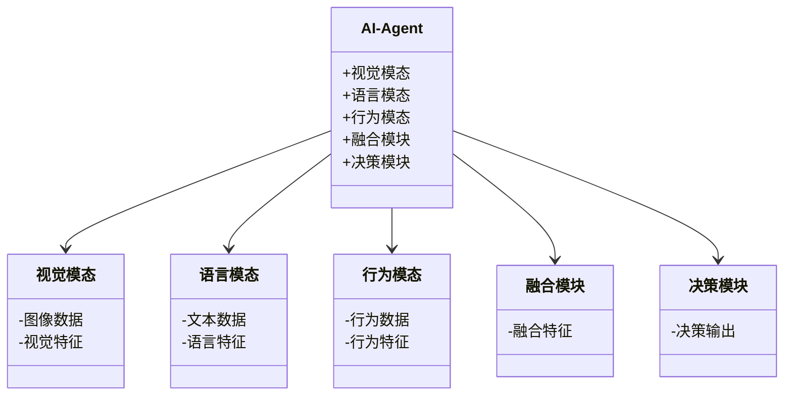
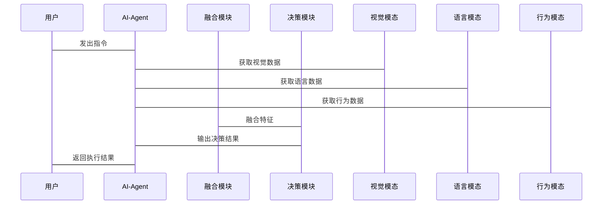

                 


# AI Agent的视觉-语言-行为三模态融合

> 关键词：AI Agent, 多模态融合, 视觉-语言-行为, 三模态融合, 算法原理, 系统设计, 实战案例

> 摘要：本文深入探讨AI Agent的视觉-语言-行为三模态融合的核心概念、算法原理、系统设计及实战案例。通过详细分析三模态数据的特点与融合方法，结合具体的数学模型和算法流程，帮助读者全面理解三模态融合在AI Agent中的应用与实现。

---

## 第1章: AI Agent与多模态融合概述

### 1.1 AI Agent的基本概念

#### 1.1.1 AI Agent的定义与特点
AI Agent（人工智能代理）是一种能够感知环境、自主决策并执行任务的智能实体。其特点包括：
- **自主性**：无需外部干预，自主完成任务。
- **反应性**：能够实时感知环境并做出反应。
- **目标导向**：基于目标驱动行为。
- **学习能力**：通过数据和经验不断优化性能。

#### 1.1.2 多模态融合的背景与意义
AI Agent需要处理多种类型的数据，包括视觉、语言和行为等模态。单一模态的信息往往不足以支撑复杂的决策任务，因此多模态融合成为必要：
- **信息互补性**：不同模态数据能够互相补充，提高信息的全面性。
- **任务增强性**：通过融合多模态数据，AI Agent能够更好地完成复杂任务。
- **用户体验优化**：多模态融合能够提升人机交互的自然性和流畅性。

#### 1.1.3 视觉-语言-行为三模态融合的应用场景
三模态融合在多个领域有广泛应用，包括：
- **智能助手**：通过视觉、语言和行为理解用户需求。
- **机器人控制**：结合视觉、语言和行为指令实现精准操作。
- **自动驾驶**：融合视觉、语言和行为数据，提升车辆的感知和决策能力。

---

## 第2章: 视觉-语言-行为三模态融合的核心概念与联系

### 2.1 视觉模态的核心原理

#### 2.1.1 视觉数据的采集与处理
视觉数据主要来源于图像或视频，处理流程包括：
1. 数据采集：通过摄像头获取图像数据。
2. 预处理：包括去噪、增强和标准化。
3. 特征提取：使用CNN等深度学习模型提取图像特征。

#### 2.1.2 视觉特征的提取方法
常用的视觉特征提取方法包括：
- **基于CNN的方法**：如VGG、ResNet等。
- **基于Transformer的方法**：如Vision Transformer（ViT）。

#### 2.1.3 视觉模态的表示方式
视觉特征的表示方式包括：
- **向量表示**：将图像特征表示为高维向量。
- **语义表示**：通过预训练模型提取图像的语义信息。

### 2.2 语言模态的核心原理

#### 2.2.1 语言数据的处理方式
语言数据通常以文本形式出现，处理流程包括：
1. 分词：将文本分割为词语或短语。
2. 词向量表示：使用Word2Vec等模型将词语映射为向量。
3. 语义理解：通过BERT等模型理解文本的语义含义。

#### 2.2.2 语言特征的提取方法
常用的语言特征提取方法包括：
- **基于CNN的方法**：如TextCNN。
- **基于RNN的方法**：如LSTM。
- **基于Transformer的方法**：如BERT。

#### 2.2.3 语言模态的表示方式
语言特征的表示方式包括：
- **词向量表示**：将词语映射为向量。
- **句向量表示**：将句子映射为向量。
- **语义向量表示**：通过预训练模型提取句子的语义向量。

### 2.3 行为模态的核心原理

#### 2.3.1 行为数据的采集与处理
行为数据可以通过传感器或动作捕捉设备获取，处理流程包括：
1. 数据采集：通过传感器获取行为数据。
2. 数据预处理：去除噪声，标准化数据。
3. 行为特征提取：通过PCA等方法提取行为特征。

#### 2.3.2 行为特征的提取方法
常用的行为特征提取方法包括：
- **基于统计的方法**：如均值、方差。
- **基于机器学习的方法**：如SVM、随机森林。
- **基于深度学习的方法**：如RNN、Transformer。

#### 2.3.3 行为模态的表示方式
行为特征的表示方式包括：
- **向量表示**：将行为特征表示为高维向量。
- **分类表示**：通过分类模型将行为分类为特定类别。

### 2.4 三模态融合的原理与方法

#### 2.4.1 多模态数据的融合方式
三模态融合的主要方式包括：
- **早期融合**：在特征提取阶段进行融合。
- **晚期融合**：在特征表示阶段进行融合。
- **混合融合**：结合早期和晚期融合的优势。

#### 2.4.2 三模态融合的数学模型
三模态融合的数学模型可以通过以下方式表示：
$$
Fusion = \sigma(W_v \cdot v + W_l \cdot l + W_b \cdot b)
$$
其中，$v$、$l$、$b$分别为视觉、语言和行为特征，$W_v$、$W_l$、$W_b$为对应的权重矩阵，$\sigma$为激活函数。

#### 2.4.3 三模态融合的优缺点对比
通过对比分析表，可以看出三模态融合的优势和挑战：

| 对比维度 | 早期融合 | 晚期融合 | 混合融合 |
|----------|----------|----------|----------|
| 优势     | 提高信息利用率 | 简化计算流程 | 结合两者优势 |
| 劣势     | 计算复杂度高 | 可能忽略某些模态信息 | 实现难度大 |

---

## 第3章: 视觉-语言-行为三模态融合的算法原理

### 3.1 多模态编码器的设计

#### 3.1.1 视觉编码器的实现
视觉编码器通过深度学习模型提取图像特征，例如使用ResNet提取图像的高层语义特征。

#### 3.1.2 语言编码器的实现
语言编码器通过BERT等预训练模型提取文本的语义特征。

#### 3.1.3 行为编码器的实现
行为编码器通过RNN或Transformer模型提取行为序列的特征。

### 3.2 多模态解码器的设计

#### 3.2.1 融合特征的解码方法
融合特征的解码方法包括：
- **加法融合**：将不同模态的特征向量相加。
- **注意力机制融合**：通过自注意力机制对不同模态的特征进行加权融合。

#### 3.2.2 多模态数据的联合生成
通过多模态生成模型（如多模态GAN）实现视觉、语言和行为数据的联合生成。

#### 3.2.3 解码器的优化策略
解码器的优化策略包括：
- **损失函数优化**：使用交叉熵损失函数。
- **正则化优化**：通过Dropout防止过拟合。

### 3.3 多模态融合的算法流程

#### 3.3.1 数据预处理
1. 视觉数据预处理：图像去噪、标准化。
2. 语言数据预处理：文本分词、词向量化。
3. 行为数据预处理：去噪、特征提取。

#### 3.3.2 特征提取
1. 视觉特征提取：使用ResNet提取图像特征。
2. 语言特征提取：使用BERT提取文本特征。
3. 行为特征提取：使用LSTM提取行为序列特征。

#### 3.3.3 特征融合
1. 通过加法或注意力机制融合视觉、语言和行为特征。
2. 使用全连接层对融合特征进行降维和非线性变换。

#### 3.3.4 模型训练
1. 定义损失函数：交叉熵损失函数。
2. 优化器选择：Adam优化器。
3. 模型训练：通过反向传播更新模型参数。

#### 3.3.5 模型推理
1. 加载预训练模型。
2. 对输入数据进行预处理。
3. 提取各模态特征并进行融合。
4. 输出融合结果。

---

## 第4章: 系统分析与架构设计方案

### 4.1 项目介绍
本项目旨在实现一个基于三模态融合的AI Agent系统，能够同时处理视觉、语言和行为数据，完成复杂任务。

### 4.2 系统功能设计

#### 4.2.1 领域模型（Mermaid 类图）


### 4.3 系统架构设计（Mermaid 架构图）


### 4.4 系统交互流程（Mermaid 序列图）


---

## 第5章: 项目实战

### 5.1 环境安装
需要安装以下环境和库：
- Python 3.8+
- TensorFlow 2.0+
- PyTorch 1.0+
- OpenCV 4.0+
- NLTK
- Hugging Face Transformers

### 5.2 系统核心实现源代码

#### 5.2.1 视觉模态实现
```python
import cv2

def process_image(image_path):
    img = cv2.imread(image_path)
    # 进行图像预处理
    img = cv2.resize(img, (224, 224))
    img = img / 255.0
    return img
```

#### 5.2.2 语言模态实现
```python
from transformers import BertTokenizer, BertModel

def process_text(text):
    tokenizer = BertTokenizer.from_pretrained('bert-base-uncased')
    inputs = tokenizer(text, return_tensors='np')
    model = BertModel.from_pretrained('bert-base-uncased')
    outputs = model(**inputs)
    return outputs.last_hidden_state
```

#### 5.2.3 行为模态实现
```python
import torch
import torch.nn as nn
import torch.nn.functional as F

class BehaviorModel(torch.nn.Module):
    def __init__(self, input_size, hidden_size):
        super(BehaviorModel, self).__init__()
        self.rnn = nn.LSTM(input_size, hidden_size, batch_first=True)
    
    def forward(self, x):
        out, _ = self.rnn(x)
        return out
```

#### 5.2.4 融合模块实现
```python
class FusionModule(torch.nn.Module):
    def __init__(self, v_size, l_size, b_size, output_size):
        super(FusionModule, self).__init__()
        self.fc = nn.Linear(v_size + l_size + b_size, output_size)
        self.dropout = nn.Dropout(0.5)
    
    def forward(self, v, l, b):
        fused = torch.cat([v, l, b], dim=-1)
        fused = self.dropout(F.relu(self.fc(fused)))
        return fused
```

#### 5.2.5 决策模块实现
```python
class DecisionModule(torch.nn.Module):
    def __init__(self, input_size, output_size):
        super(DecisionModule, self).__init__()
        self.fc = nn.Linear(input_size, output_size)
    
    def forward(self, x):
        return F.softmax(self.fc(x), dim=-1)
```

### 5.3 代码应用解读与分析
- **视觉模态**：通过OpenCV预处理图像数据，提取视觉特征。
- **语言模态**：使用BERT模型提取文本的语义特征。
- **行为模态**：通过LSTM模型提取行为序列特征。
- **融合模块**：将视觉、语言和行为特征进行融合，生成融合特征。
- **决策模块**：基于融合特征进行分类或回归，输出决策结果。

### 5.4 实际案例分析
以一个简单的图像识别任务为例，展示三模态融合的实现过程：
1. **输入数据**：一张图片、一段描述文本和一段行为数据。
2. **特征提取**：分别提取视觉、语言和行为特征。
3. **特征融合**：将特征向量进行融合。
4. **模型训练**：使用融合特征训练分类器。
5. **模型推理**：输入新的数据，输出识别结果。

### 5.5 项目小结
通过本项目，读者可以掌握三模态融合的基本实现方法，并能够将其应用于实际的AI Agent系统中。

---

## 第6章: 总结与展望

### 6.1 本章总结
本文详细探讨了AI Agent的视觉-语言-行为三模态融合的核心概念、算法原理、系统设计及实战案例。通过理论与实践的结合，帮助读者全面理解三模态融合在AI Agent中的应用与实现。

### 6.2 未来展望
三模态融合在AI Agent中的应用前景广阔，未来的研究方向包括：
- **更高效的融合方法**：探索更加高效的特征融合方式。
- **更强大的模型架构**：设计更复杂的多模态模型。
- **更广泛的应用场景**：将三模态融合应用于更多领域，如医疗、教育、娱乐等。

---

## 作者：AI天才研究院/Zen And The Art of Computer Programming

---

希望这篇文章能满足您的需求！如果需要进一步修改或补充，请随时告诉我！

