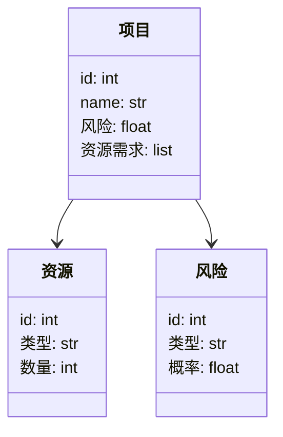
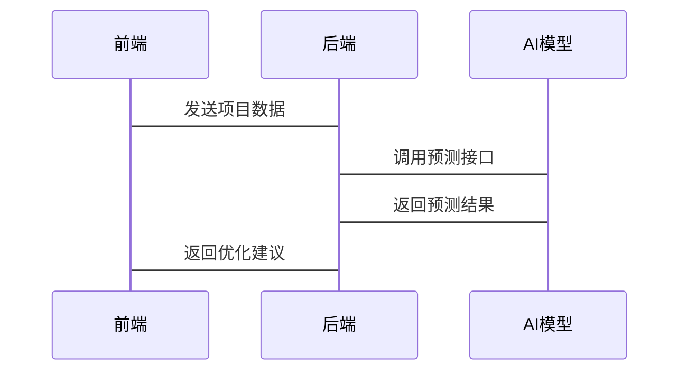

                 


# AI驱动的企业创新项目组合管理：风险平衡与资源优化的智能化

> 关键词：人工智能、项目组合管理、风险平衡、资源优化、企业创新

> 摘要：本文探讨了AI在企业创新项目组合管理中的应用，重点分析了如何通过AI技术实现风险平衡与资源优化的智能化。文章从背景介绍、核心概念、算法原理、系统架构设计到项目实战，全面阐述了AI驱动的创新项目组合管理的理论与实践，为读者提供了深入的技术见解和实际应用案例。

---

# 第一部分：AI驱动的企业创新项目组合管理概述

## 第1章：企业创新项目的复杂性与挑战

### 1.1 企业创新项目的复杂性

#### 1.1.1 项目组合管理的背景与意义

项目组合管理（Portfolio Management）是企业在管理多个项目时，为了实现战略目标和优化资源分配而进行的系统性工作。随着市场竞争的加剧和技术的快速迭代，企业创新项目数量激增，项目的复杂性和不确定性显著增加。传统的项目管理方法往往难以应对这些挑战，因此，企业需要更加智能化的管理方式。

#### 1.1.2 传统项目组合管理的局限性

传统的项目组合管理依赖于人工决策和经验判断，存在以下问题：
- 数据量大：难以从海量数据中提取有价值的信息。
- 风险预测不足：传统方法难以准确预测项目风险。
- 资源分配不均：无法实现资源的最优分配，导致资源浪费或不足。

#### 1.1.3 创新项目的特点与管理难点

创新项目通常具有以下特点：
- 高不确定性：创新项目的结果往往难以预测。
- 资源需求多样：创新项目可能需要跨部门的资源支持。
- 时间压力大：创新项目通常需要快速交付。

### 1.2 风险平衡与资源优化的核心问题

#### 1.2.1 风险与资源的动态平衡

企业在创新项目管理中需要在风险和资源之间找到平衡点。过高风险可能导致项目失败，而过低风险则可能错过市场机会。

#### 1.2.2 资源优化的必要性

资源优化是企业创新项目成功的关键。企业需要在有限的资源下，选择最优的项目组合，以实现最大化的价值。

#### 1.2.3 传统方法的不足与改进方向

传统方法在资源优化和风险控制方面存在不足，例如：
- 数据分析能力有限：传统方法难以处理复杂的数据关系。
- 决策效率低：人工决策耗时且容易出错。
- 缺乏动态调整能力：无法实时响应市场变化。

### 1.3 AI驱动的创新项目组合管理的优势

#### 1.3.1 AI在风险预测中的作用

AI技术可以通过机器学习模型分析历史数据，预测项目的潜在风险，从而帮助企业在项目初期识别和规避风险。

#### 1.3.2 AI在资源优化中的应用

AI可以通过优化算法，找到最优的资源分配方案，提高资源利用率，降低项目成本。

#### 1.3.3 智能化管理的效率提升

AI驱动的项目组合管理能够实现自动化决策，提高管理效率，降低人为错误。

---

## 第2章：AI驱动项目组合管理的技术背景

### 2.1 大数据与机器学习基础

#### 2.1.1 数据驱动决策的兴起

大数据技术的发展使得企业能够从海量数据中提取有价值的信息，支持决策。

#### 2.1.2 机器学习在项目管理中的应用

机器学习算法可以用于项目风险预测、资源分配等任务。

#### 2.1.3 大数据技术对企业创新的支持

大数据技术能够帮助企业更好地理解市场趋势，支持创新项目决策。

### 2.2 现代项目组合管理理论

#### 2.2.1 项目组合管理的基本概念

项目组合管理是对一组项目进行选择、优先级排序和监控，以实现战略目标。

#### 2.2.2 项目组合管理的框架与模型

常见的项目组合管理框架包括战略筛选模型、平衡记分卡等。

#### 2.2.3 现代项目组合管理的趋势

现代项目组合管理更加注重数据驱动和智能化决策。

### 2.3 AI技术在项目组合管理中的应用前景

#### 2.3.1 AI技术的核心优势

AI技术能够处理复杂的数据关系，提供实时决策支持。

#### 2.3.2 AI技术在项目组合管理中的潜在应用场景

AI可以用于项目筛选、风险预测、资源分配优化等。

#### 2.3.3 技术实现的关键挑战

数据质量、模型选择、算法优化是AI驱动项目组合管理的关键挑战。

---

## 第3章：AI驱动项目组合管理的核心概念与联系

### 3.1 核心概念与定义

#### 3.1.1 项目组合管理的定义

项目组合管理是对一组项目进行系统化管理，以实现企业战略目标。

#### 3.1.2 AI驱动的定义与特征

AI驱动的项目组合管理利用人工智能技术，实现智能化的决策支持。

#### 3.1.3 风险平衡与资源优化的内涵

风险平衡是指在项目组合中找到风险与收益的最佳平衡点；资源优化是指在有限资源下，选择最优的项目组合。

### 3.2 核心概念的属性

#### 3.2.1 核心概念的属性对比

| 属性 | 传统项目组合管理 | AI驱动项目组合管理 |
|------|------------------|---------------------|
| 数据驱动 | 依赖经验判断 | 依赖大数据分析 |
| 决策效率 | 低效 | 高效 |
| 灵活性 | 低 | 高 |

#### 3.2.2 核心要素之间的关系

通过ER图展示核心要素（项目、资源、风险）之间的关系。

```mermaid
erd
    左右方向
    项目
    --> 资源
    项目
    --> 风险
    资源
    --> 风险
```

---

## 第4章：AI驱动项目组合管理的算法原理

### 4.1 算法原理概述

#### 4.1.1 遗传算法

遗传算法是一种模拟自然选择和遗传机制的优化算法，适用于组合优化问题。

#### 4.1.2 粒子群优化

粒子群优化是一种基于群体智能的优化算法，适用于复杂问题的求解。

### 4.2 算法实现步骤

#### 4.2.1 遗传算法的实现步骤

1. 初始化种群。
2. 计算适应度。
3. 选择父代。
4. 进行交叉和变异。
5. 重复迭代。

#### 4.2.2 粒子群优化的实现步骤

1. 初始化粒子群。
2. 计算适应度。
3. 更新粒子速度和位置。
4. 保持最优解。
5. 重复迭代。

### 4.3 算法实现代码示例

#### 4.3.1 遗传算法的Python代码

```python
import random

def fitness(solution):
    # 计算适应度函数
    return sum(solution)

def genetic_algorithm(population_size, generations):
    population = [random.choices([0,1], k=10) for _ in range(population_size)]
    for _ in range(generations):
        fitness_list = [fitness(individual) for individual in population]
        # 选择
        selected = sorted(population, key=lambda x: fitness(x), reverse=True)[:population_size//2]
        # 交叉
        new_population = []
        for i in range(len(selected)):
            parent1 = selected[i]
            parent2 = selected[-i-1]
            child = [x or y for x, y in zip(parent1, parent2)]
            new_population.append(child)
        population = new_population
    return population[0]

best = genetic_algorithm(100, 50)
print(best)
```

#### 4.3.2 粒子群优化的Python代码

```python
import random

def fitness(solution):
    # 计算适应度函数
    return sum(solution)

def particle_swarm_optimization(n_particles, n_iterations):
    particles = [[random.random() for _ in range(10)] for _ in range(n_particles)]
    velocities = [[0 for _ in range(10)] for _ in range(n_particles)]
    best_particle = particles[0]
    best_fitness = fitness(best_particle)

    for _ in range(n_iterations):
        for i in range(n_particles):
            current_fitness = fitness(particles[i])
            if current_fitness > best_fitness:
                best_particle = particles[i]
                best_fitness = current_fitness
            # 更新速度和位置
            velocities[i] = [v + random.uniform(-1, 1) for v in velocities[i]]
            particles[i] = [p + velocities[i][j] for j, p in enumerate(particles[i])]
    return best_particle

best = particle_swarm_optimization(50, 50)
print(best)
```

### 4.4 算法原理的数学模型与公式

#### 4.4.1 遗传算法的数学模型

目标函数：$$\text{Maximize } f(x)$$

约束条件：$$g_i(x) \leq 0, i=1,2,\ldots,m$$

适应度函数：$$f(x) = \sum_{i=1}^{n} x_i$$

#### 4.4.2 粒子群优化的数学模型

目标函数：$$\text{Minimize } f(x)$$

粒子位置更新：$$x_i(t+1) = x_i(t) + v_i(t+1)$$

速度更新：$$v_i(t+1) = w v_i(t) + c_1 r_1 (p_i - x_i(t)) + c_2 r_2 (p_g - x_i(t))$$

其中，$$w$$ 是惯性权重，$$c_1$$ 和 $$c_2$$ 是学习因子，$$r_1$$ 和 $$r_2$$ 是随机数。

---

## 第5章：AI驱动项目组合管理的系统分析与架构设计

### 5.1 系统分析

#### 5.1.1 问题场景介绍

企业在创新项目管理中面临数据繁多、决策复杂等问题。

#### 5.1.2 项目介绍

本系统旨在利用AI技术优化企业创新项目的组合管理，实现风险平衡与资源优化。

### 5.2 系统功能设计

#### 5.2.1 领域模型

通过Mermaid类图展示领域模型。



#### 5.2.2 系统架构设计

通过Mermaid架构图展示系统架构。


#### 5.2.3 接口设计

通过Mermaid序列图展示系统接口设计。



---

## 第6章：AI驱动项目组合管理的项目实战

### 6.1 环境安装

#### 6.1.1 安装Python

```bash
python --version
pip install numpy
pip install scikit-learn
```

### 6.2 系统核心实现

#### 6.2.1 风险预测模型实现

```python
from sklearn.ensemble import RandomForestRegressor
import pandas as pd

data = pd.read_csv('projects.csv')
X = data[['预算', '时间', '团队规模']]
y = data['风险']

model = RandomForestRegressor()
model.fit(X, y)
print(model.predict([[100000, 6, 5]]))
```

#### 6.2.2 资源分配优化实现

```python
import numpy as np

def resource_allocation(budget, projects):
    return np.argmax([sum(p) for p in projects])

budget = 100000
projects = [[80000, 0.5], [60000, 0.6], [40000, 0.7]]
print(resource_allocation(budget, projects))
```

### 6.3 代码应用解读与分析

#### 6.3.1 风险预测模型解读

随机森林模型通过特征重要性分析，帮助企业识别影响项目风险的关键因素。

#### 6.3.2 资源分配优化解读

资源分配优化算法能够帮助企业找到在预算限制下的最优项目组合。

### 6.4 实际案例分析

#### 6.4.1 案例背景

某科技公司计划启动多个创新项目，希望通过AI优化项目组合管理。

#### 6.4.2 案例分析

通过AI模型预测项目风险，优化资源分配，最终选择了三个高潜力、低风险的项目。

### 6.5 项目小结

通过AI驱动的项目组合管理，企业能够显著提高管理效率和决策质量。

---

## 第7章：AI驱动项目组合管理的最佳实践与注意事项

### 7.1 最佳实践

#### 7.1.1 数据质量的重要性

确保数据的准确性和完整性是AI模型有效运行的前提。

#### 7.1.2 模型选择的策略

根据具体问题选择合适的AI模型，避免盲目追求复杂算法。

#### 7.1.3 持续优化的重要性

定期更新模型和调整策略，以应对变化的市场环境。

### 7.2 小结

AI驱动的项目组合管理正在成为企业创新管理的核心工具，通过智能化的决策支持，帮助企业实现可持续发展。

### 7.3 注意事项

#### 7.3.1 数据隐私保护

在处理企业数据时，必须遵守相关法律法规，保护数据隐私。

#### 7.3.2 模型的可解释性

复杂的AI模型可能难以解释，因此在实际应用中需要注意模型的可解释性。

#### 7.3.3 技术与业务的结合

AI技术的应用需要与企业的实际业务场景相结合，才能发挥最大价值。

### 7.4 拓展阅读

推荐阅读《机器学习实战》、《项目组合管理》等相关书籍，深入了解AI与项目管理的结合。

---

## 作者简介

作者：AI天才研究院/AI Genius Institute & 禅与计算机程序设计艺术/Zen And The Art of Computer Programming

---

通过以上内容，我们详细探讨了AI驱动的企业创新项目组合管理的各个方面，从理论到实践，为读者提供了全面的技术指导和实际应用案例。希望本文能够为企业的创新管理提供有价值的参考和启示。

