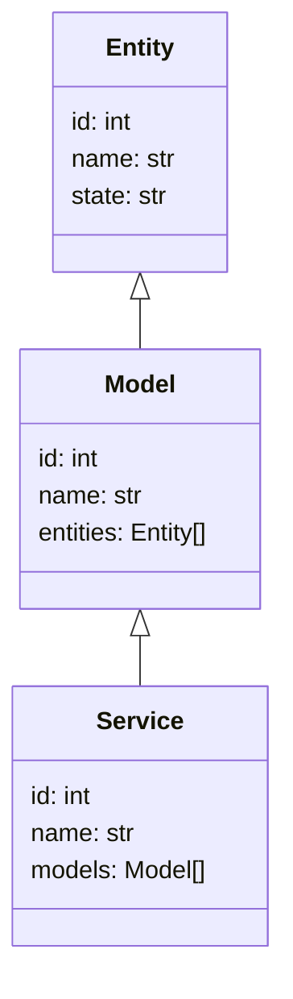

                 


# AI驱动的企业数字孪生技术：虚拟环境中的决策优化与验证

> 关键词：企业数字孪生，人工智能，决策优化，虚拟环境，数字建模

> 摘要：本文探讨了AI驱动的企业数字孪生技术在虚拟环境中的应用，详细分析了数字孪生的核心概念、AI驱动的算法原理、系统架构设计以及实际项目中的应用案例。文章从数字孪生的定义、AI技术的融入、算法实现、系统设计到项目实战，全面解析了AI驱动的企业数字孪生技术如何在虚拟环境中实现决策优化与验证。

---

## 第一部分: AI驱动的企业数字孪生技术背景与基础

### 第1章: 数字孪生技术概述

#### 1.1 数字孪生的定义与核心概念

##### 1.1.1 数字孪生的定义
数字孪生（Digital Twin）是一种虚拟与现实世界实时映射的技术，通过数字模型精确反映物理实体的状态、行为和功能。数字孪生不仅包括数据的实时映射，还支持对物理实体的动态模拟和预测。

##### 1.1.2 数字孪生的核心要素
数字孪生的核心要素包括：
- 数据采集：通过传感器、摄像头等设备实时采集物理实体的数据。
- 模型构建：基于采集的数据，构建物理实体的虚拟模型。
- 实时同步：虚拟模型与物理实体保持实时数据同步。
- 模拟与预测：通过虚拟模型对物理实体的行为进行模拟和预测。
- 交互与优化：用户可以通过虚拟模型对物理实体进行操作和优化。

##### 1.1.3 数字孪生的实现方式
数字孪生的实现方式主要包括：
1. **数据驱动**：基于实时数据构建虚拟模型。
2. **模型驱动**：基于物理模型构建虚拟模型。
3. **混合驱动**：结合数据和模型构建虚拟模型。

#### 1.2 企业数字孪生的背景与意义

##### 1.2.1 数字化转型的现状
随着企业数字化转型的推进，企业需要更加高效地管理复杂的业务流程和系统。数字孪生技术为企业提供了实时、动态的虚拟模型，帮助企业在虚拟环境中进行决策优化和验证。

##### 1.2.2 数字孪生在企业中的应用价值
数字孪生在企业中的应用价值主要体现在以下几个方面：
1. **实时监控**：通过虚拟模型实时监控物理系统的运行状态。
2. **预测分析**：基于虚拟模型对系统进行预测和优化。
3. **减少成本**：通过虚拟验证减少物理实验的成本。
4. **提高效率**：通过虚拟优化提高企业的运营效率。

##### 1.2.3 数字孪生对企业决策优化的作用
数字孪生通过虚拟环境中的实时模拟和预测，为企业提供了更加高效和精准的决策支持。企业在虚拟环境中进行多种方案的模拟和验证，选择最优方案进行实际操作，从而降低风险和成本。

#### 1.3 AI驱动的数字孪生技术

##### 1.3.1 AI在数字孪生中的角色
AI在数字孪生中的角色主要体现在以下几个方面：
1. **数据处理**：AI技术用于处理和分析大量实时数据，提高数据的准确性和处理效率。
2. **模型优化**：AI技术用于优化数字孪生的虚拟模型，提高模型的精度和预测能力。
3. **智能决策**：AI技术用于基于虚拟模型进行智能决策，提供最优解决方案。

##### 1.3.2 数字孪生与虚拟环境的结合
数字孪生与虚拟环境的结合主要体现在以下几个方面：
1. **虚拟建模**：通过虚拟环境构建物理实体的虚拟模型。
2. **实时交互**：用户可以通过虚拟环境与物理实体进行实时交互。
3. **动态模拟**：基于虚拟模型进行动态模拟和预测。

##### 1.3.3 数字孪生与现实世界的映射关系
数字孪生通过虚拟模型与物理实体的实时映射，实现虚拟环境与现实世界的动态交互。这种映射关系不仅体现在数据上，还体现在行为和功能上，使得虚拟模型能够准确反映物理实体的状态和变化。

### 第2章: AI驱动的数字孪生技术基础

#### 2.1 数字孪生的体系结构

##### 2.1.1 数据层
数据层是数字孪生的基础设施，包括数据采集、数据存储和数据处理。数据采集通过传感器、摄像头等设备实时采集物理实体的数据，数据存储将采集的数据存储到数据库中，数据处理对存储的数据进行清洗、转换和分析。

##### 2.1.2 模型层
模型层是数字孪生的核心，包括模型构建、模型优化和模型管理。模型构建基于数据层的数据构建虚拟模型，模型优化通过AI技术优化虚拟模型的精度和性能，模型管理对虚拟模型进行版本控制和维护。

##### 2.1.3 应用层
应用层是数字孪生的最终体现，包括用户界面、功能实现和应用扩展。用户界面是用户与数字孪生系统交互的界面，功能实现基于虚拟模型提供各种功能，应用扩展将数字孪生技术应用于企业的各个业务领域。

#### 2.2 AI驱动的数字孪生核心算法

##### 2.2.1 生成模型
生成模型是基于生成对抗网络（GAN）的一种算法，通过生成对抗网络生成与物理实体相似的虚拟模型。生成模型的核心是生成器和判别器的对抗训练，生成器生成虚拟数据，判别器判断数据的真实性，通过不断对抗训练提高生成模型的精度。

##### 2.2.2 强化学习
强化学习是一种基于奖励机制的算法，通过智能体与环境的交互，不断优化智能体的决策策略。在数字孪生中，强化学习可以用于优化虚拟模型的决策和控制策略，提高系统的运行效率。

##### 2.2.3 图神经网络
图神经网络是一种基于图结构的算法，通过图结构的数据进行学习和推理。在数字孪生中，图神经网络可以用于构建物理实体之间的关系模型，分析系统中各个实体的相互作用和影响。

#### 2.3 数字孪生与现实世界的映射关系

##### 2.3.1 数据采集与处理
数据采集是数字孪生的第一步，通过传感器、摄像头等设备实时采集物理实体的数据。数据处理是对采集的数据进行清洗、转换和分析，确保数据的准确性和可用性。

##### 2.3.2 模型训练与优化
模型训练是基于数据层的数据构建虚拟模型，并通过AI技术优化模型的精度和性能。模型优化包括参数调整、算法改进和模型验证，确保虚拟模型能够准确反映物理实体的状态和行为。

##### 2.3.3 模型验证与部署
模型验证是通过实际数据验证虚拟模型的准确性和可靠性，确保虚拟模型能够准确反映物理实体的状态和变化。模型部署是将虚拟模型应用于实际系统中，提供实时的决策支持和优化建议。

---

## 第二部分: AI驱动的数字孪生核心算法与数学模型

### 第3章: 数字孪生生成模型

#### 3.1 生成模型概述

##### 3.1.1 生成模型的定义
生成模型是一种基于生成对抗网络（GAN）的算法，通过生成器和判别器的对抗训练生成虚拟数据。生成模型的核心是生成器和判别器的对抗关系，生成器生成与真实数据相似的虚拟数据，判别器判断数据的真实性，通过不断对抗训练提高生成模型的生成能力。

##### 3.1.2 生成模型的分类
生成模型主要分为以下几类：
1. **深度生成模型**：基于深度学习的生成模型，如GAN、变分自编码器（VAE）等。
2. **浅层生成模型**：基于浅层学习的生成模型，如朴素贝叶斯生成模型等。
3. **混合生成模型**：结合深度学习和浅层学习的生成模型。

##### 3.1.3 生成模型的应用场景
生成模型在数字孪生中的应用场景主要包括：
1. **虚拟模型生成**：通过生成模型生成与物理实体相似的虚拟模型。
2. **数据增强**：通过生成模型生成额外的数据，提高模型的训练效果。
3. **实时模拟**：通过生成模型进行实时模拟和预测。

#### 3.2 基于生成模型的数字孪生实现

##### 3.2.1 模型训练流程
基于生成模型的数字孪生实现流程主要包括以下几个步骤：
1. **数据准备**：收集和整理物理实体的数据，包括图像、传感器数据等。
2. **模型构建**：基于生成模型构建虚拟模型，包括生成器和判别器的搭建。
3. **对抗训练**：通过生成器和判别器的对抗训练，优化生成模型的生成能力。
4. **模型验证**：通过实际数据验证生成模型的准确性和可靠性。
5. **模型部署**：将生成模型应用于实际系统中，提供实时的决策支持和优化建议。

##### 3.2.2 数据生成与模拟
数据生成与模拟是基于生成模型生成虚拟数据的过程，主要包括数据生成和模拟验证两个步骤。数据生成是通过生成模型生成与物理实体相似的虚拟数据，模拟验证是通过虚拟数据验证生成模型的生成能力。

##### 3.2.3 模型评估与优化
模型评估与优化是通过实际数据验证生成模型的准确性和可靠性，优化生成模型的生成能力。模型评估主要通过生成数据与真实数据的对比，评估生成模型的生成效果。模型优化是通过参数调整和算法改进，提高生成模型的生成能力和准确性。

#### 3.3 生成模型的数学公式

##### 3.3.1 生成模型的损失函数
生成模型的损失函数主要包括生成器损失和判别器损失两部分。生成器损失函数用于优化生成器的生成能力，判别器损失函数用于优化判别器的判别能力。具体数学公式如下：

生成器损失函数：
$$ L_g = \mathbb{E}_{z \sim p(z)}[\log D(G(z))] $$

判别器损失函数：
$$ L_d = \mathbb{E}_{x \sim p(x)}[\log D(x)] + \mathbb{E}_{z \sim p(z)}[\log (1 - D(G(z)))] $$

##### 3.3.2 生成模型的优化算法
生成模型的优化算法主要包括梯度下降和Adam优化器。Adam优化器是一种常用的优化算法，结合动量和自适应学习率，优化生成模型的训练效果。

优化算法的具体数学公式如下：
$$ \theta_{t+1} = \theta_t - \eta \nabla_{\theta} L(\theta) $$

其中，$\theta$ 表示模型参数，$\eta$ 表示学习率，$\nabla_{\theta} L(\theta)$ 表示损失函数的梯度。

---

### 第4章: 强化学习

#### 4.1 强化学习概述

##### 4.1.1 强化学习的定义
强化学习是一种基于奖励机制的算法，通过智能体与环境的交互，不断优化智能体的决策策略。强化学习的核心是通过奖励机制，智能体根据环境的反馈不断调整自己的行为，以达到最优的决策效果。

##### 4.1.2 强化学习的核心要素
强化学习的核心要素包括：
1. **智能体**：智能体是强化学习系统的核心，负责感知环境并做出决策。
2. **环境**：环境是智能体所处的外部世界，智能体通过与环境的交互获取反馈。
3. **动作**：智能体做出的动作，包括选择下一步的操作。
4. **奖励**：环境对智能体动作的反馈，用于指导智能体的决策。

##### 4.1.3 强化学习的应用场景
强化学习在数字孪生中的应用场景主要包括：
1. **智能控制**：通过强化学习优化系统的控制策略，提高系统的运行效率。
2. **决策优化**：通过强化学习优化虚拟模型的决策策略，提高企业的决策效率。
3. **游戏模拟**：通过强化学习进行游戏模拟和训练，提高虚拟模型的智能性。

#### 4.2 强化学习在数字孪生中的应用

##### 4.2.1 强化学习的算法流程
强化学习的算法流程主要包括以下几个步骤：
1. **初始化**：初始化智能体的状态和参数。
2. **环境感知**：智能体感知环境的状态，获取环境的反馈。
3. **决策制定**：智能体根据当前状态做出决策，选择下一步的动作。
4. **执行动作**：智能体执行决策动作，获取环境的反馈。
5. **奖励计算**：根据动作的执行结果计算奖励，指导智能体的下一步决策。
6. **模型更新**：根据奖励更新智能体的模型参数，优化决策策略。

##### 4.2.2 强化学习的数学模型
强化学习的数学模型主要包括状态、动作、奖励和策略四个部分。状态表示智能体所处的环境状态，动作表示智能体做出的决策，奖励表示环境对智能体动作的反馈，策略表示智能体的决策规则。

数学模型的具体公式如下：
$$ Q(s, a) = r + \gamma \max_{a'} Q(s', a') $$

其中，$Q(s, a)$ 表示状态 $s$ 和动作 $a$ 的价值函数，$r$ 表示奖励，$\gamma$ 表示折扣因子，$\max_{a'} Q(s', a')$ 表示下一个状态的最大价值函数。

##### 4.2.3 强化学习的代码实现
以下是基于强化学习的数字孪生实现的Python代码示例：

```python
import numpy as np

class DQN:
    def __init__(self, state_dim, action_dim, gamma=0.99, epsilon=1.0):
        self.state_dim = state_dim
        self.action_dim = action_dim
        self.gamma = gamma
        self.epsilon = epsilon
        self.Q = np.zeros((state_dim, action_dim))

    def choose_action(self, state):
        if np.random.random() < self.epsilon:
            return np.random.randint(self.action_dim)
        else:
            return np.argmax(self.Q[state])

    def update_Q(self, state, action, reward, next_state):
        self.Q[state, action] = reward + self.gamma * np.max(self.Q[next_state])

    def decay_epsilon(self):
        self.epsilon = max(0.01, self.epsilon * 0.99)
```

---

## 第三部分: 数字孪生系统架构设计与实现

### 第5章: 系统架构设计

#### 5.1 问题场景介绍
在企业数字孪生系统中，我们需要构建一个实时、动态的虚拟模型，用于模拟和优化企业的业务流程和系统。系统的用户包括企业的管理层、运维人员和技术开发人员，用户需要通过虚拟模型进行实时监控、预测分析和决策优化。

#### 5.2 系统功能设计

##### 5.2.1 领域模型
领域模型是数字孪生系统的核心，用于描述企业的业务流程和系统结构。领域模型的实现需要考虑企业的业务需求、系统功能和用户交互。以下是领域模型的Mermaid类图：



##### 5.2.2 系统架构
系统的架构设计需要考虑系统的可扩展性、可维护性和性能优化。以下是系统的Mermaid架构图：

```mermaid
div class="mermaid"
graph TD
    A[用户] --> B[前端界面]
    B --> C[业务逻辑层]
    C --> D[数据层]
    D --> E[数据库]
    E --> F[外部系统]
```

##### 5.2.3 系统接口设计
系统接口设计需要考虑系统的输入输出和交互流程。以下是系统的Mermaid序列图：

```mermaid
div class="mermaid"
sequenceDiagram
    participant 用户
    participant 系统
    participant 数据库
    用户->系统: 请求数据
    系统->数据库: 查询数据
    数据库->系统: 返回数据
    系统->用户: 显示数据
```

##### 5.2.4 系统交互设计
系统交互设计需要考虑用户的操作流程和用户体验。以下是系统的Mermaid流程图：

```mermaid
div class="mermaid"
graph TD
    A[用户] --> B[登录]
    B --> C[主页]
    C --> D[选择功能]
    D --> E[执行操作]
    E --> F[返回结果]
```

#### 5.3 系统实现与代码

##### 5.3.1 系统环境安装
系统环境安装需要安装Python、NumPy、TensorFlow、Keras等依赖库。以下是环境安装的命令：

```bash
pip install numpy tensorflow keras scikit-learn matplotlib
```

##### 5.3.2 系统核心代码实现

以下是数字孪生系统的核心代码实现：

```python
import numpy as np
from tensorflow.keras import layers

class DigitalTwin:
    def __init__(self, input_shape):
        self.model = self.build_model(input_shape)
        self.model.compile(optimizer='adam', loss='mse')

    def build_model(self, input_shape):
        model = layers.Sequential()
        model.add(layers.Dense(64, activation='relu', input_shape=input_shape))
        model.add(layers.Dense(32, activation='relu'))
        model.add(layers.Dense(1, activation='linear'))
        return model

    def train(self, x, y, epochs=100, batch_size=32):
        self.model.fit(x, y, epochs=epochs, batch_size=batch_size)

    def predict(self, x):
        return self.model.predict(x)

# 示例使用
dt = DigitalTwin(input_shape=(10,))
x_train = np.random.random((100, 10))
y_train = np.random.random((100, 1))
dt.train(x_train, y_train)
y_predict = dt.predict(x_train)
```

##### 5.3.3 代码应用解读与分析
以上代码实现了一个简单的数字孪生系统，包括模型构建、训练和预测三个部分。模型基于深度学习构建，使用Adam优化器和均方误差损失函数。代码示例展示了如何通过Python和Keras构建一个简单的数字孪生模型，并进行训练和预测。

#### 5.4 项目实战

##### 5.4.1 案例分析
以下是数字孪生技术在制造企业的实际应用案例。制造企业通过数字孪生技术构建虚拟生产线，实时监控生产线的运行状态，预测设备故障，优化生产流程。

##### 5.4.2 实际应用中的挑战与解决方案
在数字孪生技术的实际应用中，主要面临以下挑战：
1. **数据采集与处理**：如何高效地采集和处理大量实时数据。
2. **模型优化**：如何优化虚拟模型的精度和性能。
3. **系统集成**：如何将数字孪生系统与企业的现有系统集成。

解决方案包括：
1. **高效数据采集**：使用边缘计算技术，实时采集和处理数据。
2. **模型优化**：通过分布式计算和并行训练，提高模型的训练效率。
3. **系统集成**：通过API接口和数据对接，实现系统之间的无缝集成。

#### 5.4.3 项目小结
通过数字孪生技术，制造企业实现了生产线的实时监控和优化，提高了生产效率和产品质量。数字孪生技术的应用不仅降低了企业的运营成本，还提高了企业的竞争力。

---

## 第四部分: 数字孪生系统的数学模型与算法实现

### 第6章: 数字孪生系统的数学模型

#### 6.1 数字孪生系统的数学模型

##### 6.1.1 系统状态表示
系统状态表示数字孪生系统的实时状态，包括设备状态、运行参数等。系统状态的表示可以通过向量或矩阵的形式进行，具体表示如下：

$$ S = [s_1, s_2, \dots, s_n] $$

其中，$s_i$ 表示系统状态的第 $i$ 个元素。

##### 6.1.2 系统行为表示
系统行为表示数字孪生系统的动态行为，包括设备的操作、流程的控制等。系统行为的表示可以通过状态转移矩阵进行描述，具体表示如下：

$$ T = [t_{ij}] $$

其中，$t_{ij}$ 表示从状态 $i$ 转移到状态 $j$ 的概率。

##### 6.1.3 系统目标函数
系统目标函数用于评估数字孪生系统的性能，包括系统的运行效率、资源利用率等。系统目标函数的具体表示如下：

$$ f(S, T) = \sum_{i=1}^{n} \sum_{j=1}^{n} t_{ij} \cdot c_{ij} $$

其中，$c_{ij}$ 表示从状态 $i$ 转移到状态 $j$ 的成本。

---

## 第五部分: 数字孪生系统的最佳实践与未来展望

### 第7章: 最佳实践

#### 7.1 数字孪生系统的最佳实践

##### 7.1.1 数据质量管理
数据质量管理是数字孪生系统成功的关键，需要确保数据的准确性、完整性和实时性。数据质量管理的具体措施包括数据清洗、数据标准化和数据加密。

##### 7.1.2 模型优化策略
模型优化策略是提高数字孪生系统性能的关键，需要通过参数调整、算法改进和模型验证不断优化模型的精度和性能。模型优化策略的具体措施包括交叉验证、超参数调优和模型集成。

##### 7.1.3 系统集成与维护
系统集成与维护是确保数字孪生系统稳定运行的关键，需要通过API接口和数据对接实现系统之间的无缝集成，并定期进行系统维护和更新。

### 7.2 小结
数字孪生技术在企业的应用前景广阔，通过虚拟环境中的决策优化与验证，企业可以实现更加高效和精准的管理和运营。数字孪生技术的应用不仅提高了企业的竞争力，还推动了企业的数字化转型和智能化发展。

### 7.3 注意事项

#### 7.3.1 数据安全
数字孪生系统的数据安全是企业需要重点关注的问题，需要通过数据加密、访问控制和安全审计等措施确保数据的安全性。

#### 7.3.2 系统稳定性
数字孪生系统的稳定性是确保系统正常运行的关键，需要通过系统监控、容错设计和故障恢复等措施确保系统的稳定性。

#### 7.3.3 人员培训
数字孪生技术的应用需要企业的相关人员具备一定的技术能力和经验，需要通过人员培训和知识共享等措施提高员工的技术水平。

### 7.4 拓展阅读

#### 7.4.1 数字孪生技术的最新研究
数字孪生技术的最新研究主要集中在以下几个方面：
1. **多模态数据融合**：通过多模态数据融合提高数字孪生系统的感知能力和决策能力。
2. **实时计算优化**：通过实时计算优化提高数字孪生系统的运行效率和响应速度。
3. **边缘计算应用**：通过边缘计算技术实现数字孪生系统的实时数据处理和本地决策。

#### 7.4.2 人工智能与数字孪生的结合
人工智能与数字孪生的结合是数字孪生技术发展的主要方向，通过人工智能技术的引入，数字孪生系统可以实现更加智能和自主的决策和优化。

---

## 作者：AI天才研究院/AI Genius Institute & 禅与计算机程序设计艺术 /Zen And The Art of Computer Programming

---

**文章总结：** 本文详细探讨了AI驱动的企业数字孪生技术在虚拟环境中的应用，从数字孪生的定义、AI驱动的算法原理、系统架构设计到实际项目中的应用案例，全面解析了AI驱动的企业数字孪生技术如何在虚拟环境中实现决策优化与验证。通过本文的学习，读者可以深入了解数字孪生技术的核心概念和实现方法，掌握AI驱动的数字孪生技术在企业中的应用策略和最佳实践，为企业的数字化转型和智能化发展提供有力的技术支持。

