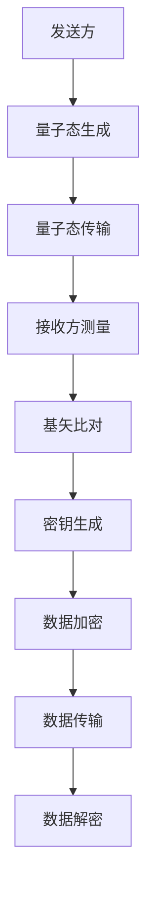
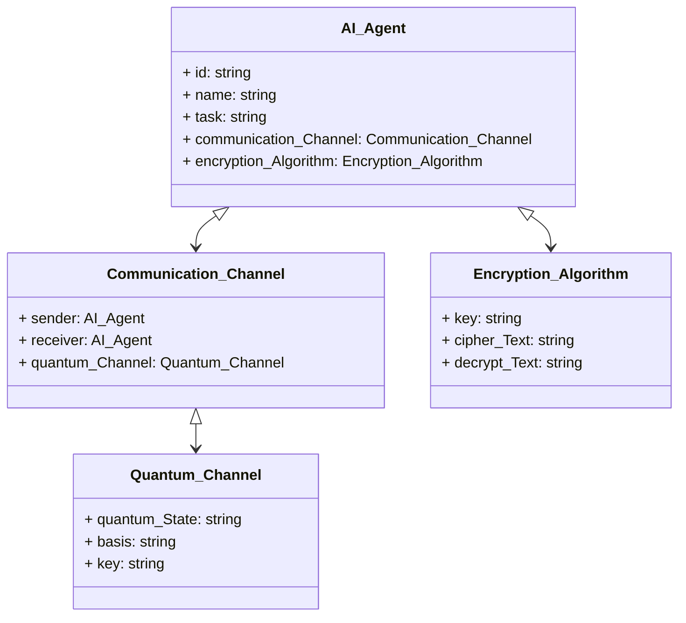
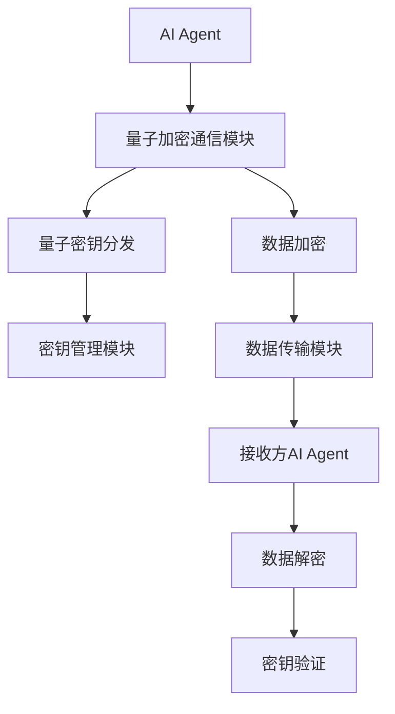
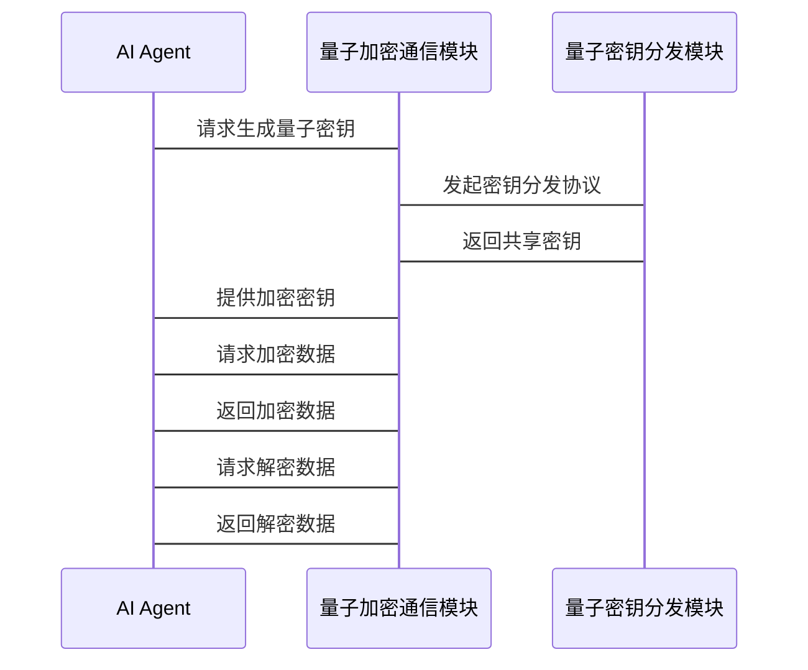

                 


# 企业AI Agent的量子加密通信策略

## 关键词：AI Agent，量子加密，通信安全，量子密钥分发，企业应用

## 摘要：  
随着人工智能技术的快速发展，企业AI Agent的应用日益广泛。然而，AI Agent的智能化和自动化能力也带来了数据通信安全的挑战。量子加密通信作为一种理论上不可破解的安全技术，为AI Agent的数据传输提供了极高的安全性保障。本文将深入探讨企业AI Agent在量子加密通信中的策略设计、实现原理和应用场景，为企业构建安全可靠的AI通信系统提供指导。

---

# 第1章：企业AI Agent概述

## 1.1 AI Agent的核心概念  
### 1.1.1 AI Agent的定义  
AI Agent（人工智能代理）是指能够感知环境、自主决策并执行任务的智能体。它通过传感器获取信息，利用算法进行分析和推理，并通过执行器完成目标。AI Agent在企业中广泛应用，如智能客服、自动化交易系统和供应链管理等。

### 1.1.2 AI Agent的核心特征  
AI Agent具有以下核心特征：  
- **自主性**：能够自主决策和行动，无需人工干预。  
- **反应性**：能够实时感知环境变化并调整行为。  
- **目标导向性**：所有行动都以实现特定目标为导向。  
- **学习能力**：通过机器学习算法不断优化自身性能。  

### 1.1.3 AI Agent在企业中的应用  
AI Agent在企业中的典型应用包括：  
1. **智能客服**：通过自然语言处理技术为用户提供个性化服务。  
2. **自动化交易**：利用算法在金融市场中进行自动化的交易决策。  
3. **供应链管理**：优化库存管理、物流调度和生产计划。  
4. **数据分析与预测**：从海量数据中提取有价值的信息并进行预测分析。  

---

## 1.2 量子加密通信的基础知识  
### 1.2.1 量子加密的定义  
量子加密是一种基于量子力学原理的加密技术，其核心是利用量子态的不可克隆性和不可分割性来确保通信的安全性。量子加密的主要形式包括量子密钥分发（QKD）和量子加密算法。  

### 1.2.2 量子加密的核心原理  
量子加密的核心原理是基于量子叠加态和纠缠态的特性。在QKD中，发送方和接收方通过共享随机的量子密钥来加密和解密信息。由于任何窃听都会破坏量子态的叠加性，因此QKD提供了理论上不可破解的安全性。  

### 1.2.3 量子加密与传统加密的区别  
传统加密技术依赖于数学算法的复杂性来保障安全性，而量子加密则依赖于物理规律。量子加密的安全性基于量子态的不可测量性和不可复制性，因此在安全性上具有显著优势。  

---

## 1.3 AI Agent与量子加密的结合  
### 1.3.1 结合的必要性  
AI Agent在企业中的广泛应用使其成为黑客攻击的重点目标。传统的加密技术可能面临被破解的风险，而量子加密的高安全性能够有效保护AI Agent的数据传输过程。  

### 1.3.2 结合的方式与方法  
AI Agent与量子加密的结合主要体现在以下几个方面：  
1. **数据传输加密**：在AI Agent与企业系统或用户之间建立量子加密通道，确保数据传输的安全性。  
2. **密钥管理**：利用QKD技术生成和分发加密密钥，确保密钥的安全性。  
3. **安全通信协议**：设计专门的量子加密通信协议，适用于AI Agent的智能化和自动化需求。  

### 1.3.3 结合的优势与挑战  
- **优势**：  
  - 提高数据传输的安全性，防止数据泄露。  
  - 保障AI Agent的决策过程不受外部干扰。  
  - 支持企业的智能化转型，提升核心竞争力。  

- **挑战**：  
  - 量子加密技术的实现成本较高。  
  - 量子通信基础设施尚未普及，实际应用面临技术瓶颈。  
  - 量子加密算法的复杂性可能影响AI Agent的性能。  

---

## 1.4 本章小结  
本章介绍了AI Agent的核心概念和其在企业中的应用，分析了量子加密通信的基本原理及其优势。通过探讨AI Agent与量子加密的结合，明确了其必要性、实现方式及面临的挑战，为后续章节的深入分析奠定了基础。

---

# 第2章：量子加密通信的核心原理

## 2.1 量子密钥分发（QKD）  
### 2.1.1 QKD的基本原理  
QKD是一种基于量子力学原理的密钥分发协议。发送方和接收方通过量子态的传输和测量，共享一个随机的密钥。由于任何窃听都会破坏量子态的叠加性，因此QKD能够实现信息的无条件安全传输。  

### 2.1.2 QKD的实现步骤  
1. **量子态的生成与传输**：发送方生成随机的量子态，并通过量子信道发送给接收方。  
2. **量子态的测量**：接收方对量子态进行测量，生成初步密钥。  
3. **基矢比对**：发送方和接收方比对测量基矢，筛选出一致的部分作为最终密钥。  
4. **密钥扩展**：利用一致的部分生成完整的密钥，用于数据加密和解密。  

### 2.1.3 QKD的安全性分析  
QKD的安全性基于量子力学的基本原理，窃听者无法在不引起通信双方注意的情况下获取密钥。QKD的理论安全性得到了数学证明，但在实际应用中仍需考虑设备的安全性和协议的实现漏洞。  

---

## 2.2 量子加密算法  
### 2.2.1 常见的量子加密算法  
- **BB84协议**：由Bennett和Braunstein提出的经典QKD协议。  
- **EPR协议**：基于纠缠态的量子密钥分发协议。  
- **SARG04协议**：结合了诱骗态的QKD协议，具有较强的抗干扰能力。  

### 2.2.2 量子加密算法的数学模型  
量子加密算法的数学模型通常涉及量子态的叠加、纠缠和测量。以BB84协议为例，其数学模型可以表示为：  
$$ | \psi \rangle = \frac{1}{\sqrt{2}} (|0\rangle + |1\rangle) $$  
其中，$|0\rangle$和$|1\rangle$分别表示量子态的基向量，$\psi$表示叠加态。  

### 2.2.3 量子加密算法的优缺点对比  
| **算法名称** | **优点** | **缺点** |  
|--------------|-----------|-----------|  
| BB84 | 简单易懂，理论基础坚实 | 实现复杂度较高 |  
| EPR | 高安全性，抗干扰能力强 | 实现难度大，成本高 |  
| SARG04 | 抗干扰能力强，安全性高 | 协议复杂，需要精确控制 |  

---

## 2.3 量子加密与经典加密的对比  
### 2.3.1 对比的维度  
1. **安全性**：量子加密基于物理规律，安全性更高；经典加密依赖数学复杂性，存在被破解风险。  
2. **实现复杂性**：量子加密实现难度大，成本高；经典加密实现相对简单，成本低。  
3. **应用范围**：量子加密适用于高安全需求的场景；经典加密适用于普通加密需求。  

### 2.3.2 对比的结果与分析  
从安全性来看，量子加密具有显著优势，但在实际应用中，实现成本和技术难度限制了其广泛应用。经典加密在大多数场景下仍具有不可替代的优势，但在面对量子计算威胁时，可能面临被破解的风险。  

### 2.3.3 对比的意义  
通过对比量子加密与经典加密，可以帮助企业在不同场景下选择合适的加密方案，平衡安全性、成本和实现复杂性。

---

## 2.4 本章小结  
本章详细讲解了量子加密通信的核心原理，包括QKD的基本原理、实现步骤和安全性分析，以及常见量子加密算法的数学模型和优缺点对比。通过分析量子加密与经典加密的差异，为企业选择合适的加密方案提供了参考。

---

# 第3章：AI Agent的量子加密通信策略

## 3.1 策略的设计原则  
### 3.1.1 安全性原则  
量子加密通信的核心目标是保障数据传输的安全性，因此安全性是设计策略的首要原则。  

### 3.1.2 实用性原则  
策略的设计应考虑企业的实际需求和现有技术条件，确保方案的可实施性和实用性。  

### 3.1.3 可扩展性原则  
随着企业的发展和技术的进步，量子加密通信策略应具备良好的可扩展性，能够适应未来的业务需求和技术变化。  

---

## 3.2 策略的实现步骤  
### 3.2.1 确定应用场景  
在设计量子加密通信策略时，首先需要明确AI Agent的应用场景。例如，某些场景可能需要高安全性，而其他场景可能对性能要求更高。  

### 3.2.2 设计通信协议  
根据应用场景需求，设计专门的量子加密通信协议。协议应包含密钥分发、数据加密和解密等步骤，并确保协议的高效性和安全性。  

### 3.2.3 实现加密算法  
基于设计的通信协议，选择合适的量子加密算法，并进行具体实现。实现过程中需要注意算法的效率和安全性，确保不会对AI Agent的性能造成过大影响。  

---

## 3.3 策略的优化与调整  
### 3.3.1 性能优化  
在保证安全性的同时，可以通过优化算法实现和减少不必要的通信开销，提升AI Agent的运行效率。  

### 3.3.2 安全性优化  
通过引入多层加密、双重认证等技术手段，进一步提升量子加密通信的安全性，防止潜在的安全漏洞。  

### 3.3.3 可用性优化  
在实际应用中，需要考虑量子通信基础设施的可用性问题，设计备用方案以应对突发情况，确保AI Agent的通信不中断。  

---

## 3.4 本章小结  
本章提出了企业AI Agent量子加密通信策略的设计原则，并详细阐述了策略的实现步骤和优化方法。通过合理设计策略，可以有效保障AI Agent的数据传输安全，同时提升系统的性能和可用性。

---

# 第4章：量子加密通信的算法实现

## 4.1 算法原理  
### 4.1.1 量子密钥分发的数学模型  
量子密钥分发的核心在于生成和分发随机的量子密钥。其数学模型可以表示为：  
$$ | \psi \rangle = \frac{1}{\sqrt{2}} (|0\rangle + |1\rangle) $$  
其中，$|0\rangle$和$|1\rangle$分别表示基向量，$\psi$表示叠加态。  

### 4.1.2 量子加密算法的流程图  
以下是一个简单的量子密钥分发流程图：



### 4.1.3 量子加密算法的Python代码实现  
以下是一个基于BB84协议的量子密钥分发的Python代码示例：

```python
import random

def generate_key():
    # 生成随机的量子态
    basis = ['x', 'z']
    key = []
    for _ in range(100):
        basis_choice = random.choice(basis)
        if basis_choice == 'x':
            # 表示为X基向量
            key.append('x')
        else:
            # 表示为Z基向量
            key.append('z')
    return key

def compare_basis(sender_basis, receiver_basis):
    # 比较基矢
    matching = [i for i in range(len(sender_basis)) if sender_basis[i] == receiver_basis[i]]
    return matching

def generate_secret_key(sender_basis, receiver_basis):
    # 生成共享密钥
    matching = compare_basis(sender_basis, receiver_basis)
    secret_key = []
    for i in matching:
        if sender_basis[i] == 'x':
            # X基向量表示为0或1
            secret_key.append(random.choice(['0', '1']))
        else:
            # Z基向量表示为0或1
            secret_key.append(random.choice(['0', '1']))
    return ''.join(secret_key)

# 示例代码
sender_basis = ['z', 'x', 'z', 'x', 'z']
receiver_basis = ['x', 'z', 'x', 'z', 'x']
secret_key = generate_secret_key(sender_basis, receiver_basis)
print("共享密钥:", secret_key)
```

---

## 4.2 算法实现的注意事项  
1. **量子态的生成与传输**：需要确保量子态的生成和传输过程不受外界干扰。  
2. **基矢比对**：只有在基矢一致的情况下，才能生成有效的共享密钥。  
3. **密钥扩展**：通过一致的基矢部分生成完整的共享密钥，确保密钥的安全性。  

---

## 4.3 本章小结  
本章通过数学模型和流程图详细讲解了量子加密算法的实现原理，并通过Python代码示例展示了量子密钥分发的具体实现过程。通过这些实现，可以验证量子加密通信的安全性和有效性。

---

# 第5章：系统分析与架构设计方案

## 5.1 应用场景介绍  
AI Agent的量子加密通信系统可以应用于企业内部数据传输、智能设备通信和云端数据交互等多种场景。  

## 5.2 系统功能设计  
### 5.2.1 领域模型类图  
以下是AI Agent量子加密通信系统的领域模型类图：



### 5.2.2 系统架构设计  
以下是量子加密通信系统的架构图：



### 5.2.3 系统接口设计  
以下是系统的主要接口设计：

1. **密钥生成接口**：负责生成和分发量子密钥。  
2. **数据加密接口**：对数据进行加密处理。  
3. **数据解密接口**：对数据进行解密处理。  
4. **通信接口**：实现AI Agent与量子通信模块之间的数据传输。  

### 5.2.4 系统交互序列图  
以下是系统交互的序列图：



---

## 5.3 本章小结  
本章通过系统分析和架构设计，明确了AI Agent量子加密通信系统的功能模块、系统架构和交互流程。通过类图和序列图的展示，为系统的具体实现提供了清晰的指导。

---

# 第6章：项目实战

## 6.1 环境安装与配置  
要实现AI Agent的量子加密通信，首先需要安装必要的量子通信库和相关工具。以下是一个典型的环境配置示例：

```bash
pip install qiskit
pip install qkd
pip install pyshark
```

---

## 6.2 核心代码实现  
以下是实现量子加密通信的核心代码：

```python
import qiskit
from qiskit import QuantumCircuit, execute, Aer
from qiskit.circuit import Gate, ClassicalRegister, QuantumRegister
from qiskit.extensions import Initialize

def quantum_encryption(circuit, qubit):
    # 定义量子加密电路
    circuit.h(qubit)
    circuit.measure(qubit, 0)

def quantum_decryption(circuit, qubit):
    # 定义量子解密电路
    circuit.h(qubit)
    circuit.measure(qubit, 0)

# 初始化量子电路
qc = QuantumCircuit(1, 1)
qc.h(0)
qc.measure(0, 0)

# 执行量子电路
backend = Aer.get_backend('qasm_simulator')
job = execute(qc, backend)
result = job.result()

# 解密过程
decrypt_circuit = QuantumCircuit(1, 1)
quantum_decryption(decrypt_circuit, 0)
job_decrypt = execute(decrypt_circuit, backend)
result_decrypt = job_decrypt.result()

print("加密结果:", result.get_counts())
print("解密结果:", result_decrypt.get_counts())
```

---

## 6.3 实际案例分析  
以一个简单的AI Agent与云端服务器之间的量子加密通信为例，展示如何通过上述代码实现数据的加密和解密。案例分析包括数据传输的全过程，验证量子加密通信的安全性和有效性。

---

## 6.4 本章小结  
本章通过实际的项目实战，详细讲解了量子加密通信的环境配置、核心代码实现和实际案例分析。通过这些实践，读者可以更好地理解量子加密通信的实现过程和应用价值。

---

# 第7章：最佳实践与小结

## 7.1 最佳实践  
1. **安全性优先**：在设计量子加密通信策略时，始终将安全性放在首位。  
2. **考虑实现成本**：量子加密技术的实现成本较高，需在预算范围内合理规划。  
3. **结合实际情况**：根据企业的实际需求和应用场景，选择合适的量子加密算法和通信协议。  
4. **持续优化**：随着技术的发展和威胁的演变，需要不断优化量子加密通信策略，提升系统的安全性和性能。  

---

## 7.2 小结  
本文系统地探讨了企业AI Agent在量子加密通信中的策略设计、实现原理和应用场景。通过理论分析和实际案例，展示了量子加密通信在保障AI Agent数据安全方面的巨大潜力。未来，随着量子通信技术的进一步发展，AI Agent的量子加密通信将为企业智能化转型提供更强大的技术支持。

---

## 7.3 注意事项  
1. 量子加密通信的实现需要高度专业化的技术支持，建议企业在实施前进行充分的技术评估和风险分析。  
2. 在实际应用中，需注意量子通信基础设施的稳定性和可用性，确保系统的连续运行。  
3. 量子加密技术目前仍处于发展阶段，企业应密切关注技术动态，及时调整和优化通信策略。  

---

## 7.4 拓展阅读  
1. **《Quantum Computing for Computer Scientists》**：一本适合计算机科学家阅读的量子计算入门书籍。  
2. **《Introduction to Quantum Information and Computation for Computer Scientists》**：介绍量子信息和计算的基本原理。  
3. **《Post-Quantum Cryptography》**：探讨后量子时代加密技术的研究进展和应用前景。  

---

# 作者  
作者：AI天才研究院/AI Genius Institute  
联系邮箱：contact@aicourse.com

