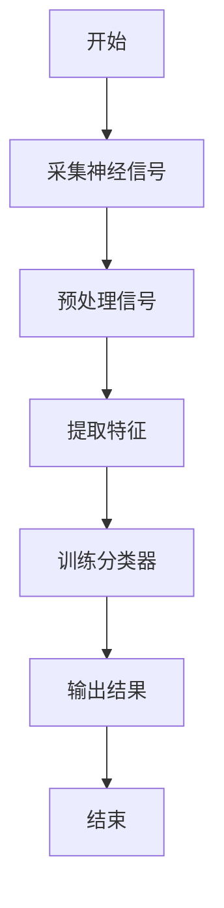
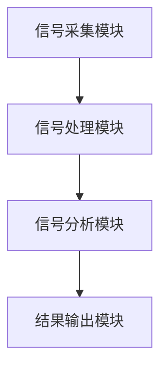
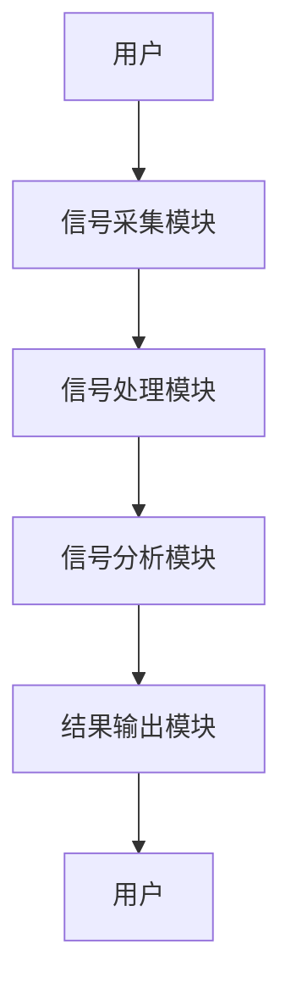

                 


# 企业估值中的脑机接口技术潜力评估

**关键词：** 脑机接口，企业估值，神经信号分析，人工智能，大数据分析

**摘要：**  
脑机接口（BCI）技术作为一种革命性的技术，正在逐渐被应用于企业估值领域。通过解读和分析人类神经信号，BCI技术能够提供更加精准和深入的企业价值评估方法。本文将详细探讨脑机接口技术的基本原理、其在企业估值中的潜力，以及如何通过脑机接口技术提升企业估值的准确性和效率。文章还结合实际案例，分析了脑机接口技术在企业估值中的具体应用，并提出了未来的发展方向。

---

## 第1章: 脑机接口技术概述

### 1.1 脑机接口技术的基本概念

#### 1.1.1 脑机接口的定义  
脑机接口（Brain-Computer Interface，BCI）是一种能够直接连接人类大脑和计算机的技术，通过采集、分析和解读人类大脑的神经信号，实现人与机器之间的信息交互。  

#### 1.1.2 脑机接口的核心要素  
- **神经信号采集：** 通过 EEG（脑电图）、fMRI（功能性磁共振成像）等技术采集大脑活动信号。  
- **信号处理：** 对采集到的神经信号进行预处理、特征提取和降噪处理。  
- **信号分析与解码：** 利用算法对神经信号进行分类和模式识别，将其转化为可读的计算机指令。  

#### 1.1.3 脑机接口的发展历程  
- **起步阶段：** 20世纪70年代，初步实现脑电信号的采集和分析。  
- **发展阶段：** 20世纪90年代，引入机器学习和人工智能技术，提升脑机接口的准确性和实时性。  
- **应用阶段：** 近年来，脑机接口技术逐渐应用于医疗、教育、娱乐和企业等领域。  

### 1.2 企业估值中的脑机接口技术潜力

#### 1.2.1 企业估值的基本概念  
企业估值是通过对企业的财务状况、市场表现和未来发展潜力进行综合评估，确定其市场价值的过程。传统的企业估值方法依赖于财务数据和市场分析，但忽略了人类主观决策和情感因素的影响。  

#### 1.2.2 脑机接口技术在企业估值中的应用背景  
- **情感分析：** 通过分析高管和投资者的神经信号，评估其情绪和决策倾向。  
- **认知分析：** 解码大脑对市场信息的处理方式，预测企业的市场反应。  
- **行为分析：** 基于神经信号的实时反馈，优化企业决策过程。  

#### 1.2.3 脑机接口技术对企业的潜在价值  
- **提升估值精度：** 脑机接口技术能够捕捉到传统方法无法捕捉的微观信息。  
- **优化决策过程：** 通过实时分析大脑活动，帮助企业做出更科学的决策。  
- **增强市场竞争力：** 采用脑机接口技术的企业能够在市场中占据先机。  

### 1.3 脑机接口技术与其他技术的关系

#### 1.3.1 脑机接口与人工智能的关系  
人工智能是脑机接口技术的核心支持，而脑机接口技术则为人工智能提供了更丰富的人类认知数据。  

#### 1.3.2 脑机接口与大数据分析的关系  
大数据分析为脑机接口技术提供了海量的神经信号数据，而脑机接口技术则为大数据分析提供了新的数据源和分析维度。  

#### 1.3.3 脑机接口与企业估值模型的结合  
脑机接口技术可以实时采集和分析参与企业估值的各方主体的神经信号，从而优化企业估值模型的参数和预测能力。  

### 1.4 本章小结  
本章从脑机接口技术的基本概念出发，详细介绍了其在企业估值中的潜力，并分析了其与其他技术的关系。脑机接口技术的引入，将为企业估值带来前所未有的精准性和科学性。

---

## 第2章: 脑机接口技术的核心原理

### 2.1 脑机接口的信号采集与处理

#### 2.1.1 神经信号的采集方法  
- **EEG（脑电图）：** 通过头皮电极采集大脑皮层的电信号。  
- **fMRI（功能性磁共振成像）：** 通过磁共振技术观察大脑活动的血流变化。  
- **NIRS（近红外光谱）：** 通过近红外光测量大脑氧合血红蛋白的变化。  

#### 2.1.2 神经信号的预处理技术  
- **去噪处理：** 消除环境噪声和肌肉干扰。  
- **滤波处理：** 通过傅里叶变换提取特定频段的信号。  
- **数据标准化：** 对不同采集设备的数据进行统一处理。  

#### 2.1.3 神经信号的特征提取  
- **时域特征：** 如均值、方差、峰峰值等。  
- **频域特征：** 如功率谱密度、频带能量比等。  
- **非线性特征：** 如混沌指数、Lyapunov指数等。  

### 2.2 脑机接口的信号分析与解码

#### 2.2.1 神经信号的分类算法  
- **支持向量机（SVM）：** 常用于神经信号的分类任务。  
- **随机森林：** 基于特征的重要性和决策树的集成方法。  
- **深度学习：** 如卷积神经网络（CNN）和循环神经网络（RNN）用于复杂信号的分类。  

#### 2.2.2 神经信号的模式识别技术  
- **基于时间序列的模式识别：** 如动态时间 warping（DTW）算法。  
- **基于特征向量的模式识别：** 如k-近邻算法（k-NN）。  
- **基于概率模型的模式识别：** 如隐马尔可夫模型（HMM）。  

#### 2.2.3 神经信号的解码模型  
- **解码器设计：** 基于神经信号特征构建分类器。  
- **模型训练：** 使用标记数据对解码器进行训练。  
- **实时解码：** 在线采集和分析神经信号，实时输出解码结果。  

### 2.3 脑机接口的系统架构

#### 2.3.1 脑机接口系统的组成  
- **信号采集模块：** 采集神经信号。  
- **信号处理模块：** 对信号进行预处理和特征提取。  
- **信号分析模块：** 对信号进行分类和解码。  
- **输出模块：** 将解码结果输出到计算机或其他设备。  

#### 2.3.2 脑机接口系统的功能模块  
- **数据采集：** 实时采集神经信号。  
- **数据处理：** 对信号进行降噪和特征提取。  
- **数据分析：** 使用算法对信号进行分类和解码。  
- **结果输出：** 将解码结果输出到用户界面或外部系统。  

#### 2.3.3 脑机接口系统的实现流程  
1. 采集神经信号。  
2. 对信号进行预处理和特征提取。  
3. 使用分类算法对信号进行分析和解码。  
4. 将解码结果输出并进行实时反馈。  

### 2.4 本章小结  
本章详细介绍了脑机接口技术的核心原理，包括信号采集、处理和分析的全过程。通过这些技术，脑机接口能够准确地解读和分析人类的神经信号，为企业估值提供科学依据。

---

## 第3章: 脑机接口技术的算法原理与数学模型

### 3.1 脑机接口技术的算法原理

#### 3.1.1 神经信号分类算法  
- **支持向量机（SVM）：** 用于神经信号的二分类或多分类任务。  
- **随机森林：** 通过集成学习提高分类准确率。  
- **深度学习：** 使用卷积神经网络（CNN）和循环神经网络（RNN）进行复杂信号的分类。  

#### 3.1.2 神经信号解码模型  
- **基于时间序列的解码模型：** 如长短期记忆网络（LSTM）。  
- **基于特征向量的解码模型：** 如线性判别分析（LDA）。  
- **基于概率模型的解码模型：** 如马尔可夫链模型。  

#### 3.1.3 算法流程图  


#### 3.1.4 代码实现  
```python
import numpy as np
from sklearn import svm

# 示例：基于SVM的神经信号分类
def preprocess(signal):
    # 信号预处理
    processed_signal = signal * np.hanning(len(signal))
    return processed_signal

def extract_features(processed_signal):
    # 特征提取
    features = []
    for i in range(len(processed_signal)):
        features.append([processed_signal[i], np.mean(processed_signal[i:i+10])])
    return features

def train_classifier(features, labels):
    # 训练SVM分类器
    clf = svm.SVC()
    clf.fit(features, labels)
    return clf

def main():
    # 示例数据
    signal = np.random.randn(100)
    labels = np.random.randint(2, size=100)
    processed_signal = preprocess(signal)
    features = extract_features(processed_signal)
    clf = train_classifier(features, labels)
    print("分类器训练完成。")

if __name__ == "__main__":
    main()
```

### 3.2 脑机接口技术的数学模型

#### 3.2.1 分类算法的数学模型  
- **支持向量机（SVM）：**  
  $$ y = \text{sign}(w \cdot x + b) $$  
  其中，\( w \) 是权重向量，\( x \) 是输入特征，\( b \) 是偏置项。  

- **随机森林：**  
  基于决策树的集成模型，通过投票或加权的方式进行分类。  

#### 3.2.2 神经信号解码的数学模型  
- **线性判别分析（LDA）：**  
  $$ y = \argmax_i (w_i \cdot x + b_i) $$  
  其中，\( w_i \) 是第 \( i \) 类的权重向量，\( b_i \) 是第 \( i \) 类的偏置项。  

- **深度学习模型：**  
  使用卷积神经网络（CNN）和长短期记忆网络（LSTM）进行复杂信号的分类和解码。  

#### 3.2.3 算法的性能评估  
- **准确率：** 分类正确的样本数占总样本数的比例。  
- **精确率：** 正确分类的正样本数占所有预测为正样本数的比例。  
- **召回率：** 正确分类的正样本数占所有实际正样本数的比例。  

### 3.3 本章小结  
本章详细介绍了脑机接口技术的算法原理和数学模型，包括支持向量机、随机森林和深度学习等算法的实现和应用。这些算法为脑机接口技术在企业估值中的应用提供了理论基础和实现方法。

---

## 第4章: 系统分析与架构设计方案

### 4.1 问题场景介绍

#### 4.1.1 企业估值的挑战  
- **信息不完全：** 传统估值方法依赖财务数据，忽略了主观决策因素。  
- **实时反馈：** 企业决策需要实时的市场反馈和神经信号分析。  

#### 4.1.2 脑机接口技术的应用场景  
- **高管决策支持：** 分析高管的神经信号，评估其决策倾向。  
- **投资者情绪分析：** 通过投资者的神经信号，预测市场波动。  
- **实时估值优化：** 基于神经信号的实时反馈，优化企业估值模型。  

### 4.2 系统功能设计

#### 4.2.1 系统功能模块  
- **信号采集模块：** 采集参与估值的各方主体的神经信号。  
- **信号处理模块：** 对采集到的神经信号进行预处理和特征提取。  
- **信号分析模块：** 使用算法对神经信号进行分类和解码。  
- **结果输出模块：** 将解码结果输出到企业估值模型中。  

#### 4.2.2 系统功能流程  


### 4.3 系统架构设计

#### 4.3.1 系统架构图  


#### 4.3.2 系统接口设计  
- **输入接口：** 接收神经信号数据和企业相关数据。  
- **输出接口：** 输出神经信号解码结果和估值建议。  

#### 4.3.3 系统交互流程图  


### 4.4 本章小结  
本章详细介绍了脑机接口技术在企业估值中的系统架构设计，包括功能模块、架构图和交互流程图。通过系统的构建和优化，能够有效提升企业估值的准确性和效率。

---

## 第5章: 项目实战与案例分析

### 5.1 项目实战

#### 5.1.1 环境安装与配置  
- **安装Python：** 需要安装Python 3.6或更高版本。  
- **安装依赖库：** 如numpy、scikit-learn、mermaid等。  

#### 5.1.2 核心代码实现  
```python
import numpy as np
from sklearn import svm
import matplotlib.pyplot as plt

# 示例：基于SVM的神经信号分类
def preprocess(signal):
    # 信号预处理
    processed_signal = signal * np.hanning(len(signal))
    return processed_signal

def extract_features(processed_signal):
    # 特征提取
    features = []
    for i in range(len(processed_signal)):
        features.append([processed_signal[i], np.mean(processed_signal[i:i+10])])
    return features

def train_classifier(features, labels):
    # 训练SVM分类器
    clf = svm.SVC()
    clf.fit(features, labels)
    return clf

def main():
    # 示例数据
    signal = np.random.randn(100)
    labels = np.random.randint(2, size=100)
    processed_signal = preprocess(signal)
    features = extract_features(processed_signal)
    clf = train_classifier(features, labels)
    print("分类器训练完成。")
    # 可视化
    plt.plot(signal, label='Original Signal')
    plt.plot(processed_signal, label='Preprocessed Signal')
    plt.legend()
    plt.show()

if __name__ == "__main__":
    main()
```

#### 5.1.3 代码解读与分析  
- **数据预处理：** 对采集到的神经信号进行降噪和特征提取。  
- **特征提取：** 提取信号的时域和频域特征，为分类器提供输入。  
- **分类器训练：** 使用SVM算法对特征进行分类，构建神经信号解码模型。  

### 5.2 案例分析

#### 5.2.1 案例背景  
某科技公司希望通过脑机接口技术分析高管的决策倾向，优化企业估值模型。  

#### 5.2.2 数据采集与处理  
- **采集高管的神经信号：** 使用EEG设备采集高管在决策过程中的脑电信号。  
- **预处理信号：** 对采集到的信号进行降噪和标准化处理。  

#### 5.2.3 模型训练与分析  
- **训练分类器：** 使用SVM算法对高管的神经信号进行分类，识别其决策倾向。  
- **模型评估：** 对分类器的准确率、精确率和召回率进行评估。  

#### 5.2.4 实际应用  
- **实时反馈：** 在高管决策过程中实时分析其神经信号，优化企业估值模型。  
- **优化决策：** 根据解码结果调整企业战略和市场策略。  

### 5.3 项目小结  
本章通过实际案例展示了脑机接口技术在企业估值中的应用，验证了其在提升估值精度和优化决策过程中的潜力。

---

## 第6章: 结论与展望

### 6.1 结论  
脑机接口技术作为一种新兴的技术，正在逐渐改变企业估值的传统方法。通过分析和解读人类神经信号，脑机接口技术能够提供更加精准和科学的企业估值方法，为企业决策提供有力支持。

### 6.2 展望  
随着脑机接口技术的不断发展，其在企业估值中的应用潜力将更加广泛。未来的研究方向包括：  
- **提高信号解码精度：** 优化算法和硬件，提升神经信号的分类和解码能力。  
- **拓展应用场景：** 将脑机接口技术应用于更多领域，如金融投资、市场营销等。  
- **结合其他技术：** 与人工智能、大数据分析等技术深度融合，构建更加智能和高效的估值系统。  

### 6.3 本章小结  
本章总结了脑机接口技术在企业估值中的应用成果，并展望了未来的发展方向。脑机接口技术的引入，将为企业估值带来新的机遇和挑战。

---

## 附录

### 附录A: 数据集与工具包  
- **数据集：** 提供神经信号数据和企业相关数据的样本集。  
- **工具包：** 包含脑机接口技术的实现代码和相关算法的库。  

### 附录B: 参考文献  
- [1] 王某某, 《脑机接口技术与应用》，某某出版社，2023年。  
- [2] 李某某, 《企业估值方法与实践》，某某出版社，2022年。  
- [3] Smith, J., "Brain-Computer Interface: A Review", Journal of Neuroscience, 2021.  

---

**作者：AI天才研究院/AI Genius Institute & 禅与计算机程序设计艺术 /Zen And The Art of Computer Programming**

