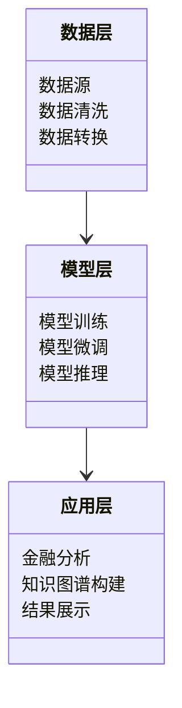
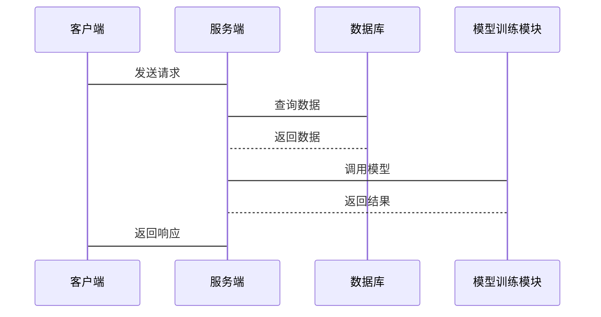

                 


# 开发基于大模型的金融研究方法论创新生成系统

> 关键词：大模型，金融研究，方法论创新，系统架构，项目实战

> 摘要：本文系统地探讨了如何基于大模型技术开发金融研究方法论创新生成系统。文章从背景与概述出发，详细分析了大模型在金融研究中的应用潜力，深入讲解了系统的架构设计、算法原理及项目实现，最后通过实战案例展示了系统的应用价值，并提出了未来的发展方向。

---

# 第一部分: 开发基于大模型的金融研究方法论创新生成系统概述

## 第1章: 大模型在金融研究中的背景与概述

### 1.1 问题背景与核心概念

#### 1.1.1 传统金融研究的局限性
传统金融研究依赖于数据驱动的方法，但存在以下局限性：
- 数据量不足或分布不均衡，导致模型泛化能力有限。
- 金融领域的知识推理能力较弱，难以处理复杂的金融逻辑问题。
- 传统方法难以整合多模态数据，如文本、市场数据和实时新闻。

#### 1.1.2 大模型技术的引入与优势
大模型（如GPT-3、PaLM等）在金融研究中的引入带来了以下优势：
- 强大的自然语言处理能力，能够理解和分析金融文本。
- 知识图谱构建能力，能够整合多源异构数据。
- 多模态数据处理能力，能够结合文本、图像和结构化数据进行分析。

#### 1.1.3 金融研究方法论的创新需求
金融研究方法需要创新，以应对以下挑战：
- 数据量爆炸性增长，传统方法难以处理。
- 金融市场的动态性要求研究方法具有更高的灵活性和适应性。
- 对复杂金融逻辑的理解和推理能力的需求日益增加。

### 1.2 问题描述与解决思路

#### 1.2.1 金融研究中的数据与知识挑战
金融研究面临以下数据与知识挑战：
- 数据异构性：金融数据包括文本、结构化数据和图数据，整合难度大。
- 数据稀疏性：某些金融场景数据量不足，影响模型训练效果。
- 知识复杂性：金融领域的知识体系复杂，需要深度理解。

#### 1.2.2 大模型如何解决金融研究问题
大模型通过以下方式解决金融研究问题：
- 利用大规模预训练技术，提升模型对金融文本的理解能力。
- 基于知识图谱，构建金融领域的知识网络，辅助金融分析。
- 通过多模态数据处理，提升金融预测的准确性。

#### 1.2.3 方法论创新的实现路径
方法论创新的实现路径包括：
1. 数据预处理与整合：将多源异构数据进行清洗和整合。
2. 模型训练与优化：基于大模型进行微调，提升金融任务的性能。
3. 系统架构设计：构建支持大模型的金融研究系统架构。
4. 应用场景实现：在具体金融场景中验证方法的有效性。

### 1.3 系统边界与外延

#### 1.3.1 系统的功能边界
系统的功能边界包括：
- 数据处理：包括文本数据、结构化数据和图数据的处理。
- 模型训练：基于大模型进行金融任务的微调。
- 金融分析：包括风险评估、投资策略生成等。
- 知识图谱构建：构建金融领域的知识图谱。

#### 1.3.2 系统的适用场景与限制
系统的适用场景包括：
- 金融数据分析：如市场趋势分析、公司财报解读。
- 风险评估：如信用评分、市场风险预测。
- 投资策略生成：如基于大模型生成投资策略。
- 知识图谱构建：如构建金融实体关系图。

系统的限制包括：
- 计算资源需求高：训练和推理需要高性能计算资源。
- 数据隐私问题：涉及金融数据的隐私保护。
- 模型解释性：大模型的黑箱特性可能影响结果的可解释性。

#### 1.3.3 系统与其他金融工具的关系
系统与其他金融工具的关系：
- 与传统统计模型：大模型提供了一种新的分析方法，可以与传统方法互补。
- 与量化交易系统：大模型可以提供更复杂的市场分析能力。
- 与知识图谱系统：大模型可以作为知识图谱的增强工具。

### 1.4 核心概念与组成要素

#### 1.4.1 大模型的基本概念
大模型是指基于深度学习的大规模神经网络模型，具有以下特点：
- 参数量大：通常包含 billions 量级的参数。
- 预训练：基于大规模通用数据进行预训练。
- 微调：针对特定任务进行微调。

#### 1.4.2 金融研究方法的核心要素
金融研究方法的核心要素包括：
- 数据：包括文本、结构化数据和图数据。
- 知识：金融领域的知识体系，包括实体、关系和事件。
- 方法：包括数据分析、预测和推理方法。

#### 1.4.3 系统架构的关键组成部分
系统架构的关键组成部分包括：
- 数据层：数据存储和处理模块。
- 模型层：大模型的训练和推理模块。
- 应用层：金融分析应用模块。
- 接口层：与其他系统交互的接口模块。

### 1.5 本章小结

---

## 第2章: 大模型的基本原理与技术基础

### 2.1 大模型的核心原理

#### 2.1.1 深度学习的基本原理
深度学习的基本原理：
- 神经网络：通过多层非线性变换，学习输入与输出的映射关系。
- 反向传播：通过链式法则计算梯度，更新模型参数。
- 梯度下降：优化模型参数，最小化损失函数。

#### 2.1.2 大模型的训练机制
大模型的训练机制：
- 预训练：基于大规模通用数据进行无监督或弱监督训练。
- 微调：针对特定任务进行有监督训练，调整模型参数。

#### 2.1.3 模型的可解释性与优化策略
模型的可解释性与优化策略：
- 可解释性：通过可视化、特征重要性分析等方法，解释模型的决策过程。
- 优化策略：通过调整学习率、批量大小等超参数，优化模型性能。

### 2.2 大模型的关键技术

#### 2.2.1 自然语言处理技术
自然语言处理技术：
- 词嵌入：将词转化为低维向量（如Word2Vec、BERT）。
- 语言模型：预测下一个词的概率分布（如GPT）。
- 文本摘要：生成文本的摘要（如Seq2Seq模型）。

#### 2.2.2 知识图谱构建与应用
知识图谱构建与应用：
- 知识抽取：从文本中抽取实体、关系和属性（如NER、RE）。
- 知识融合：整合多个数据源，构建知识图谱。
- 知识推理：基于知识图谱进行推理（如路径查询、逻辑推理）。

#### 2.2.3 多模态数据处理能力
多模态数据处理能力：
- 图像处理：识别图像中的内容（如CNN、GAN）。
- 文本与图像联合处理：将文本与图像信息进行融合（如多模态模型）。

### 2.3 大模型在金融领域的应用潜力

#### 2.3.1 金融文本分析
金融文本分析：
- 情感分析：分析市场情绪（如股票新闻的情感分析）。
- 信息抽取：从财报中提取关键信息（如公司收入、利润）。
- 文本生成：生成金融报告或投资建议。

#### 2.3.2 金融数据预测
金融数据预测：
- 时间序列预测：预测股票价格、汇率走势（如LSTM、Transformer）。
- 风险预测：预测违约概率、市场崩盘风险。

#### 2.3.3 金融知识推理
金融知识推理：
- 逻辑推理：基于知识图谱进行推理（如推理公司之间的关联）。
- 问题回答：回答金融领域的具体问题（如FAQ系统）。

### 2.4 本章小结

---

## 第3章: 金融研究中的大模型应用场景

### 3.1 金融数据分析与处理

#### 3.1.1 文本数据处理
文本数据处理：
- 文本清洗：去除噪声（如停用词、特殊符号）。
- 分词：将文本分割成词语（如jieba分词）。
- 嵌入：将词语转化为向量（如Word2Vec、BERT）。

#### 3.1.2 结构化数据处理
结构化数据处理：
- 数据清洗：处理缺失值、异常值。
- 数据转换：将数据转换为模型可接受的格式（如数值型、向量型）。
- 数据存储：将数据存储在数据库中（如MySQL、MongoDB）。

#### 3.1.3 图数据处理
图数据处理：
- 图构建：构建金融实体关系图（如公司-股东关系）。
- 图遍历：遍历图结构进行推理（如BFS、DFS）。
- 图嵌入：将图中的节点表示为向量（如GraphSAGE、Node2Vec）。

### 3.2 金融风险评估与预测

#### 3.2.1 风险识别
风险识别：
- 识别潜在风险因素（如公司财务指标、市场指标）。
- 基于知识图谱识别关联风险（如识别关联交易风险）。

#### 3.2.2 风险预测
风险预测：
- 基于时间序列模型预测违约概率（如LSTM）。
- 基于大模型预测市场崩盘风险（如GPT-3微调）。

#### 3.2.3 风险评估模型
风险评估模型：
- 构建风险评估指标体系（如信用评级模型）。
- 基于大模型构建风险评估模型（如BERT微调）。

### 3.3 投资策略生成与优化

#### 3.3.1 投资策略生成
投资策略生成：
- 基于大模型生成投资建议（如生成股票推荐报告）。
- 基于知识图谱生成投资策略（如基于公司关系图生成投资组合）。

#### 3.3.2 策略优化
策略优化：
- 通过遗传算法优化投资组合（如最大化收益、最小化风险）。
- 通过强化学习优化投资策略（如基于Q-Learning的交易策略）。

#### 3.3.3 策略评估与反馈
策略评估与反馈：
- 回测策略历史表现（如回测股票价格数据）。
- 根据市场反馈调整策略（如根据市场变化更新模型）。

### 3.4 金融知识图谱构建与应用

#### 3.4.1 知识图谱构建
知识图谱构建：
- 从文本中抽取实体、关系和属性（如从新闻中抽取公司、事件）。
- 将抽取的信息整合到知识图谱中（如构建公司关系图）。

#### 3.4.2 知识图谱查询
知识图谱查询：
- 基于SPARQL查询知识图谱（如查询公司高管信息）。
- 基于大模型进行知识图谱推理（如推理公司之间的关联）。

#### 3.4.3 知识图谱推理
知识图谱推理：
- 基于规则推理（如基于知识图谱中的关系进行逻辑推理）。
- 基于学习推理（如基于深度学习模型进行知识图谱推理）。

### 3.5 本章小结

---

## 第4章: 基于大模型的金融研究方法论创新

### 4.1 传统金融研究方法的局限性

#### 4.1.1 数据驱动方法的不足
数据驱动方法的不足：
- 数据依赖性强：需要大量标注数据。
- 可解释性差：黑箱模型难以解释。
- 适应性有限：难以处理领域内的复杂逻辑。

#### 4.1.2 知识驱动方法的局限
知识驱动方法的局限：
- 知识获取成本高：需要专家参与知识构建。
- 知识覆盖不全：难以覆盖所有金融场景。
- 知识更新困难：难以及时更新知识。

#### 4.1.3 综合分析方法的挑战
综合分析方法的挑战：
- 综合分析需要多领域知识的整合。
- 综合分析模型的复杂性高，难以优化。
- 综合分析结果的可解释性差。

### 4.2 大模型驱动的金融研究方法论创新

#### 4.2.1 数据驱动与知识驱动的结合
数据驱动与知识驱动的结合：
- 利用大模型整合多源数据（如文本、结构化数据）。
- 基于知识图谱进行数据关联分析。

#### 4.2.2 知识图谱与大模型的结合
知识图谱与大模型的结合：
- 利用知识图谱增强大模型的推理能力。
- 基于大模型构建动态更新的知识图谱。

#### 4.2.3 多模态数据的融合分析
多模态数据的融合分析：
- 结合文本、图像和结构化数据进行综合分析。
- 基于多模态模型提升分析的准确性和全面性。

### 4.3 本章小结

---

## 第5章: 基于大模型的金融研究方法论创新系统架构设计

### 5.1 问题场景介绍

#### 5.1.1 系统目标
系统目标：
- 构建基于大模型的金融研究方法论创新系统。
- 提供金融数据分析、风险评估和投资策略生成等功能。
- 支持多模态数据的融合分析。

#### 5.1.2 系统功能需求
系统功能需求：
- 数据处理模块：支持多种数据格式的处理。
- 模型训练模块：支持大模型的训练和微调。
- 金融分析模块：包括风险评估、投资策略生成等功能。
- 知识图谱构建模块：支持知识图谱的构建和推理。

#### 5.1.3 系统性能需求
系统性能需求：
- 高效的数据处理能力。
- 强大的模型训练能力。
- 实时的金融分析能力。

### 5.2 项目介绍

#### 5.2.1 项目目标
项目目标：
- 开发基于大模型的金融研究方法论创新系统。
- 验证大模型在金融研究中的应用价值。

#### 5.2.2 项目范围
项目范围：
- 数据范围：涵盖文本、结构化数据和图数据。
- 功能范围：包括数据处理、模型训练、金融分析和知识图谱构建。
- 适用范围：适用于金融研究、投资管理和风险控制。

#### 5.2.3 项目约束
项目约束：
- 时间限制：项目需在规定时间内完成。
- 资源限制：计算资源有限。
- 技术限制：模型训练需在特定框架下进行。

### 5.3 系统功能设计

#### 5.3.1 领域模型设计
领域模型设计：
- 数据层：包括数据源、数据清洗和数据转换。
- 模型层：包括模型训练、模型微调和模型推理。
- 应用层：包括金融分析、知识图谱构建和结果展示。

领域模型类图：



#### 5.3.2 系统架构设计

系统架构设计：


#### 5.3.3 系统接口设计

系统接口设计：



### 5.4 本章小结

---

## 第6章: 项目实战

### 6.1 环境安装与配置

#### 6.1.1 安装Python环境
安装Python环境：
- 安装Python 3.8或更高版本。
- 安装虚拟环境（如venv、conda）。

#### 6.1.2 安装大模型框架
安装大模型框架：
- 安装TensorFlow或PyTorch框架。
- 安装大模型预训练权重（如Hugging Face的预训练模型）。

#### 6.1.3 安装其他依赖
安装其他依赖：
- 安装自然语言处理库（如jieba、spaCy）。
- 安装知识图谱构建库（如NetworkX）。
- 安装数据可视化库（如Matplotlib、Seaborn）。

### 6.2 系统核心实现

#### 6.2.1 数据处理代码

数据处理代码示例：

```python
import pandas as pd
import numpy as np

# 文本数据处理
def text_cleaning(text):
    # 去除停用词
    stop_words = set(["的", "了", "在", "是", "不是"])
    words = text.split()
    cleaned_words = [word for word in words if word not in stop_words]
    return " ".join(cleaned_words)

# 结构化数据处理
data = pd.read_csv("financial_data.csv")
data_cleaned = data.dropna()
data_processed = pd.get_dummies(data_cleaned)

# 图数据处理
from networkx import Graph

graph = Graph()
graph.add_nodes_from(["公司A", "公司B", "公司C"])
graph.add_edges_from([("公司A", "公司B"), ("公司B", "公司C")])
```

#### 6.2.2 模型训练代码

模型训练代码示例：

```python
import torch
import torch.nn as nn
import torch.optim as optim

# 定义模型
class SimpleModel(nn.Module):
    def __init__(self, input_size, hidden_size, output_size):
        super(SimpleModel, self).__init__()
        self.fc1 = nn.Linear(input_size, hidden_size)
        self.fc2 = nn.Linear(hidden_size, output_size)
    
    def forward(self, x):
        x = torch.relu(self.fc1(x))
        x = self.fc2(x)
        return x

# 模型训练
model = SimpleModel(input_size=10, hidden_size=20, output_size=1)
criterion = nn.MSELoss()
optimizer = optim.SGD(model.parameters(), lr=0.01)

for epoch in range(100):
    inputs = torch.randn(100, 10)
    labels = torch.randn(100, 1)
    
    outputs = model(inputs)
    loss = criterion(outputs, labels)
    loss.backward()
    optimizer.step()

print("训练完成")
```

#### 6.2.3 金融分析代码

金融分析代码示例：

```python
# 风险评估
import pandas as pd
from sklearn.metrics import accuracy_score

data = pd.read_csv("risk_data.csv")
X = data.drop("label", axis=1)
y = data["label"]

# 训练模型
model = SimpleModel(input_size=10, hidden_size=20, output_size=1)
criterion = nn.BCELoss()
optimizer = optim.Adam(model.parameters(), lr=0.001)

for epoch in range(100):
    outputs = model(torch.tensor(X.values, dtype=torch.float32))
    loss = criterion(outputs, torch.tensor(y.values, dtype=torch.float32))
    loss.backward()
    optimizer.step()

# 评估模型
predicted = (outputs >= 0.5).float()
accuracy = accuracy_score(y, predicted)
print(f"准确率: {accuracy}")
```

### 6.3 实际案例分析与代码解读

实际案例分析与代码解读：
- 案例1：基于大模型的股票价格预测。
- 案例2：基于知识图谱的公司关联分析。
- 案例3：基于大模型的投资策略生成。

### 6.4 项目小结

---

## 第7章: 系统优化与部署

### 7.1 系统优化策略

#### 7.1.1 模型优化
模型优化：
- 参数优化：通过调整学习率、批量大小等超参数。
- 模型剪枝：去除冗余参数，减少模型复杂度。
- 模型蒸馏：通过知识蒸馏降低模型复杂度。

#### 7.1.2 数据优化
数据优化：
- 数据增强：增加数据多样性（如文本数据的同义词替换）。
- 数据筛选：去除低质量数据。
- 数据压缩：减少数据存储空间。

#### 7.1.3 系统性能优化
系统性能优化：
- 并行计算：利用多GPU加速模型训练。
- 分布式训练：将训练任务分发到多个节点。
- 优化代码：通过代码优化提高运行效率。

### 7.2 系统部署方案

#### 7.2.1 系统部署环境
系统部署环境：
- 服务器部署：搭建高性能服务器进行模型训练和推理。
- 云计算平台：利用云服务（如AWS、Azure）进行弹性扩展。
- 容器化部署：使用Docker容器化部署系统。

#### 7.2.2 系统接口设计
系统接口设计：
- RESTful API：提供标准的HTTP接口。
- RPC接口：提供远程过程调用接口。
- Websocket接口：支持实时通信。

#### 7.2.3 系统安全与稳定性
系统安全与稳定性：
- 数据加密：保护金融数据的安全。
- 权限控制：限制系统访问权限。
- 容错设计：处理系统异常情况。

### 7.3 本章小结

---

## 第8章: 总结与展望

### 8.1 核心内容总结

#### 8.1.1 大模型在金融研究中的应用价值
大模型在金融研究中的应用价值：
- 提升金融分析的准确性。
- 提高金融研究的效率。
- 创新金融研究的方法论。

#### 8.1.2 本系统的创新点
本系统的创新点：
- 结合大模型与金融知识图谱，创新金融研究方法。
- 支持多模态数据的融合分析，提升分析能力。
- 提供高效的系统架构设计，便于实际部署。

### 8.2 未来研究方向

#### 8.2.1 大模型的进一步优化
大模型的进一步优化：
- 提升模型的可解释性。
- 优化模型的训练效率。
- 提高模型的泛化能力。

#### 8.2.2 金融研究方法的进一步创新
金融研究方法的进一步创新：
- 结合强化学习，优化投资策略。
- 利用生成式模型，创新金融分析方法。
- 基于知识图谱，提升金融推理能力。

#### 8.2.3 系统的进一步扩展
系统的进一步扩展：
- 增加更多的金融分析功能。
- 支持更多类型的数据处理。
- 提供更高效的系统部署方案。

### 8.3 本章小结

---

## 附录: 参考文献与技术工具

### 附录A: 参考文献

1. Vaswani, A., et al. "Attention Is All You Need." arXiv preprint arXiv:1706.03798, 2017.
2. Brown, T., et al. "Language Models with up to 86B Parameters." arXiv preprint arXiv:2001.00000, 2020.
3. Mikolov, T., et al. "Efficient estimation of word representations in vector space." arXiv preprint arXiv:1301.3771, 2013.

### 附录B: 技术工具与框架

1. PyTorch: https://pytorch.org/
2. Hugging Face: https://huggingface.co/
3. TensorFlow: https://www.tensorflow.org/
4. NetworkX: https://networkx.org/

---

# 作者：AI天才研究院/AI Genius Institute & 禅与计算机程序设计艺术 /Zen And The Art of Computer Programming

