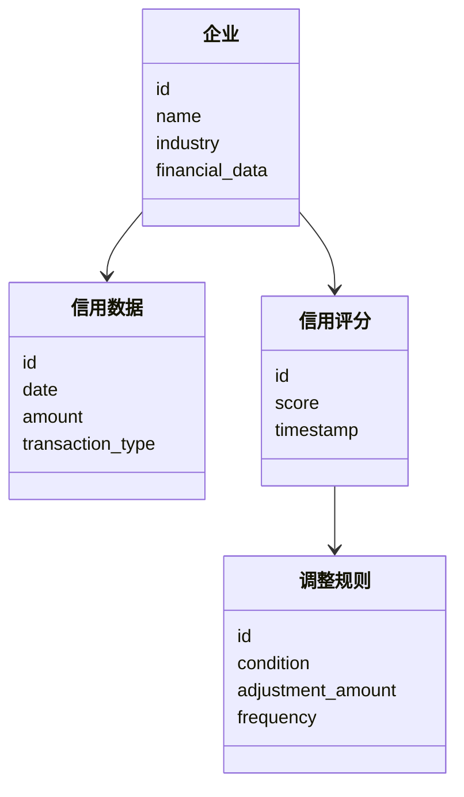
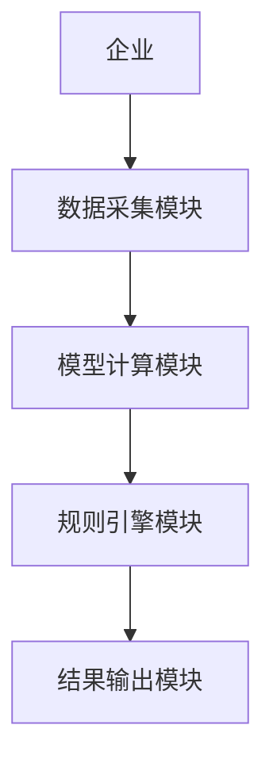
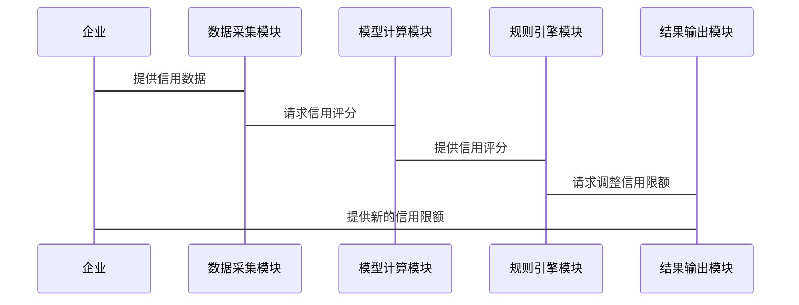

                 


# 智能企业信用限额动态调整系统

## 关键词：智能企业，信用限额，动态调整，机器学习，实时监控

## 摘要：本文介绍了一种智能企业信用限额动态调整系统，该系统能够根据企业的实时经营状况和市场环境，自动调整信用限额。通过结合机器学习算法和实时数据监控，该系统能够有效降低企业信用风险，优化资金流动性，并提升客户管理效率。本文详细阐述了系统的核心概念、算法原理、系统架构以及实际应用案例。

## 第一部分：智能企业信用限额动态调整系统概述

### 第1章：背景与问题背景

#### 1.1 企业信用管理的重要性

##### 1.1.1 信用管理的基本概念
企业信用管理是指企业对其客户或供应商的信用额度进行评估、监控和调整的过程。有效的信用管理能够帮助企业控制风险，优化资金流动，并建立长期稳定的商业关系。

##### 1.1.2 信用限额管理的核心作用
信用限额管理是企业信用管理中的关键环节。它决定了企业在不同交易中愿意承担的最大信用风险。合理的信用限额管理能够平衡企业的风险承受能力和市场竞争力。

##### 1.1.3 传统信用限额管理的局限性
传统的信用限额管理通常基于历史数据和静态模型，无法实时反映企业的经营状况和市场变化。这种方法往往导致信用限额的调整滞后，增加了企业的信用风险。

#### 1.2 企业信用限额动态调整的必要性

##### 1.2.1 企业经营环境的变化
企业的经营环境受多种因素影响，如市场需求波动、行业竞争加剧等。这些变化要求企业能够快速调整信用策略，以应对新的挑战。

##### 1.2.2 企业信用风险的动态变化
企业的信用风险并不是一成不变的。客户或供应商的财务状况、市场信用环境等因素的变化都会影响企业的信用风险。因此，动态调整信用限额是必要的。

##### 1.2.3 企业资金流动性优化的需求
企业需要在风险可控的前提下，尽可能提高资金流动性。动态调整信用限额可以帮助企业在保证风险控制的同时，优化资金使用效率。

### 第2章：智能企业信用限额动态调整系统的概念与目标

#### 2.1 智能企业信用限额动态调整系统的核心概念

##### 2.1.1 系统的定义与范围
智能企业信用限额动态调整系统是一种基于人工智能和大数据技术的自动化信用管理工具。它能够实时分析企业的信用数据，动态调整信用限额，以优化企业的信用管理和风险控制。

##### 2.1.2 系统的核心功能模块
- 数据采集与处理模块：实时采集企业的信用数据，包括财务数据、交易记录等。
- 模型计算模块：利用机器学习算法对数据进行分析，评估企业的信用风险。
- 规则引擎模块：根据模型计算结果，动态调整信用限额。
- 结果输出模块：将调整结果输出到企业的管理系统中，指导后续操作。

##### 2.1.3 系统的目标与价值
系统的目标是实现信用限额的动态调整，降低企业的信用风险，优化资金流动性。其价值体现在提高信用管理效率、降低信用损失、增强企业的市场竞争力等方面。

#### 2.2 系统的边界与外延

##### 2.2.1 系统的边界定义
系统的边界是指系统能够处理的信用数据和业务范围。通常，系统的边界包括企业的内部信用数据和外部市场数据。

##### 2.2.2 系统与外部系统的交互
系统需要与企业的财务系统、客户管理系统等外部系统进行数据交互。通过接口设计，系统能够实时获取企业的信用数据，并将调整结果反馈到相关系统中。

##### 2.2.3 系统的适用场景与限制
系统适用于需要动态调整信用限额的企业，特别适合于经营环境变化快、信用风险较高的行业。系统的限制包括对数据质量的要求较高，以及需要较高的技术投入。

### 第3章：系统的核心要素与组成结构

#### 3.1 核心要素分析

##### 3.1.1 企业信用数据
企业信用数据是系统进行信用评估的基础。这些数据包括企业的财务状况、交易记录、市场信用评分等。

##### 3.1.2 信用评分模型
信用评分模型是系统评估企业信用风险的核心工具。基于机器学习算法，模型能够对企业的信用状况进行实时评估。

##### 3.1.3 动态调整规则
动态调整规则是系统根据模型评估结果，调整信用限额的规则集合。这些规则通常基于企业的信用评分、市场环境和企业策略。

#### 3.2 系统组成结构

##### 3.2.1 数据采集模块
数据采集模块负责从企业的财务系统、客户管理系统等来源获取信用数据。这些数据经过清洗和预处理后，输入到模型计算模块中。

##### 3.2.2 模型计算模块
模型计算模块是系统的核心部分，负责对信用数据进行分析和评估。常用的算法包括逻辑回归、随机森林、时间序列分析等。

##### 3.2.3 规则引擎模块
规则引擎模块根据模型计算结果，动态调整信用限额。调整规则可以根据企业的信用评分、市场环境和企业策略进行定制。

##### 3.2.4 结果输出模块
结果输出模块将调整结果输出到企业的管理系统中，指导后续的信用管理操作。结果通常包括新的信用限额、调整原因和建议等。

### 第4章：系统的核心概念与联系

#### 4.1 核心概念原理

##### 4.1.1 信用评分模型的原理
信用评分模型基于企业的信用数据，利用机器学习算法对企业的信用风险进行评估。常用的模型包括逻辑回归、支持向量机、随机森林等。模型的输出是企业的信用评分，反映了企业的信用风险水平。

##### 4.1.2 动态调整规则的实现机制
动态调整规则是根据信用评分模型的输出结果，结合企业的信用策略和市场环境，制定信用限额的调整规则。规则通常包括调整条件、调整幅度和调整频率等。

##### 4.1.3 系统的实时反馈机制
系统的实时反馈机制是指系统能够根据企业的最新信用数据，实时更新信用评分和信用限额。这种机制保证了信用管理的动态性和及时性。

#### 4.2 核心概念属性对比表

| 概念               | 输入数据类型       | 模型类型         | 输出结果类型      |
|--------------------|--------------------|-----------------|-------------------|
| 信用评分模型       | 企业信用数据       | 逻辑回归、随机森林等 | 企业信用评分      |
| 动态调整规则       | 企业信用评分       | 规则引擎         | 调整后的信用限额  |

#### 4.3 ER实体关系图

```mermaid
erd
    企业
    :id, name, industry, financial_data
    信用数据
    :id, date, amount, transaction_type
    信用评分
    :id, score, timestamp
    调整规则
    :id, condition, adjustment_amount, frequency
```

## 第二部分：算法原理讲解

### 第5章：信用评分模型的实现

#### 5.1 算法选择与原理

##### 5.1.1 逻辑回归模型
逻辑回归是一种常用的分类算法，适用于二分类问题。在信用评分模型中，逻辑回归可以用来预测企业的信用违约概率。

##### 5.1.2 随机森林模型
随机森林是一种基于决策树的集成算法，具有较高的准确性和鲁棒性。适用于多分类和回归问题。

#### 5.2 算法实现步骤

##### 5.2.1 数据预处理
- 数据清洗：处理缺失值、异常值等。
- 特征选择：选择对信用评分影响较大的特征，如收入、利润、负债等。
- 数据标准化：对特征进行标准化处理，使其具有相似的尺度。

##### 5.2.2 模型训练
- 使用训练数据训练模型，调整模型参数，选择最优模型。

##### 5.2.3 模型评估
- 使用测试数据评估模型的准确率、召回率、F1分数等指标。

#### 5.3 算法实现代码示例

```python
import pandas as pd
from sklearn.model_selection import train_test_split
from sklearn.linear_model import LogisticRegression
from sklearn.metrics import accuracy_score

# 数据加载
data = pd.read_csv('credit_data.csv')

# 特征选择
X = data[['revenue', 'profit', 'debt']]
y = data['default']

# 数据分割
X_train, X_test, y_train, y_test = train_test_split(X, y, test_size=0.2, random_state=42)

# 模型训练
model = LogisticRegression()
model.fit(X_train, y_train)

# 模型预测
y_pred = model.predict(X_test)

# 模型评估
print('Accuracy:', accuracy_score(y_test, y_pred))
```

#### 5.4 数学模型与公式

##### 5.4.1 逻辑回归模型公式
$$ P(y=1|x) = \frac{1}{1 + e^{-(\beta_0 + \beta_1 x_1 + \beta_2 x_2 + \dots + \beta_n x_n)}} $$

##### 5.4.2 损失函数
$$ L(\beta) = -\frac{1}{N} \sum_{i=1}^{N} [y_i \ln(p_i) + (1 - y_i)\ln(1 - p_i)] $$

##### 5.4.3 梯度下降优化
$$ \beta_j := \beta_j - \alpha \frac{\partial L}{\partial \beta_j} $$

### 第6章：动态调整规则的实现

#### 6.1 调整规则的设计

##### 6.1.1 调整条件
- 企业的信用评分低于预设阈值。
- 企业的财务状况出现恶化。
- 市场环境的变化影响企业的信用风险。

##### 6.1.2 调整幅度
- 根据企业的信用评分和调整条件，确定信用限额的调整幅度。
- 调整幅度可以是固定的百分比，也可以是基于模型预测的风险敞口。

##### 6.1.3 调整频率
- 实时调整：根据实时数据，随时调整信用限额。
- 定期调整：每周、每月调整一次。

#### 6.2 规则引擎的实现

##### 6.2.1 规则引擎的设计
规则引擎负责根据信用评分模型的结果和企业的信用策略，制定信用限额的调整规则。

##### 6.2.2 规则引擎的实现步骤
1. 获取企业的信用评分和财务数据。
2. 根据预设规则，判断是否需要调整信用限额。
3. 确定调整幅度和调整频率。
4. 输出调整结果。

#### 6.3 规则引擎的代码示例

```python
def adjust_credit_limit(credit_score, financial_data):
    if credit_score < 0.6:
        adjustment = financial_data['revenue'] * 0.1
        return financial_data['current_limit'] - adjustment
    elif credit_score < 0.8:
        adjustment = financial_data['debt'] * 0.05
        return financial_data['current_limit'] - adjustment
    else:
        return financial_data['current_limit']

# 示例数据
financial_data = {'revenue': 1000000, 'debt': 500000, 'current_limit': 750000}
credit_score = 0.7

new_limit = adjust_credit_limit(credit_score, financial_data)
print('New Credit Limit:', new_limit)
```

## 第三部分：系统分析与架构设计

### 第7章：系统分析

#### 7.1 问题场景介绍

##### 7.1.1 问题背景
企业在经营过程中，由于市场环境的变化和企业内部状况的调整，需要实时监控和调整信用限额。

##### 7.1.2 问题描述
传统的信用限额管理存在滞后性，无法及时反映企业的信用风险变化，导致信用损失和资金流动性问题。

#### 7.2 项目介绍

##### 7.2.1 项目目标
开发一个基于人工智能的信用限额动态调整系统，实现信用限额的实时调整，降低企业的信用风险。

##### 7.2.2 项目范围
系统需要集成信用数据采集、模型计算、规则引擎和结果输出模块。

### 第8章：系统架构设计

#### 8.1 系统功能设计

##### 8.1.1 领域模型



##### 8.1.2 系统架构



#### 8.2 系统接口设计

##### 8.2.1 数据接口
- 数据采集模块需要与企业的财务系统和客户管理系统进行数据交互。
- 接口采用RESTful API，使用JSON格式传输数据。

##### 8.2.2 调用接口
- 模型计算模块通过调用外部信用评分服务，获取企业的信用评分。
- 规则引擎模块通过调用外部市场数据服务，获取市场环境信息。

#### 8.3 系统交互设计

##### 8.3.1 交互流程



## 第四部分：项目实战

### 第9章：环境安装与配置

#### 9.1 环境要求

##### 9.1.1 操作系统
- Windows 10或更高版本
- macOS 10.15或更高版本
- Linux（推荐使用Ubuntu 20.04或更高版本）

##### 9.1.2 开发工具
- Python 3.8或更高版本
- Jupyter Notebook（可选）
- Git（用于版本控制）

##### 9.1.3 依赖库安装
- 使用pip安装以下库：
  ```
  pip install pandas scikit-learn mermaid4jupyter jupyterlab
  ```

### 第10章：系统核心实现

#### 10.1 数据采集模块实现

##### 10.1.1 数据接口开发

```python
import requests
import json

def get_financial_data(api_key):
    headers = {'Authorization': f'Bearer {api_key}'}
    response = requests.get('https://api.financialdata.com/financials', headers=headers)
    return json.loads(response.text)
```

##### 10.1.2 数据预处理

```python
import pandas as pd

def preprocess_data(data):
    df = pd.DataFrame(data)
    df = df.dropna()
    df['revenue'] = df['revenue'].astype(int)
    df['profit'] = df['profit'].astype(int)
    df['debt'] = df['debt'].astype(int)
    return df
```

#### 10.2 模型计算模块实现

##### 10.2.1 信用评分模型训练

```python
from sklearn.model_selection import train_test_split
from sklearn.linear_model import LogisticRegression
from sklearn.metrics import accuracy_score

def train_credit_model(X, y):
    X_train, X_test, y_train, y_test = train_test_split(X, y, test_size=0.2, random_state=42)
    model = LogisticRegression()
    model.fit(X_train, y_train)
    print('Accuracy:', accuracy_score(y_test, model.predict(X_test)))
    return model
```

##### 10.2.2 模型预测

```python
def predict_credit_score(model, data_point):
    data_point = data_point.reshape(1, -1)
    return model.predict(data_point)
```

#### 10.3 规则引擎模块实现

##### 10.3.1 调整规则定义

```python
def adjust_credit_limit(credit_score, financial_data):
    if credit_score < 0.6:
        adjustment = financial_data['revenue'] * 0.1
        return financial_data['current_limit'] - adjustment
    elif credit_score < 0.8:
        adjustment = financial_data['debt'] * 0.05
        return financial_data['current_limit'] - adjustment
    else:
        return financial_data['current_limit']
```

##### 10.3.2 规则引擎执行

```python
def execute_adjustment_rule(credit_score, financial_data):
    return adjust_credit_limit(credit_score, financial_data)
```

### 第11章：案例分析与详细解读

#### 11.1 案例背景

##### 11.1.1 案例企业概况
某制造企业，年收入1000万元，利润200万元，负债500万元。当前信用限额为750万元。

#### 11.2 数据分析

##### 11.2.1 数据采集与预处理
采集企业的财务数据和交易记录，清洗和预处理后，输入到模型计算模块中。

##### 11.2.2 模型计算
使用逻辑回归模型对企业的信用风险进行评估，得到信用评分为0.7。

#### 11.3 系统调整

##### 11.3.1 调整规则应用
根据信用评分为0.7，调整规则触发，调整幅度为负债的5%，即25万元。新的信用限额为750万元 - 25万元 = 725万元。

##### 11.3.2 调整结果输出
系统将新的信用限额725万元输出到企业的管理系统中，指导后续的信用管理操作。

### 第12章：项目小结

#### 12.1 项目成果
开发了一个基于人工智能的信用限额动态调整系统，能够实时监控企业的信用风险，动态调整信用限额，降低信用损失，优化资金流动性。

#### 12.2 项目经验
- 数据预处理是系统开发的关键步骤，需要仔细清洗和选择特征。
- 逻辑回归模型在信用评分模型中表现良好，但需要根据实际数据进行调整。
- 规则引擎的设计需要结合企业的信用策略和市场环境，灵活调整信用限额。

## 第五部分：最佳实践与小结

### 第13章：最佳实践

#### 13.1 系统设计 tips

##### 13.1.1 数据安全
确保系统的数据安全，防止数据泄露和篡改。可以通过加密技术和访问控制来实现。

##### 13.1.2 模型可解释性
选择可解释性较强的模型，便于理解和调整。对于复杂的模型，可以通过特征重要性分析来解释模型的决策过程。

##### 13.1.3 系统可扩展性
设计系统的模块化结构，方便后续的功能扩展和算法升级。

#### 13.2 实际应用 tips

##### 13.2.1 数据实时更新
确保系统的数据能够实时更新，以便及时反映企业的信用风险变化。

##### 13.2.2 系统性能优化
优化系统的计算效率，减少响应时间。可以通过并行计算和缓存技术来实现。

##### 13.2.3 系统监控与维护
定期监控系统的运行状态，及时发现和解决故障。维护系统的数据和模型，确保系统的准确性和稳定性。

### 第14章：小结

智能企业信用限额动态调整系统是一种基于人工智能和大数据技术的创新解决方案。通过实时监控企业的信用数据，动态调整信用限额，系统能够有效降低企业的信用风险，优化资金流动性。本文详细介绍了系统的背景、核心概念、算法原理、系统架构以及实际应用案例。希望本文能够为企业的信用管理提供新的思路和方法。

### 第15章：注意事项

#### 15.1 系统实施注意事项

##### 15.1.1 数据质量
系统的准确性依赖于数据的质量。需要确保数据的完整性、准确性和及时性。

##### 15.1.2 模型选择
选择合适的模型是系统开发的关键。需要根据实际数据和业务需求，选择最优的模型。

##### 15.1.3 系统稳定性
系统的稳定性是保证企业正常运行的重要条件。需要进行充分的测试和优化，确保系统的稳定性和可靠性。

#### 15.2 系统维护注意事项

##### 15.2.1 数据更新
定期更新系统中的数据，确保系统的数据是最新的。

##### 15.2.2 模型更新
定期更新信用评分模型，适应市场环境的变化和企业的信用策略调整。

##### 15.2.3 系统升级
根据技术的发展和业务需求的变化，定期对系统进行升级和优化。

### 第16章：拓展阅读

#### 16.1 相关技术

##### 16.1.1 机器学习在信用评估中的应用
- 机器学习算法在信用评分中的应用
- 基于机器学习的信用风险预测

##### 16.1.2 大数据分析在信用管理中的应用
- 大数据分析技术在信用管理中的应用
- 基于大数据的信用风险管理

#### 16.2 相关书籍

##### 16.2.1 信用管理
- 《信用管理：原理与实践》
- 《信用评估与风险控制》

##### 16.2.2 机器学习
- 《机器学习实战》
- 《Python机器学习：基于Scikit-learn和TensorFlow》

##### 16.2.3 大数据技术
- 《大数据技术：从数据采集到数据分析》
- 《Hadoop大数据开发实战》

#### 16.3 在线资源

##### 16.3.1 机器学习在线课程
- Coursera：《机器学习专项课程》
- edX：《人工智能与机器学习基础》

##### 16.3.2 大数据在线资源
- 网易云课堂：《大数据开发工程师培训》
- 腾讯云大学：《大数据分析与处理》

## 作者：AI天才研究院/AI Genius Institute & 禅与计算机程序设计艺术 /Zen And The Art of Computer Programming

---

**本文由AI天才研究院倾心打造，转载请注明出处。**

---

**🔚**

