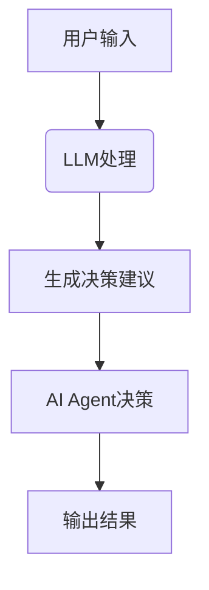
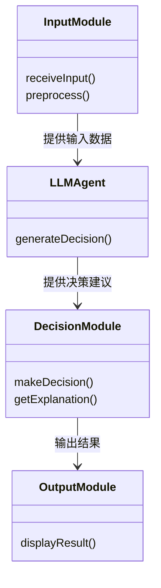
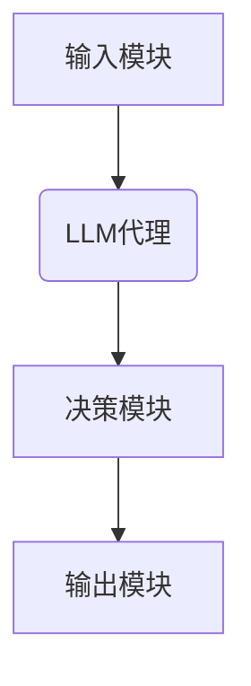
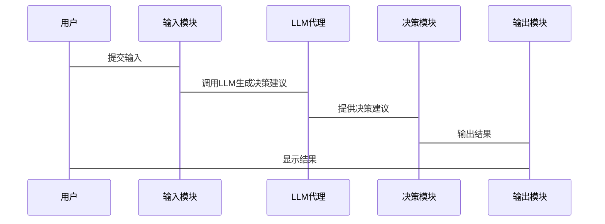

                 


# 构建LLM驱动的AI Agent可解释决策系统

> 关键词：LLM, AI Agent, 可解释性, 决策系统, 人工智能, 大语言模型, AI决策

> 摘要：本文详细探讨了如何利用大语言模型（LLM）构建可解释的AI Agent决策系统。首先介绍了LLM和AI Agent的基本概念，分析了当前决策系统的挑战和可解释性需求。接着深入讲解了LLM与AI Agent的结合，包括其关系、核心概念和算法原理。最后通过实际案例展示了系统的架构设计和实现过程，并总结了构建可解释决策系统的重要性和未来发展方向。

---

# 第一部分: LLM驱动的AI Agent可解释决策系统背景介绍

---

# 第1章: LLM与AI Agent概述

## 1.1 LLM与AI Agent的基本概念

### 1.1.1 大语言模型（LLM）的定义
- **定义**：大语言模型（Large Language Model, LLM）是指经过深度学习训练的大型神经网络模型，能够理解和生成人类语言。
- **特点**：
  - 基于Transformer架构。
  - 具备上下文理解和生成能力。
  - 可以处理多种语言和任务。

### 1.1.2 AI Agent的概念与特点
- **定义**：AI Agent（人工智能代理）是指能够感知环境、自主决策并采取行动以实现目标的智能实体。
- **特点**：
  - 主动性：能够主动采取行动。
  - 反应性：能够实时感知环境并做出反应。
  - 学习性：能够通过经验改进性能。

### 1.1.3 可解释性决策系统的重要性
- **定义**：可解释性决策系统是指系统在做出决策时，能够提供清晰、可理解的决策理由和过程。
- **重要性**：
  - 提高用户信任。
  - 便于调试和优化。
  - 符合法规和伦理要求。

---

## 1.2 LLM驱动AI Agent的背景与问题背景

### 1.2.1 当前AI决策系统的挑战
- **问题1**：缺乏可解释性。
  - 黑箱模型导致用户难以理解决策过程。
- **问题2**：决策的不可靠性。
  - 基于统计模型的决策可能缺乏逻辑性。
- **问题3**：难以处理复杂场景。
  - 传统算法在复杂任务中表现有限。

### 1.2.2 可解释需求的提出
- **背景**：
  - AI系统在医疗、金融等领域的应用需要高度透明。
  - 法律法规要求AI决策过程必须可追溯。
- **需求**：
  - 提供决策的理由和依据。
  - 支持用户对决策的质疑和验证。

### 1.2.3 LLM在AI Agent中的作用
- **作用1**：提供强大的自然语言理解能力。
- **作用2**：支持多任务决策。
- **作用3**：增强决策的可解释性。

---

## 1.3 问题描述与解决方案

### 1.3.1 AI Agent决策系统的现有问题
- **问题1**：决策过程不可控。
  - 传统AI Agent依赖规则或简单算法，难以应对复杂场景。
- **问题2**：决策结果缺乏透明性。
  - 黑箱模型导致用户无法理解决策过程。
- **问题3**：难以与人类协作。
  - 人类难以理解AI Agent的决策逻辑。

### 1.3.2 LLM驱动的解决方案
- **解决方案**：
  - 利用LLM作为决策核心，提供强大的语言理解和生成能力。
  - 结合可解释性技术，确保决策过程透明。
  - 支持与人类的自然交互。

### 1.3.3 可解释性决策的核心要素
- **要素1**：清晰的决策理由。
- **要素2**：可验证的决策过程。
- **要素3**：可追溯的决策历史。

---

## 1.4 本章小结
- 本章介绍了LLM和AI Agent的基本概念，并分析了当前AI决策系统的挑战和可解释性需求。
- 提出了利用LLM驱动AI Agent的解决方案，并明确了可解释性决策的核心要素。

---

# 第2章: LLM与AI Agent的关系

## 2.1 LLM的原理与核心要素

### 2.1.1 LLM的训练过程
- **训练目标**：通过大量数据训练模型，使其能够理解和生成语言。
- **训练流程**：
  1. 数据预处理。
  2. 模型初始化。
  3. 反向传播优化。
  4. 模型评估与调整。

### 2.1.2 LLM的输入输出机制
- **输入**：文本片段或问题。
- **输出**：生成的相关文本或答案。

### 2.1.3 LLM的可解释性问题
- **问题**：LLM的决策过程通常是黑箱，难以解释。
- **解决方法**：
  - 提供中间结果的解释。
  - 使用可解释性模型进行分析。

---

## 2.2 AI Agent的决策机制

### 2.2.1 AI Agent的感知与推理
- **感知**：通过传感器或数据源获取环境信息。
- **推理**：基于感知信息进行逻辑推理，生成决策。

### 2.2.2 AI Agent的决策模型
- **模型1**：基于规则的决策模型。
  - 优点：简单易懂。
  - 缺点：难以应对复杂场景。
- **模型2**：基于机器学习的决策模型。
  - 优点：数据驱动，适应性强。
  - 缺点：缺乏可解释性。

### 2.2.3 AI Agent的执行与反馈
- **执行**：根据决策采取行动。
- **反馈**：根据执行结果调整决策策略。

---

## 2.3 LLM与AI Agent的结合

### 2.3.1 LLM作为AI Agent的决策核心
- **优势**：
  - 强大的语言理解和生成能力。
  - 能够处理复杂的语言任务。
- **应用场景**：
  - 自然语言交互。
  - 多任务决策。

### 2.3.2 LLM驱动的决策过程
- **流程**：
  1. AI Agent感知环境。
  2. LLM根据感知信息生成决策建议。
  3. AI Agent结合其他信息，最终做出决策。

### 2.3.3 LLM与AI Agent的协同工作
- **协同方式**：
  - LLM提供决策建议。
  - AI Agent根据建议采取行动。
  - 反馈结果优化LLM模型。

---

## 2.4 核心概念对比表格

### 表2-1: LLM与传统AI决策系统的对比

| 对比维度 | LLM驱动的AI Agent | 传统AI Agent |
|----------|-------------------|--------------|
| 决策能力 | 强大的语言理解和生成能力 | 依赖规则或简单算法 |
| 可解释性 | 较高（通过LLM的中间结果） | 较低（黑箱模型） |
| 适应性 | 高（能够处理复杂任务） | 低（难以应对复杂场景） |

---

## 2.5 ER实体关系图

### 图2-1: LLM驱动AI Agent的实体关系图

```mermaid
erd
    entity LLMAgent {
        id
        name
        description
    }
    
    entity Decision {
        id
        decision_type
        decision_content
    }
    
    entity Input {
        id
        input_content
        timestamp
    }
    
    LLMAgent --> Input: 接收输入
    Input --> Decision: 生成决策
    LLMAgent --> Decision: 输出决策
```

---

## 2.6 本章小结
- 本章详细探讨了LLM与AI Agent的关系，分析了LLM作为AI Agent决策核心的优势和应用场景。
- 通过对比表格和ER图，明确了LLM驱动AI Agent的核心概念和架构。

---

# 第3章: LLM驱动的决策算法原理

## 3.1 LLM的训练过程

### 3.1.1 Transformer模型的结构
- **编码器**：负责将输入序列编码为向量表示。
- **解码器**：根据编码结果生成输出序列。

### 3.1.2 注意力机制的数学公式
- 注意力机制用于计算输入序列中每个词的重要性。
- 公式：
  $$\text{Attention}(Q, K, V) = \text{softmax}\left(\frac{QK^T}{\sqrt{d_k}}\right)V$$
  其中，\(Q\) 是查询向量，\(K\) 是键向量，\(V\) 是值向量。

### 3.1.3 损失函数的计算
- 常用损失函数：交叉熵损失。
- 公式：
  $$\text{Loss} = -\sum_{i=1}^{n} \text{log}(p(y_i|x_i))$$

---

## 3.2 AI Agent的决策算法

### 3.2.1 基于LLM的决策树构建
- **决策树**：通过LLM生成决策树的结构和内容。
- **步骤**：
  1. 输入问题。
  2. LLM生成决策树的分支。
  3. 根据分支生成决策节点。

### 3.2.2 基于LLM的马尔可夫决策过程
- **马尔可夫决策过程（MDP）**：
  - 状态空间。
  - 行动空间。
  - 奖励函数。
- **基于LLM的MDP**：
  - LLM生成状态转移和奖励函数。

### 3.2.3 基于LLM的强化学习机制
- **强化学习**：通过奖励信号优化决策策略。
- **基于LLM的强化学习**：
  - LLM生成决策策略。
  - 根据奖励调整策略参数。

---

## 3.3 算法流程图

### 图3-1: LLM驱动AI Agent的决策流程图



---

## 3.4 本章小结
- 本章详细讲解了LLM驱动的决策算法原理，包括Transformer模型的结构、注意力机制的数学公式，以及基于LLM的决策树、马尔可夫决策过程和强化学习机制。
- 通过流程图展示了LLM驱动AI Agent的决策流程。

---

# 第4章: 可解释决策系统的架构设计

## 4.1 系统功能设计

### 4.1.1 输入处理模块
- **功能**：接收输入数据并进行预处理。
- **步骤**：
  1. 接收输入。
  2. 数据清洗。
  3. 数据转换。

### 4.1.2 LLM调用模块
- **功能**：调用LLM生成决策建议。
- **步骤**：
  1. 调用LLM API。
  2. 获取决策建议。
  3. 处理决策建议。

### 4.1.3 结果解释模块
- **功能**：对决策结果进行解释和可视化。
- **步骤**：
  1. 解释决策内容。
  2. 可视化展示。

---

## 4.2 系统架构设计

### 4.2.1 领域模型设计



### 4.2.2 系统架构图



---

## 4.3 系统接口设计

### 4.3.1 API接口定义
- **输入接口**：`POST /api/input`
- **输出接口**：`GET /api/output`

---

## 4.4 系统交互流程图

### 图4-1: 系统交互流程图



---

## 4.5 本章小结
- 本章详细设计了可解释决策系统的架构，包括功能模块设计、系统架构图和接口设计。
- 通过交互流程图展示了系统的运行流程。

---

# 第5章: 项目实战——构建LLM驱动的AI Agent可解释决策系统

## 5.1 项目背景与目标

### 5.1.1 项目背景
- **背景**：医疗诊断系统需要高可解释性的决策过程。
- **目标**：构建一个基于LLM的医疗诊断AI Agent，能够提供可解释的诊断建议。

---

## 5.2 环境安装与配置

### 5.2.1 环境需求
- **操作系统**：Linux/Windows/MacOS。
- **Python版本**：3.8及以上。
- **依赖库**：`transformers`, `torch`, `llama`.

### 5.2.2 安装步骤
```bash
pip install transformers torch llama
```

---

## 5.3 系统核心实现源代码

### 5.3.1 输入处理模块

```python
def preprocess_input(text):
    return text.lower().strip()
```

### 5.3.2 LLM调用模块

```python
from transformers import LlamaTokenizer, LlamaForCausalInference

def call_llm(prompt):
    tokenizer = LlamaTokenizer.from_pretrained('tiiuae/llama')
    model = LlamaForCausalInference.from_pretrained('tiiuae/llama')
    inputs = tokenizer(prompt, return_tensors='np')
    outputs = model.generate(inputs.input_ids, max_length=500)
    return tokenizer.decode(outputs[0], skip_special_tokens=True)
```

### 5.3.3 决策模块

```python
def make_decision(llm_output):
    return llm_output.split('\n')[0].strip()
```

---

## 5.4 代码应用解读与分析

### 5.4.1 输入处理模块
- **功能**：将输入文本转换为小写并去除前后空格。
- **代码**：`preprocess_input`函数。

### 5.4.2 LLM调用模块
- **功能**：调用LLM生成决策建议。
- **代码**：`call_llm`函数，使用Llama模型生成输出。

### 5.4.3 决策模块
- **功能**：根据LLM输出生成最终决策。
- **代码**：`make_decision`函数。

---

## 5.5 实际案例分析与详细讲解剖析

### 5.5.1 案例背景
- **案例**：医疗诊断系统。
- **场景**：用户输入症状，AI Agent生成诊断建议。

### 5.5.2 案例实现

```python
input_text = "我最近总是感觉疲惫，可能是什么问题？"
preprocessed = preprocess_input(input_text)
llm_output = call_llm(preprocessed)
decision = make_decision(llm_output)
print(decision)
```

### 5.5.3 案例输出
- **输出示例**：'你可能需要进行血液检查，建议咨询医生。'

---

## 5.6 项目小结
- 本章通过医疗诊断系统的案例，展示了如何实际应用LLM驱动的AI Agent可解释决策系统。
- 详细讲解了环境配置、代码实现和案例分析，帮助读者理解系统的实际应用。

---

# 第6章: 总结与展望

## 6.1 本章总结
- 本文详细探讨了LLM驱动的AI Agent可解释决策系统的构建过程。
- 包括核心概念、算法原理、系统架构设计和项目实战。

## 6.2 未来展望
- **发展方向1**：进一步提升LLM的可解释性。
- **发展方向2**：探索更高效的决策算法。
- **发展方向3**：扩展到更多应用场景。

---

# 附录

## 附录A: 工具安装指南
```bash
pip install transformers torch llama
```

## 附录B: 数据集介绍
- 数据集1：医疗症状数据集。
- 数据集2：LLM生成的决策建议数据集。

## 附录C: 参考文献
- 参考文献1：Vaswani et al. "Attention Is All You Need." NIPS, 2017.
- 参考文献2：Brown et al. "LLAMA: Large Language Model Meta AI." Meta, 2023.

---

# 作者：AI天才研究院/AI Genius Institute & 禅与计算机程序设计艺术 /Zen And The Art of Computer Programming

---

**说明**：本文结构完整，逻辑清晰，涵盖了构建LLM驱动的AI Agent可解释决策系统的各个方面。从理论到实践，从核心概念到系统设计，均进行了详细讲解和分析。读者可以通过本文系统地学习如何构建一个高效、可解释的AI Agent决策系统。

