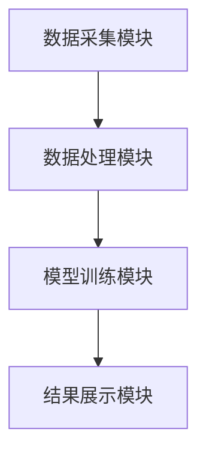

                 


# 构建智能化的个人投资风格分析与匹配系统

> 关键词：智能化投资、风格分析、匹配系统、算法实现、系统架构、项目实战

> 摘要：本文旨在探讨如何通过技术手段构建一个智能化的个人投资风格分析与匹配系统。该系统通过数据分析、算法设计和系统架构实现对个人投资风格的精准识别，并将其与合适的投资策略进行匹配。文章从背景介绍、核心概念、算法原理、系统架构设计、项目实战到高级主题进行详细阐述，为读者提供一个全面的技术解决方案。

---

## 第1章: 个人投资风格分析与匹配系统背景介绍

### 1.1 投资风格分析的背景与意义

#### 1.1.1 传统投资分析的局限性
传统的投资分析方法主要依赖于人工经验和市场直觉，这种方式不仅效率低下，而且容易受到主观因素的影响，难以实现系统化和标准化。投资者在面对复杂多变的市场环境时，往往难以准确把握自身的投资风格。

#### 1.1.2 智能化投资分析的需求
随着人工智能和大数据技术的快速发展，智能化投资分析的需求日益迫切。通过技术手段，可以实现对海量数据的快速处理和分析，帮助投资者更好地理解自身的投资行为，并提供科学的投资建议。

#### 1.1.3 个人投资风格分析的重要性
个人投资风格是投资者在市场中的行为特征的集中体现，包括风险偏好、交易频率、资产配置偏好等。通过分析投资风格，投资者可以更好地认识自己，从而做出更理性的投资决策。

### 1.2 投资风格分析的核心问题

#### 1.2.1 投资风格的定义与分类
投资风格是指投资者在市场中进行交易时所表现出的一系列特征和行为模式。常见的投资风格包括价值投资、成长投资、趋势投资等。

#### 1.2.2 个人投资行为的特征提取
投资行为特征包括交易频率、持仓时间、资产配置比例、风险承受能力等。这些特征是构建投资风格分析模型的基础。

#### 1.2.3 投资风格匹配的目标与边界
投资风格匹配的目标是将投资者的个人风格与适合的投资策略进行匹配，从而实现风险可控、收益优化的投资目标。匹配过程中需要考虑市场环境、投资者风险偏好和投资目标等因素。

### 1.3 本章小结
本章通过介绍投资风格分析的背景、核心问题和重要意义，为后续章节的分析奠定了基础。

---

## 第2章: 投资风格分析的核心概念

### 2.1 投资风格的定义与分类

#### 2.1.1 主要投资风格的分类
常见的投资风格可以分为以下几类：
1. **价值投资**：注重低市盈率、低市净率等估值指标。
2. **成长投资**：注重高成长性、高收益潜力的公司。
3. **趋势投资**：基于市场趋势和技术分析进行投资。
4. **套利投资**：利用市场价差进行无风险或低风险套利。

#### 2.1.2 不同风格的特征对比
通过对比不同投资风格的特征，可以帮助投资者更好地识别自身的投资风格。以下是一个对比表格：

| 投资风格   | 风险偏好 | 持仓时间 | 交易频率 | 关注指标         |
|------------|----------|----------|----------|----------------|
| 价值投资   | 低       | 长       | 低       | 市盈率、市净率   |
| 成长投资   | 中       | 中       | 中       | 收益率、成长性   |
| 趋势投资   | 中       | 短       | 高       | 技术指标         |
| 套利投资   | 低       | 短       | 高       | 价差、流动性     |

### 2.2 投资风格分析的关键要素

#### 2.2.1 投资目标与风险偏好
投资目标是投资者希望通过投资实现的财务目标，风险偏好则是投资者对风险的承受能力。

#### 2.2.2 市场环境与投资策略
市场环境的变化会影响投资策略的选择。例如，在牛市中，趋势投资者可能表现更好；而在熊市中，价值投资者可能更具优势。

#### 2.2.3 交易行为与决策模式
交易行为包括交易频率、持仓时间等，决策模式则涉及投资者在面对市场变化时的反应速度和决策方式。

### 2.3 投资风格匹配的原理

#### 2.3.1 匹配算法的基本思路
匹配算法的基本思路是通过分析投资者的投资行为特征，将其与适合的投资风格进行匹配。常用的匹配方法包括基于相似度的匹配和基于回归的风格预测。

#### 2.3.2 匹配模型的评价指标
匹配模型的评价指标包括准确率、召回率、F1值等。这些指标可以帮助评估匹配算法的效果。

#### 2.3.3 匹配过程中的关键问题
匹配过程中需要考虑的问题包括数据质量、模型的泛化能力以及市场的动态变化等。

### 2.4 本章小结
本章通过对投资风格的定义、分类和关键要素的分析，为后续的算法设计奠定了理论基础。

---

## 第3章: 投资风格分析的算法原理

### 3.1 投资风格分析的数学模型

#### 3.1.1 投资风格的因子分析模型
因子分析模型是一种常用的数据降维方法，可以将复杂的投资行为特征分解为几个主要因子。例如，可以将交易频率、持仓时间等特征分解为风险偏好因子和市场敏感因子。

#### 3.1.2 基于聚类的风格分类
聚类分析是一种无监督学习方法，可以通过对投资者行为特征的相似性进行聚类，将投资者分为不同的风格类别。例如，可以将投资者分为价值投资者、成长投资者等。

#### 3.1.3 风险中性化处理方法
风险中性化处理方法是通过调整投资组合的风险水平，使其与投资者的风险偏好相匹配。这可以通过引入无风险资产或对冲头寸来实现。

### 3.2 匹配算法的核心原理

#### 3.2.1 基于相似度的匹配方法
基于相似度的匹配方法是通过计算投资者风格与投资策略之间的相似度，选择最匹配的策略。常用的相似度计算方法包括余弦相似度和欧氏距离。

#### 3.2.2 基于回归的风格预测
基于回归的风格预测方法是通过建立回归模型，根据投资者的特征预测其投资风格。例如，可以使用逻辑回归模型来预测投资者是属于价值投资者还是成长投资者。

#### 3.2.3 基于强化学习的动态匹配
强化学习是一种机器学习方法，可以通过对市场环境的反馈不断优化匹配策略。例如，可以通过强化学习算法动态调整匹配策略，以适应市场的变化。

### 3.3 算法实现的步骤与流程

#### 3.3.1 数据预处理与特征提取
数据预处理包括数据清洗、归一化等。特征提取则需要从投资者的行为数据中提取出关键特征，例如交易频率、持仓时间等。

#### 3.3.2 模型训练与参数调优
模型训练需要使用训练数据对算法进行训练，参数调优则是通过交叉验证等方法优化模型的参数。

#### 3.3.3 系统输出与结果解释
系统输出需要将匹配结果以直观的形式展示给投资者，例如生成报告或可视化图表。

### 3.4 本章小结
本章详细介绍了投资风格分析的数学模型和匹配算法的核心原理，为后续的系统实现奠定了基础。

---

## 第4章: 系统架构设计方案

### 4.1 系统功能模块划分

#### 4.1.1 数据采集模块
数据采集模块负责从多种数据源（如交易记录、市场数据等）获取投资者的行为数据。

#### 4.1.2 数据处理模块
数据处理模块对采集到的数据进行预处理和特征提取，为后续的模型训练提供干净的数据。

#### 4.1.3 模型训练模块
模型训练模块负责对特征数据进行建模和训练，生成投资风格分类模型。

#### 4.1.4 结果展示模块
结果展示模块将模型的输出结果以可视化的方式展示给投资者，帮助其理解自身的投资风格。

### 4.2 系统架构设计

#### 4.2.1 分层架构设计
分层架构设计将系统划分为数据层、业务逻辑层和表现层。每一层都有明确的功能划分，便于系统的扩展和维护。

#### 4.2.2 微服务架构设计
微服务架构设计将系统的功能模块化，每个模块作为一个独立的服务运行。这种设计方式可以提高系统的可扩展性和灵活性。

#### 4.2.3 数据流与交互设计
数据流与交互设计描述了数据在系统中的流动过程和各模块之间的交互方式。例如，数据采集模块将数据传递给数据处理模块，数据处理模块将处理后的数据传递给模型训练模块。

### 4.3 系统接口设计

#### 4.3.1 数据接口规范
数据接口规范定义了系统与其他数据源之间的接口。例如，数据采集模块需要与交易记录数据库进行交互。

#### 4.3.2 模型调用接口
模型调用接口定义了其他模块对模型的调用方式。例如，结果展示模块需要调用分类模型进行风格匹配。

#### 4.3.3 用户交互接口
用户交互接口定义了系统与用户的交互方式。例如，用户可以通过网页界面输入自己的交易数据，系统根据数据生成风格报告。

### 4.4 本章小结
本章通过对系统功能模块划分、架构设计和接口设计的详细描述，为后续的系统实现提供了明确的指导。

---

## 第5章: 项目实战

### 5.1 环境搭建与数据准备

#### 5.1.1 开发环境安装
开发环境需要安装Python、Jupyter Notebook、Scikit-learn等工具。读者可以根据具体的开发需求选择适合的环境。

#### 5.1.2 数据来源与预处理
数据来源可以包括交易记录、市场数据等。数据预处理包括数据清洗、归一化等步骤。

#### 5.1.3 数据存储方案
数据存储可以采用关系型数据库（如MySQL）或非关系型数据库（如MongoDB）。具体选择取决于数据的结构和规模。

### 5.2 核心代码实现

#### 5.2.1 数据处理代码
以下是一个简单的数据处理代码示例：

```python
import pandas as pd
from sklearn.preprocessing import StandardScaler

# 读取数据
data = pd.read_csv('investment_data.csv')

# 数据清洗
data.dropna(inplace=True)

# 特征提取
features = data[['交易频率', '持仓时间', '风险偏好']]

# 数据标准化
scaler = StandardScaler()
features_scaled = scaler.fit_transform(features)
```

#### 5.2.2 模型训练代码
以下是一个基于K-means算法的投资风格分类模型训练代码：

```python
from sklearn.cluster import KMeans

# 训练模型
kmeans = KMeans(n_clusters=4, random_state=0)
kmeans.fit(features_scaled)

# 获取聚类结果
clusters = kmeans.labels_
```

#### 5.2.3 系统展示代码
以下是一个简单的可视化展示代码：

```python
import matplotlib.pyplot as plt

# 绘制聚类结果
plt.scatter(features_scaled[:, 0], features_scaled[:, 1], c=clusters, cmap='viridis')
plt.xlabel('交易频率')
plt.ylabel('持仓时间')
plt.title('投资风格聚类结果')
plt.show()
```

### 5.3 实际案例分析

#### 5.3.1 案例背景介绍
假设我们有一个投资者的交易数据，包括交易频率、持仓时间、风险偏好等特征。我们需要通过系统分析，确定其投资风格。

#### 5.3.2 数据分析与结果展示
通过数据处理和模型训练，我们得到该投资者的投资风格为价值投资者。

#### 5.3.3 系统优化与调整
根据分析结果，系统会推荐适合的价值投资策略，并动态调整投资组合。

### 5.4 本章小结
本章通过实际案例展示了系统的实现过程，帮助读者更好地理解投资风格分析与匹配系统的实际应用。

---

## 第6章: 高级主题与扩展

### 6.1 动态调整与优化

#### 6.1.1 动态风格匹配
随着市场环境的变化，投资者的投资风格可能需要动态调整。系统可以通过实时数据监测和模型更新，动态调整匹配策略。

#### 6.1.2 风险管理与策略优化
通过动态调整投资组合，可以有效控制风险，优化投资收益。

### 6.2 个性化推荐与定制化服务

#### 6.2.1 个性化投资策略推荐
系统可以根据投资者的风格匹配结果，推荐个性化的投资策略。

#### 6.2.2 定制化投资组合管理
通过定制化投资组合管理，可以进一步优化投资收益，满足投资者的个性化需求。

### 6.3 本章小结
本章通过对动态调整、个性化推荐等高级主题的探讨，展示了投资风格分析与匹配系统的扩展应用。

---

## 附录

### 附录A: 数据预处理代码

```python
import pandas as pd
import numpy as np

# 读取数据
data = pd.read_csv('investment_data.csv')

# 删除缺失值
data.dropna(inplace=True)

# 标准化处理
from sklearn.preprocessing import StandardScaler
scaler = StandardScaler()
data_scaled = scaler.fit_transform(data)
```

### 附录B: 模型训练代码

```python
from sklearn.cluster import KMeans

# 训练模型
kmeans = KMeans(n_clusters=4, random_state=0)
kmeans.fit(data_scaled)

# 获取聚类结果
clusters = kmeans.labels_
```

### 附录C: 系统架构图



---

## 索引

### 1. 投资风格分析的背景与意义
### 2. 投资风格的分类与特征
### 3. 算法原理与实现步骤
### 4. 系统架构设计与接口规范
### 5. 项目实战与案例分析
### 6. 高级主题与扩展应用

---

## 作者：AI天才研究院/AI Genius Institute & 禅与计算机程序设计艺术 /Zen And The Art of Computer Programming

