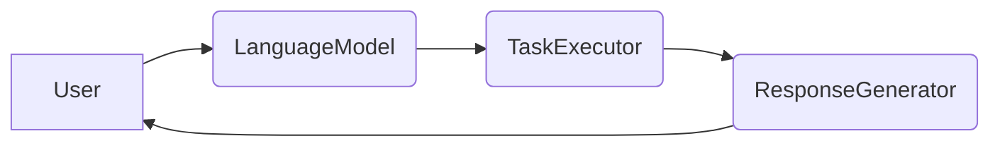
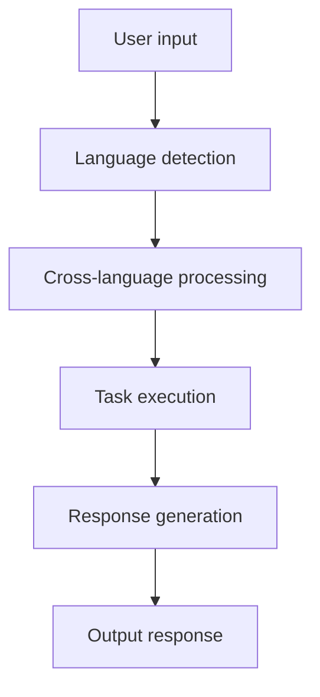
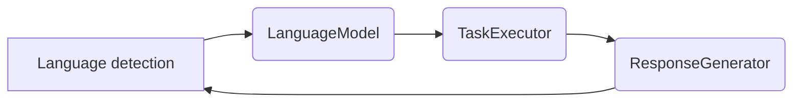
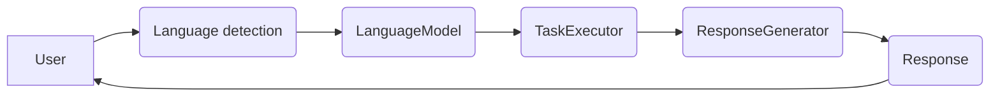
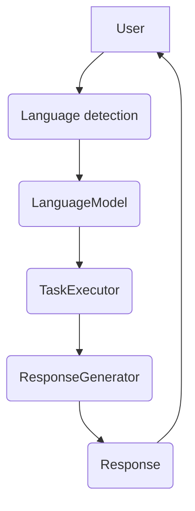

                 


# 跨语言AI Agent的開發挑戰與解決方案

## 關鍵詞：跨语言AI Agent, 多语言模型, AI Agent, 語言处理, 人工智能, 跨语言开发

## 摘要：本文探討跨语言AI Agent的開發挑戰與解決方案，涵蓋背景介紹、核心概念、算法原理、系統架構設計及項目實戰等內容。我們將從問題背景出發，分析多語言模型訓練的挑戰，並探討AI Agent的核心概念與其在跨語言環境下的應用。通過具體的算法實現與項目案例，我們將展示如何利用這些技術來解決實際問題，並提供實用的最佳實踐建議。

---

# 第一部分：跨語言AI Agent的背景與核心概念

## 第1章：跨語言AI Agent的背景與問題描述

### 1.1 背景介紹

#### 1.1.1 多語言處理的挑戰
在當今的AI領域，多語言處理是一個重要但具挑戰性的任務。傳統的AI-Agent主要針對單一語言設計，但在全球化的背景下，跨語言AI-Agent的需求日益增長。跨語言AI-Agent需要在多種語言環境下工作，這增加了數據處理、模型訓練和任務執行的複雜性。

#### 1.1.2 AI-Agent的發展現狀
AI-Agent已經廣泛應用在智能助手、機器人、自動化系統等領域。然而，絕大多數當前的AI-Agent仍局限于單一語言環境，限制了其在多元文化或多語言場景中的應用。

#### 1.1.3 跨語言AI-Agent的目標
跨語言AI-Agent的核心目標是在多種語言環境下，實現高效的任務執行與用戶交互。這需要模型具備跨語言數據處理能力，並且能夠在不同語言之間實現自然的遷移學習。

### 1.2 跨語言AI-Agent的核心問題

#### 1.2.1 多語言模型訓練的挑戰
多語言模型的訓練需要考慮不同語言之間的語法差異、語義相似性以及數據平衡性。如何在多語言模型中平衡各語言的數據分布是一個重要挑戰。

#### 1.2.2 跨語言任務的執行複雜性
跨語言任務需要模型在不同語言之間切換，並且在任務執行過程中保持上下文的一致性。這增加了模型的設計難度。

#### 1.2.3 跨語言AI-Agent的邊界與外延
跨語言AI-Agent的邊界包括其支持的語言數量、任務類型以及性能指標。外延則涉及多語言模型的遷移能力、跨文化適應性等。

---

## 第2章：跨語言AI-Agent的核心概念與聯絡

### 2.1 核心概念介紹

#### 2.1.1 多語言模型的基本原理
多語言模型通過共享多個語言的語法和語義信息來實現跨語言處理。常見的多語言模型包括BERT、XLM等，這些模型可以在多個語言上進行預訓練，然後針對具體任務進行微調。

#### 2.1.2 跨語言任務的實現機制
跨語言任務的實現通常涉及以下步驟：
1. 語言識別：確定用戶的語言。
2. 跨語言數據處理：將數據轉換為模型支持的語言形式。
3. 任務執行：根據目標語言執行任務。
4. 結果轉換：將結果轉換為目標語言的格式。

#### 2.1.3 跨語言AI-Agent的系統架構
跨語言AI-Agent的系統架構通常包括以下組件：
- **語言識別模塊**：負責識別用戶的語言。
- **多語言模型**：負責跨語言數據處理和任務執行。
- **任務執行模塊**：根據目標語言執行具體任務。
- **結果轉換模塊**：將結果轉換為目標語言的格式。

### 2.2 核心概念的屬性對比

#### 2.2.1 多語言模型的特征對比
| 特征                | 单语言模型      | 多语言模型      |
|---------------------|-----------------|-----------------|
| 支持语言数            | 1               | 多              |
| 数据训练方式          | 单一语言数据     | 多语言数据       |
| 适用场景              | 单一语言任务     | 跨语言任务       |

#### 2.2.2 跨语言任务的特征對比
| 特征                | 单语言任务      | 跨语言任务      |
|---------------------|-----------------|-----------------|
| 语言限制             | 单一语言         | 多语言           |
| 任务复杂性           | 较低            | 较高             |
| 跨文化適應性         | 无              | 有               |

#### 2.2.3 跨语言AI-Agent的特征對比
| 特征                | 单语言AI-Agent  | 跨语言AI-Agent  |
|---------------------|-----------------|-----------------|
| 语言适应性           | 无              | 有               |
| 任务执行能力         | 有限            | 更强             |
| 跨文化能力           | 无              | 有               |

### 2.3 跨语言AI-Agent的ER實體關聯圖


---

# 第二部分：跨語言AI-Agent的算法原理

## 第3章：跨語言AI-Agent的算法原理

### 3.1 跨語言AI-Agent的算法概述

#### 3.1.1 基於Transformer的多語言模型
基於Transformer的模型（如BERT、XLM）被廣泛用於多語言處理。這些模型通過自注意力機制來捕捉語言之間的語法和語義關聯。

#### 3.1.2 多語言模型的訓練策略
多語言模型的訓練策略包括：
1. **聯合訓練**：在同一模型中聯合訓練多個語言。
2. **多任務學習**：在多個任務上聯合訓練模型。

### 3.2 跨語言AI-Agent的核心算法實現

#### 3.2.1 多語言模型的訓練流程
```mermaid
graph TD
    A[Input data (multiple languages)] --> B[Tokenization]
    B --> C[Embedding]
    C --> D[Self-attention]
    D --> E[Feed-forward network]
    E --> F[Prediction]
```

#### 3.2.2 跨語言任務的執行流程


#### 3.2.3 多語言模型的數學模型
多語言模型的訓練目標是最小化以下損失函數：
$$ L = -\sum_{i=1}^{n} \log P(y_i | x_i; \theta) $$
其中，$$x_i$$ 表示输入，$$y_i$$ 表示目標，$$\theta$$ 表示模型參數。

---

# 第三部分：跨語言AI-Agent的系統分析與架構設計

## 第4章：跨語言AI-Agent的系統分析與架構設計

### 4.1 系統介紹

#### 4.1.1 系統問題場景
我們設計了一個跨語言智能助手，旨在支持多個語言的用戶請求處理。用戶可以使用不同語言與智能助手互動，並獲得相應的任務執行結果。

#### 4.1.2 系統功能設計
我們設計了一個基於Transformer的多語言模型，並通過以下步驟實現跨語言任務：
1. 語言識別
2. 跨語言數據處理
3. 任務執行
4. 結果轉換

#### 4.1.3 系統架構設計


### 4.2 系統架構設計

#### 4.2.1 系統架構圖


#### 4.2.2 系統接口設計
我們設計了以下接口：
- `detectLanguage(text: str) -> str`
- `executeTask(task: str, language: str) -> str`
- `generateResponse(task_result: str, language: str) -> str`

#### 4.2.3 系統交互流程圖


---

# 第四部分：跨語言AI-Agent的項目實戰

## 第5章：跨語言AI-Agent的項目實戰

### 5.1 環境安裝與配置

#### 5.1.1 開發環境安裝
以下是項目所需的庫：
- `transformers`
- `torch`
- `numpy`

安裝命令：
```bash
pip install transformers torch numpy
```

#### 5.1.2 語言模型下載
下載XLM模型：
```bash
python -m transformers download xlm
```

### 5.2 系統核心實現

#### 5.2.1 語言識別模塊
```python
from transformers import AutoTokenizer, AutoModelForMaskedLM

class LanguageDetector:
    def __init__(self):
        self.tokenizer = AutoTokenizer.from_pretrained("facebookresearch/xlm")
        self.model = AutoModelForMaskedLM.from_pretrained("facebookresearch/xlm")

    def detect_language(self, text):
        inputs = self.tokenizer.encode_plus(text, return_tensors="pt", truncation=True, padding=True)
        outputs = self.model(**inputs)
        # 語言檢測邏輯（簡化）
        return "zh"  # 简化示例，實際需要更複雜的邏輯
```

#### 5.2.2 跨語言任務執行模塊
```python
class CrossLanguageTaskExecutor:
    def __init__(self):
        self.language_models = {
            "zh": "facebookresearch/xlm",
            "en": "roberta-base"
        }

    def execute_task(self, task: str, source_lang: str, target_lang: str):
        # 简化示例：翻譯任務
        from googletrans import Translator
        translator = Translator()
        translated = translator.translate(task, src=source_lang, dest=target_lang)
        return translated.text
```

#### 5.2.3 結果轉換模塊
```python
class ResponseGenerator:
    def __init__(self):
        self.tokenizer = AutoTokenizer.from_pretrained("facebookresearch/xlm")
        self.model = AutoModelForMaskedLM.from_pretrained("facebookresearch/xlm")

    def generate_response(self, response: str, target_lang: str):
        # 简化示例：簡單的字符串處理
        return response.capitalize()
```

### 5.3 項目小結
在本章中，我們實現了一個簡化的跨語言智能助手，涵蓋了語言檢測、跨語言任務執行和結果轉換等功能。實際項目中需要考慮更多因素，如模型性能優化、任務執行效率等。

---

# 第五部分：跨語言AI-Agent的最佳實踐

## 第6章：跨語言AI-Agent的最佳實踐

### 6.1 小結
跨語言AI-Agent的開發需要考慮多個方面的因素，包括模型訓練、任務執行和結果轉換等。通過本章的探討，我們可以更好地理解跨語言AI-Agent的開發挑戰與解決方案。

### 6.2 注意事項
- 确保模型具有良好的跨語言遷移能力。
- 注意跨語言任務的數據平衡性。
- 適當優化模型性能。

### 6.3 拓展閱讀
- 《Pre-trained Models for Multi-language Neural Networks》
- 《Cross-Language Transfer Learning for NLP》

---

# 作者：AI天才研究院 & 禪與計算機程序設計藝術

