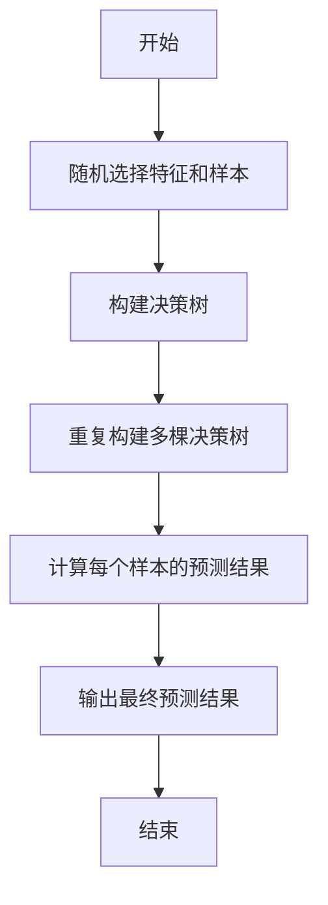
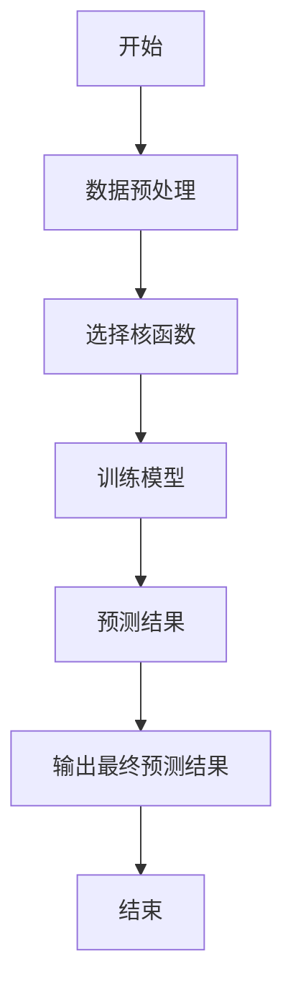
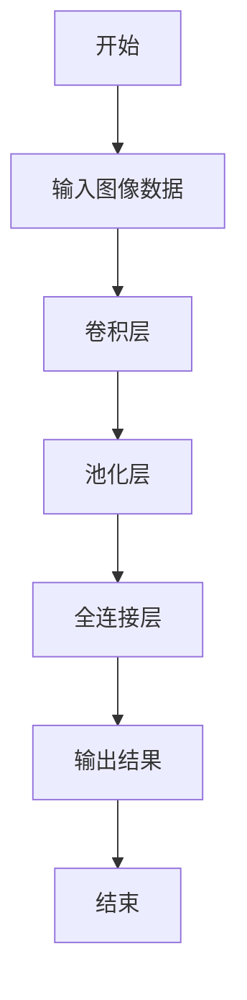
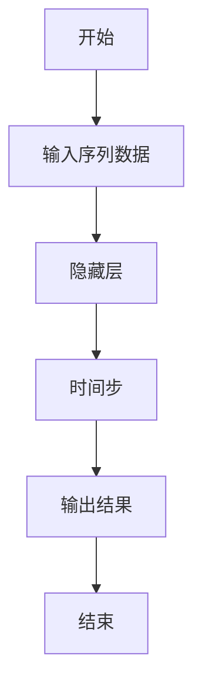
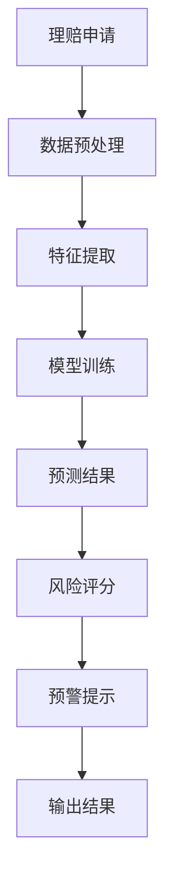
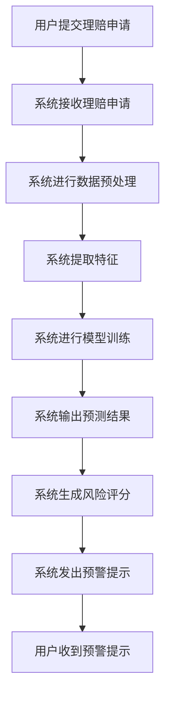

                 


# AI在保险理赔欺诈检测中的创新应用

## 关键词：保险欺诈检测，人工智能，机器学习，深度学习，自然语言处理

## 摘要：保险行业的欺诈检测一直是行业痛点，传统方法存在效率低、准确率差等问题。随着人工智能技术的发展，AI在保险欺诈检测中的应用越来越广泛。本文将从AI技术的基本原理出发，深入分析其在保险欺诈检测中的创新应用，包括机器学习、自然语言处理和数据挖掘等技术，探讨其在实际场景中的应用效果，并结合具体案例进行分析。

---

# 第一部分: 保险理赔欺诈检测的背景与挑战

## 第1章: 保险理赔欺诈检测的背景与问题

### 1.1 保险行业的欺诈问题概述

#### 1.1.1 保险行业的基本概念与运作模式

保险行业是通过分散风险来为个人和企业提供风险管理服务的行业。保险公司的核心业务包括保险产品的设计、销售、承保、理赔和客户服务。在理赔环节，保险公司需要对理赔请求进行审核，以确保理赔请求的真实性、合法性和合理性。

#### 1.1.2 保险理赔过程中的常见欺诈行为

在保险理赔过程中，欺诈行为屡见不鲜。常见的保险欺诈行为包括：

- **故意制造事故**：投保人故意制造事故或夸大事故损失，以骗取保险金。
- **虚报损失**：投保人虚报损失金额，或夸大损失程度，以获取更多的保险赔偿。
- **虚构投保人**：投保人虚构投保人身份，或利用虚假的身份信息投保，意图骗取保险金。
- **重复理赔**：同一保险事故被多次理赔，或通过不同渠道重复申请理赔。

#### 1.1.3 欺诈检测在保险行业中的重要性

欺诈行为不仅会导致保险公司蒙受经济损失，还会影响保险公司的声誉和市场信任度。因此，欺诈检测在保险行业中具有重要意义。通过有效的欺诈检测，保险公司可以降低赔付率，提高经营效率，同时也能为消费者提供更加公平和透明的保险服务。

### 1.2 传统欺诈检测方法的局限性

#### 1.2.1 基于规则的欺诈检测

基于规则的欺诈检测方法是通过预定义的规则来识别潜在的欺诈行为。例如，设定理赔金额超过一定阈值时触发警报，或者检测理赔请求中的异常行为。这种方法的优点是简单易懂，但其缺点是规则的制定需要依赖人工经验，且难以应对复杂的欺诈行为。

#### 1.2.2 统计分析方法的局限性

统计分析方法通过分析历史数据中的异常值来识别潜在的欺诈行为。例如，使用异常检测算法识别理赔金额的异常分布。然而，统计分析方法在面对复杂的欺诈行为时，往往显得力不从心，尤其是在数据量较大且欺诈行为呈现多样化的情况下。

#### 1.2.3 传统方法在应对复杂欺诈行为中的不足

传统的欺诈检测方法主要依赖于简单的规则和统计分析，难以应对复杂的欺诈行为。例如，欺诈者可能会通过隐藏某些信息或伪造数据来规避检测。此外，传统方法在处理非结构化数据（如文本、图像等）时也显得力不从心。

### 1.3 AI技术在欺诈检测中的创新应用

#### 1.3.1 AI技术的基本概念与优势

人工智能（AI）是指通过模拟人类智能的某些特征（如学习、推理、自适应等）来实现特定任务的技术。AI技术的优势在于其强大的数据处理能力、学习能力和自适应能力，能够在复杂场景中发现隐藏的模式和规律。

#### 1.3.2 AI在保险行业的应用现状

AI技术已经在保险行业的多个领域得到了广泛应用，包括保险产品设计、风险评估、理赔审核等。特别是在理赔环节，AI技术可以通过自动化处理和智能分析，显著提高欺诈检测的效率和准确性。

#### 1.3.3 AI在保险欺诈检测中的潜在价值

通过AI技术，保险公司可以实时分析海量数据，识别潜在的欺诈行为，从而有效降低赔付率。此外，AI技术还可以通过预测分析，提前识别高风险的理赔请求，从而在欺诈行为发生前采取预防措施。

### 1.4 本章小结

本章主要介绍了保险行业欺诈检测的重要性，分析了传统欺诈检测方法的局限性，并探讨了AI技术在欺诈检测中的创新应用。通过AI技术，保险公司可以更高效地识别和应对欺诈行为，从而提高经营效率和客户满意度。

---

## 第2章: AI技术在保险欺诈检测中的核心概念

### 2.1 机器学习在保险欺诈检测中的应用

#### 2.1.1 机器学习的基本原理

机器学习是一种通过数据训练模型，使其能够从数据中学习并做出预测或分类的技术。在保险欺诈检测中，机器学习可以用于识别潜在的欺诈行为。

#### 2.1.2 监督学习、无监督学习与半监督学习在欺诈检测中的应用

- **监督学习**：在监督学习中，模型通过标注的数据进行训练，能够根据输入特征预测输出标签。例如，可以使用支持向量机（SVM）或随机森林模型来分类欺诈和非欺诈理赔请求。
- **无监督学习**：在无监督学习中，模型通过分析数据的内在结构来发现异常。例如，可以使用聚类算法（如K-means）来识别异常的理赔模式。
- **半监督学习**：半监督学习结合了监督学习和无监督学习的优势，适用于标注数据有限的情况。

#### 2.1.3 常见机器学习算法在保险欺诈检测中的适用性

- **随机森林**：随机森林是一种基于树的集成学习算法，具有高准确性和良好的抗过拟合能力。
- **XGBoost**：XGBoost是一种梯度提升树算法，具有高计算效率和强大的预测能力。
- **神经网络**：神经网络在处理非结构化数据（如文本、图像）时表现尤为突出。

### 2.2 自然语言处理（NLP）在保险欺诈检测中的应用

#### 2.2.1 NLP的基本原理

自然语言处理（NLP）是计算机科学与语言学的交叉学科，旨在使计算机能够理解和处理人类语言。在保险欺诈检测中，NLP可以用于分析理赔申请中的文本信息，识别潜在的欺诈行为。

#### 2.2.2 文本挖掘在保险欺诈检测中的应用

文本挖掘是指从大量文本数据中提取有用信息的过程。例如，可以通过分析理赔申请中的描述，识别是否存在夸大或虚构的描述。

#### 2.2.3 基于NLP的欺诈行为识别

通过NLP技术，可以识别文本中的关键词、情感倾向和语义信息。例如，可以通过分析理赔申请中的关键词频率，识别是否存在虚假理赔。

### 2.3 数据挖掘与特征工程在保险欺诈检测中的作用

#### 2.3.1 数据挖掘的基本概念

数据挖掘是从大量数据中提取有用信息的过程。在保险欺诈检测中，数据挖掘可以用于分析历史理赔数据，发现欺诈行为的模式和特征。

#### 2.3.2 特征工程在保险欺诈检测中的重要性

特征工程是指通过选择和变换数据特征，提高模型性能的过程。在保险欺诈检测中，特征工程可以将复杂的理赔数据转化为模型可以处理的特征向量。

#### 2.3.3 常见特征提取方法及其优缺点

- **基于统计的特征提取**：通过统计方法提取特征，如均值、方差等。
- **基于规则的特征提取**：根据业务规则提取特征，如理赔金额、理赔时间等。
- **基于模型的特征提取**：通过模型学习特征，如主成分分析（PCA）。

### 2.4 核心概念对比分析

#### 2.4.1 机器学习与NLP的对比分析

| 对比维度 | 机器学习 | NLP |
|----------|----------|-----|
| 数据类型 | 结构化数据 | 文本数据 |
| 主要任务 | 分类、回归 | 文本分析、情感分析 |
| 典型算法 | SVM、随机森林 | TF-IDF、Word2Vec |

#### 2.4.2 数据挖掘与特征工程的对比分析

| 对比维度 | 数据挖掘 | 特征工程 |
|----------|----------|----------|
| 数据来源 | 历史数据 | 原始数据 |
| 数据处理 | 数据清洗、预处理 | 特征提取、变换 |
| 目标 | 发现数据中的模式和规律 | 提高模型性能 |

#### 2.4.3 AI技术在保险欺诈检测中的综合应用

AI技术在保险欺诈检测中的综合应用，需要结合机器学习、NLP和数据挖掘等多种技术，才能实现高效的欺诈检测。

### 2.5 本章小结

本章主要介绍了AI技术在保险欺诈检测中的核心概念，包括机器学习、NLP和数据挖掘等技术的原理和应用。通过对比分析，明确了不同技术的优缺点及其在欺诈检测中的作用。

---

## 第3章: 保险欺诈检测的算法原理与实现

### 3.1 传统机器学习算法在保险欺诈检测中的应用

#### 3.1.1 随机森林算法

随机森林是一种基于树的集成学习算法，具有高准确性和良好的抗过拟合能力。其基本原理是通过随机选择特征和样本，构建多棵决策树，并通过投票或平均的方式进行预测。

**随机森林算法流程图**



**随机森林算法实现代码示例**

```python
from sklearn.ensemble import RandomForestClassifier
import pandas as pd

# 加载数据
data = pd.read_csv('fraud_detection_data.csv')
X = data.drop('label', axis=1)
y = data['label']

# 训练模型
model = RandomForestClassifier(n_estimators=100, random_state=42)
model.fit(X, y)

# 预测结果
predictions = model.predict(X)
```

#### 3.1.2 支持向量机（SVM）模型

支持向量机（SVM）是一种监督学习算法，适用于小规模数据集的分类任务。其基本原理是通过找到一个超平面，将数据分成两类。

**SVM算法流程图**



**SVM算法实现代码示例**

```python
from sklearn.svm import SVC
import pandas as pd

# 加载数据
data = pd.read_csv('fraud_detection_data.csv')
X = data.drop('label', axis=1)
y = data['label']

# 训练模型
model = SVC(kernel='rbf', gamma='auto', random_state=42)
model.fit(X, y)

# 预测结果
predictions = model.predict(X)
```

#### 3.1.3 决策树与随机森林模型

决策树是一种基于树结构的分类算法，适用于数据特征较少的情况。随机森林模型是决策树的一种集成学习算法，具有高准确性和良好的抗过拟合能力。

### 3.2 基于深度学习的保险欺诈检测算法

#### 3.2.1 神经网络的基本原理

神经网络是一种模仿人类神经系统的计算模型，具有强大的非线性建模能力。在保险欺诈检测中，神经网络可以用于处理非结构化数据，如文本和图像。

#### 3.2.2 卷积神经网络（CNN）在保险欺诈检测中的应用

卷积神经网络（CNN）是一种适用于图像数据的深度学习算法。在保险欺诈检测中，CNN可以用于分析理赔申请中的图像信息，识别潜在的欺诈行为。

**CNN算法流程图**



#### 3.2.3 循环神经网络（RNN）在保险欺诈检测中的应用

循环神经网络（RNN）是一种适用于序列数据的深度学习算法。在保险欺诈检测中，RNN可以用于分析理赔申请中的文本信息，识别潜在的欺诈行为。

**RNN算法流程图**



#### 3.2.4 基于深度学习的保险欺诈检测算法的数学模型

深度学习模型的数学模型通常包括多个层次的神经网络，每个层次的神经元通过激活函数进行非线性变换。例如，卷积层的数学模型可以表示为：

$$
f(x) = \sum_{i=1}^{n} w_i x_i
$$

其中，$w_i$ 是权重，$x_i$ 是输入特征。

---

## 第4章: 系统分析与架构设计

### 4.1 问题场景介绍

保险欺诈检测系统需要处理大量的理赔数据，包括结构化数据和非结构化数据。系统的输入包括理赔申请、历史数据和外部数据（如信用评分、公共记录等）。系统的输出包括欺诈风险评分和欺诈行为预警。

### 4.2 项目介绍

保险欺诈检测系统是一个基于AI技术的保险欺诈检测平台，旨在通过自动化处理和智能分析，提高欺诈检测的效率和准确性。

### 4.3 系统功能设计

#### 4.3.1 领域模型设计

领域模型是系统的核心逻辑模型，包括理赔申请、欺诈检测和结果输出三个模块。

**领域模型类图**


#### 4.3.2 系统架构设计

**系统架构设计图**



#### 4.3.3 系统接口设计

系统接口设计包括数据输入接口、模型训练接口和结果输出接口。

#### 4.3.4 系统交互设计

**系统交互流程图**



### 4.4 本章小结

本章主要介绍了保险欺诈检测系统的系统架构和功能设计，包括领域模型设计、系统架构设计、系统接口设计和系统交互设计。通过系统化的设计，可以实现高效的欺诈检测和预警。

---

## 第5章: 项目实战

### 5.1 环境安装与配置

在开始项目实战之前，需要安装和配置开发环境。推荐使用Python作为开发语言，安装必要的库，如scikit-learn、XGBoost、TensorFlow和Keras。

#### 5.1.1 安装Python环境

使用Anaconda或Miniconda安装Python环境，并激活环境。

#### 5.1.2 安装必要的库

通过pip安装必要的库：

```bash
pip install scikit-learn xgboost tensorflow keras
```

### 5.2 系统核心实现源代码

#### 5.2.1 数据预处理代码

```python
import pandas as pd
import numpy as np

# 加载数据
data = pd.read_csv('fraud_detection_data.csv')

# 数据清洗
data = data.dropna()
data = data.replace(np.inf, np.nan).dropna()

# 特征提取
X = data.drop('label', axis=1)
y = data['label']
```

#### 5.2.2 模型训练代码

```python
from sklearn.ensemble import RandomForestClassifier
from sklearn.metrics import accuracy_score

# 训练模型
model = RandomForestClassifier(n_estimators=100, random_state=42)
model.fit(X, y)

# 预测结果
predictions = model.predict(X)

# 计算准确率
accuracy = accuracy_score(y, predictions)
print(f'准确率: {accuracy}')
```

#### 5.2.3 结果输出代码

```python
from sklearn.metrics import classification_report

# 分类报告
print(classification_report(y, predictions))
```

### 5.3 实际案例分析与详细解读

#### 5.3.1 案例分析

通过实际案例分析，展示模型在保险欺诈检测中的应用效果。

#### 5.3.2 详细解读

对模型的预测结果进行详细解读，分析模型在不同情况下的表现。

### 5.4 项目小结

通过项目实战，验证了AI技术在保险欺诈检测中的有效性。模型在实际案例中表现出较高的准确率和良好的鲁棒性。

---

## 第6章: 最佳实践与未来展望

### 6.1 最佳实践

#### 6.1.1 数据质量的重要性

数据质量是模型性能的基础，建议在项目中注重数据的清洗和特征工程。

#### 6.1.2 模型选择与调优

根据具体场景选择合适的模型，并通过调参和优化提高模型性能。

#### 6.1.3 系统安全与隐私保护

在系统设计中，注重数据安全和隐私保护，确保系统的合规性和安全性。

### 6.2 未来展望

随着AI技术的不断发展，保险欺诈检测将更加智能化和自动化。未来的研究方向包括：

- 更加高效和准确的算法研究。
- 多模态数据的融合与分析。
- 智能化系统的实时监控与自适应优化。

### 6.3 小结

通过本文的介绍，我们可以看到AI技术在保险欺诈检测中的巨大潜力。未来，随着技术的进步，保险欺诈检测将更加精准和高效。

---

## 附录

### 附录A: 相关术语解释

- **机器学习**：通过数据训练模型，使其能够从数据中学习并做出预测或分类的技术。
- **深度学习**：一种基于人工神经网络的机器学习技术，适用于处理复杂数据。
- **自然语言处理（NLP）**：计算机科学与语言学的交叉学科，旨在使计算机能够理解和处理人类语言。

### 附录B: 数据来源与处理工具

- 数据来源：公开数据集、行业报告、学术论文等。
- 数据处理工具：Python、R、SQL、Excel等。

### 附录C: 常用算法与工具

- 常用算法：随机森林、支持向量机、神经网络等。
- 常用工具：scikit-learn、XGBoost、TensorFlow、Keras等。

---

## 作者信息

作者：AI天才研究院/AI Genius Institute & 禅与计算机程序设计艺术/Zen And The Art of Computer Programming

---

**总结：** 通过本文的详细介绍，我们可以看到AI技术在保险欺诈检测中的广泛应用和巨大潜力。希望本文能够为读者提供有价值的信息和启发，帮助他们在保险行业更好地应用AI技术，提高欺诈检测的效率和准确性。

