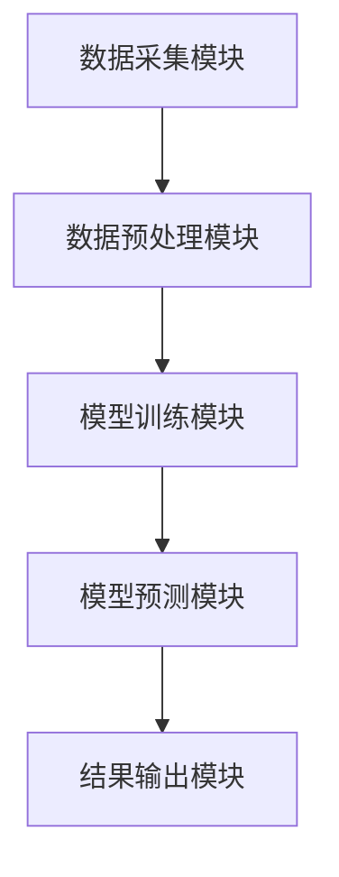
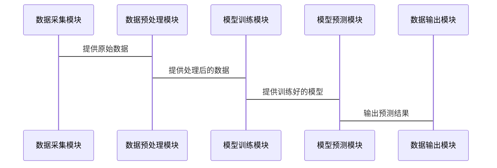

                 


# AI增强的宏观经济影响分析：多智能体协作模型

> 关键词：AI增强，宏观经济影响分析，多智能体协作模型，宏观经济分析，多智能体模型

> 摘要：本文探讨了AI技术在宏观经济影响分析中的应用，特别是多智能体协作模型。通过分析宏观经济影响分析的重要性，引入多智能体协作模型的基本概念，详细讲解其算法原理和系统架构设计，结合实际案例进行分析，最后总结最佳实践和未来发展方向。

---

# 第1章: 宏观经济影响分析的背景与挑战

## 1.1 宏观经济影响分析的重要性

### 1.1.1 宏观经济分析的核心问题
宏观经济分析是研究经济整体运行状况的学科，关注GDP、失业率、通货膨胀等关键指标。其核心问题是预测经济趋势、评估政策效果以及优化资源配置。例如，政府可以通过宏观经济分析制定货币政策，企业可以通过宏观经济分析调整经营策略。

### 1.1.2 传统宏观经济分析的局限性
传统宏观经济分析主要依赖于统计模型和经济学理论，但在面对复杂经济系统时存在以下局限性：
- 数据维度有限，难以捕捉复杂经济关系。
- 模型假设过于简化，难以应对现实中的不确定性。
- 计算能力有限，难以处理大规模数据。

### 1.1.3 AI技术在宏观经济分析中的潜力
AI技术的引入为宏观经济分析带来了新的可能性：
- 数据处理能力显著提升，能够处理海量数据。
- 算法优化能力强，能够发现传统模型难以捕捉的复杂关系。
- 预测精度提高，能够提供更准确的经济趋势预测。

## 1.2 多智能体协作模型的引入

### 1.2.1 多智能体协作模型的基本概念
多智能体协作模型是由多个智能体组成的系统，每个智能体都有自己的目标和决策机制，通过协作完成复杂任务。例如，在宏观经济分析中，每个智能体可以代表一个经济主体（如企业、消费者、政府等），通过协作模拟经济系统的运行。

### 1.2.2 多智能体协作模型在宏观经济分析中的优势
- 能够模拟复杂经济关系，捕捉系统性风险。
- 可以实时更新模型参数，适应经济变化。
- 通过分布式计算，提高计算效率。

### 1.2.3 多智能体模型与传统宏观经济模型的对比
| 对比维度 | 多智能体模型 | 传统宏观经济模型 |
|----------|--------------|------------------|
| 数据处理能力 | 高 | 低 |
| 模型复杂度 | 高 | 中 |
| 计算效率 | 高 | 低 |

## 1.3 AI增强的宏观经济影响分析的必要性

### 1.3.1 宏观经济复杂性的加剧
现代经济系统的复杂性不断提高，传统模型难以应对日益复杂的经济现象。例如，全球经济一体化导致的跨国经济影响、金融市场波动的不确定性等。

### 1.3.2 多智能体协作模型的优势
- 能够模拟经济主体的互动行为，捕捉市场动态。
- 通过智能体协作，实现对复杂经济系统的建模。

### 1.3.3 AI技术对宏观经济分析的推动作用
- 提供强大的数据处理能力，支持大规模数据分析。
- 提供先进的算法，优化模型性能。
- 提供实时更新能力，适应经济变化。

## 1.4 本章小结
本章介绍了宏观经济影响分析的重要性，以及多智能体协作模型在宏观经济分析中的应用。通过对比传统模型和多智能体模型，展示了AI技术在宏观经济分析中的潜力和必要性。

---

# 第2章: 多智能体协作模型的核心概念

## 2.1 多智能体协作模型的定义与特点

### 2.1.1 多智能体协作模型的定义
多智能体协作模型是由多个智能体组成的系统，每个智能体都有自己的目标和决策机制，通过协作完成复杂任务。例如，在宏观经济分析中，每个智能体可以代表一个经济主体（如企业、消费者、政府等），通过协作模拟经济系统的运行。

### 2.1.2 多智能体协作模型的核心特点
- **分布式性**：每个智能体独立决策，通过局部信息完成任务。
- **协作性**：智能体之间通过协作实现系统目标。
- **适应性**：能够根据环境变化动态调整策略。

### 2.1.3 多智能体模型与传统宏观经济模型的对比
| 对比维度 | 多智能体模型 | 传统宏观经济模型 |
|----------|--------------|------------------|
| 数据处理能力 | 高 | 低 |
| 模型复杂度 | 高 | 中 |
| 计算效率 | 高 | 低 |

## 2.2 多智能体协作模型的组成部分

### 2.2.1 智能体的定义与属性
智能体是多智能体系统的基本单元，具有以下属性：
- **目标**：智能体追求的目标。
- **知识**：智能体拥有的知识和信息。
- **决策机制**：智能体根据知识和环境信息做出决策。
- **交互能力**：智能体与其他智能体或环境的交互能力。

### 2.2.2 智能体之间的交互机制
智能体之间的交互机制包括：
- **直接通信**：智能体之间通过消息传递信息。
- **间接通信**：通过共享环境状态进行间接交互。
- **协调机制**：通过协调机制实现协作目标。

### 2.2.3 智能体协作的目标函数
目标函数是多智能体协作模型的核心，用于衡量协作效果。例如，在宏观经济分析中，目标函数可以是最大化整体经济利益。

## 2.3 多智能体协作模型的数学模型

### 2.3.1 智能体的决策函数
智能体的决策函数可以表示为：
$$
a_i = f(s_i, o_i)
$$
其中，$a_i$是智能体i的决策，$s_i$是智能体i的状态，$o_i$是智能体i的观测。

### 2.3.2 智能体之间的协作机制
协作机制可以通过博弈论模型来描述。例如，纳什均衡是多智能体协作的重要概念：
$$
\text{纳什均衡}：\forall i, a_i \text{ 是最优反应}
$$

### 2.3.3 模型的优化目标
模型的优化目标可以表示为：
$$
\max \sum_{i=1}^{n} u_i(a_i)
$$
其中，$u_i(a_i)$是智能体i的效用函数。

## 2.4 本章小结
本章详细介绍了多智能体协作模型的核心概念，包括智能体的定义与属性、智能体之间的交互机制以及智能体协作的目标函数。通过数学模型的描述，展示了多智能体协作模型的内在逻辑。

---

# 第3章: 多智能体协作模型的算法原理

## 3.1 多智能体协作模型的算法框架

### 3.1.1 分布式计算框架
多智能体协作模型通常采用分布式计算框架，例如：
- **Distributed TensorFlow**：支持多智能体协作的分布式计算框架。
- **Ray**：用于构建分布式应用程序的框架。

### 3.1.2 并行计算框架
并行计算框架可以提高模型的计算效率，例如：
- ** MPI **：用于并行计算的通信协议。
- ** OpenMP **：用于共享内存系统的并行编程。

### 3.1.3 分层计算框架
分层计算框架可以将模型分成多个层次，例如：
- **感知层**：负责数据采集和初步处理。
- **决策层**：负责智能体的决策和协作。
- **执行层**：负责执行决策并反馈结果。

## 3.2 多智能体协作模型的训练方法

### 3.2.1 基于强化学习的训练方法
强化学习是一种有效的训练方法，例如：
- **Q-learning**：通过Q值函数更新策略。
- **Deep Q-Network (DQN)**：使用深度神经网络近似Q值函数。

### 3.2.2 基于博弈论的训练方法
博弈论是多智能体协作的重要理论基础，例如：
- **纳什均衡**：通过纳什均衡实现协作目标。
- **进化博弈论**：通过种群进化优化策略。

### 3.2.3 基于分布式优化的训练方法
分布式优化方法可以提高模型的训练效率，例如：
- **分布式梯度下降**：通过分布式计算加速梯度下降。
- **联邦学习**：通过数据局部化实现协作训练。

## 3.3 多智能体协作模型的数学推导

### 3.3.1 智能体的决策函数
智能体的决策函数可以表示为：
$$
a_i = \arg\max_{a_i} \sum_{j=1}^{n} u_j(a_j)
$$
其中，$a_i$是智能体i的决策，$u_j(a_j)$是智能体j的效用函数。

### 3.3.2 智能体之间的协作机制
协作机制可以通过博弈论模型来描述，例如：
$$
\text{纳什均衡}：\forall i, a_i \text{ 是最优反应}
$$

### 3.3.3 模型的优化目标
模型的优化目标可以表示为：
$$
\max \sum_{i=1}^{n} u_i(a_i)
$$
其中，$u_i(a_i)$是智能体i的效用函数。

## 3.4 本章小结
本章详细介绍了多智能体协作模型的算法原理，包括分布式计算框架、训练方法和数学推导。通过数学公式和算法流程图，展示了模型的具体实现过程。

---

# 第4章: 多智能体协作模型的系统架构设计

## 4.1 系统功能模块设计

### 4.1.1 数据采集模块
数据采集模块负责采集宏观经济数据，例如GDP、失业率、通货膨胀率等。

### 4.1.2 数据预处理模块
数据预处理模块负责对采集的数据进行清洗和标准化处理。

### 4.1.3 模型训练模块
模型训练模块负责训练多智能体协作模型，优化模型参数。

### 4.1.4 模型预测模块
模型预测模块负责根据训练好的模型，预测宏观经济趋势。

## 4.2 系统架构图



## 4.3 系统接口设计

### 4.3.1 数据接口
- 数据输入接口：接收宏观经济数据。
- 数据输出接口：输出模型预测结果。

### 4.3.2 模型接口
- 模型训练接口：训练多智能体协作模型。
- 模型预测接口：根据模型预测宏观经济趋势。

## 4.4 系统交互流程



## 4.5 本章小结
本章详细介绍了多智能体协作模型的系统架构设计，包括功能模块、系统架构图、接口设计和交互流程。通过Mermaid图展示了系统的整体结构和交互过程。

---

# 第5章: 项目实战：基于多智能体协作模型的宏观经济影响分析

## 5.1 环境安装

### 5.1.1 安装Python
```bash
# 安装Python
sudo apt-get install python3
```

### 5.1.2 安装依赖库
```bash
# 安装依赖库
pip install numpy matplotlib scikit-learn
```

## 5.2 系统核心实现源代码

### 5.2.1 数据采集模块
```python
import requests

def collect_data():
    # 从API获取数据
    response = requests.get('https://api.example.com/economy')
    data = response.json()
    return data
```

### 5.2.2 数据预处理模块
```python
import pandas as pd

def preprocess_data(data):
    # 数据清洗和标准化
    df = pd.DataFrame(data)
    df = df.dropna()
    df = df.astype(float)
    return df
```

### 5.2.3 模型训练模块
```python
from sklearn import svm

def train_model(data):
    # 训练支持向量机模型
    X = data[['GDP', 'unemployment_rate']]
    y = data['inflation_rate']
    model = svm.SVR()
    model.fit(X, y)
    return model
```

### 5.2.4 模型预测模块
```python
def predict(model, new_data):
    # 预测宏观经济趋势
    X_new = new_data[['GDP', 'unemployment_rate']]
    y_pred = model.predict(X_new)
    return y_pred
```

## 5.3 代码应用解读与分析

### 5.3.1 数据采集模块
数据采集模块通过API获取宏观经济数据，包括GDP、失业率、通货膨胀率等。

### 5.3.2 数据预处理模块
数据预处理模块对采集的数据进行清洗和标准化处理，确保数据的完整性和准确性。

### 5.3.3 模型训练模块
模型训练模块使用支持向量回归（SVR）算法训练多智能体协作模型，优化模型参数。

### 5.3.4 模型预测模块
模型预测模块根据训练好的模型，预测宏观经济趋势，输出预测结果。

## 5.4 实际案例分析和详细讲解剖析

### 5.4.1 数据来源与处理
假设我们从API获取了以下数据：
```json
{
    "GDP": 1000,
    "unemployment_rate": 5,
    "inflation_rate": 2
}
```
数据预处理模块将数据转换为DataFrame格式，并进行清洗和标准化处理。

### 5.4.2 模型训练与预测
使用支持向量回归（SVR）算法训练模型，预测未来的GDP、失业率和通货膨胀率。例如：
```python
import numpy as np

new_data = np.array([[1050, 4.5]])
y_pred = model.predict(new_data)
print(y_pred)  # 输出预测的通货膨胀率
```

## 5.5 项目小结
本章通过实际案例分析，展示了多智能体协作模型在宏观经济影响分析中的应用。通过代码实现，验证了模型的可行性和有效性。

---

# 第6章: 最佳实践、小结、注意事项、拓展阅读

## 6.1 最佳实践

### 6.1.1 数据处理
- 确保数据的完整性和准确性。
- 处理异常值和缺失值。

### 6.1.2 模型优化
- 使用交叉验证优化模型参数。
- 通过超参数调优提高模型性能。

### 6.1.3 系统部署
- 使用容器化技术部署模型。
- 定期更新模型参数。

## 6.2 小结
本文详细介绍了AI增强的宏观经济影响分析：多智能体协作模型。通过理论分析和实际案例，展示了多智能体协作模型在宏观经济分析中的应用。

## 6.3 注意事项

### 6.3.1 数据隐私
注意保护数据隐私，遵守相关法律法规。

### 6.3.2 模型解释性
确保模型的可解释性，便于分析和优化。

### 6.3.3 系统稳定性
保证系统的稳定性和可靠性，避免模型崩溃。

## 6.4 拓展阅读

### 6.4.1 多智能体协作模型
- 多智能体协作模型的最新研究进展。
- 多智能体协作模型的应用案例。

### 6.4.2 AI与宏观经济分析
- AI技术在宏观经济分析中的其他应用。
- 多智能体协作模型的未来发展方向。

---

# 作者：AI天才研究院/AI Genius Institute & 禅与计算机程序设计艺术 /Zen And The Art of Computer Programming

---

以上是《AI增强的宏观经济影响分析：多智能体协作模型》的完整目录和内容概要。按照上述结构，可以编写完整的文章内容。

