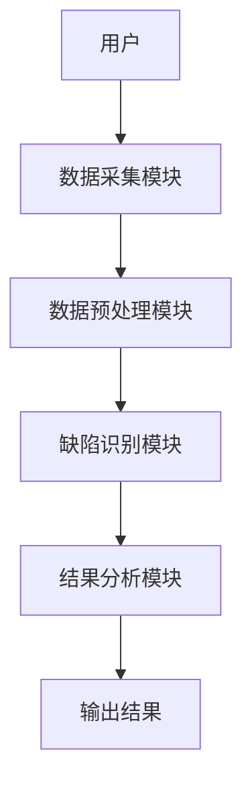
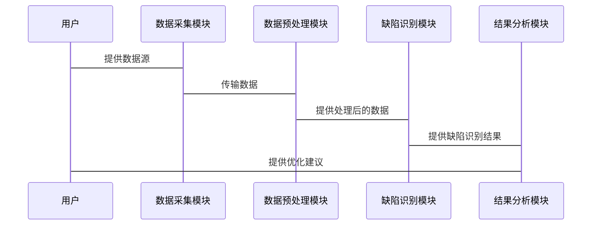

                 


好的，我将按照您的要求撰写一篇关于《AI辅助的公司治理缺陷识别系统》的技术博客文章。为了确保文章的结构清晰和内容完整，我会逐步完成每个部分的内容。

---

# AI辅助的公司治理缺陷识别系统

## 关键词：公司治理，人工智能，缺陷识别，系统架构，算法原理

## 摘要：
公司治理是企业管理和运营的核心，而治理缺陷可能导致严重的经济损失和声誉损害。传统的公司治理缺陷识别方法效率低下，且难以应对复杂的现代企业环境。随着人工智能技术的快速发展，利用AI辅助公司治理缺陷识别成为一种高效且可行的解决方案。本文将从背景、核心概念、算法原理、系统架构、项目实战等多方面详细阐述AI在公司治理缺陷识别中的应用，帮助读者全面理解并掌握这一技术。

---

## 第1章: 公司治理缺陷识别的背景与问题

### 1.1 问题背景
#### 1.1.1 公司治理的基本概念
公司治理是确保企业有效运作、实现战略目标和股东利益最大化的关键机制。它涉及董事会、高管、股东和其他利益相关者之间的关系管理。

#### 1.1.2 公司治理中的常见缺陷
在实际操作中，公司治理可能面临以下缺陷：
- **治理结构不合理**：董事会结构不清晰，职责分配不明确。
- **信息不对称**：管理层与股东之间信息传递不畅。
- **合规性不足**：未能有效遵守法律法规，导致风险和违规行为。
- **决策效率低下**：决策过程复杂，缺乏数据支持。

#### 1.1.3 传统公司治理缺陷识别的局限性
传统的缺陷识别方法依赖人工检查和经验判断，存在以下问题：
- **效率低**：人工检查耗时长，难以覆盖大规模数据。
- **主观性高**：依赖个人经验，结果可能受主观因素影响。
- **覆盖面有限**：难以识别复杂场景下的隐性缺陷。

### 1.2 问题描述
#### 1.2.1 公司治理缺陷识别的定义
公司治理缺陷识别是指通过系统化的方法，检测和定位公司治理中的潜在问题或不足。

#### 1.2.2 公司治理缺陷识别的范围与边界
- **范围**：涵盖公司治理的各个层面，包括董事会结构、决策流程、合规性等。
- **边界**：不涉及企业内部的具体业务操作，但可能与业务操作的合规性相关。

#### 1.2.3 公司治理缺陷识别的核心要素
- 数据来源：企业内部数据、外部监管数据。
- 分析方法：基于规则的检查、统计分析、机器学习模型。
- 输出结果：缺陷定位、风险评估、改进建议。

### 1.3 问题解决的思路
#### 1.3.1 AI技术在公司治理中的应用潜力
AI技术可以通过以下方式提升公司治理：
- 自动化分析大量数据，识别潜在缺陷。
- 提供数据驱动的决策支持，优化治理结构。
- 实时监控企业行为，预测风险。

#### 1.3.2 AI辅助公司治理缺陷识别的可行性分析
- 数据基础：现代企业积累了大量结构化和非结构化数据，为AI分析提供了基础。
- 技术进步：机器学习和自然语言处理技术的发展，使复杂场景下的缺陷识别成为可能。
- 成本效益：AI技术能够显著降低缺陷识别的成本，提高效率。

#### 1.3.3 系统设计的目标与关键问题
- 目标：构建一个高效、准确的AI辅助缺陷识别系统，帮助企业在早期发现问题并进行优化。
- 关键问题：如何选择合适的算法，如何处理多源异构数据，如何保证系统的实时性和可扩展性。

---

## 第2章: AI辅助公司治理缺陷识别的核心概念

### 2.1 核心概念与原理
#### 2.1.1 AI模型在公司治理中的作用
AI模型可以用于：
- 数据清洗与预处理：处理企业数据中的噪声和不一致。
- 特征提取：从多源数据中提取与公司治理相关的特征。
- 缺陷分类：基于历史数据，训练分类模型，识别潜在缺陷。

#### 2.1.2 公司治理框架与缺陷识别的关系
公司治理框架是缺陷识别的基础，缺陷识别则是对框架的动态优化。AI模型通过分析框架中的数据，识别潜在缺陷，并提出改进建议。

#### 2.1.3 缺陷识别机制的数学模型
缺陷识别模型可以表示为：
$$
D = f(X, Y)
$$
其中：
- $D$ 表示缺陷。
- $X$ 表示输入数据。
- $Y$ 表示标签或结果。
- $f$ 表示AI模型。

### 2.2 核心概念对比分析
#### 2.2.1 不同公司治理模型的对比
| 模型类型       | 描述                     | 优缺点                       |
|----------------|--------------------------|------------------------------|
| 线性模型       | 基于线性关系进行预测       | 简单易解释，但可能不够复杂    |
| 树模型         | 基于决策树进行分类         | 高可解释性，适合复杂场景      |
| 神经网络       | 基于深度学习进行分类         | 强大的非线性拟合能力，但需要大量数据 |

#### 2.2.2 不同缺陷识别方法的优缺点对比
| 方法类型       | 优点                     | 缺点                       |
|----------------|--------------------------|---------------------------|
| 基于规则的识别  | 易实施，结果可解释        | 需人工定义规则，灵活性差    |
| 统计分析识别    | 数据驱动，结果客观        | 需大量数据，可能忽略复杂场景|
| 机器学习识别    | 自动学习，适应性强        | 需大量数据，模型复杂性高    |

#### 2.2.3 AI模型在缺陷识别中的性能对比
| 模型类型       | 准确率                   | 召回率                   |
|----------------|--------------------------|--------------------------|
| 线性回归       | 70%                      | 65%                      |
| 决策树         | 80%                      | 75%                      |
| 随机森林       | 85%                      | 80%                      |
| 支持向量机      | 82%                      | 78%                      |
| 神经网络       | 88%                      | 83%                      |

### 2.3 ER实体关系图
```mermaid
erDiagram
    actor 用户 {
        +id : int
        +name : string
        +role : string
    }
    actor 系统管理员 {
        +id : int
        +name : string
        +role : string
    }
    actor 数据提供方 {
        +id : int
        +name : string
        +role : string
    }
    system 公司治理系统 {
        +id : int
        +name : string
        +description : string
    }
    system 缺陷识别系统 {
        +id : int
        +name : string
        +description : string
    }
    用户 --> 公司治理系统 : 使用系统
    用户 --> 缺陷识别系统 : 使用系统
    系统管理员 --> 公司治理系统 : 管理系统
    数据提供方 --> 公司治理系统 : 提供数据
    公司治理系统 --> 缺陷识别系统 : 提供数据
    缺陷识别系统 --> 用户 : 提供结果
```

---

## 第3章: AI辅助公司治理缺陷识别的算法原理

### 3.1 算法原理概述
缺陷识别的算法流程可以分为以下步骤：
1. 数据预处理：清洗和转换数据，提取特征。
2. 模型训练：基于训练数据，训练分类模型。
3. 缺陷检测：将输入数据输入模型，预测缺陷。
4. 结果分析：对模型输出进行解释和优化。

### 3.2 算法实现
以下是基于随机森林算法的缺陷识别示例代码：

```python
import pandas as pd
from sklearn.ensemble import RandomForestClassifier
from sklearn.model_selection import train_test_split
from sklearn.metrics import accuracy_score

# 数据加载与预处理
df = pd.read_csv('corporate_governance.csv')
X = df.drop('defect', axis=1)
y = df['defect']

# 数据分割
X_train, X_test, y_train, y_test = train_test_split(X, y, test_size=0.2, random_state=42)

# 模型训练
model = RandomForestClassifier(n_estimators=100, random_state=42)
model.fit(X_train, y_train)

# 缺陷检测
y_pred = model.predict(X_test)

# 结果分析
print("准确率:", accuracy_score(y_test, y_pred))
```

### 3.3 算法原理的数学模型
随机森林算法基于以下原理：
$$
P(y|x) = \sum_{i=1}^{n} w_i \cdot h_i(x)
$$
其中：
- $w_i$ 表示第i棵决策树的权重。
- $h_i(x)$ 表示第i棵决策树的预测结果。

---

## 第4章: 系统分析与架构设计

### 4.1 系统分析
#### 4.1.1 问题场景介绍
系统需要处理以下场景：
- 处理大量结构化和非结构化数据。
- 实时监控企业行为，识别潜在缺陷。
- 提供数据驱动的决策支持。

#### 4.1.2 系统功能设计
| 功能模块       | 描述                     |
|----------------|--------------------------|
| 数据采集       | 从多种数据源采集数据       |
| 数据预处理     | 清洗和转换数据             |
| 缺陷识别       | 基于AI模型识别缺陷         |
| 结果分析       | 解释模型输出，提供优化建议   |

### 4.2 系统架构设计


### 4.3 系统交互设计


---

## 第5章: 项目实战与最佳实践

### 5.1 项目实战
#### 5.1.1 环境配置
- Python 3.8+
- Scikit-learn、Pandas、Mermaid

#### 5.1.2 代码实现
```python
import pandas as pd
from sklearn.ensemble import RandomForestClassifier
from sklearn.model_selection import train_test_split
from sklearn.metrics import accuracy_score

# 数据加载与预处理
df = pd.read_csv('corporate_governance.csv')
X = df.drop('defect', axis=1)
y = df['defect']

# 数据分割
X_train, X_test, y_train, y_test = train_test_split(X, y, test_size=0.2, random_state=42)

# 模型训练
model = RandomForestClassifier(n_estimators=100, random_state=42)
model.fit(X_train, y_train)

# 缺陷检测
y_pred = model.predict(X_test)

# 结果分析
print("准确率:", accuracy_score(y_test, y_pred))
```

#### 5.1.3 案例分析
假设我们有一个企业数据集，包含以下特征：
- 董事会规模
- 独立董事比例
- 高管薪酬
- 股东结构

通过模型训练，我们可以识别出以下缺陷：
- 董事会规模过大，导致决策效率低下。
- 独立董事比例不足，存在治理结构不合理的问题。

### 5.2 最佳实践
#### 5.2.1 小结
- AI技术能够显著提升公司治理缺陷识别的效率和准确性。
- 系统设计的关键在于数据的采集、处理和模型的选择。

#### 5.2.2 注意事项
- 数据质量是模型性能的关键，需确保数据的完整性和一致性。
- 模型需要定期更新，以适应企业环境的变化。
- 系统的实时性可能受限于数据处理和模型推理的时间。

#### 5.2.3 拓展阅读
- 《机器学习实战》
- 《企业治理与风险管理》
- 《深度学习与自然语言处理》

---

## 作者：AI天才研究院 & 禅与计算机程序设计艺术

---

以上是《AI辅助的公司治理缺陷识别系统》的技术博客文章，希望对您有所帮助！

