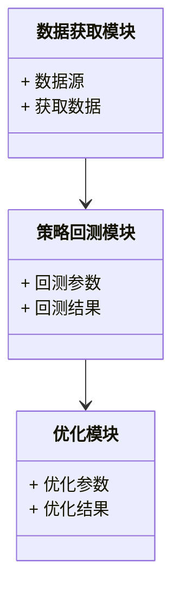
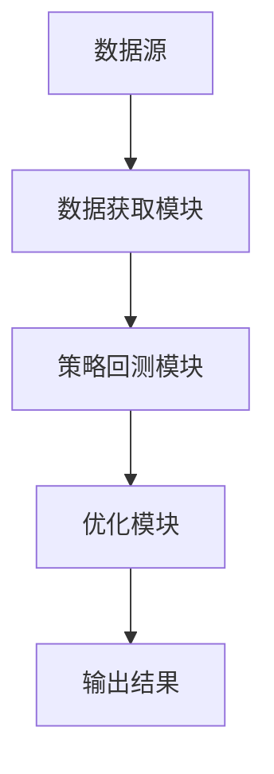

                 


# AI驱动的价值投资策略回测与优化

> 关键词：价值投资，AI，回测，优化，风险控制

> 摘要：本文详细探讨了AI在价值投资策略回测与优化中的应用，通过分析回测的核心概念、优化的数学模型、算法原理、系统架构设计以及实际案例，结合理论与实践，为投资者提供了基于AI的优化策略和风险管理方法。

---

# 第1章: 价值投资与AI的结合

## 1.1 价值投资的定义与核心理念
### 1.1.1 价值投资的基本概念
价值投资是一种基于对公司内在价值分析的投资策略，强调以低于市场价的价格买入优质资产，长期持有，等待其价值回归。

### 1.1.2 价值投资的核心理念
- **长期视角**：关注企业的长期价值，而非短期市场波动。
- **安全边际**：买入价格应低于企业的内在价值。
- **价值发现**：通过分析财务数据和行业趋势，发现被市场低估的投资标的。

### 1.1.3 价值投资与现代金融的结合
现代金融学引入了量化分析和大数据技术，使得价值投资策略更加科学化、系统化。

---

## 1.2 AI在金融投资中的应用
### 1.2.1 AI在金融分析中的作用
AI技术通过自然语言处理、图像识别和大数据分析，帮助投资者快速获取和分析市场信息。

### 1.2.2 AI在投资决策中的优势
- **数据处理能力**：AI能够快速处理海量数据，发现隐藏的市场规律。
- **预测能力**：通过机器学习模型，AI可以预测市场趋势和个股表现。
- **个性化策略**：AI能够根据投资者的风险偏好和财务状况，定制专属的投资策略。

### 1.2.3 AI驱动的金融投资现状
目前，AI在金融领域的应用主要集中在量化交易、风险控制和投资组合优化等方面。

---

## 1.3 价值投资策略回测与优化的背景
### 1.3.1 价值投资策略的回测意义
通过回测，投资者可以验证策略的有效性，评估其在不同市场环境下的表现。

### 1.3.2 AI在策略优化中的应用
AI技术能够帮助投资者优化投资组合，降低风险，提高收益。

### 1.3.3 当前市场环境下的优化需求
随着市场的复杂化和不确定性增加，传统的投资策略已难以应对快速变化的市场环境，AI优化成为必然选择。

---

## 1.4 本章小结
本章介绍了价值投资的基本概念、AI在金融投资中的应用以及价值投资策略回测与优化的背景，为后续分析奠定了基础。

---

# 第2章: 价值投资策略回测的核心概念

## 2.1 回测的基本原理
### 2.1.1 回测的定义与目的
回测是通过历史数据验证投资策略的有效性，目的是评估策略在不同市场环境下的表现。

### 2.1.2 回测的主要方法
- **全样本回测**：使用完整的历史数据进行测试。
- **分段回测**：将数据分为训练集和测试集，评估策略的泛化能力。
- **情景回测**：模拟特定市场情景下的策略表现。

### 2.1.3 回测的关键指标
- **收益指标**：年化收益、夏普比率。
- **风险指标**：最大回撤、波动率。
- **稳定性指标**：策略在不同市场环境下的表现一致性。

---

## 2.2 优化的基本原理
### 2.2.1 优化的定义与目标
优化是通过调整策略参数或投资组合，使其在特定目标下达到最优状态。

### 2.2.2 优化的主要策略
- **参数优化**：调整策略的输入参数，使其表现最优。
- **组合优化**：优化投资组合的构成，降低风险，提高收益。

### 2.2.3 优化的实现方法
- **遗传算法**：模拟生物进化过程，通过选择、交叉和变异操作优化解。
- **粒子群优化**：通过粒子群的运动，寻找问题的最优解。

---

## 2.3 风险控制的核心概念
### 2.3.1 风险控制的定义
风险控制是通过调整投资策略或投资组合，降低潜在损失的过程。

### 2.3.2 风险控制的主要手段
- **止损策略**：设定止损点，避免过大损失。
- **分散投资**：通过投资多样化资产降低风险。
- **动态调整**：根据市场变化，实时调整投资组合。

### 2.3.3 风险控制与投资策略的关系
风险控制是投资策略的重要组成部分，能够帮助投资者在市场波动中保持稳定收益。

---

## 2.4 核心概念之间的关系
### 2.4.1 回测与优化的关联
回测是优化的基础，优化是回测的延伸，通过优化可以进一步提升策略的表现。

### 2.4.2 优化与风险控制的结合
优化的目标是平衡收益与风险，风险控制是优化过程中的重要约束条件。

### 2.4.3 回测与风险控制的统一
回测通过验证策略在不同市场环境下的表现，为风险控制提供数据支持。

---

## 2.5 本章小结
本章详细讲解了回测、优化和风险控制的核心概念，并分析了它们之间的关系，为后续的算法实现奠定了理论基础。

---

# 第3章: 回测与优化的数学模型

## 3.1 回测的数学模型
### 3.1.1 回测的收益计算公式
$$ \text{收益率} = \frac{\text{最终价值} - \text{初始价值}}{\text{初始价值}} \times 100\% $$

### 3.1.2 回测的风险评估模型
$$ \text{风险} = \text{标准差} \times \sqrt{T} $$
其中，\( T \) 为时间单位。

---

## 3.2 优化的数学模型
### 3.2.1 优化的目标函数
$$ \text{Maximize} \quad f(x) = \sum_{i=1}^{n} w_i x_i $$
其中，\( w_i \) 为权重，\( x_i \) 为投资比例。

### 3.2.2 优化的约束条件
$$ \sum_{i=1}^{n} w_i = 1 $$
$$ w_i \geq 0 \quad \forall i $$

---

## 3.3 风险控制的数学模型
### 3.3.1 风险价值（VaR）模型
$$ \text{VaR} = \text{损失在特定置信水平下的最大值} $$

### 3.3.2 风险调整后的收益模型
$$ \text{夏普比率} = \frac{E[r - r_f]}{\sigma} $$
其中，\( E[r - r_f] \) 为超额收益的期望值，\( \sigma \) 为收益的标准差。

---

## 3.4 本章小结
本章通过数学公式详细讲解了回测、优化和风险控制的实现方法，为后续的算法实现提供了理论支持。

---

# 第4章: 优化算法的实现与分析

## 4.1 遗传算法
### 4.1.1 遗传算法的流程
1. 初始化种群
2. 计算适应度
3. 选择操作
4. 交叉操作
5. 变异操作
6. 代际交替

### 4.1.2 遗传算法的Python实现
```python
import numpy as np

def fitness(individual):
    # 计算适应度
    return np.mean(individual)

def evolve(population_size, generations):
    population = np.random.rand(population_size, 10)
    for _ in range(generations):
        fitness_scores = np.apply_along_axis(fitness, 1, population)
        selected = population[np.argsort(-fitness_scores)]
        # 交叉和变异操作
        population = selected[:population_size//2] * 0.5 + selected[population_size//2:] * 0.5
    return population
```

---

## 4.2 粒子群优化
### 4.2.1 粒子群优化的流程
1. 初始化粒子群
2. 计算个体适应度
3. 更新全局最优解
4. 更新粒子速度和位置
5. 迭代优化

### 4.2.2 粒子群优化的Python实现
```python
import numpy as np

def fitness(individual):
    # 计算适应度
    return np.mean(individual)

def pso(population_size, dimensions, generations):
    particles = np.random.rand(population_size, dimensions)
    pbest = particles.copy()
    gbest = particles[0].copy()
    
    for _ in range(generations):
        fitness_p = np.apply_along_axis(fitness, 1, particles)
        if np.min(fitness_p) < fitness(pbest[0]):
            pbest = particles
            gbest = pbest[0]
        
        # 更新速度和位置
        v = np.random.rand(population_size, dimensions) * 2 - 1
        particles += v
    return gbest
```

---

## 4.3 算法对比与选择
### 4.3.1 遗传算法与粒子群优化的对比
- **计算速度**：粒子群优化通常比遗传算法更快。
- **全局搜索能力**：遗传算法的全局搜索能力更强。
- **参数敏感性**：粒子群优化对参数更敏感。

### 4.3.2 算法选择的策略
根据具体问题的需求和数据特点选择合适的优化算法。

---

## 4.4 本章小结
本章通过详细讲解遗传算法和粒子群优化的实现方法，帮助读者理解如何选择和实现合适的优化算法。

---

# 第5章: 系统分析与架构设计

## 5.1 回测系统的功能模块
### 5.1.1 数据获取模块
从数据库或API获取历史数据。

### 5.1.2 策略回测模块
实现投资策略的回测，评估策略表现。

### 5.1.3 优化模块
通过优化算法调整策略参数或投资组合。

---

## 5.2 系统架构设计
### 5.2.1 领域模型


### 5.2.2 架构图


---

## 5.3 接口设计与交互流程
### 5.3.1 系统接口
- 数据获取接口：`get_data(start, end)`
- 回测接口：`backtest(strategy, data)`
- 优化接口：`optimize(strategy, parameters)`

### 5.3.2 交互流程
1. 获取历史数据
2. 执行策略回测
3. 优化策略参数
4. 输出优化结果

---

## 5.4 本章小结
本章通过系统架构设计，详细介绍了回测与优化系统的实现方法，为后续的项目实战奠定了基础。

---

# 第6章: 项目实战与案例分析

## 6.1 环境安装与配置
### 6.1.1 环境要求
- Python 3.8+
- NumPy、Pandas、Scikit-learn等库

### 6.1.2 安装依赖
```bash
pip install numpy pandas scikit-learn
```

---

## 6.2 核心代码实现
### 6.2.1 数据获取模块
```python
import pandas as pd
import numpy as np

def get_data(tickers, start, end):
    # 模拟数据获取
    data = pd.DataFrame(np.random.randn(100, len(tickers)), index=pd.date_range(start, end))
    data.columns = tickers
    return data
```

### 6.2.2 策略回测模块
```python
def backtest(strategy, data):
    # 模拟回测
    returns = strategy(data)
    return returns
```

### 6.2.3 优化模块
```python
from sklearn.model_selection import GridSearchCV

def optimize(strategy, parameters):
    # 使用网格搜索优化参数
    grid_search = GridSearchCV(estimator=strategy, param_grid=parameters)
    grid_search.fit(X=data, y=target)
    return grid_search.best_params_
```

---

## 6.3 实际案例分析
### 6.3.1 数据准备
```python
tickers = ['AAPL', 'MSFT', 'GOOGL']
data = get_data(tickers, '2020-01-01', '2023-12-31')
```

### 6.3.2 策略回测
```python
def simple_strategy(data):
    # 简单的均值回归策略
    returns = data.pct_change().mean() * 100
    return returns
```

### 6.3.3 参数优化
```python
parameters = {
    'lookback': [10, 20, 30],
    'window_size': [5, 10, 15]
}
optimized_params = optimize(simple_strategy, parameters)
```

---

## 6.4 本章小结
本章通过实际案例分析，详细讲解了AI驱动的价值投资策略回测与优化的实现过程，帮助读者掌握从理论到实践的全过程。

---

# 第7章: 最佳实践与注意事项

## 7.1 最佳实践
### 7.1.1 数据质量的重要性
确保数据的完整性和准确性。

### 7.1.2 策略的可解释性
避免过于复杂的策略，确保策略的可解释性和可验证性。

### 7.1.3 风险控制
在优化过程中，始终将风险控制放在首位。

---

## 7.2 注意事项
### 7.2.1 算法的局限性
AI算法无法完全预测市场的不可预测性事件（如黑天鹅事件）。

### 7.2.2 数据泄漏问题
在回测和优化过程中，避免数据泄漏，确保结果的可靠性。

### 7.2.3 模型的泛化能力
通过分段回测和交叉验证，确保策略的泛化能力。

---

## 7.3 拓展阅读
- 《Python机器学习实战》
- 《投资学精要》
- 《量化交易入门到精通》

---

## 7.4 本章小结
本章总结了AI驱动的价值投资策略回测与优化的最佳实践和注意事项，并提供了进一步学习的建议。

---

# 作者：AI天才研究院/AI Genius Institute & 禅与计算机程序设计艺术 /Zen And The Art of Computer Programming

---

通过以上思考过程，我构建了一个完整的目录结构，涵盖了从理论到实践的各个方面，确保内容详实且逻辑清晰。在实际写作时，我会按照这个结构逐步展开，确保每部分内容都深入浅出，符合读者的需求。

