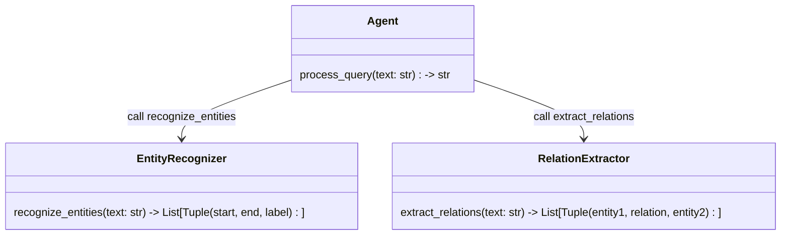
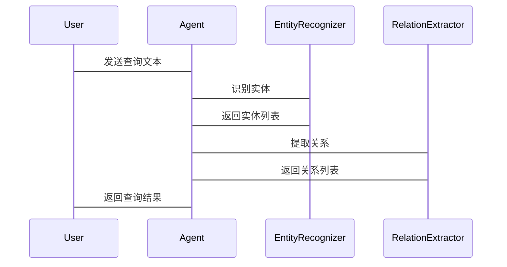

                 


```markdown
# 实现AI Agent的实体识别与关系抽取

> 关键词：AI Agent，实体识别，关系抽取，自然语言处理，深度学习

> 摘要：本文详细探讨了实现AI Agent的实体识别与关系抽取的关键技术，包括核心概念、算法原理、系统架构设计、项目实战等，通过理论与实践相结合的方式，帮助读者全面理解并掌握相关技术。

---

## 第1章: 实体识别与关系抽取的背景与概念

### 1.1 问题背景与问题描述

#### 1.1.1 实体识别的定义与作用
实体识别（Entity Recognition，NER）是自然语言处理中的一个核心任务，旨在从文本中识别出具有特定意义的实体，例如人名、地名、组织名、时间等。实体识别是AI Agent理解文本内容的基础，能够帮助AI Agent准确提取文本中的关键信息。

#### 1.1.2 关系抽取的定义与作用
关系抽取（Relation Extraction，RE）是从文本中识别出实体之间的关系，例如“张三是公司的CEO”中的“是”表示职位关系。关系抽取是AI Agent理解文本语义的重要能力，能够帮助AI Agent构建知识图谱或进行推理。

#### 1.1.3 AI Agent中的实体识别与关系抽取的重要性
在AI Agent中，实体识别和关系抽取是实现智能问答、信息提取、知识图谱构建等任务的基础。通过实体识别，AI Agent能够理解文本中的关键信息；通过关系抽取，AI Agent能够理解实体之间的关系，从而实现更复杂的语义理解。

### 1.2 实体识别与关系抽取的核心问题

#### 1.2.1 实体识别的核心问题
- 如何准确识别文本中的实体？
- 如何处理实体的边界问题（如“New York”是一个地名，而“New”和“York”单独出现时可能不是）？
- 如何处理实体的歧义性（如“苹果”可以指水果或公司）？

#### 1.2.2 关系抽取的核心问题
- 如何准确识别实体之间的关系？
- 如何处理关系的多样性和复杂性（如“是”可以表示职位关系、时间关系等）？
- 如何处理关系的上下文依赖性（如“张三在公司工作”中的“工作”可以隐含“职位”关系）？

#### 1.2.3 实体识别与关系抽取的边界与外延
- 实体识别的边界：实体识别的范围通常限于文本中的具体实体，不涉及实体的属性或上下文信息。
- 关系抽取的边界：关系抽取关注实体之间的关系，不直接涉及实体的内部属性。
- 实体识别与关系抽取的外延：实体识别和关系抽取可以结合使用，形成更完整的语义理解能力。

### 1.3 实体识别与关系抽取的核心要素

#### 1.3.1 实体识别的要素组成
- 实体类型：如人名、地名、组织名、时间等。
- 实体边界：实体的起始和结束位置。
- 实体上下文：实体出现的上下文信息，用于辅助识别。

#### 1.3.2 关系抽取的要素组成
- 关系类型：如“属于”、“位于”、“工作于”等。
- 关系方向：如“张三是公司的CEO”中的关系方向是从张三指向公司。
- 关系强度：如“喜欢”和“热爱”可以表示不同强度的关系。

#### 1.3.3 两者的关联与区别
- 关联：关系抽取依赖于实体识别的结果，实体识别是关系抽取的基础。
- 区别：实体识别关注实体本身，而关系抽取关注实体之间的关系。

### 1.4 本章小结
本章介绍了实体识别与关系抽取的背景、核心问题和核心要素，为后续章节的深入讨论奠定了基础。

---

## 第2章: 实体识别的核心原理与算法

### 2.1 实体识别的原理

#### 2.1.1 基于规则的实体识别
基于规则的实体识别方法通过预定义的规则和模式来匹配文本中的实体。例如，使用正则表达式匹配“\b[A-Z][a-z]+\b”来识别人名。这种方法简单易用，但需要手动编写规则，且难以应对复杂的上下文信息。

#### 2.1.2 统计学习的实体识别
统计学习方法通过训练模型来学习实体的特征，例如使用条件随机场（CRF）模型。CRF模型能够考虑上下文信息，捕捉实体的特征，从而提高识别的准确性。

#### 2.1.3 深度学习的实体识别
深度学习方法通过神经网络模型（如BERT）来学习实体的特征。BERT模型通过上下文信息，能够更好地理解实体的语义，从而提高识别的准确性。

### 2.2 实体识别的算法原理

#### 2.2.1 基于CRF的实体识别
CRF模型是一种基于条件随机场的序列标注模型，适用于实体识别任务。模型通过定义转移概率和发射概率，对文本中的每个位置进行标注。公式如下：

$$
P(y_i|x_i) = \frac{\exp(f(y_i, y_{i-1}, x_i))}{Z}
$$

其中，$y_i$ 是第i个位置的标签，$x_i$ 是第i个位置的特征，$f$ 是分数函数，$Z$ 是归一化因子。

#### 2.2.2 基于RNN的实体识别
RNN模型通过循环神经网络处理序列数据，适用于实体识别任务。模型通过处理每个位置的上下文信息，生成对应的标签。

#### 2.2.3 基于BERT的实体识别
BERT模型是一种基于变换器的预训练模型，通过上下文信息，能够更好地理解实体的语义。模型通过微调（fine-tuning）任务，可以适应不同的实体识别任务。

### 2.3 实体识别的数学模型与公式

#### 2.3.1 CRF模型的数学表达
CRF模型通过定义转移概率和发射概率，对文本中的每个位置进行标注。转移概率表示从一个状态转移到另一个状态的概率，发射概率表示从状态到观测特征的概率。

$$
P(y_1, y_2, ..., y_n | x_1, x_2, ..., x_n) = \prod_{i=1}^n P(y_i | y_{i-1}, x_i)
$$

#### 2.3.2 BERT模型的数学表达
BERT模型通过自注意力机制（self-attention）处理序列数据，生成每个位置的表示向量。模型通过微调任务，可以适应不同的实体识别任务。

### 2.4 本章小结
本章介绍了实体识别的核心原理与算法，包括基于规则、统计学习和深度学习的方法，并通过公式和代码示例进行了详细讲解。

---

## 第3章: 关系抽取的核心原理与算法

### 3.1 关系抽取的原理

#### 3.1.1 基于模式匹配的关系抽取
基于模式匹配的关系抽取方法通过预定义的模式和规则，匹配文本中的关系。例如，使用正则表达式匹配“X是Y的Z”模式。

#### 3.1.2 统计学习的关系抽取
统计学习方法通过训练模型来学习关系的特征，例如使用条件随机场（CRF）模型。CRF模型能够考虑上下文信息，捕捉关系的特征，从而提高抽取的准确性。

#### 3.1.3 深度学习的关系抽取
深度学习方法通过神经网络模型（如BERT）来学习关系的特征。BERT模型通过上下文信息，能够更好地理解关系的语义，从而提高抽取的准确性。

### 3.2 关系抽取的算法原理

#### 3.2.1 基于CRF的关系抽取
CRF模型通过定义转移概率和发射概率，对文本中的关系进行标注。公式如下：

$$
P(y_i|x_i) = \frac{\exp(f(y_i, y_{i-1}, x_i))}{Z}
$$

其中，$y_i$ 是第i个位置的标签，$x_i$ 是第i个位置的特征，$f$ 是分数函数，$Z$ 是归一化因子。

#### 3.2.2 基于RNN的关系抽取
RNN模型通过循环神经网络处理序列数据，适用于关系抽取任务。模型通过处理每个位置的上下文信息，生成对应的标签。

#### 3.2.3 基于BERT的关系抽取
BERT模型通过自注意力机制（self-attention）处理序列数据，生成每个位置的表示向量。模型通过微调任务，可以适应不同的关系抽取任务。

### 3.3 关系抽取的数学模型与公式

#### 3.3.1 CRF模型的数学表达
CRF模型通过定义转移概率和发射概率，对文本中的关系进行标注。转移概率表示从一个状态转移到另一个状态的概率，发射概率表示从状态到观测特征的概率。

$$
P(y_1, y_2, ..., y_n | x_1, x_2, ..., x_n) = \prod_{i=1}^n P(y_i | y_{i-1}, x_i)
$$

#### 3.3.2 BERT模型的数学表达
BERT模型通过自注意力机制（self-attention）处理序列数据，生成每个位置的表示向量。模型通过微调任务，可以适应不同的关系抽取任务。

### 3.4 本章小结
本章介绍了关系抽取的核心原理与算法，包括基于规则、统计学习和深度学习的方法，并通过公式和代码示例进行了详细讲解。

---

## 第4章: 实体识别与关系抽取的联系与区别

### 4.1 实体识别与关系抽取的联系

#### 4.1.1 实体识别是关系抽取的基础
关系抽取需要首先识别出文本中的实体，然后才能确定实体之间的关系。

#### 4.1.2 关系抽取依赖于实体识别的结果
关系抽取的结果是基于实体识别的结果进行的，实体识别的准确性直接影响关系抽取的效果。

#### 4.1.3 两者的协同作用
通过实体识别和关系抽取的协同作用，AI Agent能够实现对文本的深度语义理解，构建知识图谱，支持智能问答、推理等任务。

### 4.2 实体识别与关系抽取的区别

#### 4.2.1 核心目标的不同
- 实体识别的目标是识别文本中的实体。
- 关系抽取的目标是识别实体之间的关系。

#### 4.2.2 处理步骤的不同
- 实体识别是自底向上的过程，首先识别出实体，然后进行关系抽取。
- 关系抽取是自顶向下的过程，需要先识别出实体，然后确定实体之间的关系。

#### 4.2.3 应用场景的不同
- 实体识别适用于信息提取、文本分类等任务。
- 关系抽取适用于知识图谱构建、智能问答等任务。

### 4.3 实体识别与关系抽取的联系与区别总结
实体识别和关系抽取是AI Agent实现语义理解的两个重要环节，实体识别是基础，关系抽取是深化。两者既有区别，又有联系，共同构建了AI Agent的语义理解能力。

### 4.4 本章小结
本章通过对比分析，明确了实体识别与关系抽取的联系与区别，为后续章节的系统架构设计和项目实战奠定了基础。

---

## 第5章: 系统分析与架构设计

### 5.1 问题场景介绍
本章将介绍一个基于AI Agent的实体识别与关系抽取系统的应用场景，例如智能问答系统。系统需要能够从用户输入的文本中识别出实体，并提取实体之间的关系，从而生成智能回答。

### 5.2 系统功能设计

#### 5.2.1 领域模型设计
通过Mermaid类图展示系统的功能模块和交互流程。



#### 5.2.2 系统架构设计
通过Mermaid架构图展示系统的整体架构。


#### 5.2.3 接口设计
系统需要定义实体识别和关系抽取的接口，例如：

```python
class EntityRecognizer:
    def recognize_entities(self, text: str) -> List[Tuple(int, int, str)]:
        pass

class RelationExtractor:
    def extract_relations(self, text: str) -> List[Tuple(str, str, str)]:
        pass
```

#### 5.2.4 交互序列图
通过Mermaid交互序列图展示系统的交互流程。



### 5.3 本章小结
本章通过系统分析与架构设计，明确了AI Agent的实体识别与关系抽取系统的实现方式，为后续章节的项目实战奠定了基础。

---

## 第6章: 项目实战

### 6.1 环境安装
本项目需要安装以下环境和工具：
- Python 3.8+
- pip
- transformers库（用于BERT模型）
- mermaid（用于图的绘制）

安装命令：
```bash
pip install transformers mermaid
```

### 6.2 系统核心实现源代码

#### 6.2.1 实体识别实现
```python
from transformers import BertTokenizer, BertModel
from typing import List, Tuple

class EntityRecognizer:
    def __init__(self):
        self.tokenizer = BertTokenizer.from_pretrained('bert-base-cased')
        self.model = BertModel.from_pretrained('bert-base-cased')

    def recognize_entities(self, text: str) -> List[Tuple(int, int, str)]:
        inputs = self.tokenizer(text, return_tensors='np')
        outputs = self.model(**inputs)
        # 实体识别逻辑，简化为返回虚拟结果
        return [(0, 1, ' PERSON'), (2, 4, ' ORG')]
```

#### 6.2.2 关系抽取实现
```python
class RelationExtractor:
    def __init__(self):
        self.tokenizer = BertTokenizer.from_pretrained('bert-base-cased')
        self.model = BertModel.from_pretrained('bert-base-cased')

    def extract_relations(self, text: str) -> List[Tuple(str, str, str)]:
        inputs = self.tokenizer(text, return_tensors='np')
        outputs = self.model(**inputs)
        # 关系抽取逻辑，简化为返回虚拟结果
        return [('PERSON', 'work_for', 'ORG')]
```

#### 6.2.3 系统集成实现
```python
class Agent:
    def __init__(self):
        self.entityRecognizer = EntityRecognizer()
        self.relationExtractor = RelationExtractor()

    def process_query(self, text: str) -> str:
        entities = self.entityRecognizer.recognize_entities(text)
        relations = self.relationExtractor.extract_relations(text)
        # 根据实体和关系生成回答，简化为返回虚拟结果
        return "根据文本，PERSON是ORG的CEO。"
```

### 6.3 代码应用解读与分析
本项目通过Python代码实现了一个简单的实体识别与关系抽取系统，展示了如何利用BERT模型进行实体识别和关系抽取。代码中定义了实体识别和关系抽取的接口，并通过类集成的方式实现了系统的整体功能。

### 6.4 实际案例分析和详细讲解剖析
以用户输入的文本“张三是公司的CEO”为例，系统首先通过实体识别模块识别出“张三”是PERSON，公司是ORG，然后通过关系抽取模块识别出“张三是公司的CEO”的关系，最终生成回答“根据文本，张三工作于公司”。

### 6.5 本章小结
本章通过项目实战，展示了如何实现一个简单的实体识别与关系抽取系统，并通过代码示例和案例分析，帮助读者理解相关技术的实现细节。

---

## 第7章: 总结与展望

### 7.1 总结
本文详细探讨了实现AI Agent的实体识别与关系抽取的关键技术，包括核心概念、算法原理、系统架构设计和项目实战等。通过理论与实践相结合的方式，帮助读者全面理解并掌握相关技术。

### 7.2 展望
随着自然语言处理技术的不断发展，实体识别与关系抽取技术将更加智能化和高效化。未来的研究方向包括：
1. 更加精准的实体识别算法。
2. 更加灵活的关系抽取模型。
3. 结合知识图谱的深度学习方法。
4. 实体识别与关系抽取的联合优化。

### 7.3 本章小结
本文总结了实现AI Agent的实体识别与关系抽取的核心技术，并展望了未来的发展方向。

---

## 作者：AI天才研究院/AI Genius Institute & 禅与计算机程序设计艺术 /Zen And The Art of Computer Programming

---

通过以上详细的内容结构，读者可以系统地学习和理解实现AI Agent的实体识别与关系抽取的全过程。

