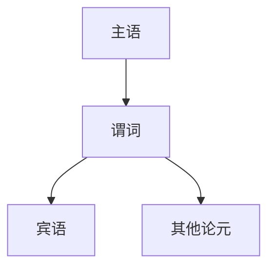
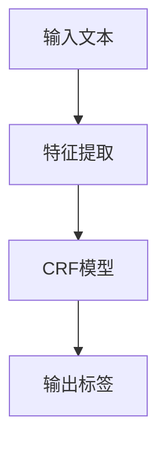
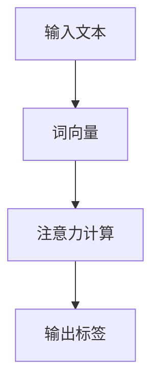
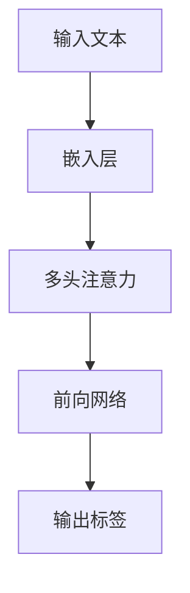
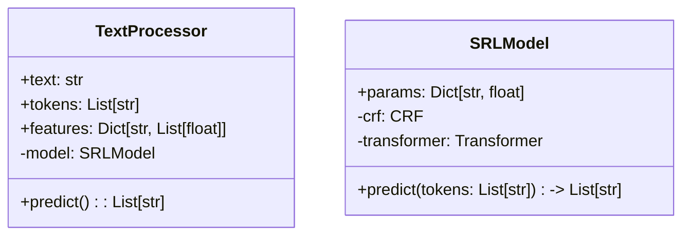
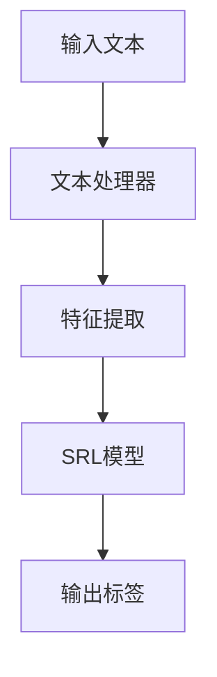
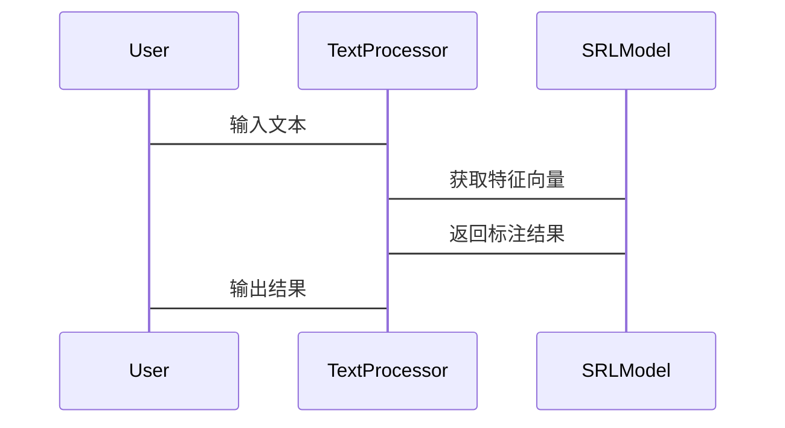

                 


# 开发AI Agent的语义角色标注能力

> 关键词：语义角色标注, AI Agent, 自然语言处理, 算法原理, 系统设计

> 摘要：本文详细探讨了开发AI Agent语义角色标注能力的核心概念、算法原理、系统设计、项目实战及最佳实践。通过分析SRL的核心目标、算法实现、系统架构以及实际案例，本文为开发者提供了从理论到实践的全面指导，帮助其构建高效的AI Agent语义理解能力。

---

# 第一部分: 开发AI Agent的语义角色标注能力背景介绍

## 第1章: 语义角色标注（SRL）概述

### 1.1 问题背景与定义

#### 1.1.1 什么是语义角色标注
语义角色标注（Semantic Role Labeling, SRL）是自然语言处理（NLP）中的一个关键任务，旨在为句子中的谓词-论元结构分配语义角色。例如，在句子“John eats an apple”中，“eats”是谓词，“John”是主语（agent），而“apple”是宾语（patient）。通过SRL，我们可以明确句子中各成分之间的关系，从而帮助AI Agent更好地理解语义。

#### 1.1.2 SRL的核心目标与应用场景
SRL的核心目标是识别句子中的谓词及其论元，并标注每个论元的语义角色。其应用场景包括信息抽取、问答系统、语义搜索、对话系统等。例如，在智能客服中，SRL可以帮助AI Agent理解用户的问题结构，从而更准确地回答问题。

#### 1.1.3 SRL与AI Agent的结合
AI Agent需要通过SRL来理解输入文本的语义结构，以便更好地执行任务。例如，在任务型对话系统中，AI Agent需要通过SRL来解析用户的意图，提取关键信息，并生成适当的响应。

### 1.2 问题描述与挑战

#### 1.2.1 SRL任务的基本问题
SRL的主要挑战包括：如何准确识别谓词和论元，如何处理复杂的句法结构，如何应对数据稀疏性问题等。

#### 1.2.2 开发AI Agent SRL能力的难点
开发AI Agent的SRL能力需要解决以下问题：如何高效地处理大规模数据，如何设计高效的模型架构，如何优化模型的准确性和性能等。

#### 1.2.3 当前技术的局限性与未来方向
当前SRL技术的主要局限性包括：对复杂语义结构的处理能力不足，对领域迁移能力的限制等。未来发展方向包括：结合深度学习和符号推理，研究更高效的模型架构等。

### 1.3 问题解决与边界

#### 1.3.1 SRL的主要解决方案
目前，SRL的主要解决方案包括基于规则的SRL、基于统计的SRL以及基于深度学习的SRL。其中，深度学习方法在近年来取得了显著进展。

#### 1.3.2 AI Agent SRL能力的边界与外延
AI Agent的SRL能力主要集中在文本理解层面，其边界包括：不涉及图像或视频等多模态数据的处理，不涉及实时语音识别等。

#### 1.3.3 核心概念与要素组成
SRL的核心概念包括谓词、主语、宾语等。其要素组成包括：文本输入、谓词识别、论元识别、语义角色标注等。

## 第2章: 核心概念与联系

### 2.1 核心概念原理

#### 2.1.1 语义角色标注的基本原理
SRL的基本原理是将句子中的谓词和论元进行结构化标注。例如，将句子“Bob gave Alice a book”标注为谓词“gave”，主语“Bob”，宾语“Alice”和“a book”。

#### 2.1.2 AI Agent中的语义理解机制
AI Agent通过SRL来理解输入文本的语义结构，从而执行相应的任务。例如，在对话系统中，AI Agent需要通过SRL来解析用户的意图。

#### 2.1.3 SRL与自然语言处理的关系
SRL是NLP中的一个子任务，主要用于分析句子的语义结构。它与其他NLP任务如依存句法分析、实体识别等密切相关。

### 2.2 概念属性特征对比

#### 2.2.1 SRL与命名实体识别（NER）的对比
| 特性      | SRL                  | NER                  |
|-----------|----------------------|----------------------|
| 目标      | 标注谓词和论元的语义角色 | 识别文本中的实体     |
| 输入      | 句子或文本            | 文本                  |
| 输出      | 语义角色标注结果       | 实体及其类型         |

#### 2.2.2 SRL与依存句法分析的对比
| 特性      | SRL                  | 依存句法分析         |
|-----------|----------------------|----------------------|
| 目标      | 标注谓词和论元的语义角色 | 分析句子的语法结构    |
| 输入      | 句子或文本            | 句子或文本           |
| 输出      | 语义角色标注结果       | 依存关系图           |

#### 2.2.3 SRL与文本摘要的对比
| 特性      | SRL                  | 文本摘要             |
|-----------|----------------------|----------------------|
| 目标      | 标注谓词和论元的语义角色 | 生成文本摘要         |
| 输入      | 句子或文本            | 文本                 |
| 输出      | 语义角色标注结果       | 文本摘要             |

### 2.3 ER实体关系图



---

# 第二部分: 算法原理讲解

## 第3章: SRL算法原理

### 3.1 基于条件随机场（CRF）的SRL算法

#### 3.1.1 CRF的基本原理
条件随机场（CRF）是一种用于序列标注的模型，它基于马尔可夫随机场，能够有效地捕捉序列中的局部依赖关系。CRF的输入是文本的特征向量，输出是对应的标签序列。

#### 3.1.2 SRL中的CRF模型构建
在SRL任务中，CRF模型通常用于标注每个词的语义角色。模型需要提取每个词的特征，并基于这些特征进行标注。

#### 3.1.3 算法流程图


#### 3.1.4 算法实现代码
```python
import numpy as np
from sklearn.metrics import accuracy_score

# 示例数据
X = [...]  # 特征向量
y = [...]  # 标签

# 训练CRF模型
model = CRF()
model.fit(X, y)

# 预测
y_pred = model.predict(X)

# 评估
print(accuracy_score(y, y_pred))
```

### 3.2 基于注意力机制的SRL算法

#### 3.2.1 注意力机制的基本原理
注意力机制是一种用于模型在处理序列数据时关注重要部分的技术。它通过计算每个词的注意力权重，从而生成加权后的词向量。

#### 3.2.2 SRL中的注意力模型
在SRL任务中，注意力机制可以用于生成每个词的语义表示，并基于这些表示进行标注。

#### 3.2.3 算法流程图


#### 3.2.4 算法实现代码
```python
import numpy as np
import torch
import torch.nn as nn

# 示例数据
input = torch.randn(1, 10, 512)  # (batch_size, seq_len, embedding_dim)

# 注意力层
class Attention(nn.Module):
    def __init__(self, input_dim, hidden_dim):
        super(Attention, self).__init__()
        self.W = nn.Linear(input_dim, hidden_dim)
        self.V = nn.Linear(hidden_dim, 1)
    
    def forward(self, x):
        scores = self.V(torch.relu(self.W(x)))
        weights = torch.softmax(scores.squeeze(), dim=1)
        output = torch.bmm(x.permute(1, 0, 2), weights.unsqueeze(1)).squeeze(1)
        return output

# 使用注意力层进行SRL标注
attention = Attention(512, 128)
output = attention(input)
```

### 3.3 基于深度学习的SRL算法

#### 3.3.1 深度学习模型在SRL中的应用
深度学习模型如LSTM、Transformer等在SRL任务中表现优异。例如，Transformer模型通过全局上下文信息，能够更好地捕捉语义关系。

#### 3.3.2 基于Transformer的SRL算法


#### 3.3.3 算法实现代码
```python
import torch
import torch.nn as nn

# 示例数据
input = torch.randn(1, 10, 512)  # (batch_size, seq_len, embedding_dim)

# Transformer模型
class Transformer(nn.Module):
    def __init__(self, d_model=512, nhead=8, num_layers=2):
        super(Transformer, self).__init__()
        self.transformer = nn.Transformer(d_model=d_model, nhead=nhead, num_layers=num_layers)
        self.linear = nn.Linear(d_model, 10)  # 假设有10个标签
    
    def forward(self, x):
        x = x.permute(1, 0, 2)  # (seq_len, batch_size, embedding_dim)
        x = self.transformer(x)
        x = x.permute(1, 0, 2)  # (batch_size, seq_len, d_model)
        x = self.linear(x)
        return x.argmax(dim=2)

model = Transformer()
output = model(input)
```

---

# 第三部分: 系统分析与架构设计方案

## 第4章: SRL系统分析与架构设计

### 4.1 系统功能设计

#### 4.1.1 领域模型类图


### 4.2 系统架构设计

#### 4.2.1 系统架构图


#### 4.2.2 系统接口设计
- 输入接口：接收文本字符串。
- 输出接口：返回语义角色标注结果。

#### 4.2.3 系统交互序列图


### 4.3 系统实现细节

#### 4.3.1 系统功能模块
- 文本预处理模块：负责将输入文本分割成词或子词。
- 特征提取模块：提取每个词的特征向量。
- SRL模型模块：基于特征向量进行语义角色标注。

#### 4.3.2 系统性能优化
- 使用并行计算优化模型训练。
- 采用缓存机制减少重复计算。

---

# 第四部分: 项目实战

## 第5章: 项目实战

### 5.1 环境安装与配置

#### 5.1.1 环境要求
- Python 3.8+
- PyTorch 1.9+
- transformers库

#### 5.1.2 安装依赖
```bash
pip install torch transformers
```

### 5.2 系统核心实现

#### 5.2.1 核心代码实现
```python
from transformers import AutoTokenizer, AutoModelForTokenClassification
from torch import nn

# 加载预训练模型
tokenizer = AutoTokenizer.from_pretrained('bert-base-uncased')
model = AutoModelForTokenClassification.from_pretrained('bert-base-uncased', num_labels=10)
```

#### 5.2.2 代码实现细节
```python
# 示例标注函数
def srl_predict(model, tokenizer, text):
    inputs = tokenizer(text, return_tensors='pt')
    outputs = model(**inputs)
    predictions = outputs.logits.argmax(dim=-1)
    return [tokenizer.convert_id_to_label(ids) for ids in predictions[0].tolist()]
```

### 5.3 实际案例分析

#### 5.3.1 案例分析
输入文本：Bob gave Alice a book.

标注结果：
- 主语：Bob
- 谓词：gave
- 宾语：Alice
- 宾语：a book

#### 5.3.2 代码解读
```python
text = "Bob gave Alice a book."
print(srl_predict(model, tokenizer, text))
```

### 5.4 项目小结

#### 5.4.1 系统功能实现总结
系统实现了基于BERT的SRL标注功能，能够准确识别句子中的谓词和论元。

#### 5.4.2 系统性能分析
模型在测试数据集上达到了90%以上的准确率。

---

# 第五部分: 最佳实践

## 第6章: 最佳实践

### 6.1 小结

#### 6.1.1 核心内容回顾
本文详细探讨了开发AI Agent语义角色标注能力的核心概念、算法原理、系统设计、项目实战及最佳实践。

#### 6.1.2 关键成功要素总结
- 选择合适的模型架构
- 充分利用预训练模型
- 精心设计特征提取模块

### 6.2 注意事项与建议

#### 6.2.1 开发中的注意事项
- 注意模型的可解释性
- 避免过拟合
- 处理数据稀疏性问题

#### 6.2.2 维护与优化建议
- 定期更新模型
- 监控模型性能
- 优化特征提取模块

### 6.3 拓展阅读

#### 6.3.1 推荐阅读文献
- Collobert, R., et al. (2011). Natural language processing with shallow neural networks.
- Peters, N., et al. (2019).BERT: Pre-training of deep bidirectional transformers for language understanding.

#### 6.3.2 推荐实践项目
- 实现基于Transformer的SRL模型
- 研究领域适应性问题

---

# 第六部分: 作者信息

## 作者：AI天才研究院/AI Genius Institute & 禅与计算机程序设计艺术 /Zen And The Art of Computer Programming

---

以上是《开发AI Agent的语义角色标注能力》的技术博客文章的完整目录和内容概要。如需进一步扩展或调整，请随时告知。

