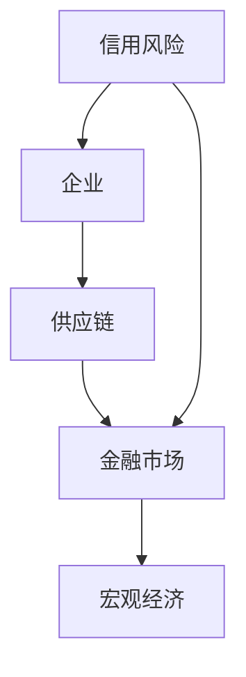
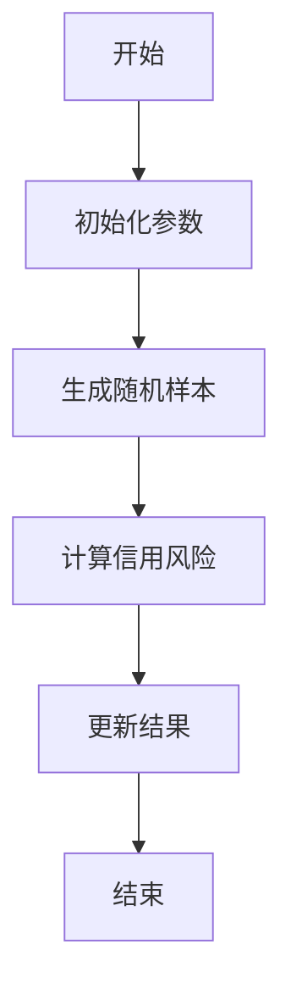
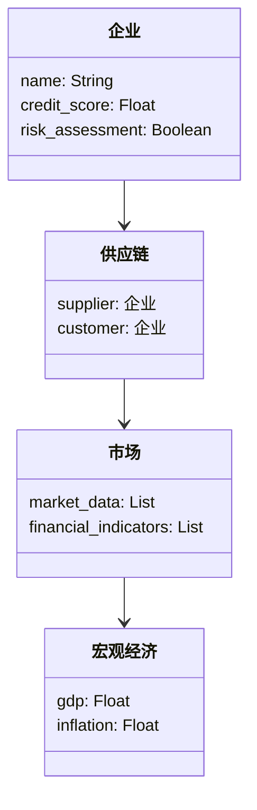
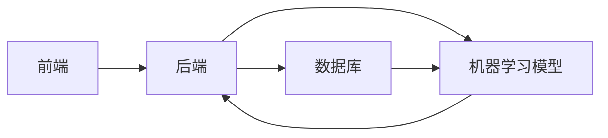

                 


# 开发智能化的企业信用风险传导模拟系统

> 关键词：信用风险，风险传导，智能化模拟，人工智能，企业信用评估，风险管理系统

> 摘要：本文详细探讨了开发智能化企业信用风险传导模拟系统的核心技术与实现方案。通过分析信用风险传导机制，结合人工智能算法和系统架构设计，提出了一套高效、可靠的信用风险评估与模拟方法。文章从背景介绍、核心概念、算法原理、系统架构、项目实战等多个维度展开，深入解析了系统开发的关键步骤与实现细节，为企业信用风险管理提供了新的思路与解决方案。

---

## 第一部分: 企业信用风险传导模拟系统背景介绍

### 第1章: 问题背景与描述

#### 1.1 问题背景
##### 1.1.1 信用风险的基本概念
信用风险是指企业在履行债务过程中由于企业或其交易对手无法履行合同义务而给债权人带来的损失风险。它是企业风险管理中的核心问题之一。

##### 1.1.2 信用风险传导的定义
信用风险传导是指由于企业之间的关联性，一个企业的信用风险可能通过供应链、金融市场的传导机制影响到其他企业或整个金融体系的风险。

##### 1.1.3 企业信用风险传导的现实意义
随着全球经济一体化的加深，企业之间的关联性增强，信用风险传导的影响范围不断扩大。及时、准确地模拟和评估信用风险传导对企业的稳健经营和金融市场的稳定具有重要意义。

---

#### 1.2 问题描述
##### 1.2.1 信用风险传导的复杂性
信用风险传导涉及多个变量，如企业财务状况、市场波动、宏观经济环境等，其复杂性使得传统的线性模型难以有效捕捉风险传导的非线性特征。

##### 1.2.2 传统信用风险评估的局限性
传统的信用风险评估方法通常基于静态模型和线性假设，难以应对复杂多变的市场环境。此外，传统方法对风险传导路径的分析较为单一，难以全面反映风险的传播机制。

##### 1.2.3 智能化信用风险模拟的需求
随着人工智能技术的发展，利用机器学习和大数据分析技术，可以更高效地捕捉信用风险传导的非线性特征，实现智能化、动态化的信用风险评估与模拟。

---

#### 1.3 问题解决
##### 1.3.1 数据驱动的信用风险评估
通过收集和分析企业的财务数据、市场数据、行业数据等，利用机器学习算法构建信用风险评估模型。

##### 1.3.2 智能化模拟系统的构建目标
开发一个智能化的企业信用风险传导模拟系统，能够实时捕捉信用风险的变化，模拟风险传导路径，并为企业提供风险预警和应对策略。

##### 1.3.3 系统实现的核心问题
如何利用机器学习算法构建信用风险评估模型，如何模拟信用风险的传导路径，如何实现系统的智能化和动态化。

---

#### 1.4 边界与外延
##### 1.4.1 系统边界定义
系统的输入包括企业的财务数据、市场数据、行业数据等；输出包括信用风险评估结果和风险传导模拟报告。

##### 1.4.2 系统外延与应用场景
系统可以应用于企业信用风险管理、金融机构的风险评估、政府部门的经济监管等领域。

##### 1.4.3 系统与外部环境的交互
系统通过数据接口与外部数据源（如企业数据库、金融市场数据源）进行交互，同时通过用户界面与用户进行交互。

---

#### 1.5 核心概念对比
##### 表1.1: 传统信用风险评估与智能化模拟的对比

| 对比维度       | 传统信用风险评估                     | 智能化信用风险模拟                     |
|----------------|--------------------------------------|--------------------------------------|
| 方法论         | 基于统计模型和线性假设               | 基于机器学习和大数据分析               |
| 数据需求       | 数据量小，依赖历史数据               | 数据量大，支持实时数据更新             |
| 模型复杂度     | 模型简单，难以捕捉复杂关系           | 模型复杂，能够捕捉非线性关系           |
| 应用场景       | 适用于单一企业的信用评估             | 适用于企业信用风险传导的模拟与预警     |

---

## 第2章: 核心概念与联系

### 2.1 信用风险传导机制
#### 2.1.1 信用风险传导的定义与特点
信用风险传导是指一个企业的信用风险通过供应链、金融市场等渠道传递给其他企业或整个金融体系的过程。其特点是路径复杂、影响范围广。

#### 2.1.2 信用风险传导的关键因素
##### 2.1.2.1 企业间的关联性
企业间的供应链关系、投资关系等是信用风险传导的重要路径。

##### 2.1.2.2 市场波动
金融市场的波动会加剧信用风险的传导。

##### 2.1.2.3 宏观经济环境
宏观经济环境的变化（如经济衰退、通货膨胀）会影响信用风险的传导。

#### 2.1.3 信用风险传导的路径分析
##### 2.1.3.1 供应链传导
一家企业发生信用风险后，可能通过供应链影响其上下游企业。

##### 2.1.3.2 市场传导
金融市场的波动会导致企业信用风险的加剧。

##### 2.1.3.3 行业传导
一个行业内的信用风险可能传导到整个行业或相关行业。

---

### 2.2 智能化模拟的核心原理
#### 2.2.1 数据驱动的模拟方法
利用机器学习算法，通过对企业历史数据和实时数据的分析，构建信用风险评估模型。

#### 2.2.2 人工智能在风险传导中的应用
##### 2.2.2.1 机器学习算法
使用随机森林、支持向量机等算法进行信用风险评估。

##### 2.2.2.2 自然语言处理
通过分析企业财报文本，提取关键信息用于信用风险评估。

##### 2.2.2.3 深度学习
使用神经网络模型捕捉信用风险传导的非线性特征。

---

#### 图2.1: 信用风险传导的ER实体关系图



---

## 第3章: 算法原理讲解

### 3.1 蒙特卡洛模拟算法
#### 3.1.1 算法原理
蒙特卡洛模拟是一种通过随机采样来估计系统行为的方法。在信用风险模拟中，可以用来模拟不同情景下的信用风险传导路径。

#### 3.1.2 算法步骤
##### 图3.1: 蒙特卡洛模拟流程图



##### 代码实现
```python
import numpy as np

def monte_carlo_simulation(n_iterations=1000):
    risks = []
    for _ in range(n_iterations):
        # 生成随机样本
        random_sample = np.random.rand(100)
        # 计算信用风险
        credit_risk = np.mean(random_sample)
        risks.append(credit_risk)
    return risks

# 示例调用
results = monte_carlo_simulation()
print(results)
```

---

### 3.2 数学模型与公式
#### 3.2.1 信用风险评估模型
##### 公式1.1: 信用风险评估的线性回归模型
$$ credit\_risk = \beta_0 + \beta_1x_1 + \beta_2x_2 + \dots + \beta_nx_n + \epsilon $$

其中，$x_i$ 是企业的财务指标，$\beta_i$ 是回归系数，$\epsilon$ 是误差项。

#### 3.2.2 风险传导的动态模型
##### 公式1.2: 风险传导的动态方程
$$ R_{t+1} = \alpha R_t + (1-\alpha)S_t $$

其中，$R_t$ 是当前时间点的信用风险，$S_t$ 是外部冲击，$\alpha$ 是传导系数。

---

## 第4章: 系统分析与架构设计

### 4.1 系统功能设计
#### 4.1.1 领域模型类图
##### 图4.1: 领域模型类图



---

### 4.2 系统架构设计
#### 4.2.1 总体架构
##### 图4.2: 系统架构图



---

#### 4.2.2 接口设计
##### 4.2.2.1 数据接口
- 输入接口：企业数据接口、市场数据接口。
- 输出接口：风险评估结果接口。

##### 4.2.2.2 用户接口
- 用户登录接口。
- 风险评估结果查询接口。

---

#### 4.2.3 交互流程
##### 图4.3: 系统交互流程图


---

## 第5章: 项目实战

### 5.1 环境安装
#### 5.1.1 安装Python
安装Python 3.8及以上版本。

#### 5.1.2 安装依赖库
安装numpy、pandas、scikit-learn等库。

```bash
pip install numpy pandas scikit-learn
```

---

### 5.2 核心代码实现
#### 5.2.1 信用风险评估模型
```python
from sklearn.linear_model import LinearRegression
import pandas as pd

# 加载数据
data = pd.read_csv('credit_risk.csv')

# 训练模型
model = LinearRegression()
model.fit(data[['revenue', 'profit']], data['credit_score'])

# 预测结果
predictions = model.predict(data[['revenue', 'profit']])
```

#### 5.2.2 风险传导模拟
```python
import numpy as np

def simulate_risk(credit_scores, alpha=0.1):
    n = len(credit_scores)
    simulated_risk = []
    for i in range(n):
        if i == 0:
            simulated_risk.append(credit_scores[i])
        else:
            simulated_risk.append(alpha * simulated_risk[i-1] + (1-alpha)*credit_scores[i])
    return simulated_risk

# 示例调用
credit_scores = np.random.rand(100)
results = simulate_risk(credit_scores)
print(results)
```

---

### 5.3 案例分析
#### 5.3.1 数据准备
假设我们有以下企业信用数据：

| 企业名称 | 收入 | 利润 | 信用评分 |
|----------|------|------|----------|
| A        | 100  | 20   | 0.8      |
| B        | 80   | 15   | 0.7      |
| C        | 120  | 25   | 0.9      |

#### 5.3.2 模型训练
使用上述数据训练信用风险评估模型。

#### 5.3.3 模拟结果
假设 $\alpha=0.1$，模拟信用风险的传导路径。

---

## 第6章: 最佳实践与总结

### 6.1 最佳实践
#### 6.1.1 数据质量管理
确保数据的准确性和完整性，避免因数据质量问题影响模型的准确性。

#### 6.1.2 模型优化
定期更新模型，引入新的数据和特征，提升模型的预测精度。

#### 6.1.3 系统维护
定期检查系统的运行状态，及时修复漏洞，确保系统的稳定性。

---

### 6.2 小结
智能化的企业信用风险传导模拟系统能够帮助企业更好地应对信用风险的复杂性和不确定性，通过机器学习算法和大数据分析技术，实现信用风险的动态评估和模拟，为企业风险管理提供有力支持。

---

### 6.3 注意事项
- 数据隐私保护：在处理企业数据时，需遵守相关法律法规，保护数据隐私。
- 模型解释性：复杂的模型可能难以解释，需注重模型的可解释性。
- 系统可扩展性：系统设计应具备良好的可扩展性，以应对未来数据量和复杂性的增加。

---

### 6.4 拓展阅读
- 《信用风险的量化与管理》
- 《人工智能在金融领域的应用》
- 《企业风险管理的理论与实践》

---

## 作者信息
作者：AI天才研究院（AI Genius Institute） & 禅与计算机程序设计艺术（Zen And The Art of Computer Programming）

---

通过本文的详细讲解，读者可以深入了解开发智能化企业信用风险传导模拟系统的核心技术与实现方法，掌握从理论到实践的完整流程，为企业信用风险管理提供新的思路与解决方案。

