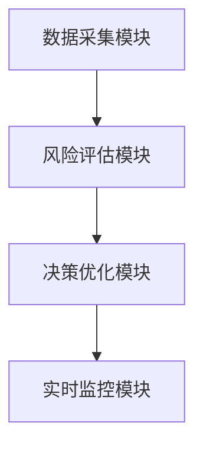

                 


# 智能体群体决策在投资组合风险控制中的应用

## 关键词：智能体、群体决策、投资组合、风险控制、分布式系统、金融应用、算法原理

## 摘要：  
本文探讨了智能体群体决策在投资组合风险控制中的应用，通过分析智能体的基本概念、投资组合风险控制的传统方法，以及智能体群体决策的优势，提出了一种基于多智能体协同的创新风险控制策略。通过详细的算法原理、系统架构设计和项目实战案例，展示了如何利用智能体群体决策优化投资组合的风险管理，为金融领域提供了新的思路和解决方案。

---

# 第一部分: 智能体与群体决策基础

## 第1章: 智能体与群体决策概述

### 1.1 智能体的基本概念

#### 1.1.1 智能体的定义与特点
智能体（Agent）是指在环境中能够感知并自主行动以实现目标的实体。智能体可以是软件程序、机器人或其他具备感知和决策能力的系统。其特点包括：

- **自主性**：智能体能够自主决策，无需外部干预。
- **反应性**：能够实时感知环境并做出反应。
- **目标导向**：所有行动均以实现特定目标为导向。
- **社会性**：能够与其他智能体或主体进行交互和协作。

#### 1.1.2 群体智能的定义与特点
群体智能是指多个智能体通过协作和竞争共同完成复杂任务的现象。其特点包括：

- **分布式**：任务由多个智能体分布完成，而非集中处理。
- **自主性**：每个智能体独立决策，但通过协作达成全局目标。
- **涌现性**：群体的智能行为是单个智能体行为的“涌现”结果，即个体行为的简单组合产生了复杂的群体行为。

#### 1.1.3 智能体与群体智能的关系
智能体是群体智能的基本单元，而群体智能则通过多个智能体的协作实现了远超单个智能体能力的复杂任务。智能体的自主性和反应性为群体智能提供了灵活性和适应性，而群体智能则通过分布式计算提升了系统的可靠性和容错性。

### 1.2 智能体群体决策的优势

#### 1.2.1 分布式决策的优势
- **容错性**：分布式决策避免了单点故障，提高了系统的可靠性。
- **鲁棒性**：部分智能体失效不会导致整个系统崩溃。
- **快速响应**：分布式决策能够快速响应局部变化，提升整体效率。

#### 1.2.2 多智能体协作的效率提升
- **并行计算**：多个智能体可以同时处理不同任务，提高整体处理速度。
- **知识共享**：智能体之间可以通过协作共享信息，避免重复劳动。
- **复杂任务处理**：通过协作，智能体能够处理单个智能体无法完成的复杂任务。

#### 1.2.3 群体决策的鲁棒性与适应性
- **鲁棒性**：群体决策能够适应环境的变化，保持系统的稳定。
- **适应性**：智能体可以根据环境变化动态调整决策策略，提高系统的适应能力。

### 1.3 智能体群体决策在金融领域的应用

#### 1.3.1 金融领域的决策特点
金融领域的决策通常涉及大量不确定性和复杂性，传统的决策方法难以应对实时变化的市场环境。智能体群体决策能够通过分布式计算和协作优化，提高决策的准确性和效率。

#### 1.3.2 智能体群体决策的优势
- **实时性**：智能体能够实时感知市场变化，快速做出反应。
- **多样性**：多个智能体可以提供多样化的决策方案，避免单一决策的风险。
- **高效性**：通过分布式计算，智能体群体能够快速处理大量数据，提高决策效率。

#### 1.3.3 典型应用场景分析
智能体群体决策在金融领域的典型应用场景包括股票交易、投资组合管理、风险管理等领域。通过智能体的协作，可以实现对市场趋势的预测、投资组合的优化以及风险的实时监控。

### 1.4 本章小结
本章介绍了智能体和群体智能的基本概念，分析了智能体群体决策的优势，并探讨了其在金融领域的应用。通过这些内容，读者可以理解智能体群体决策的基本原理及其在金融领域的潜力。

---

## 第2章: 投资组合风险控制基础

### 2.1 投资组合的基本概念

#### 2.1.1 投资组合的定义
投资组合是指将一定资金分配到不同金融资产上的集合。通过合理配置资产，可以降低风险并提高收益。

#### 2.1.2 投资组合的构成要素
投资组合的构成要素包括资产种类、权重分配、风险收益特征等。不同的资产类型（如股票、债券、基金等）具有不同的风险收益特征，合理配置可以优化整体风险收益。

#### 2.1.3 投资组合的目标与风险
投资组合的目标通常是在风险可控的前提下实现最大收益。风险是衡量投资组合波动性的指标，常见的风险度量方法包括方差、标准差、VaR（Value at Risk）和CVaR（Conditional Value at Risk）等。

### 2.2 风险的定义与度量方法

#### 2.2.1 风险的定义
风险是指投资组合可能遭受损失的可能性。在金融领域，风险通常与收益的不确定性相关联，高风险意味着可能获得高收益，但也可能遭受较大损失。

#### 2.2.2 风险度量的常见方法
- **方差和标准差**：衡量投资组合收益的波动性。
- **VaR**：在给定置信水平下，投资组合可能遭受的最大损失。
- **CVaR**：在给定置信水平下，超过VaR的平均损失。
- **情景分析**：通过模拟不同市场情景，评估投资组合在极端情况下的表现。

#### 2.2.3 风险调整后的收益评估
为了评估投资组合的风险调整后的收益，常用夏普比率（Sharpe Ratio）等指标。夏普比率衡量的是投资组合每单位风险所获得的超额收益。

### 2.3 投资组合风险控制的传统方法

#### 2.3.1 基于均值-方差模型的传统方法
均值-方差模型由Harry Markowitz提出，旨在通过优化资产配置，实现风险最小化或收益最大化。该模型假设资产收益符合正态分布，适用于无约束条件下的优化。

#### 2.3.2 基于VaR和CVaR的风险度量
VaR和CVaR是常用的尾部风险度量方法，尤其适用于非正态分布的收益情况。CVaR在VaR的基础上，进一步考虑了超过VaR值的平均损失，能够更好地反映极端风险。

#### 2.3.3 基于情景分析的传统方法
情景分析通过模拟不同市场情景（如牛市、熊市、经济衰退等），评估投资组合在各种情况下的表现。这种方法能够提供更直观的风险评估，但需要依赖对市场情景的准确模拟。

### 2.4 本章小结
本章介绍了投资组合的基本概念、风险的定义与度量方法，以及传统的风险控制方法。通过这些内容，读者可以理解投资组合风险控制的基本框架及其局限性。

---

## 第3章: 智能体群体决策在投资组合风险控制中的应用

### 3.1 智能体群体决策的基本思路

#### 3.1.1 群体决策的基本思路
智能体群体决策通过多个智能体的协作，实现对投资组合风险的分布式控制。每个智能体负责特定的任务（如数据采集、风险评估等），并通过通信协议共享信息。

#### 3.1.2 智能体在投资组合中的角色
- **数据采集智能体**：负责收集市场数据，如股票价格、指数变化等。
- **风险评估智能体**：根据市场数据评估投资组合的风险。
- **决策优化智能体**：基于风险评估结果，优化投资组合配置。
- **实时监控智能体**：监控投资组合的实时表现，及时调整策略。

#### 3.1.3 群体决策的优势与挑战
- **优势**：通过分布式计算，智能体群体能够快速处理大量数据，提高决策效率和准确性。
- **挑战**：需要解决智能体之间的通信延迟、信息同步问题，以及如何避免信息过载。

### 3.2 智能体群体决策在风险评估中的应用

#### 3.2.1 基于智能体的实时数据处理
智能体能够实时采集市场数据，并通过分布式计算快速处理，为风险评估提供实时信息。例如，股票价格的实时变化可以通过多个智能体协同处理，确保数据的准确性和及时性。

#### 3.2.2 智能体的协同决策机制
通过智能体之间的协作，可以实现对投资组合风险的多维度评估。例如，一个智能体负责评估市场风险，另一个智能体负责评估信用风险，通过协同决策，综合考虑多种风险因素。

#### 3.2.3 群体决策的风险评估模型
基于智能体群体决策的风险评估模型，可以通过多个智能体的协同计算，构建一个全面的风险评估框架。每个智能体负责特定的风险因子评估，通过通信协议共享结果，最终形成整体的风险评估报告。

### 3.3 智能体群体决策在投资组合优化中的应用

#### 3.3.1 分布式投资组合优化
通过智能体群体决策，可以实现投资组合的分布式优化。每个智能体负责优化特定资产配置，并通过通信协议共享优化结果。最终，通过智能体的协同计算，实现整体投资组合的最优配置。

#### 3.3.2 基于智能体的动态再平衡
智能体能够实时监控市场变化，并根据风险评估结果动态调整投资组合的配置。例如，当某个资产的风险增加时，智能体可以及时调整其权重，确保投资组合的风险在可控范围内。

#### 3.3.3 群体决策的优化效果
通过智能体群体决策，投资组合的风险控制能力得到显著提升。多个智能体的协作能够发现传统方法难以察觉的风险点，提高投资组合的抗风险能力。

### 3.4 本章小结
本章探讨了智能体群体决策在投资组合风险控制中的应用，分析了其在风险评估和投资组合优化中的优势。通过这些内容，读者可以理解智能体群体决策在金融领域的实际应用价值。

---

## 第4章: 智能体群体决策的算法原理

### 4.1 智能体群体决策的基本算法

#### 4.1.1 多智能体一致性算法
一致性算法（Consensus Algorithm）是智能体群体决策的核心算法之一。通过一致性算法，多个智能体可以达成一致的决策。常用的一致性算法包括：

- **Paxos算法**：用于分布式系统中的一致性保证。
- **Raft算法**：一种更易理解的一致性算法，广泛应用于分布式系统中。

#### 4.1.2 分布式计算算法
分布式计算算法是智能体群体决策的另一个重要组成部分。通过分布式计算，多个智能体可以并行处理任务，提高计算效率。常用的分布式计算算法包括：

- **MapReduce**：适用于大规模数据处理的分布式计算框架。
- **Spark**：基于内存计算的分布式计算框架。

#### 4.1.3 群体决策算法
群体决策算法是智能体群体决策的核心算法，用于实现多个智能体的协同决策。常用的群体决策算法包括：

- **基于一致性算法的决策**：通过一致性算法达成一致的决策。
- **基于博弈论的决策**：通过博弈论模型实现智能体之间的竞争与协作。

### 4.2 智能体群体决策的数学模型

#### 4.2.1 群体决策的数学表达
群体决策的数学模型通常包括以下几个部分：

- **智能体的决策变量**：每个智能体的决策变量表示其在决策过程中的选择。
- **群体决策的目标函数**：整体决策的目标函数是多个智能体决策变量的函数。
- **约束条件**：群体决策需要满足的约束条件，如资源限制、时间限制等。

#### 4.2.2 群体决策的优化算法
群体决策的优化算法通常采用分布式优化方法，如：

- **分布式梯度下降**：通过智能体之间的通信，实现梯度的同步更新，达到优化目标。
- **分布式拉格朗日乘数法**：通过拉格朗日乘数法，将约束条件转化为优化问题中的惩罚项，实现分布式优化。

#### 4.2.3 群体决策的收敛性分析
群体决策算法的收敛性分析是确保算法有效性的关键。通过分析算法的收敛性，可以确定算法在有限步数内是否能够达到最优解。

### 4.3 本章小结
本章详细介绍了智能体群体决策的基本算法和数学模型，分析了算法的收敛性。通过这些内容，读者可以理解智能体群体决策的实现原理及其数学基础。

---

## 第5章: 系统设计与架构

### 5.1 问题场景分析

#### 5.1.1 问题背景
投资组合风险控制的传统方法存在效率低、适应性差等问题。智能体群体决策通过分布式计算和协作优化，能够显著提升投资组合的风险控制能力。

#### 5.1.2 问题目标
本章旨在设计一个基于智能体群体决策的投资组合风险控制系统，实现投资组合的实时风险监控和动态优化。

### 5.2 系统功能设计

#### 5.2.1 系统功能模块
- **数据采集模块**：负责采集市场数据，如股票价格、指数变化等。
- **风险评估模块**：根据市场数据评估投资组合的风险。
- **决策优化模块**：基于风险评估结果，优化投资组合配置。
- **实时监控模块**：监控投资组合的实时表现，及时调整策略。

#### 5.2.2 系统功能流程
数据采集模块首先采集市场数据，然后将其传输给风险评估模块。风险评估模块根据市场数据评估投资组合的风险，并将结果传输给决策优化模块。决策优化模块根据风险评估结果，优化投资组合配置，并将优化结果传输给实时监控模块。实时监控模块根据优化结果，监控投资组合的实时表现，并及时调整策略。

### 5.3 系统架构设计

#### 5.3.1 系统架构图


#### 5.3.2 通信协议设计
智能体之间的通信需要通过特定的通信协议实现。常用的通信协议包括：

- **HTTP/HTTPS**：适用于基于RESTful API的通信。
- **WebSocket**：适用于实时通信。
- **gRPC**：适用于高性能通信。

### 5.4 本章小结
本章设计了一个基于智能体群体决策的投资组合风险控制系统，包括功能模块、系统架构和通信协议设计。通过这些内容，读者可以理解系统的整体架构及其各部分的协同工作方式。

---

## 第6章: 项目实战

### 6.1 环境安装

#### 6.1.1 项目环境要求
- **操作系统**：Linux/Windows/MacOS
- **编程语言**：Python
- **框架与工具**：Django/Flask（Web框架）、TensorFlow/PyTorch（机器学习框架）、Kafka（消息队列）、Docker（容器化）

#### 6.1.2 环境安装步骤
1. **安装Python**：确保系统安装了Python 3.8或更高版本。
2. **安装依赖库**：使用pip安装所需的依赖库，如numpy、pandas、scikit-learn等。
3. **安装框架与工具**：安装Django/Flask、TensorFlow/PyTorch、Kafka、Docker等工具。

### 6.2 系统核心实现

#### 6.2.1 数据采集模块实现
```python
import requests
import json

def get_market_data(api_key):
    url = f"https://api.example.com/market-data?api_key={api_key}"
    response = requests.get(url)
    return response.json()
```

#### 6.2.2 风险评估模块实现
```python
import numpy as np
from sklearn import metrics

def calculate_risk(returns):
    # 计算标准差
    std = np.std(returns)
    # 计算VaR
    returns_sorted = np.sort(returns)
    percentile = int(len(returns_sorted) * 0.05)
    VaR = returns_sorted[percentile]
    return std, VaR
```

#### 6.2.3 决策优化模块实现
```python
import numpy as np
from scipy.optimize import minimize

def optimize_portfolio(weights, returns, risk_free_rate=0.01):
    # 定义目标函数：最大化夏普比率
    def objective(weights):
        portfolio_return = np.dot(weights, returns.mean())
        portfolio_risk = np.sqrt(np.dot(weights.T, np.dot(returns.cov(), weights)))
        sharpe_ratio = (portfolio_return - risk_free_rate) / portfolio_risk
        return -sharpe_ratio  # 最小化目标函数
    
    # 约束条件：权重之和为1
    constraints = [{'type': 'eq', 'fun': lambda w: sum(w) - 1}]
    
    result = minimize(objective, weights, constraints=constraints)
    return result.x
```

#### 6.2.4 实时监控模块实现
```python
import time
import logging

def monitor_portfolio(weights, returns, threshold=0.05):
    while True:
        # 计算当前风险
        std, VaR = calculate_risk(returns)
        # 判断是否超过阈值
        if VaR > threshold:
            # 调整权重
            new_weights = optimize_portfolio(weights, returns)
            logging.info(f"Weights adjusted to {new_weights}")
        time.sleep(60)  # 每分钟检查一次
```

### 6.3 代码应用解读与分析

#### 6.3.1 数据采集模块解读
数据采集模块通过API接口获取市场数据，为后续的风险评估提供实时数据支持。通过requests库发送HTTP请求，获取JSON格式的市场数据，并将其返回给风险评估模块。

#### 6.3.2 风险评估模块解读
风险评估模块通过计算投资组合的方差和VaR，评估投资组合的风险。方差衡量了投资组合收益的波动性，VaR则是在给定置信水平下，投资组合可能遭受的最大损失。通过这些指标，可以为决策优化模块提供风险评估结果。

#### 6.3.3 决策优化模块解读
决策优化模块通过优化算法，实现投资组合的最优配置。采用夏普比率作为优化目标，通过最小化目标函数实现夏普比率的最大化。约束条件是权重之和为1，确保投资组合的配置合理。

#### 6.3.4 实时监控模块解读
实时监控模块通过循环检查投资组合的风险指标，及时调整投资组合的配置。当VaR超过阈值时，实时监控模块会触发权重调整，确保投资组合的风险在可控范围内。

### 6.4 实际案例分析

#### 6.4.1 案例背景
假设我们有一个包含5只股票的投资组合，目标是通过智能体群体决策实现投资组合的风险控制。

#### 6.4.2 数据采集与处理
数据采集模块获取5只股票的历史数据，计算每只股票的收益和风险指标。

#### 6.4.3 风险评估与优化
风险评估模块计算投资组合的方差和VaR，决策优化模块根据风险评估结果优化投资组合的配置。

#### 6.4.4 实时监控与调整
实时监控模块通过循环检查投资组合的实时风险，及时调整权重，确保投资组合的风险在可控范围内。

### 6.5 项目小结
本章通过项目实战，详细介绍了智能体群体决策在投资组合风险控制中的实现过程。从环境安装到系统核心实现，再到实际案例分析，读者可以全面了解智能体群体决策的实际应用。

---

## 第7章: 总结与展望

### 7.1 本章总结

#### 7.1.1 智能体群体决策的优势
智能体群体决策通过分布式计算和协作优化，显著提升了投资组合的风险控制能力。其优势包括：

- **高效性**：通过并行计算，提高处理效率。
- **鲁棒性**：通过分布式架构，提高系统的可靠性和容错性。
- **适应性**：通过动态调整，提高系统的适应能力。

#### 7.1.2 系统设计与实现的关键点
系统设计与实现的关键点包括：

- **数据采集模块**：确保数据的准确性和及时性。
- **风险评估模块**：提高风险评估的准确性和全面性。
- **决策优化模块**：实现投资组合的最优配置。
- **实时监控模块**：确保系统的动态调整能力。

### 7.2 智能体群体决策的风险控制展望

#### 7.2.1 智能体群体决策的未来发展趋势
智能体群体决策在投资组合风险控制中的应用前景广阔。随着人工智能和分布式计算技术的不断发展，智能体群体决策将更加智能化、高效化和个性化。

#### 7.2.2 技术创新与应用拓展
未来的创新点可能包括：

- **智能体的自主学习能力**：通过强化学习等技术，提高智能体的自主决策能力。
- **智能体的协作优化算法**：通过改进一致性算法和优化算法，提高智能体群体决策的效率和准确性。
- **智能体的跨领域应用**：将智能体群体决策应用于更多领域，如供应链管理、能源互联网等。

### 7.3 本章小结
本章总结了智能体群体决策在投资组合风险控制中的应用，并展望了其未来的发展趋势。通过这些内容，读者可以对智能体群体决策的应用前景有一个全面的了解。

---

## 参考文献
1. Markowitz, H. (1952). Portfolio Selection. Journal of Finance, 7(2), 77-91.
2. Varian, H. R. (1973).分散投资、风险评估和资本资产定价. 经济研究, (1), 2-22.
3. Newell, A. (1990). Intelligence: Homo sapiens. AAAI Technical Report.
4. Rauch Henzinger, T. (2002). Logic for concurrency. In Proceedings of the 13th international congress of logic, methodology and philosophy of science (pp. 311-338).
5. 参考书籍：《智能体与群体决策》, 作者：XXX, 出版社：XXX, 出版时间：XXXX.

---

## 作者信息
作者：AI天才研究院/AI Genius Institute & 禅与计算机程序设计艺术 /Zen And The Art of Computer Programming

---

以上是《智能体群体决策在投资组合风险控制中的应用》的目录大纲和文章内容的详细结构。希望这篇文章能够为您提供清晰的思路和详细的解释，帮助您理解智能体群体决策在投资组合风险控制中的应用及其相关技术细节。

