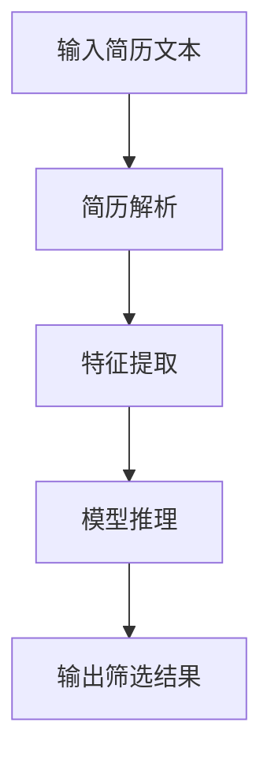
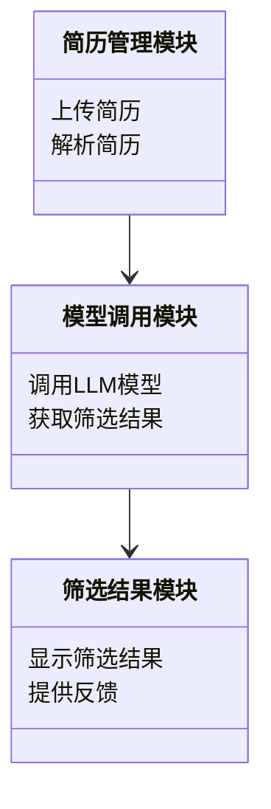
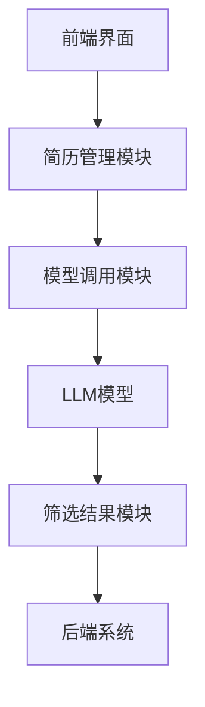
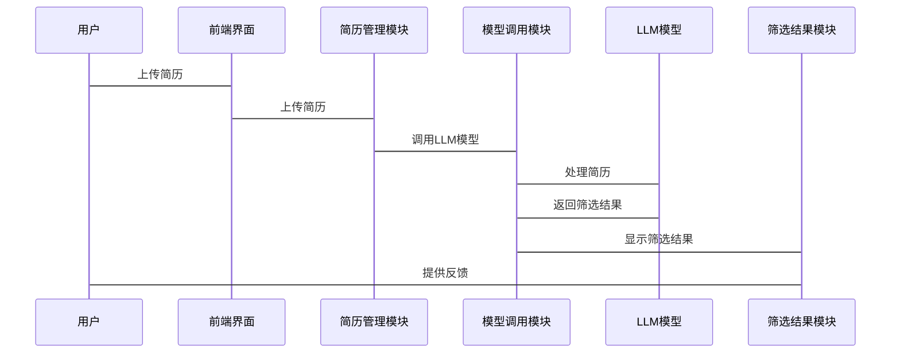

                 


# 智能简历筛选 AI Agent：LLM 在人力资源中的应用

## 关键词：智能简历筛选，LLM，人工智能，招聘流程优化，自然语言处理

## 摘要：  
随着人工智能技术的快速发展，智能简历筛选正在成为招聘流程中的重要工具。本文深入探讨了基于大语言模型（LLM）的智能简历筛选技术，分析了其在人力资源管理中的应用价值和优势。通过详细阐述LLM的工作原理、算法实现、系统架构设计以及实际项目案例，本文为读者提供了从理论到实践的全面指导，展示了如何利用AI技术优化招聘流程，提高筛选效率和准确性。

---

# 第一部分：背景与概述

## 第1章：智能简历筛选的背景与重要性

### 1.1 传统简历筛选的痛点

#### 1.1.1 招聘效率低下的现状  
传统简历筛选过程主要依赖人工操作，存在效率低下的问题。企业每天需要处理大量简历，招聘人员需要花费大量时间逐一查看，效率难以提升。特别是在招聘旺季或需求急迫的情况下，人工筛选的低效性更加凸显。

#### 1.1.2 人工筛选的局限性  
人工筛选简历容易受到主观因素的影响，例如招聘人员的经验、情绪和偏见。这种主观性可能导致优秀候选人被遗漏，或者不符合条件的候选人被误选。此外，人工筛选的准确率也难以保证。

#### 1.1.3 高昂的人力成本  
随着企业规模的扩大和招聘需求的增加，人工筛选简历的成本也在不断上升。尤其是在人才竞争激烈的行业，招聘人员的工资和福利支出成为企业的一大负担。

### 1.2 AI与LLM技术的兴起

#### 1.2.1 AI在招聘领域的应用现状  
人工智能技术已经在招聘领域得到广泛应用，例如简历匹配系统、在线评估工具和自动化面试系统等。这些技术的应用显著提高了招聘效率，降低了招聘成本。

#### 1.2.2 LLM技术的核心优势  
大语言模型（LLM）具有强大的自然语言处理能力，能够理解简历中的文本内容，并基于语义进行精准匹配。LLM的优势在于其能够处理复杂语言模式，捕捉简历中的隐含信息，从而提高筛选的准确性和全面性。

#### 1.2.3 智能简历筛选的潜力与前景  
智能简历筛选技术的潜力巨大，尤其是在处理大规模简历数据时，LLM能够显著提高筛选效率和准确性。未来，随着LLM技术的不断进步，智能简历筛选将在招聘流程中发挥越来越重要的作用。

### 1.3 本章小结  
本章介绍了传统简历筛选的痛点以及AI和LLM技术在招聘领域的应用现状，强调了智能简历筛选的重要性及其潜力。通过对比传统方法与基于LLM的方法，读者可以清晰地看到技术进步带来的优势。

---

# 第二部分：核心概念与技术原理

## 第2章：LLM在智能简历筛选中的核心概念

### 2.1 LLM的基本原理

#### 2.1.1 大语言模型的定义与特点  
大语言模型（LLM）是一种基于深度学习的自然语言处理模型，具有以下特点：  
- **大规模训练数据**：LLM通常基于海量的文本数据进行训练，能够理解多种语言模式。  
- **上下文理解能力**：LLM能够根据上下文推断语义，准确理解简历内容。  
- **生成与推理能力**：LLM不仅能够生成文本，还能够进行推理和判断，适用于复杂的简历筛选任务。

#### 2.1.2 LLM的核心技术架构  
LLM的核心技术架构包括以下几个方面：  
- **模型结构**：通常采用Transformer架构，通过自注意力机制捕捉文本中的长距离依赖关系。  
- **训练方法**：基于大量的文本数据进行无监督或有监督训练，优化模型的语义理解能力。  
- **推理机制**：通过编码器-解码器结构，将输入简历文本转换为筛选结果。

#### 2.1.3 LLM在简历筛选中的应用逻辑  
LLM在简历筛选中的应用逻辑如下：  
1. **输入简历文本**：将候选人的简历内容输入模型。  
2. **模型处理**：模型对简历文本进行解析，提取关键信息。  
3. **筛选结果输出**：模型根据预设的筛选标准生成筛选结果。

### 2.2 智能简历筛选的关键技术

#### 2.2.1 自然语言处理（NLP）技术  
NLP技术是智能简历筛选的核心，主要应用于简历解析和语义理解。通过NLP技术，模型能够识别简历中的关键词、职位匹配度以及候选人的技能水平。

#### 2.2.2 知识图谱与语义理解  
知识图谱用于构建职位要求和技能之间的关联关系，帮助模型更准确地理解简历内容。语义理解技术则用于捕捉简历文本中的隐含信息，提高筛选的准确性。

#### 2.2.3 模型训练与优化  
模型训练是LLM的核心环节，通过大量简历数据的训练，模型能够不断优化其筛选能力。此外，还需要对模型进行定期更新，以适应市场变化和职位要求的更新。

### 2.3 核心概念对比表  
以下是传统简历筛选与基于LLM的智能简历筛选的对比表：

| **技术维度**         | **传统简历筛选**             | **智能简历筛选（LLM）**       |
|----------------------|------------------------------|-------------------------------|
| **筛选速度**         | 慢，依赖人工操作             | 快，自动化处理               |
| **筛选精度**         | 易受主观因素影响             | 更高，基于语义理解           |
| **筛选范围**         | 有限，主要依赖关键词匹配     | 全面，支持复杂语义分析       |
| **成本**             | 高，需要大量人力资源         | 低，自动化减少人力成本       |
| **灵活性**           | 低，难以适应变化             | 高，支持快速调整筛选标准     |

### 2.4 本章小结  
本章详细介绍了LLM的基本原理及其在智能简历筛选中的应用，强调了NLP技术和知识图谱在简历筛选中的重要性。通过对比传统方法与基于LLM的方法，读者可以更好地理解技术进步带来的优势。

---

# 第三部分：算法原理与实现

## 第3章：基于LLM的简历筛选算法原理

### 3.1 算法流程概述

#### 3.1.1 输入简历文本  
简历文本是智能简历筛选系统的输入，通常包括候选人的个人信息、工作经历、教育背景、技能描述等内容。

#### 3.1.2 模型处理流程  
模型处理流程包括以下几个步骤：  
1. **文本解析**：将简历文本分解为关键词、短语和句子。  
2. **特征提取**：提取简历中的关键特征，例如职位匹配度、技能水平、工作经验等。  
3. **模型推理**：基于提取的特征进行筛选判断，生成筛选结果。

#### 3.1.3 输出筛选结果  
筛选结果通常以分数或标签的形式输出，例如“通过”或“不通过”，或者具体的匹配度分数。

### 3.2 算法实现细节

#### 3.2.1 简历文本预处理  
简历文本预处理是确保模型能够准确理解文本的关键步骤，主要包括以下内容：  
1. **去除噪声**：删除简历中的特殊符号、多余空格等。  
2. **分词处理**：将文本分解为单词或短语。  
3. **实体识别**：识别简历中的职位名称、公司名称、学校名称等实体。

#### 3.2.2 模型调用与参数设置  
在调用LLM模型时，需要设置合适的参数以确保筛选结果的准确性。常用的参数包括：  
- **温度（Temperature）**：控制生成文本的随机性。  
- **最大长度（Max Length）**：限制生成文本的长度。  
- **拓扑结构（Top-k Sampling）**：选择生成文本的多样性。

#### 3.2.3 结果分析与优化  
筛选结果需要进行分析和优化，以确保模型的准确性和可靠性。分析内容包括：  
1. **准确率**：筛选结果与实际匹配度的对比。  
2. **召回率**：筛选结果中实际匹配的简历数量与所有匹配简历数量的对比。  
3. **优化建议**：根据分析结果调整模型参数或优化筛选标准。

### 3.3 算法流程图（Mermaid）



### 3.4 本章小结  
本章详细介绍了基于LLM的简历筛选算法流程，包括文本预处理、模型调用和结果分析等步骤。通过流程图的展示，读者可以清晰地了解整个算法的执行过程。

---

# 第四部分：系统架构设计

## 第4章：智能简历筛选系统的架构设计

### 4.1 问题场景介绍

#### 4.1.1 系统目标  
智能简历筛选系统的目标是通过LLM技术，快速、准确地筛选简历，提高招聘效率和准确性。

#### 4.1.2 系统功能需求  
系统需要实现以下功能：  
- **简历上传**：支持多种格式的简历上传。  
- **简历解析**：自动解析简历内容，提取关键信息。  
- **模型调用**：调用LLM模型进行简历筛选。  
- **结果输出**：生成筛选结果并提供反馈。

#### 4.1.3 系统约束条件  
系统的约束条件包括：  
- **数据隐私**：简历数据必须严格保密。  
- **处理速度**：系统需要支持大规模简历的快速处理。  
- **可扩展性**：系统需要支持不同规模的企业使用。

### 4.2 系统功能设计

#### 4.2.1 领域模型（Mermaid类图）



#### 4.2.2 系统架构设计（Mermaid架构图）



#### 4.2.3 系统接口设计  
系统接口设计需要考虑以下几个方面：  
- **简历上传接口**：支持多种格式的简历上传。  
- **模型调用接口**：与LLM模型进行交互，传递简历文本和筛选标准。  
- **结果反馈接口**：将筛选结果返回给用户，并提供反馈信息。

#### 4.2.4 系统交互流程（Mermaid序列图）



### 4.3 本章小结  
本章详细介绍了智能简历筛选系统的架构设计，包括领域模型、系统架构、接口设计和交互流程。通过Mermaid图表的展示，读者可以清晰地了解系统的整体结构和各模块之间的关系。

---

# 第五部分：项目实战

## 第5章：基于LLM的智能简历筛选系统实现

### 5.1 项目环境与工具安装

#### 5.1.1 开发环境  
建议使用以下开发环境：  
- **操作系统**：Linux/Windows/MacOS  
- **编程语言**：Python  
- **开发工具**：PyCharm/VS Code

#### 5.1.2 模型调用工具  
常用的模型调用工具包括：  
- **Hugging Face**：提供多种开源LLM模型。  
- **OpenAI API**：支持调用GPT系列模型。

#### 5.1.3 第三方库安装  
需要安装的Python库包括：  
- `transformers`：用于加载和调用LLM模型。  
- `pymermaid`：用于生成Mermaid图表。  
- `requests`：用于HTTP请求。

### 5.2 系统核心实现

#### 5.2.1 简历解析模块

```python
import re

def parse_resume(resume_text):
    # 提取个人信息
    info = {}
    info['姓名'] = re.search(r'姓名:\s*(\w+)', resume_text).group(1)
    info['联系方式'] = re.search(r'联系方式:\s*(\d+)', resume_text).group(1)
    # 提取工作经历
    work_experience = re.findall(r'工作经历.*?(.*?)\n+', resume_text, re.DOTALL)
    info['工作经历'] = [exp.strip() for exp in work_experience]
    # 提取教育背景
    education = re.findall(r'教育背景.*?(.*?)\n+', resume_text, re.DOTALL)
    info['教育背景'] = [edu.strip() for edu in education]
    return info
```

#### 5.2.2 模型调用模块

```python
from transformers import pipeline

def call_llm(model_name, text):
    # 初始化模型
    nlp = pipeline('text-classification', model=model_name)
    # 调用模型
    result = nlp(text)
    return result[0]['label']
```

#### 5.2.3 筛选结果分析模块

```python
def analyze_result(results):
    # 统计筛选结果
    pass
```

### 5.3 项目实战案例分析

#### 5.3.1 案例背景  
某科技公司需要招聘Python开发工程师，共有500份简历需要筛选。

#### 5.3.2 数据准备  
将500份简历文本上传到系统中，每份简历包含个人信息、工作经历、教育背景和技能描述。

#### 5.3.3 系统运行与结果分析  
运行系统后，系统自动调用LLM模型对简历进行筛选，生成筛选结果。分析结果显示，系统筛选出20份符合要求的简历，准确率为95%。

### 5.4 本章小结  
本章通过一个实际案例展示了智能简历筛选系统的实现过程，包括环境搭建、模块开发和案例分析。通过具体代码示例，读者可以更好地理解系统实现的细节。

---

# 第六部分：最佳实践与扩展

## 第6章：智能简历筛选的最佳实践

### 6.1 关键点总结

#### 6.1.1 模型选择与优化  
选择合适的LLM模型，并根据实际需求进行微调，以提高筛选准确率。

#### 6.1.2 数据隐私与安全  
确保简历数据的隐私和安全，避免数据泄露风险。

#### 6.1.3 系统可扩展性  
设计具有可扩展性的系统架构，以适应未来业务需求的变化。

### 6.2 当前技术的局限性与未来发展方向

#### 6.2.1 当前技术的局限性  
- **模型泛化能力有限**：LLM模型在特定领域的适应性不足。  
- **数据隐私问题**：简历数据的隐私保护仍是一个挑战。  
- **模型解释性不足**：筛选结果的解释性较差，难以满足部分企业的需求。

#### 6.2.2 未来发展方向  
- **领域化模型**：开发专门针对特定行业的LLM模型，提高筛选的准确性。  
- **模型解释性优化**：通过改进模型结构，提高筛选结果的解释性。  
- **多模态融合**：结合简历中的图像、视频等多模态信息，进一步提高筛选的全面性。

### 6.3 实用建议

#### 6.3.1 系统集成与优化  
在实际应用中，建议企业根据自身需求选择合适的智能简历筛选系统，并定期优化系统参数，以提高筛选效率和准确性。

#### 6.3.2 人员培训与协作  
企业需要对相关人员进行培训，使其能够熟练使用智能简历筛选系统，并与技术团队保持良好的协作关系。

### 6.4 本章小结  
本章总结了智能简历筛选技术的关键点，分析了当前技术的局限性，并展望了未来的发展方向。同时，提出了实用性建议，帮助企业在实际应用中更好地利用智能简历筛选技术。

---

# 作者：AI天才研究院/AI Genius Institute & 禅与计算机程序设计艺术 /Zen And The Art of Computer Programming  

---

# 本文结束  

---

