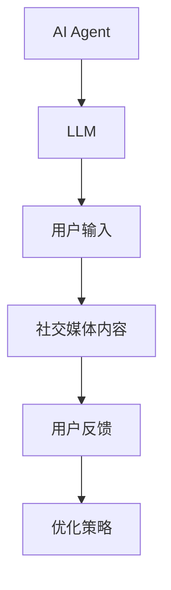
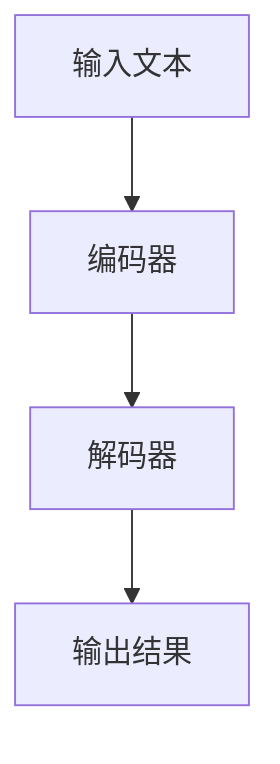

                 


# 社交媒体 AI Agent：LLM 辅助内容管理与互动

## 关键词：社交媒体、AI Agent、LLM、内容管理、用户互动、大语言模型、人工智能

## 摘要：本文探讨了如何利用大语言模型（LLM）构建社交媒体 AI Agent，以实现高效的内容管理与智能化的用户互动。通过分析 LLM 的工作原理、系统架构设计以及实际案例，展示了 AI Agent 在提升社交媒体用户体验中的巨大潜力。文章从背景介绍、核心概念、算法原理、系统架构、项目实战到总结与展望，详细阐述了实现这一目标的全过程。

---

## 第一部分: 社交媒体 AI Agent 与 LLM 的背景与概念

### 第1章: 社交媒体 AI Agent 的背景与现状

#### 1.1 社交媒体的发展与挑战
- **1.1.1 社交媒体的定义与现状**  
  社交媒体（Social Media）是指基于互联网的互动平台，允许用户创建、分享、交流内容。随着移动互联网的普及，社交媒体已经成为人们日常生活的重要组成部分，用户数量和内容生成量呈现指数级增长。然而，这种快速增长也带来了内容过载、信息筛选难度大、用户互动效率低等挑战。

- **1.1.2 内容管理与用户互动的核心问题**  
  在社交媒体上，内容管理的核心问题包括如何快速识别和分类海量内容，如何高效处理用户请求，如何优化用户体验。这些问题的传统解决方式依赖人工操作，效率低下且成本高昂。因此，引入人工智能技术，尤其是大语言模型（LLM），成为解决这些问题的关键。

- **1.1.3 AI 技术在社交媒体中的应用前景**  
  AI 技术在社交媒体中的应用前景广阔，尤其是在内容审核、用户推荐、情感分析等方面。通过 AI Agent 的辅助，社交媒体平台可以显著提高内容管理的效率和准确性，同时为用户提供更加个性化的互动体验。

#### 1.2 AI Agent 的概念与特点
- **1.2.1 AI Agent 的定义**  
  AI Agent（人工智能代理）是一种能够感知环境、自主决策并执行任务的智能系统。与传统的自动化工具不同，AI Agent 具备学习和适应能力，能够根据环境反馈动态调整其行为。

- **1.2.2 AI Agent 的核心特点**  
  AI Agent 的核心特点包括：
  1. **自主性**：能够在没有人工干预的情况下完成任务。
  2. **反应性**：能够实时感知环境变化并做出反应。
  3. **学习能力**：能够通过数据和经验不断优化自身的性能。
  4. **交互性**：能够与用户或其他系统进行自然的交互。

- **1.2.3 AI Agent 与传统自动化工具的区别**  
  传统的自动化工具通常基于固定的规则执行任务，缺乏灵活性和适应性。而 AI Agent 则能够根据具体情况动态调整其行为，具备更强的智能性和主动性。

#### 1.3 LLM 在社交媒体 AI Agent 中的作用
- **1.3.1 LLM 的定义与技术特点**  
  大语言模型（LLM，Large Language Model）是一种基于深度学习的自然语言处理模型，能够理解和生成人类语言。LLM 的核心优势在于其强大的上下文理解和生成能力，能够处理复杂的语言任务。

- **1.3.2 LLM 在内容管理中的优势**  
  在内容管理中，LLM 可以用于自动分类、内容审核、垃圾信息过滤等功能。通过分析文本的语义和上下文，LLM 能够快速识别出有害或不合适的内容，显著提高内容管理的效率。

- **1.3.3 LLM 在用户互动中的应用潜力**  
  在用户互动方面，LLM 可以用于智能客服、个性化推荐、情感分析等功能。通过理解用户的意图和情感，LLM 能够提供更加精准和个性化的服务，提升用户体验。

#### 1.4 本章小结
本章介绍了社交媒体的发展现状及其面临的挑战，详细阐述了 AI Agent 的概念和特点，以及 LLM 在社交媒体 AI Agent 中的核心作用。通过对这些内容的分析，我们可以看到，AI Agent 和 LLM 的结合为社交媒体的内容管理和用户互动带来了巨大的潜力。

---

## 第二部分: 基于 LLM 的社交媒体 AI Agent 核心概念与联系

### 第2章: 社交媒体 AI Agent 的核心概念与联系

#### 2.1 核心概念原理
- **2.1.1 AI Agent 的工作原理**  
  AI Agent 的工作原理可以分为感知、决策和执行三个阶段。感知阶段通过传感器或 API 获取环境信息，决策阶段基于获取的信息进行分析和推理，执行阶段根据决策结果采取相应行动。

- **2.1.2 LLM 的基本原理**  
  LLM 的基本原理基于 Transformer 模型，通过自注意力机制和前馈神经网络实现文本的生成和理解。模型通过对输入文本的上下文进行分析，生成与输入内容相关且连贯的输出。

- **2.1.3 两者结合的协同机制**  
  AI Agent 和 LLM 的协同机制主要体现在信息传递和任务分工上。AI Agent 负责整体任务的规划和协调，LLM 负责具体语言任务的处理和生成。通过这种分工合作，AI Agent 能够更高效地完成复杂的社交媒体管理任务。

#### 2.2 核心概念属性对比
- **2.2.1 AI Agent 的属性特征**  
  | 属性 | 描述 |
  |------|------|
  | 自主性 | 独立完成任务的能力 |
  | 反应性 | 实时感知环境变化的能力 |
  | 学习能力 | 通过数据优化自身的能力 |

- **2.2.2 LLM 的属性特征**  
  | 属性 | 描述 |
  |------|------|
  | 语义理解 | 理解人类语言的能力 |
  | 内容生成 | 生成自然语言文本的能力 |
  | 上下文感知 | 理解文本上下文的能力 |

- **2.2.3 对比分析表**  
  | 属性 | AI Agent | LLM |
  |------|----------|-----|
  | 自主性 | 高 | 无 |
  | 反应性 | 高 | 中 |
  | 学习能力 | 高 | 高 |
  | 语义理解 | 中 | 高 |

#### 2.3 ER 实体关系图


#### 2.4 本章小结
本章从核心概念的角度，详细分析了 AI Agent 和 LLM 的工作原理及其协同机制，通过对比分析和实体关系图，进一步明确了两者在社交媒体 AI Agent 中的角色和联系。

---

## 第三部分: 基于 LLM 的社交媒体 AI Agent 算法原理

### 第3章: 基于 LLM 的社交媒体 AI Agent 算法原理

#### 3.1 算法原理概述
- **3.1.1 LLM 的基本算法流程**  
  LLM 的基本算法流程包括输入处理、编码器处理、解码器处理和输出生成四个阶段。编码器负责将输入文本转换为向量表示，解码器负责根据编码器的输出生成目标文本。

- **3.1.2 基于 Transformer 的模型结构**  
  Transformer 模型由编码器和解码器两部分组成，编码器负责将输入序列转换为隐藏状态，解码器负责根据编码器的输出生成目标序列。

- **3.1.3 注意力机制的核心作用**  
  注意力机制通过计算输入序列中每个位置的重要性权重，帮助模型聚焦于关键信息，从而提高文本理解和生成的准确性和连贯性。

#### 3.2 算法流程图


#### 3.3 算法数学模型
- **3.3.1 Transformer 模型的数学公式**  
  编码器的前向网络结构可以表示为：
  $$\text{Encoder}(x) = \text{LayerNorm}(x + \text{MultiHead}(x))$$

  其中，$\text{MultiHead}$ 表示多头注意力机制，$\text{LayerNorm}$ 表示层规范化操作。

- **3.3.2 注意力机制的计算公式**  
  注意力机制的计算公式为：
  $$\text{Attention}(Q, K, V) = \text{softmax}\left(\frac{QK^T}{\sqrt{d_k}}\right)V$$

  其中，$Q$ 是查询向量，$K$ 是键向量，$V$ 是值向量，$d_k$ 是键的维度。

#### 3.4 本章小结
本章从算法原理的角度，详细分析了 LLM 的工作流程和数学模型，强调了注意力机制在提升模型性能中的核心作用。

---

## 第四部分: 社交媒体 AI Agent 系统架构设计

### 第4章: 社交媒体 AI Agent 系统架构设计

#### 4.1 问题场景介绍
- 社交媒体 AI Agent 的应用场景包括内容审核、用户推荐、情感分析、智能客服等。每个场景都需要不同的系统模块和接口设计。

#### 4.2 项目介绍
- 本项目旨在设计和实现一个基于 LLM 的社交媒体 AI Agent，用于辅助内容管理和用户互动。通过结合 AI 技术和社会化媒体的特点，打造一个高效、智能的社交媒体管理工具。

#### 4.3 系统功能设计
- **4.3.1 领域模型 mermaid 类图**  
  ```mermaid
  classDiagram
      class AI Agent {
          - llm: LLM
          - userInput: String
          - output: String
          + process(input: String): String
      }
      class LLM {
          - model: Transformer
          - tokenizer: Tokenizer
          + generate(input: String): String
      }
      class Transformer {
          - encoder: List[Layer]
          - decoder: List[Layer]
          + forward(input: Tensor): Tensor
      }
      class Tokenizer {
          + tokenize(input: String): List[Token]
      }
      AI Agent --> LLM
      LLM --> Transformer
      LLM --> Tokenizer
  ```

- **4.3.2 系统架构设计 mermaid 架构图**  
  ```mermaid
  rectangle Database {
      User Data
      Content Data
  }
  rectangle Agent {
      AI Agent
      LLM
  }
  rectangle API {
      REST API
      WebSocket API
  }
  rectangle UI {
      User Interface
  }
  Database --> Agent
  Agent --> API
  API --> UI
  ```

- **4.3.3 系统接口设计**  
  系统接口包括 REST API 和 WebSocket API。REST API 用于处理异步任务，如内容审核和推荐；WebSocket API 用于实时用户互动，如智能客服和实时聊天。

- **4.3.4 系统交互 mermaid 序列图**  
  ```mermaid
  sequenceDiagram
      用户 -->+> AI Agent: 提交请求
      AI Agent -->+> LLM: 调用模型
      LLM -->+> Transformer: 处理输入
      Transformer -->+> Tokenizer: 生成输出
      LLM -->+> AI Agent: 返回结果
      AI Agent -->+> 用户: 反馈结果
  ```

#### 4.4 本章小结
本章通过系统架构设计，明确了 AI Agent 和 LLM 在社交媒体中的集成方式和交互流程，为后续的项目实现奠定了基础。

---

## 第五部分: 项目实战

### 第5章: 项目实战

#### 5.1 环境安装
- **5.1.1 安装 Python 和依赖库**  
  需要安装的 Python 包包括：
  ```bash
  pip install numpy torch transformers requests websockets
  ```

- **5.1.2 安装 LLM 模型**  
  使用 Hugging Face 提供的预训练模型，如 GPT-2 或 Llama。

#### 5.2 系统核心实现源代码
- **5.2.1 AI Agent 的实现代码**  
  ```python
  class AI_Agent:
      def __init__(self, llm):
          self.llm = llm

      def process(self, input):
          return self.llm.generate(input)
  ```

- **5.2.2 LLM 的实现代码**  
  ```python
  class LLM:
      def __init__(self, model, tokenizer):
          self.model = model
          self.tokenizer = tokenizer

      def generate(self, input):
          inputs = self.tokenizer(input, return_tensors="pt")
          outputs = self.model.generate(inputs.input_ids, max_length=50)
          return self.tokenizer.decode(outputs[0], skip_special_tokens=True)
  ```

- **5.2.3 Transformer 模型的实现代码**  
  ```python
  import torch
  class Transformer:
      def __init__(self, vocab_size, d_model=512, n_head=8, n_layer=6):
          self.vocab_size = vocab_size
          self.d_model = d_model
          self.n_head = n_head
          self.n_layer = n_layer
          self.model = self.build_model()

      def build_model(self):
          # 简化的 Transformer 实现
          return torch.nn.Sequential(
              torch.nn.LayerNorm(self.d_model),
              torch.nn.MultiheadAttention(self.d_model, self.n_head)
          )
  ```

#### 5.3 代码应用解读与分析
- **5.3.1 AI Agent 的主要功能**  
  AI Agent 通过调用 LLM 的生成接口，实现对用户输入的处理和内容生成。在代码中，`AI_Agent.process` 方法接收用户输入，并调用 LLM 的 `generate` 方法生成输出结果。

- **5.3.2 LLM 的实现细节**  
  LLM 的实现基于预训练的 Transformer 模型和分词器。`generate` 方法将输入文本编码为张量，通过模型生成输出序列，并将生成的序列解码为字符串。

- **5.3.3 Transformer 模型的实现细节**  
  Transformer 模型的实现包括编码器和解码器两部分，采用多头注意力机制和前馈网络。通过层规范化和残差连接，模型能够更好地捕捉输入的上下文信息。

#### 5.4 实际案例分析
- **5.4.1 内容审核案例**  
  用户输入一条社交媒体帖子，AI Agent 调用 LLM 生成审核结果，判断内容是否符合社区规范。

- **5.4.2 智能推荐案例**  
  AI Agent 根据用户的兴趣和行为，推荐相关内容和用户，提升用户的参与度和满意度。

#### 5.5 本章小结
本章通过具体的项目实战，展示了如何将 AI Agent 和 LLM 集成到社交媒体系统中。通过代码实现和案例分析，验证了这一技术方案的可行性和有效性。

---

## 第六部分: 总结与展望

### 第6章: 总结与展望

#### 6.1 本章总结
- 本文详细探讨了基于 LLM 的社交媒体 AI Agent 的设计与实现，从背景介绍、核心概念、算法原理到系统架构和项目实战，全面分析了这一技术的应用潜力和实现细节。

#### 6.2 未来展望
- **6.2.1 多模态模型的应用**  
  未来的社交媒体 AI Agent 可能会结合图像、视频等多种模态信息，提供更加丰富和多样化的服务。

- **6.2.2 用户隐私保护**  
  随着 AI 技术的不断进步，如何在提升用户体验的同时保护用户隐私，将成为社交媒体 AI Agent 设计中的重要挑战。

#### 6.3 最佳实践 Tips
- 在实际应用中，建议开发者从简单的功能入手，逐步完善系统功能，同时注重用户体验和性能优化。
- 在选择 LLM 模型时，需要根据具体需求选择合适的模型和参数设置，以平衡性能和成本。

#### 6.4 本章小结
本章总结了全文的主要内容，并展望了未来的发展方向，为读者提供了进一步探索和技术实践的方向。

---

## 附录

### 附录 A: 简单数学公式示例
- **公式 1**：$$1+1=2$$
- **公式 2**：$$y = mx + b$$

### 附录 B: Mermaid 图表示例
- **流程图**：
  ```mermaid
  graph TD
      A[开始] --> B[处理输入]
      B --> C[生成输出]
      C --> D[结束]
  ```

- **类图**：
  ```mermaid
  classDiagram
      class AI Agent {
          - llm: LLM
          + process(input: String): String
      }
      class LLM {
          - model: Transformer
          + generate(input: String): String
      }
  ```

### 附录 C: 代码片段示例
```python
def greeting(name):
    return f"Hello, {name}!"
```

---

## 作者：AI天才研究院/AI Genius Institute & 禅与计算机程序设计艺术/Zen And The Art of Computer Programming

---

**摘要：**  
本文系统地探讨了如何利用大语言模型（LLM）构建社交媒体 AI Agent，以实现高效的内容管理与智能化的用户互动。通过分析 LLM 的工作原理、系统架构设计以及实际案例，展示了 AI Agent 在提升社交媒体用户体验中的巨大潜力。文章从背景介绍、核心概念、算法原理、系统架构、项目实战到总结与展望，详细阐述了实现这一目标的全过程。

