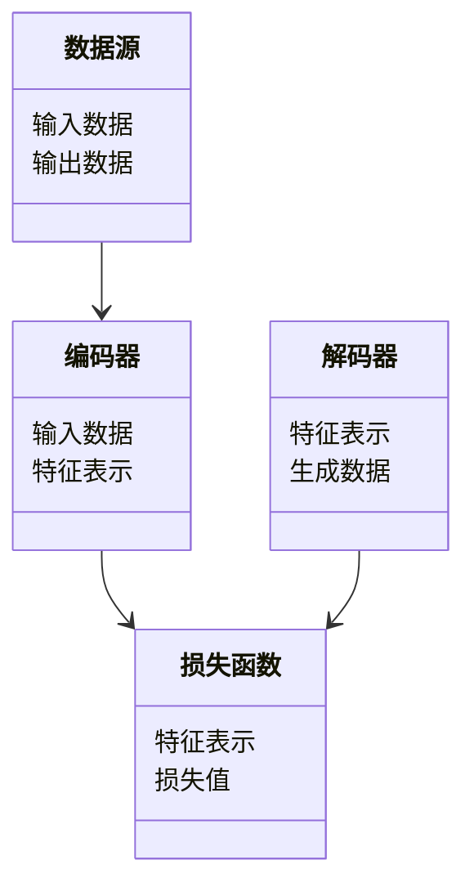
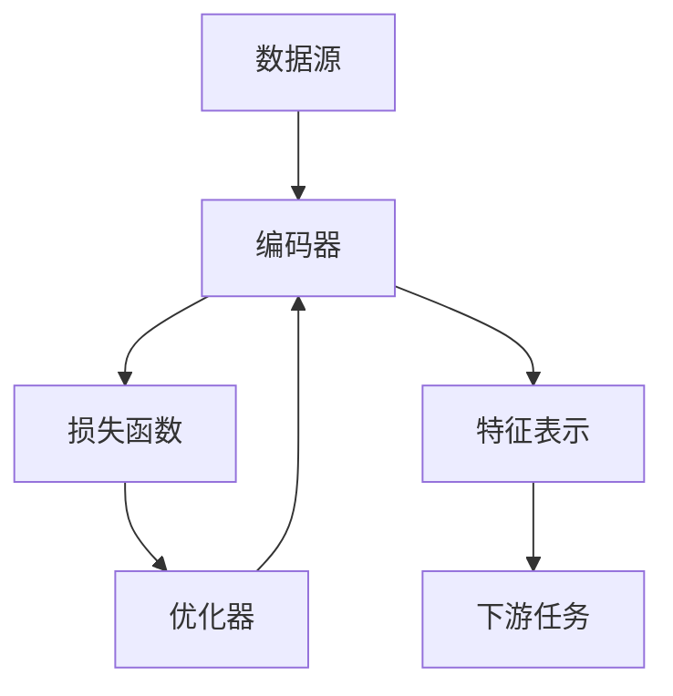

                 


# 《金融领域自监督学习的应用与挑战》

## 关键词：自监督学习，金融应用，算法原理，系统架构，挑战与解决方案

## 摘要：  
自监督学习作为一种新兴的人工智能技术，在金融领域的应用正变得越来越重要。本文详细探讨了自监督学习的基本概念、算法原理及其在金融领域的具体应用，分析了其在金融数据分析中的优势与挑战，并通过实际案例展示了如何在金融领域中有效实施自监督学习。文章结构清晰，内容详实，旨在为读者提供关于自监督学习在金融领域应用的全面理解。

---

# 第1章: 自监督学习的基本概念与背景

## 1.1 自监督学习的定义与特点

### 1.1.1 自监督学习的基本概念  
自监督学习（Self-Supervised Learning, SSL）是一种无监督学习的变体，其核心思想是通过利用数据本身的结构信息来生成标签，从而减少对标注数据的依赖。与监督学习不同，自监督学习不需要人工标注的标签，而是通过任务驱动的方式从数据中学习有用的特征表示。  

### 1.1.2 自监督学习的核心特点  
1. **无监督性**：自监督学习主要依赖数据本身的结构信息，减少了对标注数据的依赖。  
2. **任务驱动性**：通过设计特定的预训练任务，模型能够从数据中学习到有用的特征。  
3. **灵活性**：自监督学习可以应用于多种数据类型，如文本、图像、时间序列等，在金融领域中尤其适合处理多模态数据。  

### 1.1.3 自监督学习与监督学习的区别  
| 特性             | 监督学习          | 自监督学习         |
|------------------|-------------------|---------------------|
| 数据需求         | 高                | 低                 |
| 标签依赖         | 高                | 低                 |
| 适用场景         | 数据量小、标注容易 | 数据量大、标注困难  |
| 模型泛化能力     | 一般              | 较强               |

---

## 1.2 金融领域的自监督学习背景

### 1.2.1 金融数据分析的特点  
1. **数据多样性**：金融数据通常包括文本、图像、时间序列等多种类型。  
2. **数据稀疏性**：某些金融场景下，标注数据可能非常有限。  
3. **数据敏感性**：金融数据通常涉及敏感信息，对隐私保护要求高。  

### 1.2.2 传统监督学习的局限性  
1. **标注成本高**：金融领域的标注数据通常需要专家进行，成本较高。  
2. **数据稀疏性**：在某些金融场景中，可能缺乏足够的标注数据来训练模型。  
3. **模型泛化能力有限**：监督学习模型在面对未见过的数据时，表现可能不佳。  

### 1.2.3 自监督学习在金融领域的优势  
1. **降低标注成本**：通过自监督学习，可以在无标注数据上进行预训练，减少标注成本。  
2. **提升模型泛化能力**：自监督学习可以从大量未标注数据中学习到通用特征，提升模型的泛化能力。  
3. **适用于多种数据类型**：自监督学习可以处理文本、图像、时间序列等多种数据类型，适合金融领域的多模态数据。  

---

# 第2章: 自监督学习的核心概念与理论基础

## 2.1 自监督学习的理论基础

### 2.1.1 对比学习的基本原理  
对比学习是一种常用的自监督学习方法，其核心思想是通过最大化正样本对的相似性，同时最小化负样本对的相似性。  

$$ L = -\log \frac{e^{f(x_i, x_j)}}{e^{f(x_i, x_k)} + e^{f(x_j, x_k)}}} $$  

其中，$f(x_i, x_j)$ 表示正样本对的相似性，$f(x_i, x_k)$ 和 $f(x_j, x_k)$ 表示负样本对的相似性。  

### 2.1.2 生成对抗网络的原理  
生成对抗网络（GAN）是一种自监督学习方法，由生成器和判别器组成。生成器的目标是生成与真实数据分布一致的样本，而判别器的目标是区分真实样本和生成样本。  

### 2.1.3 图神经网络的自监督学习  
图神经网络（Graph Neural Network, GNN）通过将数据建模为图结构，利用节点之间的关系进行特征学习。在自监督学习中，可以通过节点嵌入和边嵌入来学习图的结构特征。  

---

## 2.2 自监督学习的核心概念

### 2.2.1 自监督学习的三要素  
1. **数据**：输入数据的结构和分布。  
2. **任务**：设计的任务用于指导模型学习有用的特征。  
3. **模型**：用于学习特征表示的模型结构。  

### 2.2.2 自监督学习的数学模型  
自监督学习的数学模型通常包括编码器、解码器和对比学习的目标函数。  

$$ \text{编码器}：f(x) \rightarrow z $$  
$$ \text{解码器}：g(z) \rightarrow x' $$  
$$ \text{目标函数}：L = \mathbb{E}_{(x, x') \sim p(x)} [\text{损失函数}] $$  

### 2.2.3 自监督学习的评价指标  
1. **重构损失**：衡量生成样本与真实样本的相似性。  
2. **对比损失**：衡量正样本对和负样本对的相似性差异。  
3. **分类准确率**：在下游任务中的分类准确率可以衡量模型的特征表示能力。  

---

## 2.3 自监督学习与金融领域的结合

### 2.3.1 金融数据的特性与自监督学习的契合点  
1. **时间序列数据**：金融市场的价格数据通常具有时间依赖性，适合使用对比学习进行特征提取。  
2. **多模态数据**：金融数据可能包括文本（如新闻）、图像（如K线图）和时间序列等多种类型，适合自监督学习的多模态处理能力。  
3. **小样本数据**：在某些金融场景中，可能只有少量标注数据，自监督学习可以通过预训练提升模型的泛化能力。  

### 2.3.2 自监督学习在金融预测中的应用  
1. **股价预测**：通过对比学习，可以从历史股价数据中学习到有用的特征，用于预测未来的股价走势。  
2. **金融事件预测**：通过生成对抗网络，可以从新闻文本中学习到事件的潜在特征，用于预测市场波动。  

### 2.3.3 自监督学习在金融风控中的应用  
1. **信用评分**：通过自监督学习，可以从客户的交易数据中学习到信用评分的特征。  
2. **欺诈检测**：通过对比学习，可以从交易数据中学习到异常交易的特征，用于欺诈检测。  

---

## 2.4 本章小结  
本章详细介绍了自监督学习的基本概念、理论基础及其在金融领域的应用。通过对比学习、生成对抗网络和图神经网络等方法，自监督学习在金融数据分析中展现出强大的潜力。然而，自监督学习也面临一些挑战，如如何设计有效的预训练任务和如何处理金融数据的复杂性。这些问题将在后续章节中进一步探讨。

---

# 第3章: 自监督学习的算法原理与数学模型

## 3.1 自监督学习的算法原理

### 3.1.1 对比学习的算法流程  
1. **数据预处理**：将数据划分为正样本对和负样本对。  
2. **特征提取**：通过编码器提取数据的特征表示。  
3. **损失计算**：计算正样本对和负样本对的相似性损失。  
4. **模型优化**：通过梯度下降优化模型参数。  

### 3.1.2 生成对抗网络的算法流程  
1. **生成器输入**：输入随机噪声，生成与真实数据分布相似的样本。  
2. **判别器输入**：输入生成样本和真实样本，输出判断结果。  
3. **损失计算**：计算生成器和判别器的损失函数。  
4. **模型优化**：通过交替优化生成器和判别器的参数。  

### 3.1.3 图神经网络的自监督学习算法  
1. **节点嵌入**：通过图神经网络学习每个节点的嵌入表示。  
2. **边嵌入**：通过边嵌入模型学习节点之间的关系。  
3. **损失计算**：计算节点嵌入和边嵌入的损失函数。  
4. **模型优化**：通过梯度下降优化模型参数。  

---

## 3.2 自监督学习的数学模型

### 3.2.1 对比学习的损失函数  
$$ L = -\sum_{i=1}^N \log \frac{e^{f(x_i, x_j)}}{\sum_{k \neq j} e^{f(x_i, x_k)}}} $$  

其中，$f(x_i, x_j)$ 表示正样本对的相似性，$f(x_i, x_k)$ 表示负样本对的相似性。  

### 3.2.2 生成对抗网络的损失函数  
1. **生成器损失**：  
$$ L_g = -\mathbb{E}_{z \sim p(z)} \log D(G(z)) $$  

2. **判别器损失**：  
$$ L_d = -\mathbb{E}_{x \sim p(x)} \log D(x) - \mathbb{E}_{z \sim p(z)} \log (1 - D(G(z))) $$  

### 3.2.3 图神经网络的自监督学习模型  
1. **节点嵌入**：  
$$ z_i = G_{\theta}(x_i) $$  

2. **边嵌入**：  
$$ e_{ij} = G_{\phi}(z_i, z_j) $$  

3. **损失函数**：  
$$ L = \mathbb{E}_{(i,j) \sim \mathcal{P}} [\text{相似性损失}] + \mathbb{E}_{(i,k) \sim \mathcal{N}} [\text{差异性损失}] $$  

---

## 3.3 算法实现与代码示例

### 3.3.1 对比学习的Python实现  
```python
import torch
import torch.nn as nn

class ContrastiveLoss(nn.Module):
    def __init__(self, temperature=0.1):
        super(ContrastiveLoss, self).__init__()
        self.temperature = temperature

    def forward(self, features):
        batch_size = features.size(0)
        features = torch.cat([features, features], dim=0)
        labels = torch.arange(batch_size).repeat(2).type(torch.long).to(device)
        similarities = torch.mm(features, features.T) / self.temperature
        diag = torch.arange(batch_size * 2).type(torch.long).to(device)
        loss = (similarities - torch.diag(similarities))[:, diag].sum() / (batch_size * 2)
        return loss

model = ContrastiveLoss()
optimizer = torch.optim.Adam(model.parameters(), lr=0.001)

for epoch in range(num_epochs):
    model.zero_grad()
    loss = model(features)
    loss.backward()
    optimizer.step()
```

### 3.3.2 生成对抗网络的Python实现  
```python
import torch
import torch.nn as nn

class Generator(nn.Module):
    def __init__(self, input_dim, output_dim):
        super(Generator, self).__init__()
        self.fc1 = nn.Linear(input_dim, 128)
        self.fc2 = nn.Linear(128, output_dim)

    def forward(self, x):
        x = torch.relu(self.fc1(x))
        x = torch.sigmoid(self.fc2(x))
        return x

class Discriminator(nn.Module):
    def __init__(self, input_dim):
        super(Discriminator, self).__init__()
        self.fc1 = nn.Linear(input_dim, 64)
        self.fc2 = nn.Linear(64, 1)

    def forward(self, x):
        x = torch.relu(self.fc1(x))
        x = torch.sigmoid(self.fc2(x))
        return x

generator = Generator(input_dim, output_dim)
discriminator = Discriminator(output_dim)
optimizer_g = torch.optim.Adam(generator.parameters(), lr=0.001)
optimizer_d = torch.optim.Adam(discriminator.parameters(), lr=0.001)

for epoch in range(num_epochs):
    # 生成样本
    z = torch.randn(batch_size, input_dim)
    gen_out = generator(z)
    
    # 判别器训练
    real_out = discriminator(real_data)
    d_loss_real = torch.mean(torch.log(real_out))
    d_loss_fake = torch.mean(torch.log(1 - fake_out))
    d_loss = -torch.mean(torch.log(fake_out)) - torch.mean(torch.log(1 - real_out))
    
    # 生成器训练
    g_loss = torch.mean(torch.log(1 - fake_out))
    
    optimizer_d.zero_grad()
    d_loss.backward()
    optimizer_d.step()
    
    optimizer_g.zero_grad()
    g_loss.backward()
    optimizer_g.step()
```

---

## 3.4 本章小结  
本章详细介绍了自监督学习的算法原理和数学模型，包括对比学习、生成对抗网络和图神经网络的自监督学习方法。通过具体的Python代码示例，展示了如何实现这些算法，并在金融领域中进行应用。

---

# 第4章: 金融领域自监督学习的系统分析与架构设计

## 4.1 金融领域自监督学习的系统分析

### 4.1.1 问题场景介绍  
1. **股价预测**：通过自监督学习，从历史股价数据中学习特征，预测未来的股价走势。  
2. **金融事件预测**：通过自监督学习，从新闻文本中学习事件的潜在特征，预测市场波动。  
3. **信用评分**：通过自监督学习，从客户的交易数据中学习信用评分的特征。  

### 4.1.2 项目目标与范围  
1. **目标**：提升金融数据分析的效率和准确性，降低标注成本。  
2. **范围**：涵盖股价预测、金融事件预测和信用评分等领域。  

---

## 4.2 系统功能设计

### 4.2.1 领域模型设计  


### 4.2.2 系统架构设计  


---

## 4.3 本章小结  
本章从系统分析的角度，介绍了自监督学习在金融领域的应用。通过领域模型和系统架构的设计，展示了如何将自监督学习应用于具体的金融场景中。系统的功能设计和架构设计为后续的实现提供了理论基础。

---

# 第5章: 金融领域自监督学习的项目实战

## 5.1 项目环境安装与配置

### 5.1.1 环境搭建  
1. **安装Python**：建议使用Python 3.6及以上版本。  
2. **安装依赖库**：如PyTorch、TensorFlow、Keras等。  

### 5.1.2 数据准备  
1. **数据来源**：可以从金融数据平台获取股票价格、新闻等数据。  
2. **数据预处理**：包括数据清洗、标准化、格式转换等。  

---

## 5.2 系统核心实现

### 5.2.1 对比学习的实现  
```python
import torch
import torch.nn as nn

class ContrastiveLearner:
    def __init__(self, encoder, decoder, temperature=0.1):
        self.encoder = encoder
        self.decoder = decoder
        self.temperature = temperature
        self.criterion = nn.CrossEntropyLoss()

    def forward(self, x):
        z = self.encoder(x)
        x_recon = self.decoder(z)
        return x_recon

    def loss(self, x, x_recon):
        z = self.encoder(x)
        z_j = torch.cat([z, z], dim=0)
        similarities = torch.mm(z_j, z_j.T) / self.temperature
        diag = torch.arange(z.size(0) * 2).type(torch.long).to(device)
        loss = (similarities - torch.diag(similarities))[:, diag].sum() / (z.size(0) * 2)
        return loss

encoder = nn.Sequential(
    nn.Linear(input_dim, 128),
    nn.ReLU(),
    nn.Linear(128, 64)
)

decoder = nn.Sequential(
    nn.Linear(64, 128),
    nn.ReLU(),
    nn.Linear(128, input_dim)
)

learner = ContrastiveLearner(encoder, decoder)
optimizer = torch.optim.Adam(learner.parameters(), lr=0.001)

for epoch in range(num_epochs):
    x = torch.randn(batch_size, input_dim)
    x_recon = learner.forward(x)
    loss = learner.loss(x, x_recon)
    loss.backward()
    optimizer.step()
```

### 5.2.2 生成对抗网络的实现  
```python
import torch
import torch.nn as nn

class GANLearner:
    def __init__(self, generator, discriminator):
        self.generator = generator
        self.discriminator = discriminator
        self.criterion = nn.BCELoss()

    def train(self, real_data, num_epochs=100, batch_size=32, lr=0.001):
        optimizer_g = torch.optim.Adam(self.generator.parameters(), lr=lr)
        optimizer_d = torch.optim.Adam(self.discriminator.parameters(), lr=lr)

        for epoch in range(num_epochs):
            # 生成样本
            z = torch.randn(batch_size, input_dim)
            gen_out = self.generator(z)

            # 判别器训练
            real_labels = torch.ones(batch_size, 1)
            fake_labels = torch.zeros(batch_size, 1)
            d_real_output = self.discriminator(real_data)
            d_fake_output = self.discriminator(gen_out)

            d_loss_real = self.criterion(d_real_output, real_labels)
            d_loss_fake = self.criterion(d_fake_output, fake_labels)
            d_loss = d_loss_real + d_loss_fake

            # 生成器训练
            g_loss = self.criterion(d_fake_output, real_labels)

            # 反向传播和优化
            optimizer_d.zero_grad()
            d_loss.backward()
            optimizer_d.step()

            optimizer_g.zero_grad()
            g_loss.backward()
            optimizer_g.step()

        return gen_out

generator = nn.Sequential(
    nn.Linear(input_dim, 128),
    nn.ReLU(),
    nn.Linear(128, output_dim),
    nn.Sigmoid()
)

discriminator = nn.Sequential(
    nn.Linear(output_dim, 64),
    nn.ReLU(),
    nn.Linear(64, 1),
    nn.Sigmoid()
)

learner = GANLearner(generator, discriminator)
generated_data = learner.train(real_data)
```

---

## 5.3 实际案例分析与代码解读

### 5.3.1 股价预测案例  
1. **数据准备**：获取股票的历史价格数据。  
2. **模型训练**：使用对比学习模型进行预训练。  
3. **结果分析**：分析模型的预测结果与实际股价的差异。  

### 5.3.2 金融事件预测案例  
1. **数据准备**：获取新闻文本数据。  
2. **模型训练**：使用生成对抗网络进行训练。  
3. **结果分析**：分析模型生成的文本与实际新闻的相似性。  

---

## 5.4 项目小结  
本章通过具体的项目实战，展示了如何在金融领域中实现自监督学习。通过对比学习和生成对抗网络的实现，读者可以深入了解自监督学习在金融数据分析中的应用。同时，代码解读和案例分析也为读者提供了实际操作的经验。

---

# 第6章: 金融领域自监督学习的总结与展望

## 6.1 本章小结  
本文详细探讨了自监督学习在金融领域中的应用，包括其基本概念、算法原理、系统架构和项目实战。通过对比学习、生成对抗网络和图神经网络等方法，自监督学习在金融数据分析中展现出强大的潜力。然而，自监督学习也面临一些挑战，如如何设计有效的预训练任务和如何处理金融数据的复杂性。

---

## 6.2 未来展望  
1. **算法优化**：未来可以通过改进对比学习和生成对抗网络的算法，进一步提升模型的性能。  
2. **多模态数据处理**：随着金融数据的多样化，如何有效处理多模态数据是未来研究的重要方向。  
3. **实际应用推广**：自监督学习在金融领域的实际应用还需要进一步探索和推广。  

---

## 作者：AI天才研究院/AI Genius Institute & 禅与计算机程序设计艺术 /Zen And The Art of Computer Programming

---

### 结语  
自监督学习作为一种新兴的人工智能技术，在金融领域的应用前景广阔。通过本文的探讨，读者可以深入了解自监督学习的基本概念、算法原理及其在金融领域的具体应用。希望本文能为读者提供关于自监督学习在金融领域应用的全面理解，并为未来的研究和实践提供有价值的参考。

