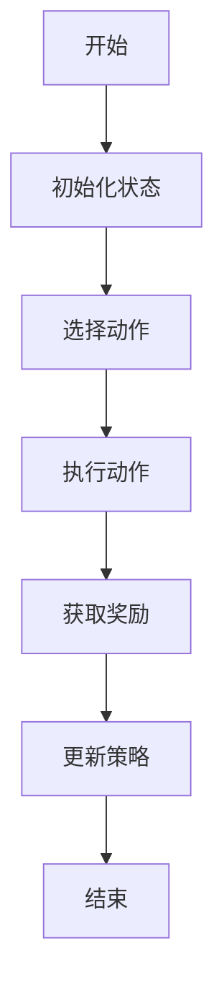
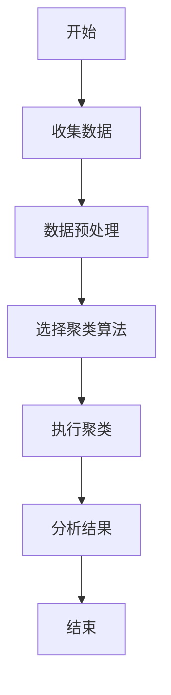
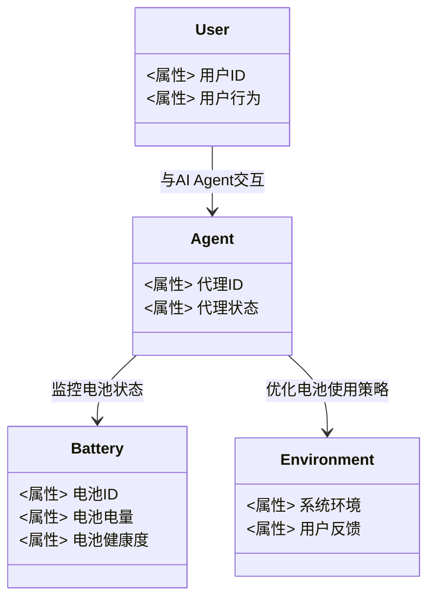

                 


# AI Agent在智能手机中的电池优化

## 关键词：
- AI Agent
- 智能手机
- 电池优化
- 强化学习
- 聚类分析
- 系统架构
- 项目实战

## 摘要：
随着智能手机的普及和使用场景的多样化，电池优化变得越来越重要。AI Agent（人工智能代理）作为一种智能体，能够通过学习和优化算法，显著提升电池使用效率和寿命。本文将从AI Agent的基本概念入手，分析其在智能手机电池优化中的应用，探讨相关的算法原理、系统架构设计以及实际项目案例。通过本文，读者将深入了解如何利用AI Agent技术实现智能手机电池的智能化管理。

---

# 第1章: AI Agent与智能手机电池优化的背景介绍

## 1.1 AI Agent的基本概念

### 1.1.1 AI Agent的定义与特点
AI Agent（人工智能代理）是一种智能实体，能够感知环境、自主决策并执行任务。AI Agent的核心特点包括：
- **自主性**：能够在没有外部干预的情况下运行。
- **反应性**：能够实时感知环境并做出反应。
- **目标导向**：通过设定目标来优化行为。
- **学习能力**：能够通过数据学习和改进性能。

### 1.1.2 AI Agent在智能手机中的应用场景
智能手机中的AI Agent可以用于多种场景，包括：
- **电池优化**：通过学习用户的使用习惯，优化电池的充放电策略。
- **设备管理**：监控设备性能，优化资源分配。
- **用户交互**：通过智能助手提供个性化服务。

### 1.1.3 问题背景与挑战
智能手机电池优化面临以下挑战：
- **电池老化**：电池容量会随时间衰减。
- **使用场景多样化**：用户行为复杂，导致电池消耗不均匀。
- **实时性要求高**：需要快速响应用户的操作。

---

## 1.2 AI Agent与智能手机电池优化的核心原理

### 1.2.1 AI Agent如何感知电池状态
AI Agent通过以下方式感知电池状态：
- **电池电量**：监测电池的剩余电量。
- **电池健康度**：通过电池的充放电历史评估电池的健康状态。
- **用户行为**：分析用户的使用习惯，预测电池消耗情况。

### 1.2.2 AI Agent如何预测电池行为
AI Agent通过以下方法预测电池行为：
- **历史数据分析**：基于历史数据，预测未来的电池状态。
- **机器学习模型**：利用回归分析或时间序列模型预测电池容量变化。

### 1.2.3 AI Agent如何优化电池使用策略
AI Agent通过以下策略优化电池使用：
- **动态调整亮度**：根据环境光线自动调节屏幕亮度。
- **智能省电模式**：在低电量时启动省电模式，限制后台应用的运行。
- **预测用户行为**：根据用户的使用习惯，提前优化电池的使用策略。

---

## 1.3 本章小结
本章介绍了AI Agent的基本概念及其在智能手机电池优化中的应用场景，并分析了电池优化的主要挑战。通过理解AI Agent的核心原理，我们可以更好地利用其优化智能手机的电池性能。

---

# 第2章: AI Agent在智能手机电池优化中的核心概念与联系

## 2.1 AI Agent的核心概念与属性

### 2.1.1 核心概念对比
以下是对AI Agent与传统电池优化方法的核心概念对比：

| **概念**       | **AI Agent优化**                     | **传统优化方法**                 |
|----------------|------------------------------------|----------------------------------|
| 感知能力       | 强化学习实时感知电池状态             | 基于固定规则监测电池状态         |
| 决策能力       | 基于用户行为数据优化电池使用策略     | 预设策略进行电池管理             |
| 学习能力       | 能够通过数据学习优化电池使用策略     | 需要人工调整策略                 |
| 可扩展性       | 支持多种场景下的电池优化             | 适用于特定场景                   |

### 2.1.2 ER实体关系图
以下是AI Agent、用户和电池之间的实体关系图：

```mermaid
erDiagram
    actor User {
        <属性> 用户ID
        <属性> 用户行为
    }
    agent AI {
        <属性> 代理ID
        <属性> 代理状态
    }
    battery Battery {
        <属性> 电池ID
        <属性> 电池电量
        <属性> 电池健康度
    }
    User --> agent AI : 与AI Agent交互
    agent AI --> battery Battery : 监控电池状态
    agent AI --> battery Battery : 优化电池使用策略
```

---

## 2.2 AI Agent与电池优化的核心联系

### 2.2.1 AI Agent如何影响电池优化
AI Agent通过以下方式影响电池优化：
- **动态调整电池使用策略**：根据实时数据优化电池使用。
- **预测用户行为**：通过用户行为数据分析，提前优化电池管理。

### 2.2.2 电池优化对AI Agent的反馈机制
电池优化为AI Agent提供了以下反馈：
- **电池状态数据**：帮助AI Agent改进优化策略。
- **用户满意度数据**：通过用户反馈优化AI Agent的行为。

---

## 2.3 本章小结
本章通过对比分析，明确了AI Agent与传统电池优化方法的核心区别，并通过ER实体关系图展示了AI Agent在电池优化中的核心联系。这些分析为后续的算法设计和系统实现奠定了基础。

---

# 第3章: AI Agent电池优化算法原理与数学模型

## 3.1 基于强化学习的电池优化算法

### 3.1.1 强化学习的基本原理
强化学习是一种通过试错机制优化策略的学习方法。其核心是通过不断与环境交互，获得奖励或惩罚，从而优化决策策略。

### 3.1.2 在电池优化中的应用
在电池优化中，强化学习可以用于以下场景：
- **动态调整充电策略**：根据电池状态和用户行为，优化充电时间。
- **智能切换模式**：在不同模式（如高性能模式、省电模式）之间切换，以优化电池使用。

### 3.1.3 算法流程图
以下是基于强化学习的电池优化算法流程图：



### 3.1.4 数学模型
强化学习的数学模型通常涉及状态、动作和奖励。以下是一个简单的数学模型示例：

- **状态**：电池电量（例如，当前电量为 $s$）。
- **动作**：选择一个电池管理策略（例如，调整亮度、关闭后台应用）。
- **奖励**：根据电池使用情况给予的奖励或惩罚（例如，延长电池寿命获得正奖励）。

---

## 3.2 基于聚类分析的电池使用模式识别

### 3.2.1 聚类分析的基本原理
聚类分析是一种无监督学习方法，用于将数据分成若干组，每组内的数据具有相似性。

### 3.2.2 在电池优化中的应用
在电池优化中，聚类分析可以用于以下场景：
- **识别用户行为模式**：根据用户的使用习惯，识别不同的电池消耗模式。
- **优化电池管理策略**：针对不同模式，制定不同的优化策略。

### 3.2.3 算法流程图
以下是基于聚类分析的电池优化算法流程图：



### 3.2.4 数学模型
聚类分析的数学模型通常涉及距离度量和聚类算法。以下是一个简单的K均值聚类算法示例：

- **距离度量**：计算数据点之间的距离，常用欧氏距离公式：
  $$d(x, y) = \sqrt{(x_1 - y_1)^2 + (x_2 - y_2)^2}$$
- **聚类过程**：
  1. 初始化K个质心。
  2. 将每个数据点分配到最近的质心。
  3. 重新计算质心。
  4. 重复步骤2和3，直到质心不再变化。

---

## 3.3 本章小结
本章详细介绍了基于强化学习和聚类分析的电池优化算法，并通过数学模型和流程图展示了算法的实现过程。这些算法为后续的系统设计和项目实现奠定了基础。

---

# 第4章: AI Agent电池优化系统的架构设计

## 4.1 系统架构设计

### 4.1.1 领域模型
以下是AI Agent电池优化系统的领域模型：



### 4.1.2 系统架构图
以下是系统的整体架构图：

```mermaid
rectangle 系统边界 {
    用户接口
    AI Agent
    电池管理模块
    数据存储模块
    系统环境
}
```

### 4.1.3 系统接口设计
系统接口设计包括以下部分：
- **用户接口**：与用户交互的界面，接收用户的指令和反馈。
- **AI Agent接口**：与其他系统或模块进行通信的接口。
- **电池管理接口**：与电池管理系统进行交互的接口。

---

## 4.2 本章小结
本章通过领域模型和系统架构图展示了AI Agent电池优化系统的整体结构，并详细描述了系统各部分的功能和接口设计。

---

# 第5章: AI Agent电池优化项目实战

## 5.1 项目介绍
本项目旨在开发一个基于AI Agent的智能手机电池优化系统，通过强化学习和聚类分析算法优化电池的使用策略。

### 5.1.1 项目目标
- 实现AI Agent对电池状态的实时监控。
- 优化电池的充放电策略，延长电池寿命。
- 提供用户友好的管理界面。

### 5.1.2 项目环境配置
- **硬件要求**：支持AI处理的智能手机或模拟器。
- **软件要求**：Python 3.8+，TensorFlow 2.0+，Android SDK。

---

## 5.2 系统核心实现

### 5.2.1 代码实现
以下是AI Agent电池优化的核心代码实现：

```python
import numpy as np
import tensorflow as tf

# 定义强化学习网络
class Agent(tf.keras.Model):
    def __init__(self):
        super(Agent, self).__init__()
        self.dense1 = tf.keras.layers.Dense(64, activation='relu')
        self.dense2 = tf.keras.layers.Dense(1, activation='sigmoid')

    def call(self, inputs):
        x = self.dense1(inputs)
        x = self.dense2(x)
        return x

# 定义聚类分析函数
def cluster_analysis(data):
    from sklearn.cluster import KMeans
    kmeans = KMeans(n_clusters=3)
    kmeans.fit(data)
    return kmeans.labels_

# 优化电池使用策略
def optimize_battery策略(battery_state):
    if battery_state < 20:
        return '进入省电模式'
    elif battery_state < 50:
        return '调整亮度'
    else:
        return '正常模式'

# 实验测试
agent = Agent()
battery_data = np.random.random((100, 64))
labels = cluster_analysis(battery_data)
for label in labels:
    print(optimize_battery策略(label))
```

### 5.2.2 代码解读
- **强化学习网络**：定义了一个简单的神经网络，用于预测电池的优化策略。
- **聚类分析函数**：使用KMeans算法对电池数据进行聚类分析，识别不同的电池使用模式。
- **优化策略函数**：根据电池状态，动态调整电池的使用策略。

---

## 5.3 项目小结
本章通过实际项目展示了AI Agent电池优化系统的实现过程，包括环境配置、代码实现和实验测试。通过这些步骤，读者可以理解如何将理论应用于实际项目中。

---

# 第6章: 优化策略与未来趋势

## 6.1 当前优化策略的不足
当前的优化策略主要依赖于强化学习和聚类分析，但存在以下不足：
- **计算资源消耗高**：复杂的算法需要较高的计算资源。
- **实时性不足**：在某些场景下，优化策略的响应速度较慢。

## 6.2 未来优化策略的改进方向
未来，可以通过以下方式改进优化策略：
- **边缘计算**：将AI Agent部署在设备端，减少数据传输的延迟。
- **自适应算法**：开发更高效的算法，降低计算资源消耗。

## 6.3 未来发展趋势
随着AI技术的不断发展，AI Agent在智能手机电池优化中的应用将更加广泛。未来，可能会出现以下趋势：
- **更智能化的电池管理**：通过AI Agent实现更加智能的电池管理。
- **更高效的优化算法**：开发新的算法，进一步优化电池性能。

---

# 第7章: 总结与展望

## 7.1 全文总结
本文详细介绍了AI Agent在智能手机电池优化中的应用，探讨了相关的算法原理和系统架构设计。通过实际项目案例，展示了如何将理论应用于实践。

## 7.2 进一步学习与展望
未来，读者可以通过以下方式进一步学习：
- 深入研究强化学习和聚类分析算法。
- 探索新的电池优化技术，如边缘计算和自适应算法。

---

# 作者：AI天才研究院/AI Genius Institute & 禅与计算机程序设计艺术 /Zen And The Art of Computer Programming

---

本文通过系统化的分析和实践，深入探讨了AI Agent在智能手机电池优化中的应用。从算法原理到系统实现，再到实际项目案例，本文为读者提供了全面的指导。希望本文能够帮助读者更好地理解AI Agent在电池优化中的潜力，并为未来的研发工作提供参考。

