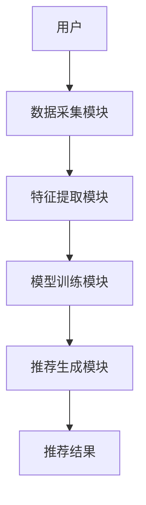
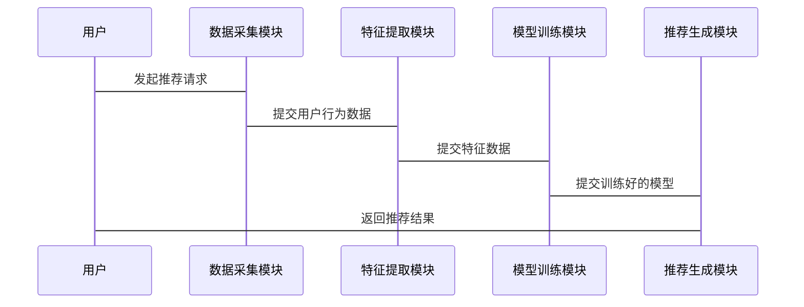

                 


# AI Agent在智能电子商务推荐中的角色

## 关键词：AI Agent, 智能推荐系统, 电子商务, 机器学习, 深度学习, 自然语言处理

## 摘要

随着电子商务的快速发展，智能推荐系统已成为提升用户体验的重要手段。AI Agent作为智能推荐系统的核心技术，通过自然语言处理、机器学习和深度学习等技术，能够实现精准的个性化推荐。本文将从AI Agent的基本概念、推荐系统的算法原理、系统架构设计以及项目实战等方面，详细探讨AI Agent在智能电子商务推荐中的角色，帮助读者深入了解其工作原理和实际应用。

---

# 第1章: AI Agent与智能电子商务推荐概述

## 1.1 AI Agent的基本概念

### 1.1.1 AI Agent的定义

AI Agent（人工智能代理）是指能够感知环境、自主决策并执行任务的智能实体。在电子商务推荐系统中，AI Agent通常以软件形式存在，通过分析用户行为、商品属性和市场趋势，为用户提供个性化推荐。

### 1.1.2 AI Agent的核心特征

AI Agent的核心特征包括：

1. **自主性**：能够在无需人工干预的情况下自主运行。
2. **反应性**：能够实时感知环境变化并做出反应。
3. **学习能力**：通过机器学习不断优化推荐策略。
4. **协作性**：能够与其他系统或AI Agent协同工作。

### 1.1.3 AI Agent与传统推荐系统的主要区别

传统推荐系统通常基于规则或统计模型，而AI Agent结合了机器学习和自然语言处理技术，能够实现更智能、更个性化的推荐。

---

## 1.2 智能电子商务推荐的背景与现状

### 1.2.1 电子商务推荐的发展历程

电子商务推荐系统经历了从简单的基于规则的推荐到复杂的深度学习推荐的过程。早期的推荐系统主要基于协同过滤算法，近年来，随着AI技术的发展，深度学习逐渐成为主流。

### 1.2.2 当前智能推荐系统的主要技术手段

当前智能推荐系统的主要技术手段包括：

1. **协同过滤**：基于用户行为数据进行推荐。
2. **内容推荐**：基于商品属性进行推荐。
3. **混合推荐**：结合协同过滤和内容推荐的优势。

### 1.2.3 AI Agent在推荐系统中的独特优势

AI Agent能够通过自然语言处理技术理解用户需求，结合深度学习算法实时优化推荐策略，从而实现更精准的推荐。

---

## 1.3 本章小结

本章介绍了AI Agent的基本概念、核心特征以及与传统推荐系统的主要区别。同时，分析了智能电子商务推荐的发展历程和当前主要技术手段，突出了AI Agent的独特优势。

---

# 第2章: AI Agent的核心概念与技术原理

## 2.1 AI Agent的基本原理

### 2.1.1 AI Agent的工作流程

AI Agent在推荐系统中的工作流程包括以下几个步骤：

1. **数据采集**：采集用户行为数据、商品属性数据等。
2. **特征提取**：从数据中提取有用的特征。
3. **模型训练**：基于特征训练推荐模型。
4. **推荐生成**：根据模型生成推荐结果。

### 2.1.2 AI Agent的核心技术特点

AI Agent的核心技术特点包括：

1. **实时性**：能够实时响应用户请求。
2. **个性化**：能够根据用户需求生成个性化推荐。
3. **可扩展性**：能够处理大规模数据。

---

## 2.2 AI Agent与推荐系统的联系

### 2.2.1 AI Agent在推荐系统中的角色定位

AI Agent在推荐系统中扮演的角色包括：

1. **数据处理**：负责数据的采集和预处理。
2. **模型训练**：负责模型的训练和优化。
3. **结果生成**：负责生成最终的推荐结果。

### 2.2.2 AI Agent与推荐算法的结合方式

AI Agent可以结合多种推荐算法，包括协同过滤、内容推荐和深度学习推荐。

---

## 2.3 AI Agent的核心技术分析

### 2.3.1 自然语言处理技术

自然语言处理技术用于理解用户需求和商品描述，例如使用词嵌入技术（如Word2Vec）将文本数据转换为向量表示。

### 2.3.2 机器学习算法

机器学习算法用于训练推荐模型，例如使用协同过滤算法（如基于用户的协同过滤和基于物品的协同过滤）。

### 2.3.3 智能决策机制

智能决策机制用于优化推荐结果，例如使用强化学习算法优化推荐策略。

---

## 2.4 本章小结

本章详细讲解了AI Agent的基本原理、核心技术特点以及与推荐系统的联系。同时，分析了AI Agent的核心技术，包括自然语言处理、机器学习和智能决策机制。

---

# 第3章: 推荐系统的算法原理

## 3.1 协同过滤算法

### 3.1.1 基于用户的协同过滤

基于用户的协同过滤算法通过寻找与目标用户行为相似的其他用户，将这些用户喜欢的商品推荐给目标用户。

公式：$$ \hat{r}_{u,i} = \bar{r}_u + \sum_{k=1}^{K} c_{u,i,k}(r_{u,k} - \bar{r}_u) $$

其中，$\hat{r}_{u,i}$表示用户u对商品i的预测评分，$\bar{r}_u$表示用户u的平均评分，$c_{u,i,k}$表示用户u和用户k的相似性，$r_{u,k}$表示用户k对商品i的评分。

### 3.1.2 基于物品的协同过滤

基于物品的协同过滤算法通过寻找与目标商品相似的其他商品，将这些商品推荐给用户。

公式：$$ \hat{r}_{u,i} = \bar{r}_i + \sum_{k=1}^{K} c_{u,i,k}(r_{u,k} - \bar{r}_i) $$

其中，$\hat{r}_{u,i}$表示用户u对商品i的预测评分，$\bar{r}_i$表示商品i的平均评分，$c_{u,i,k}$表示商品i和商品k的相似性，$r_{u,k}$表示用户u对商品k的评分。

---

## 3.2 基于内容的推荐算法

### 3.2.1 基于商品属性的推荐

基于商品属性的推荐算法通过分析商品的属性特征，将与目标商品相似的商品推荐给用户。

### 3.2.2 基于用户偏好的推荐

基于用户偏好的推荐算法通过分析用户的偏好特征，将符合用户兴趣的商品推荐给用户。

---

## 3.3 混合推荐算法

### 3.3.1 协同过滤与内容推荐的结合

混合推荐算法结合了协同过滤和内容推荐的优点，通过集成两种算法生成最终的推荐结果。

### 3.3.2 基于深度学习的混合推荐

基于深度学习的混合推荐算法通过深度神经网络模型整合多种推荐算法，生成更精准的推荐结果。

---

## 3.4 AI Agent在推荐算法中的优化作用

### 3.4.1 AI Agent如何提升推荐系统的准确率

AI Agent通过优化推荐算法的参数和模型结构，提升推荐系统的准确率。

### 3.4.2 AI Agent如何优化推荐系统的实时性

AI Agent通过并行计算和分布式处理优化推荐系统的实时性。

---

## 3.5 本章小结

本章详细讲解了推荐系统的算法原理，包括协同过滤、内容推荐和混合推荐。同时，分析了AI Agent在推荐算法中的优化作用，包括提升准确率和优化实时性。

---

# 第4章: 推荐系统的数学模型与公式

## 4.1 协同过滤的数学模型

### 4.1.1 基于用户的协同过滤公式

$$ \hat{r}_{u,i} = \bar{r}_u + \sum_{k=1}^{K} c_{u,i,k}(r_{u,k} - \bar{r}_u) $$

其中，$\hat{r}_{u,i}$表示用户u对商品i的预测评分，$\bar{r}_u$表示用户u的平均评分，$c_{u,i,k}$表示用户u和用户k的相似性，$r_{u,k}$表示用户k对商品i的评分。

### 4.1.2 基于物品的协同过滤公式

$$ \hat{r}_{u,i} = \bar{r}_i + \sum_{k=1}^{K} c_{u,i,k}(r_{u,k} - \bar{r}_i) $$

其中，$\hat{r}_{u,i}$表示用户u对商品i的预测评分，$\bar{r}_i$表示商品i的平均评分，$c_{u,i,k}$表示商品i和商品k的相似性，$r_{u,k}$表示用户u对商品k的评分。

---

## 4.2 基于矩阵分解的推荐模型

### 4.2.1 矩阵分解的数学模型

推荐系统可以通过矩阵分解技术将用户-商品评分矩阵分解为用户特征矩阵和商品特征矩阵。

公式：$$ R = P \times Q $$

其中，$R$表示用户-商品评分矩阵，$P$表示用户特征矩阵，$Q$表示商品特征矩阵。

### 4.2.2 矩阵分解的优化目标

矩阵分解的优化目标是通过最小化平方损失函数来优化模型参数。

公式：$$ \min_{P,Q} \sum_{u,i} (r_{u,i} - (P_u \times Q_i))^2 $$

其中，$P_u$表示用户u的特征向量，$Q_i$表示商品i的特征向量，$r_{u,i}$表示用户u对商品i的实际评分。

---

## 4.3 深度学习推荐模型

### 4.3.1 基于神经网络的推荐模型

深度学习推荐模型通过神经网络结构学习用户和商品的特征表示。

公式：$$ y = f(x_u, x_i) $$

其中，$y$表示推荐结果，$x_u$表示用户u的特征，$x_i$表示商品i的特征，$f$表示神经网络模型。

---

## 4.4 本章小结

本章详细讲解了推荐系统的数学模型与公式，包括协同过滤、矩阵分解和深度学习推荐模型。通过这些模型的分析，读者可以更好地理解AI Agent在推荐系统中的工作原理。

---

# 第5章: 系统分析与架构设计方案

## 5.1 问题场景介绍

在电子商务推荐系统中，用户通常会浏览商品、收藏商品、下单购买商品等行为。AI Agent通过分析这些行为数据，生成个性化的推荐结果。

---

## 5.2 项目介绍

本项目旨在开发一个基于AI Agent的智能电子商务推荐系统，通过自然语言处理、机器学习和深度学习技术实现精准的个性化推荐。

---

## 5.3 系统功能设计

### 5.3.1 数据采集模块

数据采集模块负责采集用户行为数据和商品属性数据。

### 5.3.2 特征提取模块

特征提取模块负责从数据中提取有用的特征，例如用户行为特征和商品属性特征。

### 5.3.3 模型训练模块

模型训练模块负责训练推荐模型，例如协同过滤模型和深度学习模型。

### 5.3.4 推荐生成模块

推荐生成模块负责生成最终的推荐结果。

---

## 5.4 系统架构设计

### 5.4.1 系统架构图



### 5.4.2 关键模块交互流程

1. 用户发起推荐请求。
2. 数据采集模块采集用户行为数据。
3. 特征提取模块提取用户行为特征。
4. 模型训练模块训练推荐模型。
5. 推荐生成模块生成推荐结果。
6. 推荐结果返回用户。

---

## 5.5 系统接口设计

### 5.5.1 用户接口

用户接口负责接收用户的推荐请求并返回推荐结果。

### 5.5.2 系统接口

系统接口负责与外部系统（例如数据库和第三方服务）进行交互。

---

## 5.6 系统交互流程

### 5.6.1 交互流程图



---

## 5.7 本章小结

本章详细讲解了系统分析与架构设计方案，包括问题场景介绍、项目介绍、系统功能设计和系统架构设计。通过这些设计，读者可以更好地理解AI Agent在推荐系统中的实际应用。

---

# 第6章: 项目实战

## 6.1 环境安装

### 6.1.1 安装Python

需要安装Python 3.6及以上版本。

### 6.1.2 安装依赖库

安装以下依赖库：

- `numpy`：用于数值计算。
- `pandas`：用于数据处理。
- `scikit-learn`：用于机器学习算法。
- `tensorflow`：用于深度学习算法。

安装命令：

```bash
pip install numpy pandas scikit-learn tensorflow
```

---

## 6.2 核心代码实现

### 6.2.1 数据预处理代码

```python
import pandas as pd
from sklearn.model_selection import train_test_split
from sklearn.metrics import mean_squared_error
import numpy as np

# 数据加载
data = pd.read_csv('user_ratings.csv')

# 数据分割
train_data, test_data = train_test_split(data, test_size=0.2)
```

### 6.2.2 协同过滤算法实现

```python
from sklearn.metrics.pairwise import cosine_similarity

# 计算用户相似性矩阵
user_similarity = cosine_similarity(train_data)

# 基于用户的协同过滤推荐
def user_based_recommender(user_id, train_data, user_similarity, k=5):
    # 获取目标用户的索引
    target_user_index = train_data.index[train_data['user_id'] == user_id].tolist()[0]
    # 找出与目标用户相似性最高的k个用户
    similar_users = [i for i in range(len(user_similarity[target_user_index])) if i != target_user_index]
    similar_users.sort(key=lambda x: user_similarity[target_user_index][x], reverse=True)
    similar_users = similar_users[:k]
    # 计算推荐评分
   推荐评分公式：
    $$ \hat{r}_{u,i} = \bar{r}_u + \sum_{k=1}^{K} c_{u,i,k}(r_{u,k} - \bar{r}_u) $$

其中，$\hat{r}_{u,i}$表示用户u对商品i的预测评分，$\bar{r}_u$表示用户u的平均评分，$c_{u,i,k}$表示用户u和用户k的相似性，$r_{u,k}$表示用户k对商品i的评分。

---

## 6.3 代码解读与分析

### 6.3.1 数据预处理代码解读

数据预处理代码用于加载数据和分割数据，分为训练集和测试集。

### 6.3.2 协同过滤算法实现解读

协同过滤算法通过计算用户相似性矩阵，找出与目标用户相似性最高的k个用户，然后基于这些用户的评分生成推荐结果。

---

## 6.4 实际案例分析

### 6.4.1 案例背景

假设我们有一个电子商务平台，用户数据存储在`user_ratings.csv`文件中，包含用户ID、商品ID和评分。

### 6.4.2 数据预处理

加载数据并分割为训练集和测试集。

### 6.4.3 模型训练

训练协同过滤模型，计算用户相似性矩阵。

### 6.4.4 模型预测

基于训练好的模型生成推荐结果。

### 6.4.5 模型评估

评估推荐系统的准确率和召回率。

---

## 6.5 项目小结

本章通过实际案例分析，详细讲解了AI Agent在智能电子商务推荐系统中的应用。从环境安装、核心代码实现到模型训练和评估，读者可以逐步掌握AI Agent的实现过程。

---

# 第7章: 总结与展望

## 7.1 总结

本文详细讲解了AI Agent在智能电子商务推荐中的角色，包括基本概念、算法原理、系统架构设计和项目实战。通过这些内容，读者可以全面了解AI Agent在推荐系统中的应用。

---

## 7.2 展望

随着AI技术的不断发展，AI Agent在智能推荐系统中的应用将更加广泛。未来的研究方向包括：

1. **多模态推荐**：结合文本、图像等多种数据源进行推荐。
2. **实时推荐**：实现更快速的推荐响应。
3. **个性化推荐**：进一步提升推荐的个性化和精准度。

---

# 作者：AI天才研究院/AI Genius Institute & 禅与计算机程序设计艺术 /Zen And The Art of Computer Programming

