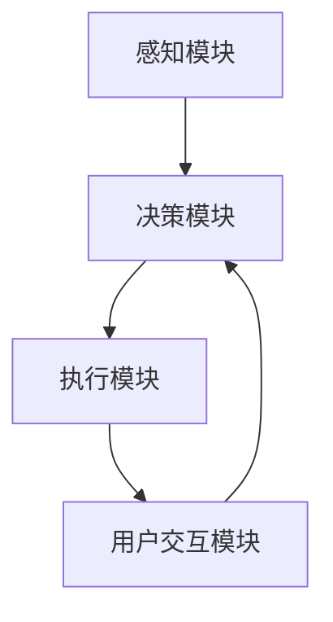

                 


# AI Agent在智能窗台中的室内植物照料

> 关键词：AI Agent, 智能窗台, 室内植物, 智能家居, 物联网, 人工智能, 室内环境监测

> 摘要：本文探讨了AI Agent在智能窗台中的应用，特别是在室内植物照料方面的创新与实践。通过分析AI Agent的核心概念、算法原理、系统架构以及实际案例，展示了如何利用AI技术实现室内植物的智能化管理。文章从背景介绍到项目实战，逐步解析了AI Agent在智能窗台中的技术实现与应用价值。

---

# 第一部分: AI Agent与智能窗台的背景与概念

## 第1章: AI Agent与智能窗台概述

### 1.1 AI Agent的基本概念
#### 1.1.1 AI Agent的定义与特点
AI Agent（人工智能代理）是指能够感知环境、自主决策并执行任务的智能实体。其核心特点包括：
- **自主性**：无需外部干预，自主完成任务。
- **反应性**：能够实时感知环境变化并做出反应。
- **目标导向**：基于目标驱动行为。
- **学习能力**：通过数据积累和机器学习优化性能。

#### 1.1.2 AI Agent的核心功能与应用场景
AI Agent在室内植物照料中的核心功能包括：
- **环境感知**：通过传感器实时监测光照、温度、湿度等环境参数。
- **健康诊断**：基于传感器数据和历史数据，分析植物健康状态。
- **智能决策**：根据诊断结果，制定浇水、施肥、光照调节等干预策略。
- **执行控制**：通过执行机构（如自动喷水系统）实现环境调节。

#### 1.1.3 智能窗台的定义与特征
智能窗台是指集成AI Agent、物联网设备和自动化控制系统的窗台装置，用于实现室内植物的智能化照料。其主要特征包括：
- **智能化**：通过AI算法实现植物照料的自动化。
- **数据驱动**：依赖传感器数据和历史数据进行决策。
- **人机交互**：用户可通过手机APP或语音助手与系统交互。

### 1.2 AI Agent在室内植物照料中的应用背景
#### 1.2.1 室内植物照料的现状与挑战
- **人工依赖**：传统植物照料依赖人工经验，效率低且不精准。
- **环境复杂**：室内环境复杂多变，植物需求多样。
- **数据孤岛**：不同设备的数据难以协同，难以形成闭环。

#### 1.2.2 AI Agent在植物照料中的优势
- **数据驱动**：通过传感器实时采集环境数据，结合历史数据进行分析。
- **精准决策**：基于机器学习模型，实现精准的植物健康诊断和环境调节。
- **自动化控制**：通过自动化设备实现环境调节，降低人工干预。

#### 1.2.3 智能窗台的生态意义与社会价值
- **生态意义**：通过智能化管理，优化植物生长环境，提高植物健康。
- **社会价值**：提升居民生活品质，降低资源浪费，推动智能家居发展。

---

## 第2章: 室内植物照料的核心问题与AI Agent的解决方案

### 2.1 室内植物照料的核心问题
#### 2.1.1 植物生长的环境需求分析
- **光照需求**：不同植物对光照强度和时长的需求不同。
- **温度需求**：植物生长需要适宜的温度范围。
- **湿度需求**：植物对空气湿度和土壤湿度的要求各异。

#### 2.1.2 光照、温度、湿度等环境因素的监测与调节
- **监测**：通过光敏传感器、温度传感器、湿度传感器等实时采集环境数据。
- **调节**：通过自动遮阳帘、加热器、加湿器等设备调节环境参数。

#### 2.1.3 植物健康状态的实时评估与反馈
- **健康评估**：通过图像识别技术分析植物叶片颜色、形状等特征，判断植物健康状态。
- **反馈优化**：根据健康评估结果，动态调整环境参数。

### 2.2 AI Agent在植物照料中的问题解决路径
#### 2.2.1 数据采集与分析的智能化
- **多传感器融合**：通过多种传感器协同工作，提高数据准确性。
- **数据预处理**：对采集到的原始数据进行去噪、归一化等处理。
- **特征提取**：从数据中提取有助于植物健康诊断的关键特征。

#### 2.2.2 AI算法在植物健康诊断中的应用
- **监督学习**：利用标记数据训练分类模型，识别植物病害。
- **无监督学习**：通过聚类分析，发现异常数据模式。
- **强化学习**：通过与环境的交互，优化决策策略。

#### 2.2.3 自动化调节与干预的实现
- **执行机构控制**：通过AI Agent控制执行机构（如喷水系统、遮阳帘）实现环境调节。
- **闭环反馈**：根据环境变化实时调整干预策略。

### 2.3 AI Agent与智能窗台的系统架构
#### 2.3.1 系统核心功能模块划分
- **感知层**：负责环境数据的采集。
- **决策层**：基于数据进行分析和决策。
- **执行层**：根据决策结果执行环境调节。

#### 2.3.2 系统边界与外延
- **系统输入**：环境数据、用户指令。
- **系统输出**：环境调节指令、植物健康报告。

#### 2.3.3 核心要素与组成关系
- **核心要素**：传感器、执行机构、AI算法、用户界面。
- **组成关系**：传感器采集数据，AI算法分析数据并生成决策，执行机构执行决策，用户通过界面与系统交互。

---

# 第二部分: AI Agent的核心概念与原理

## 第3章: AI Agent的核心概念与原理

### 3.1 AI Agent的核心原理
#### 3.1.1 感知与数据采集
- **多传感器融合**：通过多种传感器协同工作，提高感知能力。
- **数据预处理**：对采集到的环境数据进行去噪、归一化处理。

#### 3.1.2 数据分析与决策
- **机器学习算法**：利用监督学习、无监督学习等算法进行数据分析。
- **决策模型**：基于分析结果生成环境调节指令。

#### 3.1.3 行为执行与反馈
- **执行机构控制**：通过指令控制执行机构实现环境调节。
- **反馈机制**：根据环境变化调整决策策略。

### 3.2 AI Agent的感知系统
#### 3.2.1 多传感器融合技术
- **传感器类型**：光敏传感器、温度传感器、湿度传感器、图像传感器。
- **数据融合方法**：基于加权平均、卡尔曼滤波等方法融合多源数据。

#### 3.2.2 数据采集与预处理
- **数据采集流程**：传感器采集数据 → 数据传输 → 数据存储。
- **数据预处理**：去噪、归一化、特征提取。

#### 3.2.3 环境特征提取与识别
- **特征提取**：从原始数据中提取有助于分类的关键特征。
- **环境识别**：通过机器学习模型识别当前环境状态。

### 3.3 AI Agent的决策系统
#### 3.3.1 机器学习算法在决策中的应用
- **监督学习**：利用标记数据训练分类模型，识别植物健康状态。
- **无监督学习**：通过聚类分析发现数据中的潜在模式。

#### 3.3.2 基于规则的决策系统
- **规则定义**：根据植物生长需求制定环境调节规则。
- **规则执行**：根据当前环境状态匹配规则，生成调节指令。

#### 3.3.3 多目标优化的决策机制
- **目标函数**：最大化植物健康指数，最小化资源消耗。
- **优化方法**：利用遗传算法、模拟退火等优化算法寻找最优解。

---

## 第4章: AI Agent的核心算法与数学模型

### 4.1 算法原理
#### 4.1.1 基于监督学习的植物健康诊断
- **数据集**：植物叶片图像，标注健康状态。
- **算法选择**：卷积神经网络（CNN）。
- **训练流程**：
  1. 数据预处理：图像 resize、归一化。
  2. 模型训练：在标注数据上训练CNN模型。
  3. 模型评估：通过准确率、召回率等指标评估模型性能。

#### 4.1.2 基于强化学习的环境调节策略
- **状态空间**：环境参数（光照、温度、湿度）。
- **动作空间**：调节动作（打开喷水系统、关闭加热器等）。
- **奖励机制**：根据植物健康状态给予奖励。

#### 4.1.3 基于无监督学习的异常检测
- **算法选择**：Isolation Forest、K-Means。
- **应用场景**：检测环境数据中的异常值。

### 4.2 算法实现
#### 4.2.1 CNN模型实现
```python
import tensorflow as tf
from tensorflow.keras import layers

model = tf.keras.Sequential([
    layers.Conv2D(32, (3,3), activation='relu', input_shape=(64, 64, 3)),
    layers.MaxPooling2D((2,2)),
    layers.Conv2D(64, (3,3), activation='relu'),
    layers.MaxPooling2D((2,2)),
    layers.Flatten(),
    layers.Dense(64, activation='relu'),
    layers.Dense(2, activation='softmax')
])

model.compile(optimizer='adam', loss='sparse_categorical_crossentropy', metrics=['accuracy'])
model.fit(x_train, y_train, epochs=10, batch_size=32)
```

#### 4.2.2 强化学习算法实现
```python
import numpy as np
from collections import deque

class DQN:
    def __init__(self, state_space, action_space):
        self.state_space = state_space
        self.action_space = action_space
        self.memory = deque(maxlen=1000)
        self.gamma = 0.99
        self.epsilon = 1.0
        self.model = self._build_model()

    def _build_model(self):
        model = tf.keras.Sequential([
            layers.Dense(24, activation='relu', input_dim=self.state_space),
            layers.Dense(24, activation='relu'),
            layers.Dense(self.action_space, activation='linear')
        ])
        return model

    def remember(self, state, action, reward, next_state):
        self.memory.append((state, action, reward, next_state))

    def act(self, state):
        if np.random.random() < self.epsilon:
            return np.random.randint(self.action_space)
        return self.model.predict(state)[0]

    def replay(self, batch_size):
        minibatch = random.sample(self.memory, batch_size)
        states = np.array([t[0] for t in minibatch])
        actions = np.array([t[1] for t in minibatch])
        rewards = np.array([t[2] for t in minibatch])
        next_states = np.array([t[3] for t in minibatch])
        
        targets = self.model.predict(states)
        next_targets = self.model.predict(next_states)
        targets[range(batch_size), actions] = rewards + self.gamma * np.max(next_targets, axis=1)
        
        self.model.fit(states, targets, epochs=1, verbose=0)
```

### 4.3 算法分析
#### 4.3.1 CNN模型分析
- **优势**：适用于图像分类任务，能够从图像中提取高阶特征。
- **劣势**：需要大量标注数据，计算资源消耗较大。

#### 4.3.2 强化学习分析
- **优势**：能够处理复杂的环境调节问题，具有较强的通用性。
- **劣势**：训练时间较长，需要设计合理的奖励机制。

---

## 第5章: AI Agent的数学模型与公式推导

### 5.1 CNN模型的数学公式
#### 5.1.1 卷积层
$$
f(x) = \max(0, x \cdot w + b)
$$

#### 5.1.2 池化层
$$
y_i = \max(x_{i,j}, x_{i,j+1}, x_{i+1,j}, x_{i+1,j+1})
$$

#### 5.1.3 全连接层
$$
y = Wx + b
$$

### 5.2 强化学习模型的数学公式
#### 5.2.1 状态值函数
$$
V(s) = \max_a Q(s, a)
$$

#### 5.2.2 优势函数
$$
A(s, a) = Q(s, a) - V(s)
$$

#### 5.2.3 行为策略
$$
\pi(a|s) = \frac{\exp(A(s,a))}{\sum_a \exp(A(s,a))}
$$

---

## 第6章: 系统架构设计

### 6.1 系统架构
#### 6.1.1 系统模块划分
- **感知模块**：负责环境数据的采集。
- **决策模块**：负责数据分析与决策。
- **执行模块**：负责环境调节。
- **用户交互模块**：负责与用户交互。

#### 6.1.2 系统架构图


### 6.2 系统功能设计
#### 6.2.1 感知功能
- **环境数据采集**：采集光照、温度、湿度等数据。
- **数据预处理**：去噪、归一化。

#### 6.2.2 决策功能
- **数据分析**：利用机器学习模型分析环境数据。
- **决策生成**：根据分析结果生成环境调节指令。

#### 6.2.3 执行功能
- **环境调节**：根据决策结果调节环境参数。
- **反馈采集**：采集调节后的环境数据。

---

## 第7章: 项目实战

### 7.1 项目环境与工具
- **硬件**：Raspberry Pi、各类传感器、执行机构。
- **软件**：Python、TensorFlow、Keras、OpenCV。

### 7.2 核心代码实现
#### 7.2.1 数据采集与预处理
```python
import pandas as pd
import numpy as np

data = pd.read_csv('plant_data.csv')
data = data.dropna()
data = (data - data.mean()) / data.std()
```

#### 7.2.2 模型训练与评估
```python
model = tf.keras.Sequential([
    layers.Dense(64, activation='relu'),
    layers.Dense(2, activation='softmax')
])

model.compile(optimizer='adam', loss='sparse_categorical_crossentropy', metrics=['accuracy'])
model.fit(x_train, y_train, epochs=10, batch_size=32)
```

### 7.3 实际案例分析
#### 7.3.1 案例背景
- **植物种类**：绿萝。
- **环境条件**：光照强度 500lux，温度 25℃，湿度 60%。

#### 7.3.2 数据采集与分析
- **光照强度**：传感器采集到的光照数据。
- **温度与湿度**：传感器采集到的温度和湿度数据。
- **植物健康状态**：通过图像识别技术判断植物健康状态。

#### 7.3.3 调节策略
- **光照调节**：当光照不足时，打开补光灯。
- **温度调节**：当温度过低时，启动加热器。
- **湿度调节**：当湿度过低时，启动加湿器。

---

## 第8章: 总结与展望

### 8.1 总结
本文详细探讨了AI Agent在智能窗台中的室内植物照料的应用，从背景介绍到项目实战，逐步解析了AI Agent的核心概念、算法原理、系统架构以及实际案例。通过AI技术的应用，实现了室内植物的智能化管理，提升了植物照料的效率和精准度。

### 8.2 展望
未来，随着AI技术的不断发展，智能窗台的室内植物照料将更加智能化和个性化。可以通过引入更先进的机器学习算法、优化系统架构设计、提升用户体验等方式，进一步提升智能窗台的功能和性能。

---

## 第9章: 最佳实践 Tips

### 9.1 注意事项
- **数据质量**：确保传感器数据的准确性，避免数据偏差。
- **模型优化**：定期更新模型参数，提升模型性能。
- **系统维护**：定期检查硬件设备，确保系统正常运行。

### 9.2 小结
AI Agent在智能窗台中的应用为室内植物照料带来了全新的解决方案，通过智能化管理，实现了植物生长环境的精准调节，提升了植物健康和用户生活质量。

---

作者：AI天才研究院/AI Genius Institute & 禅与计算机程序设计艺术 /Zen And The Art of Computer Programming

