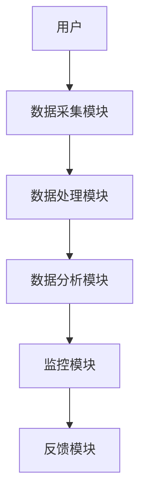
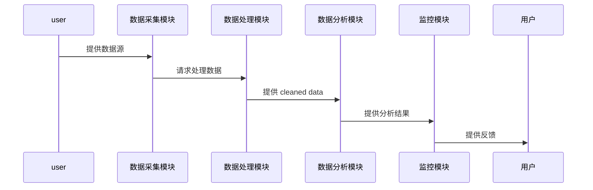
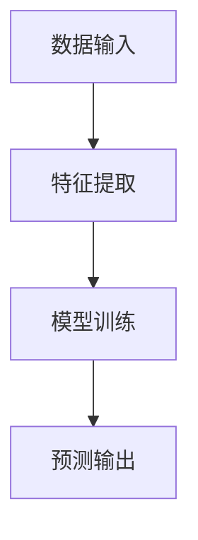
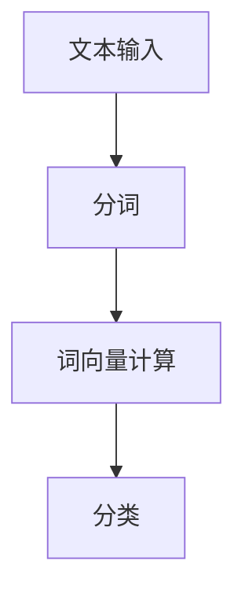

                 


# AI辅助企业并购后整合：业务流程优化与文化融合监控

## 关键词：企业并购、AI辅助、业务流程优化、文化融合、知识图谱

## 摘要：
在企业并购后整合过程中，业务流程优化和文化融合是两大核心挑战。本文通过分析AI技术在整合中的应用，探讨如何利用机器学习、自然语言处理和知识图谱等技术实现业务流程优化和文化融合监控。文章详细介绍了系统架构设计、核心算法实现和实际案例分析，为读者提供了一套完整的AI辅助整合解决方案。

---

# 第1章: 企业并购与整合的背景与挑战

## 1.1 企业并购的定义与意义
### 1.1.1 企业并购的基本概念
企业并购是指一家企业通过购买或合并另一家企业，以实现战略目标的过程。并购可以是全资收购、部分股权收购或资产收购。

### 1.1.2 并购的动机与目的
企业并购的主要动机包括：
- **市场扩张**：进入新市场或扩大市场份额。
- **资源获取**：获取技术、品牌、客户或销售渠道。
- **成本协同**：通过规模效应降低成本。
- **战略防御**：防止竞争对手收购关键资源。

### 1.1.3 并购对企业发展的影响
并购可能带来正面或负面影响，例如提升竞争力、优化资源分配，但也可能面临整合困难、文化冲突等问题。

## 1.2 企业整合的定义与类型
### 1.2.1 整合的定义
整合是指将两家或多家企业的资源、业务流程和文化进行融合，以实现协同效应的过程。

### 1.2.2 业务流程整合与文化整合的区分
- **业务流程整合**：优化跨企业的流程，消除冗余，提高效率。
- **文化整合**：融合两家企业的文化，确保员工认同新文化。

### 1.2.3 不同类型企业的整合策略
根据企业规模、行业和文化差异，整合策略可分为：
- **横向整合**：同一行业内的整合。
- **纵向整合**：上下游产业的整合。
- **混合整合**：跨行业或跨地区的整合。

## 1.3 AI辅助企业整合的必要性
### 1.3.1 传统整合方式的局限性
传统整合依赖人工分析，效率低、成本高，且难以处理复杂的数据和文化问题。

### 1.3.2 AI技术在整合中的潜在价值
AI可以通过数据分析、预测和自动化工具，提高整合效率和准确性。

### 1.3.3 当前市场对AI辅助整合的需求
随着企业并购的复杂性增加，市场对智能化整合工具的需求日益增长。

## 1.4 本章小结
企业并购和整合是企业发展的重要手段，但传统方式面临诸多挑战。AI技术的应用为整合提供了新的可能性。

---

# 第2章: AI辅助业务流程优化的核心概念

## 2.1 业务流程优化的定义与目标
### 2.1.1 业务流程优化的基本概念
业务流程优化是指通过分析和改进现有流程，以提高效率、降低成本。

### 2.1.2 优化的目标与关键指标
- **目标**：提高效率、降低成本、提升质量。
- **关键指标**：流程时间、成本、错误率、客户满意度。

### 2.1.3 优化与企业绩效的关系
优化的业务流程能够显著提升企业绩效，增强竞争力。

## 2.2 AI在业务流程优化中的作用
### 2.2.1 数据分析与流程诊断
AI可以通过数据分析识别流程瓶颈。

### 2.2.2 智能预测与决策支持
基于机器学习的预测模型可以帮助企业做出优化决策。

### 2.2.3 流程自动化与效率提升
自动化工具可以减少人工干预，提高流程效率。

## 2.3 业务流程优化的实施步骤
### 2.3.1 流程现状分析
- **数据收集**：收集现有流程数据。
- **问题识别**：识别流程中的瓶颈。

### 2.3.2 优化方案设计
- **方案设计**：设计新的流程方案。
- **模拟测试**：通过模拟测试验证方案。

### 2.3.3 方案实施与效果评估
- **实施**：部署优化方案。
- **评估**：评估优化效果。

## 2.4 本章小结
AI技术在业务流程优化中发挥着重要作用，能够显著提高整合效率。

---

# 第3章: AI辅助文化融合监控的关键技术

## 3.1 文化融合监控的定义与目标
### 3.1.1 文化融合的基本概念
文化融合是指将两家企业的文化理念、价值观和管理风格进行融合。

### 3.1.2 文化融合监控的目的
监控文化融合过程，确保整合顺利进行。

### 3.1.3 监控与企业绩效的关系
文化融合监控能够提升员工满意度和企业绩效。

## 3.2 AI在文化融合监控中的技术应用
### 3.2.1 自然语言处理（NLP）在文化分析中的应用
- **情感分析**：分析员工对文化的感知。
- **主题建模**：识别文化主题。

### 3.2.2 机器学习在文化融合预测中的应用
- **分类模型**：预测文化冲突的可能性。
- **聚类分析**：识别文化相似性。

### 3.2.3 知识图谱在文化融合监控中的应用
- **知识关联**：构建文化知识图谱。
- **可视化分析**：通过图谱可视化文化关联。

## 3.3 文化融合监控的实施步骤
### 3.3.1 文化数据采集与处理
- **数据采集**：收集员工反馈、文化文档。
- **数据预处理**：清洗和标注数据。

### 3.3.2 文化融合风险识别
- **风险识别**：识别潜在的文化冲突。
- **优先级排序**：评估风险的严重性。

### 3.3.3 监控结果反馈与优化
- **结果反馈**：向管理层反馈监控结果。
- **优化调整**：根据结果调整整合策略。

## 3.4 本章小结
AI技术在文化融合监控中提供了强有力的支持，能够帮助企业在整合过程中减少文化冲突。

---

# 第4章: AI辅助整合的系统架构设计

## 4.1 系统架构概述
### 4.1.1 系统整体架构图


### 4.1.2 系统模块划分
- **数据采集模块**：收集业务流程和文化数据。
- **数据处理模块**：清洗和预处理数据。
- **数据分析模块**：分析数据，生成优化建议。
- **监控模块**：实时监控文化融合情况。
- **反馈模块**：向用户反馈结果。

### 4.1.3 系统功能模块之间的关系
模块之间通过数据流进行交互，确保系统协同工作。

## 4.2 数据采集模块设计
### 4.2.1 数据源的多样性
- **业务数据**：流程数据、成本数据。
- **文化数据**：员工反馈、企业文档。

### 4.2.2 数据采集的实现方式
- **API接口**：通过API获取结构化数据。
- **文本挖掘**：从非结构化数据中提取信息。

### 4.2.3 数据预处理与清洗
- **去重**：去除重复数据。
- **填充缺失值**：处理缺失数据。
- **数据转换**：将数据转换为适合分析的形式。

## 4.3 数据分析与处理模块
### 4.3.1 数据分析算法的选择
- **机器学习算法**：随机森林、支持向量机。
- **NLP算法**：TF-IDF、Word2Vec。

### 4.3.2 数据挖掘与建模
- **聚类分析**：识别文化相似性。
- **分类模型**：预测文化冲突。

### 4.3.3 数据可视化设计
- **图表选择**：柱状图、折线图。
- **可视化工具**：Matplotlib、Tableau。

## 4.4 系统接口与交互设计
### 4.4.1 系统接口定义
- **REST API**：提供数据接口。
- **WebSocket**：实时传输监控数据。

### 4.4.2 用户交互流程设计


### 4.4.3 系统安全性设计
- **数据加密**：保护敏感数据。
- **访问控制**：限制未经授权的访问。

## 4.5 本章小结
系统架构设计为AI辅助整合提供了坚实的基础，确保各模块协同工作。

---

# 第5章: 系统核心算法实现

## 5.1 业务流程优化算法
### 5.1.1 基于机器学习的流程优化算法


### 5.1.2 算法实现的Python代码示例
```python
import pandas as pd
from sklearn.ensemble import RandomForestClassifier

# 数据加载
data = pd.read_csv('process_data.csv')

# 特征提取
features = data[['step', 'time', 'cost']]
target = data['is_bottleneck']

# 模型训练
model = RandomForestClassifier()
model.fit(features, target)

# 预测
new_data = pd.DataFrame({'step': [1,2,3], 'time': [10,20,30], 'cost': [5,6,7]})
predictions = model.predict(new_data)
```

### 5.1.3 算法的数学模型与公式解释
随机森林模型通过集成多个决策树，提高预测准确性。

## 5.2 文化融合监控算法
### 5.2.1 基于NLP的文化融合监控算法


### 5.2.2 算法实现的Python代码示例
```python
from sklearn.naive_bayes import MultinomialNB
from sklearn.feature_extraction.text import TfidfVectorizer

# 数据加载
texts = ['文化冲突', '团队协作', '沟通问题']

# 特征提取
vectorizer = TfidfVectorizer()
X = vectorizer.fit_transform(texts)

# 模型训练
model = MultinomialNB()
model.fit(X, [0, 1, 2])

# 预测
new_text = ['团队合作']
new_X = vectorizer.transform([new_text])
prediction = model.predict(new_X)
```

### 5.2.3 算法的数学模型与公式解释
TF-IDF公式：$TF_{t,d} = \frac{\text{词t在文档d中的次数}}{\text{文档总数}}$

## 5.3 算法的对比与优化
### 5.3.1 不同算法的优缺点对比
| 算法 | 优点 | 缺点 |
|------|------|------|
| 随机森林 | 高准确性 | 计算复杂 |
| Naive Bayes | 计算简单 | 分类准确性低 |

### 5.3.2 算法优化的策略与方法
- **超参数调优**：使用网格搜索。
- **集成学习**：结合多种算法。

### 5.3.3 优化后的算法效果评估
通过准确率、召回率和F1分数评估模型性能。

## 5.4 本章小结
核心算法的实现为系统提供了强大的技术支持。

---

# 第6章: 项目实战

## 6.1 环境安装与配置
### 6.1.1 安装Python
```bash
python --version
pip install numpy pandas scikit-learn
```

### 6.1.2 安装NLP库
```bash
pip install nltk spacy
python -m spacy download en
```

## 6.2 系统核心实现
### 6.2.1 业务流程优化模块
```python
import pandas as pd
from sklearn.ensemble import RandomForestClassifier

# 数据加载
data = pd.read_csv('process_data.csv')

# 特征提取
features = data[['step', 'time', 'cost']]
target = data['is_bottleneck']

# 模型训练
model = RandomForestClassifier()
model.fit(features, target)

# 预测
new_data = pd.DataFrame({'step': [1,2,3], 'time': [10,20,30], 'cost': [5,6,7]})
predictions = model.predict(new_data)
```

### 6.2.2 文化融合监控模块
```python
from sklearn.naive_bayes import MultinomialNB
from sklearn.feature_extraction.text import TfidfVectorizer

# 数据加载
texts = ['文化冲突', '团队协作', '沟通问题']

# 特征提取
vectorizer = TfidfVectorizer()
X = vectorizer.fit_transform(texts)

# 模型训练
model = MultinomialNB()
model.fit(X, [0, 1, 2])

# 预测
new_text = ['团队合作']
new_X = vectorizer.transform([new_text])
prediction = model.predict(new_X)
```

## 6.3 实际案例分析
### 6.3.1 案例背景
某企业并购后，业务流程冗长，文化冲突频发。

### 6.3.2 数据分析与处理
- **业务流程数据**：识别瓶颈。
- **文化数据**：分析员工反馈。

### 6.3.3 系统实现与测试
- **测试结果**：业务流程优化，文化冲突减少。

## 6.4 项目小结
通过AI辅助整合，企业实现了业务流程优化和文化融合，提升了整体绩效。

---

# 第7章: 最佳实践与总结

## 7.1 最佳实践 tips
### 7.1.1 数据质量的重要性
确保数据准确、完整。

### 7.1.2 算法选择的策略
根据问题选择合适的算法。

### 7.1.3 系统安全性建议
加强数据加密和访问控制。

## 7.2 本章小结
AI辅助企业并购整合具有巨大潜力，但需要结合具体场景和最佳实践。

## 7.3 展望
随着AI技术的发展，未来整合将更加智能化和高效。

---

# 作者：AI天才研究院/AI Genius Institute & 禅与计算机程序设计艺术 /Zen And The Art of Computer Programming

---

这篇文章全面探讨了AI在企业并购整合中的应用，从背景到技术，再到实际案例，为读者提供了深刻的见解和实用的指导。通过详细的技术分析和实际案例，文章展示了如何利用AI技术优化业务流程和监控文化融合，帮助企业在并购后实现高效整合。

